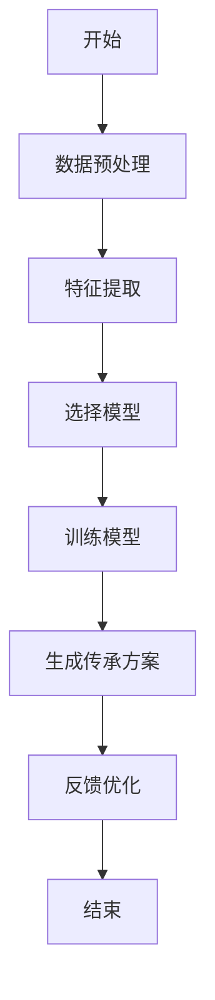
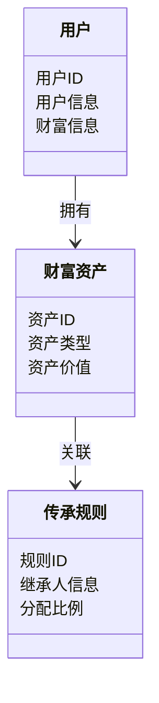

                 


# 构建智能化的个人财富传承规划助手

## 关键词：人工智能、财富传承、智能化助手、规划系统、机器学习

## 摘要：  
随着人工智能技术的快速发展，智能化的个人财富传承规划助手正在成为财富管理领域的重要工具。本文将详细探讨如何利用人工智能技术构建一个高效的财富传承规划助手，涵盖背景分析、核心概念、算法原理、系统架构设计、项目实战以及最佳实践等内容，帮助读者理解并实现智能化的财富传承规划系统。

---

## 第一部分: 背景与核心概念

### 第1章: 智能化个人财富传承规划助手的背景与需求

#### 1.1 问题背景与挑战
- **传统财富传承规划的局限性**：传统的财富传承规划依赖于人工咨询，存在效率低、覆盖面窄、个性化不足等问题。
- **数字化与智能化的需求**：随着大数据和人工智能技术的发展，智能化工具能够更高效、更精准地满足个性化需求。
- **个人财富传承规划的核心问题**：如何在复杂的法律和税务环境中，为用户提供最优的传承方案。

#### 1.2 问题描述与目标
- **财富传承规划的定义与范围**：财富传承规划是指通过法律、税务、资产配置等手段，确保财富在代际传承中的安全性和最大化。
- **个人需求的多样性与复杂性**：不同用户的需求差异大，涉及资产类型、继承人关系、税务优化等多个方面。
- **智能化助手的目标与价值**：通过AI技术，提供个性化、实时更新的传承规划建议，降低复杂性，提高效率。

#### 1.3 解决方案与技术路线
- **人工智能在财富传承规划中的应用**：利用机器学习算法分析用户需求，生成最优传承方案。
- **多模态数据的整合与分析**：结合文本、语音、图像等多种数据源，提供更全面的分析。
- **个性化推荐与动态调整机制**：根据用户反馈和市场变化，动态调整传承方案。

#### 1.4 边界与外延
- **财富传承规划的边界**：限定在法律允许的范围内，避免涉及非法操作。
- **相关领域的外延**：包括税务优化、资产配置、风险管理等领域。
- **与其他技术的结合**：与区块链、智能合约等技术结合，提升传承方案的执行效率和安全性。

#### 1.5 核心要素与概念结构
- **用户信息模型**：包括用户的基本信息、财务状况、家庭结构等。
- **财富资产模型**：涵盖资产种类、价值、分布等信息。
- **传承规则模型**：包括继承人分配比例、时间安排、税务优化策略等。

---

## 第二部分: 核心概念与联系

### 第2章: 财富传承规划助手的核心概念

#### 2.1 实体关系分析
- **用户与财富资产的关系**：用户拥有多种类型的资产，每种资产都有其独特的属性。
- **财富资产与传承规则的关系**：资产的分配需要遵循特定的规则，如按比例分配、指定继承人等。
- **传承方案与执行反馈的关系**：根据反馈调整传承方案，确保其适应变化的需求。

#### 2.2 ER实体关系图
```mermaid
er
    entity 用户 {
        key 用户ID
        属性 用户信息
        属性 财富信息
    }
    entity 财富资产 {
        key 资产ID
        属性 资产类型
        属性 资产价值
    }
    entity 传承规则 {
        key 规则ID
        属性 继承人信息
        属性 分配比例
    }
    用户 --> 财富资产: 拥有
    财富资产 --> 传承规则: 关联
```

#### 2.3 核心概念的属性对比
| 概念       | 属性1         | 属性2         | 属性3         |
|------------|---------------|---------------|---------------|
| 用户       | 用户ID         | 用户信息       | 财富信息       |
| 财富资产   | 资产ID         | 资产类型       | 资产价值       |
| 传承规则   | 规则ID         | 继承人信息     | 分配比例       |

---

## 第三部分: 算法原理

### 第3章: 算法原理与实现

#### 3.1 算法选择与优化
- **机器学习算法的选择**：基于用户需求，选择适合的回归算法或分类算法。
- **自然语言处理（NLP）的应用**：利用NLP技术分析用户的语言输入，提取关键信息。

#### 3.2 算法流程图


#### 3.3 算法数学模型
- **线性回归模型**：用于预测最佳资产分配比例。
  $$ y = \beta_0 + \beta_1x + \epsilon $$
- **决策树模型**：用于分类继承人关系和分配规则。

#### 3.4 代码实现
```python
# 示例代码：基于机器学习的传承方案生成
import numpy as np
from sklearn.linear_model import LinearRegression

# 数据预处理
X = np.array([[资产1, 资产2, ...], ...])
y = np.array([目标分配比例])

# 训练模型
model = LinearRegression()
model.fit(X, y)

# 生成传承方案
new_user_asset = np.array([[用户资产1, 用户资产2, ...]])
prediction = model.predict(new_user_asset)
```

---

## 第四部分: 系统分析与架构设计

### 第4章: 系统分析与架构设计

#### 4.1 领域模型类图


#### 4.2 系统架构设计


#### 4.3 接口设计与交互流程
- **接口设计**：定义API接口，实现用户信息上传、资产分析、方案生成等功能。
- **交互流程**：用户提交信息，系统分析并返回最优传承方案。

---

## 第五部分: 项目实战

### 第5章: 项目实战与案例分析

#### 5.1 环境安装与配置
- 安装Python、机器学习库、NLP库等。

#### 5.2 核心代码实现
```python
# 示例代码：用户资产分析与传承方案生成
import pandas as pd
from sklearn.ensemble import RandomForestRegressor

# 加载数据
data = pd.read_csv('wealth.csv')

# 特征工程
X = data[['资产1', '资产2', ...]]
y = data['目标分配比例']

# 训练模型
model = RandomForestRegressor()
model.fit(X, y)

# 用户输入资产信息
user_assets = pd.DataFrame([[资产1, 资产2, ...]], columns=X.columns)
prediction = model.predict(user_assets)
print(f"预测分配比例为：{prediction[0]}")
```

#### 5.3 案例分析与解读
- **案例1**：用户A的资产分析与传承方案生成。
- **案例2**：用户B的动态调整方案。

---

## 第六部分: 最佳实践

### 第6章: 最佳实践与总结

#### 6.1 小结
- 总结文章的主要内容，强调AI在财富传承规划中的重要性。

#### 6.2 注意事项
- 数据隐私保护的重要性。
- 模型的持续优化与更新。

#### 6.3 未来趋势
- 结合区块链技术，提升方案的可信度和执行效率。
- 更多的多模态数据整合，提升分析的精准度。

#### 6.4 拓展阅读
- 推荐相关书籍和论文，供读者深入学习。

---

## 作者：AI天才研究院/AI Genius Institute & 禅与计算机程序设计艺术 /Zen And The Art of Computer Programming

