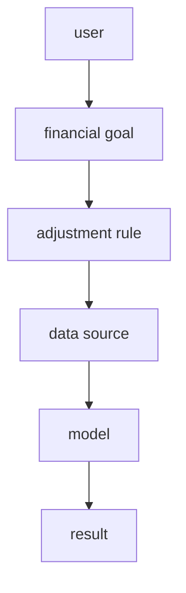
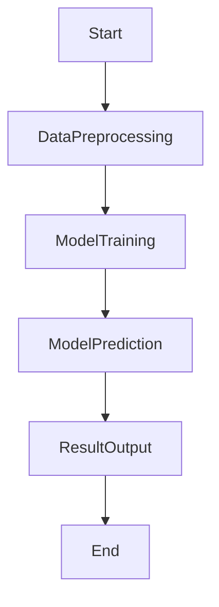
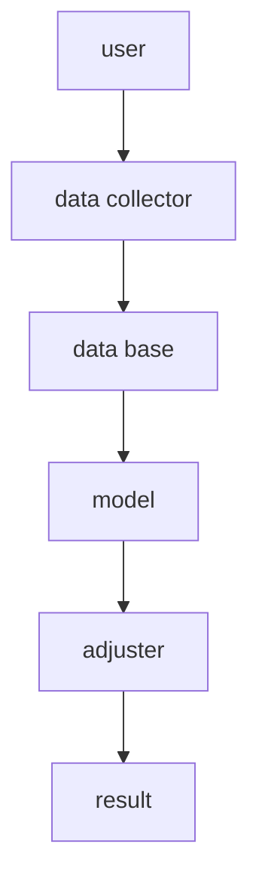
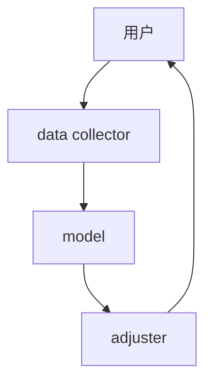

                 


# 构建智能化的个人财富管理目标动态调整助手

> 关键词：个人财富管理，动态调整，人工智能，机器学习，自然语言处理，目标设定

> 摘要：本文探讨了如何利用人工智能技术构建一个智能化的个人财富管理目标动态调整助手。通过分析当前财富管理的痛点，提出了一种基于机器学习和自然语言处理的解决方案，详细阐述了系统架构、算法原理、数学模型及实现方法，最后通过项目实战展示了如何将理论应用于实际。

---

# 第一部分: 背景介绍

## 第1章: 个人财富管理目标动态调整的背景与挑战

### 1.1 问题背景

#### 1.1.1 传统个人财富管理的局限性
传统的财富管理方法依赖于人工记录和定期调整，存在效率低、实时性差、数据不全面等问题。例如，用户可能需要手动记录每笔收支，难以及时调整目标。

#### 1.1.2 数字化与智能化时代的需求
随着数字化和智能化技术的发展，人们对财富管理的效率和准确性提出了更高的要求。用户希望有一个自动化、实时更新的工具来帮助管理财务目标。

#### 1.1.3 动态调整的必要性
财务目标往往受到市场变化、个人收入调整等因素的影响，需要实时动态调整。例如，如果用户收入增加，可能需要调整投资目标或消费预算。

### 1.2 财富管理目标的动态调整

#### 1.2.1 目标设定的动态性
财务目标不是一成不变的，需要根据实际情况进行调整。例如，用户可能在某个阶段注重投资，而在另一个阶段注重储蓄。

#### 1.2.2 影响目标调整的因素
影响目标调整的因素包括市场波动、个人收入变化、支出增加等。例如，股市下跌可能导致投资目标需要调整。

#### 1.2.3 动态调整的复杂性
动态调整需要考虑多个因素的综合影响，调整过程复杂，人工操作难以高效完成。

### 1.3 传统财富管理方法的局限性

#### 1.3.1 人工调整的低效性
传统方法依赖人工记录和调整，效率低下，容易出错。

#### 1.3.2 数据分析的不完整性
传统方法难以全面分析数据，导致调整不够精准。

#### 1.3.3 缺乏实时性
传统方法无法实时调整目标，可能导致机会成本增加。

### 1.4 智能化解决方案的必要性

#### 1.4.1 AI在财富管理中的潜力
人工智能技术可以实时分析数据，提供精准的调整建议。

#### 1.4.2 动态调整助手的核心价值
动态调整助手可以自动化处理数据，实时调整目标，提高效率。

#### 1.4.3 未来的趋势与发展方向
随着AI技术的发展，智能化财富管理将成为主流，动态调整助手将发挥越来越重要的作用。

---

## 第2章: 核心概念与系统架构

### 2.1 财富目标的定义与分类

#### 2.1.1 财富目标的分类
财富目标可以分为短期目标（如应急基金）、中期目标（如购房首付）和长期目标（如退休储蓄）。

#### 2.1.2 目标的时间维度
目标的时间维度决定了调整的频率和方式。例如，短期目标需要频繁调整，长期目标则可以定期评估。

#### 2.1.3 目标的价值维度
目标的价值维度包括资产配置、投资组合等，不同目标需要不同的调整策略。

### 2.2 动态调整机制的核心要素

#### 2.2.1 数据采集与处理
动态调整助手需要实时采集用户财务数据，包括收入、支出、资产等。

#### 2.2.2 模型计算与预测
基于机器学习模型，助手可以预测市场变化，评估目标实现的可能性。

#### 2.2.3 交互与反馈
助手需要与用户交互，根据反馈调整模型参数，优化调整策略。

### 2.3 系统架构的模块划分

#### 2.3.1 数据采集模块
负责采集用户的财务数据，包括银行账户、投资账户等。

#### 2.3.2 模型计算模块
基于机器学习模型，计算目标的实现可能性，提出调整建议。

#### 2.3.3 交互反馈模块
与用户交互，根据反馈调整模型，优化调整策略。

### 2.4 ER实体关系图



---

## 第3章: 算法原理与实现

### 3.1 机器学习基础

#### 3.1.1 监督学习与无监督学习
监督学习用于分类和回归任务，无监督学习用于聚类和降维。

#### 3.1.2 深度学习简介
深度学习通过多层神经网络，自动提取数据特征，提高模型的准确性。

#### 3.1.3 时间序列分析
时间序列分析用于预测未来的市场变化，帮助用户做出调整决策。

### 3.2 自然语言处理技术

#### 3.2.1 文本预处理
对用户输入的自然语言进行分词、去除停用词等预处理。

#### 3.2.2 模型训练
使用预训练的语言模型，如BERT，进行微调，提取用户需求。

#### 3.2.3 应用场景
用户可以通过自然语言输入调整需求，助手理解意图后执行调整。

### 3.3 动态调整模型的构建

#### 3.3.1 数据预处理
对数据进行清洗、归一化等处理，确保模型输入数据的质量。

#### 3.3.2 模型选择
选择适合任务的模型，如时间序列预测可以使用LSTM。

#### 3.3.3 模型训练
使用训练数据训练模型，调整超参数，优化模型性能。

### 3.4 算法流程图



---

## 第4章: 数学模型与公式推导

### 4.1 目标函数

$$ \text{目标函数} = \text{损失函数} + \text{正则化项} $$

### 4.2 约束条件

$$ \text{约束条件} = \{ x | x \geq 0 \} $$

### 4.3 动态调整模型的数学表达

$$ y = f(x) + \epsilon $$

其中，$y$ 是调整后的目标值，$x$ 是输入数据，$f$ 是模型函数，$\epsilon$ 是噪声项。

---

## 第5章: 系统架构与功能设计

### 5.1 系统架构设计



### 5.2 功能模块设计

#### 5.2.1 数据采集模块
负责采集用户的财务数据，包括收入、支出、资产等。

#### 5.2.2 模型计算模块
基于机器学习模型，计算目标的实现可能性，提出调整建议。

#### 5.2.3 交互反馈模块
与用户交互，根据反馈调整模型，优化调整策略。

### 5.3 系统接口设计

- 数据接口：用于与银行、投资平台等外部系统对接。
- 用户接口：用于与用户交互，接收输入和输出结果。

### 5.4 交互流程图



---

## 第6章: 项目实战与实现

### 6.1 环境安装

安装必要的库：

```bash
pip install numpy pandas scikit-learn tensorflow
```

### 6.2 核心代码实现

```python
import numpy as np
from sklearn.model_selection import train_test_split
from tensorflow.keras.models import Sequential
from tensorflow.keras.layers import LSTM, Dense

# 数据预处理
data = ...  # 加载数据
X_train, X_test, y_train, y_test = train_test_split(data, labels, test_size=0.2)

# 模型构建
model = Sequential()
model.add(LSTM(64, input_shape=(X_train.shape[1], 1)))
model.add(Dense(1))
model.compile(optimizer='adam', loss='mse')

# 模型训练
model.fit(X_train, y_train, epochs=10, batch_size=32, validation_data=(X_test, y_test))
```

### 6.3 代码解读与分析

- 数据预处理：将数据转化为适合模型输入的形式。
- 模型构建：使用LSTM进行时间序列预测。
- 模型训练：训练模型，优化参数。

### 6.4 案例分析

通过实际案例，展示模型的预测能力和调整效果。

### 6.5 项目小结

总结项目的实现过程，提出改进建议。

---

## 第7章: 总结与未来展望

### 7.1 总结

本文详细介绍了如何构建智能化的个人财富管理目标动态调整助手，涵盖了背景、核心概念、算法原理、系统架构和项目实现。

### 7.2 未来趋势与发展方向

随着AI技术的进步，动态调整助手将更加智能化和个性化，能够处理更复杂的目标调整需求。

### 7.3 最佳实践 tips

- 数据质量是关键，确保数据的准确性和完整性。
- 定期评估模型性能，及时更新模型参数。
- 与用户保持良好的交互，提供个性化的调整建议。

### 7.4 注意事项

- 注意数据隐私和安全，确保用户信息不被泄露。
- 在实际应用中，考虑模型的实时性和响应速度。

### 7.5 拓展阅读

推荐一些相关的书籍和论文，帮助读者深入理解动态调整和AI在财富管理中的应用。

---

# 作者：AI天才研究院/AI Genius Institute & 禅与计算机程序设计艺术 /Zen And The Art of Computer Programming

