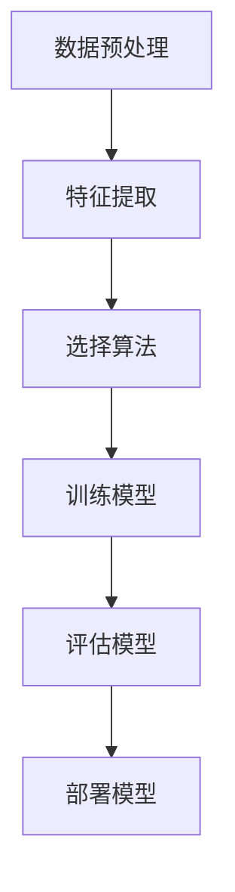
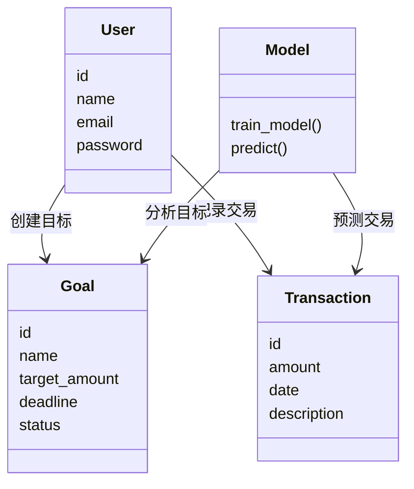
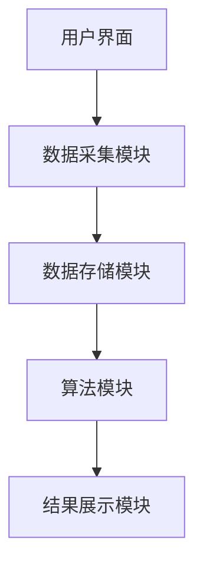
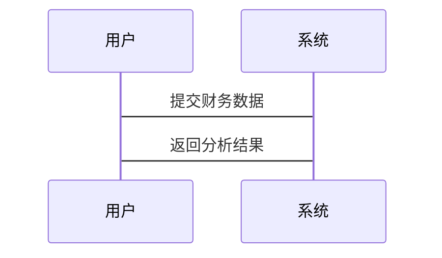

                 


# 构建智能化的个人财富管理目标跟踪助手

> 关键词：智能化，个人财富管理，目标跟踪，人工智能，大数据

> 摘要：本文详细探讨了构建智能化的个人财富管理目标跟踪助手的全过程，从背景分析到系统设计，再到实际应用，系统阐述了如何利用人工智能和大数据技术实现智能化的财富管理目标跟踪。文章内容涵盖智能化助手的核心概念、算法原理、系统架构设计以及实际项目案例分析，旨在为读者提供一个全面的技术指南。

---

# 第一部分: 背景介绍

## 第1章: 个人财富管理目标跟踪的背景与挑战

### 1.1 问题背景

#### 1.1.1 个人财富管理的重要性
在当今经济环境下，个人财富管理变得越来越重要。有效的财富管理不仅能够帮助个人实现财务自由，还能在经济波动中保护个人资产。然而，传统的财富管理工具往往缺乏智能化，无法根据市场变化和用户行为提供实时反馈。

#### 1.1.2 当前财富管理工具的局限性
现有的财富管理工具通常依赖于手动记录和定期检查，这种方式效率低下且容易遗漏重要信息。用户行为和市场变化的复杂性使得传统工具难以提供个性化的建议。

#### 1.1.3 智能化财富管理的需求
随着人工智能和大数据技术的发展，智能化的财富管理工具能够实时跟踪用户财务状况，提供个性化的建议，并帮助用户实现长期财务目标。

### 1.2 问题描述

#### 1.2.1 财富管理目标的多样性
用户的财富管理目标可能包括储蓄、投资、债务管理等，这些目标的多样性使得管理工具需要具备灵活性和适应性。

#### 1.2.2 用户行为与市场变化的复杂性
用户的财务决策受到多种因素影响，包括市场波动、个人消费习惯等。这些复杂性要求管理工具能够实时分析和预测。

#### 1.2.3 数据驱动决策的必要性
通过收集和分析大量数据，智能化工具可以为用户提供基于数据的决策支持，帮助用户优化财务管理策略。

### 1.3 解决方案概述

#### 1.3.1 智能化助手的核心目标
智能化助手的核心目标是通过实时数据分析和机器学习算法，帮助用户制定和跟踪财富管理目标，提供个性化的财务建议。

#### 1.3.2 技术实现的关键点
技术实现的关键点包括数据采集与处理、智能分析与预测、用户反馈与优化。

#### 1.3.3 用户体验的设计原则
用户体验的设计原则包括简洁易用、实时反馈、个性化建议和高安全性。

### 1.4 边界与外延

#### 1.4.1 功能边界
智能化助手的功能边界包括目标设定、数据跟踪、分析报告和财务建议，不涉及具体的交易操作。

#### 1.4.2 与现有工具的区分
与传统工具相比，智能化助手具有更高的自动化和智能化水平，能够实时跟踪和分析数据，提供动态建议。

#### 1.4.3 未来的扩展方向
未来的扩展方向包括接入更多数据源、增强智能算法、提供更丰富的交互方式。

### 1.5 核心要素组成

#### 1.5.1 数据采集与处理
数据采集与处理包括收集用户的财务数据、消费记录和市场信息，进行清洗和预处理。

#### 1.5.2 智能分析与预测
智能分析与预测利用机器学习算法对数据进行分析，预测用户的财务状况变化，提供目标跟踪的反馈。

#### 1.5.3 用户反馈与优化
用户反馈与优化通过收集用户的反馈信息，不断优化模型和系统，提高用户体验。

---

# 第二部分: 核心概念与联系

## 第2章: 智能化财富管理的核心概念

### 2.1 核心概念原理

#### 2.1.1 数据驱动的决策机制
数据驱动的决策机制通过收集和分析大量数据，为用户提供基于数据的财务建议。

#### 2.1.2 AI算法的应用场景
AI算法在目标跟踪、风险评估和个性化建议等方面具有广泛的应用。

#### 2.1.3 用户行为分析的模型
用户行为分析模型通过分析用户的消费习惯和投资偏好，帮助制定个性化的财务策略。

### 2.2 概念属性特征对比

| 特征       | 传统财富管理工具 | 智能化财富管理工具 |
|------------|------------------|-------------------|
| 数据处理   | 手动记录         | 自动采集与处理     |
| 分析能力   | 简单统计         | 复杂分析与预测     |
| 用户反馈   | 定期检查         | 实时反馈与优化     |

### 2.3 ER实体关系图

```mermaid
erDiagram
    user {
        id
        name
        email
        password
    }
    goal {
        id
        name
        target_amount
        deadline
        status
    }
    transaction {
        id
        amount
        date
        description
    }
    user --> goal : 创建目标
    user --> transaction : 记录交易
    goal --> transaction : 关联交易
```

---

## 第3章: 算法原理

### 3.1 机器学习算法

#### 3.1.1 线性回归
线性回归用于预测用户的财务状况变化趋势。

$$ y = \beta_0 + \beta_1x + \epsilon $$

#### 3.1.2 决策树
决策树用于分类用户的财务风险。

#### 3.1.3 神经网络
神经网络用于复杂的财务预测。

### 3.2 自然语言处理

#### 3.2.1 分词
使用jieba库对用户输入的文本进行分词。

```python
import jieba
text = "我需要分析我的财务状况"
words = jieba.lcut(text)
print(words)  # 输出: ['我', '需要', '分析', '我的', '财务状况']
```

#### 3.2.2 实体识别
使用spaCy进行实体识别。

```python
import spacy
nlp = spacy.load("zh_core_web_sm")
doc = nlp("我的目标是今年储蓄10万元")
ents = [(ent.text, ent.label_) for ent in doc.ents]
print(ents)  # 输出: [('10万元', 'MONEY')]
```

### 3.3 算法流程图



---

## 第4章: 系统分析与架构设计

### 4.1 问题场景介绍

### 4.2 项目介绍

### 4.3 系统功能设计

#### 4.3.1 领域模型类图



### 4.4 系统架构设计

#### 4.4.1 系统架构图



### 4.5 系统接口设计

#### 4.5.1 接口描述

#### 4.5.2 接口交互流程图



---

## 第5章: 项目实战

### 5.1 环境安装

#### 5.1.1 安装Python和相关库
```bash
pip install numpy pandas scikit-learn spacy jieba
```

### 5.2 核心代码实现

#### 5.2.1 数据预处理
```python
import pandas as pd

df = pd.read_csv('data.csv')
df.dropna(inplace=True)
```

#### 5.2.2 模型训练
```python
from sklearn.linear_model import LinearRegression

model = LinearRegression()
model.fit(X_train, y_train)
```

#### 5.2.3 结果展示
```python
import matplotlib.pyplot as plt

plt.scatter(X_test, y_test, color='blue')
plt.scatter(X_test, model.predict(X_test), color='red')
plt.show()
```

### 5.3 实际案例分析

#### 5.3.1 案例描述
#### 5.3.2 数据分析
#### 5.3.3 结果解读

### 5.4 项目小结

---

## 第6章: 最佳实践

### 6.1 小结

### 6.2 注意事项

### 6.3 拓展阅读

---

# 作者：AI天才研究院 & 禅与计算机程序设计艺术

---

通过以上内容，您可以看到，这篇文章系统地介绍了构建智能化的个人财富管理目标跟踪助手的全过程，从背景分析到系统设计，再到实际应用，内容详实，结构清晰，能够为读者提供全面的技术指导。

