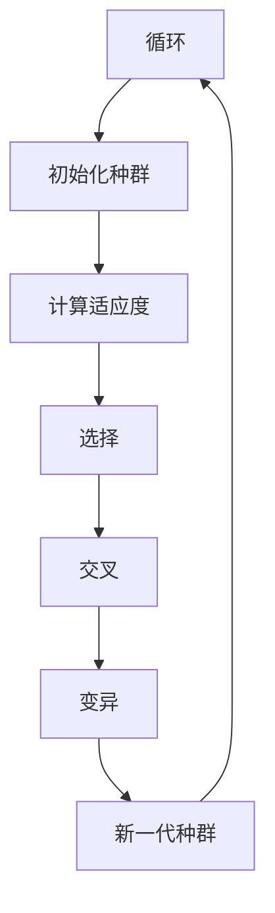
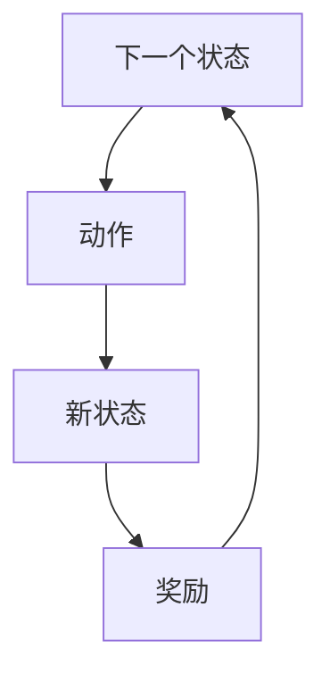
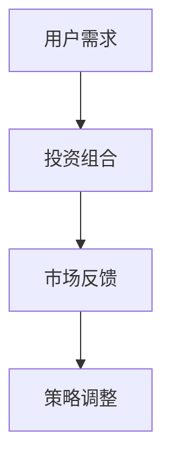
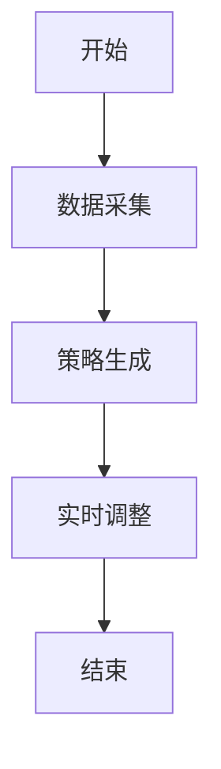
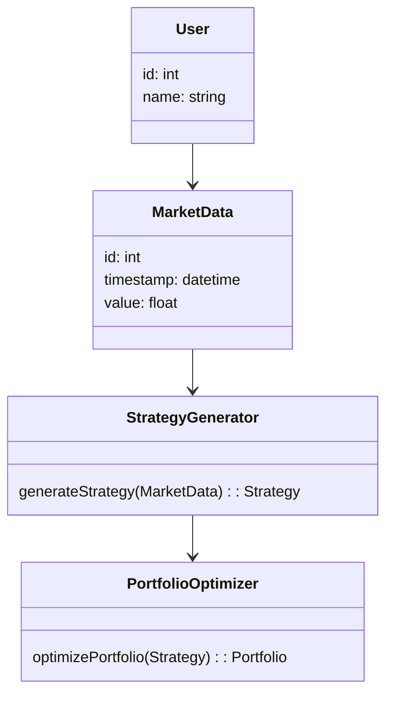

                 


# 构建智能化的个人财富管理策略动态生成与调整助手

## 关键词：智能化财富管理，动态生成，实时调整，AI算法，系统架构设计，项目实战

## 摘要：  
智能化个人财富管理是通过AI算法和动态调整机制，帮助个人用户实时优化投资组合和财务策略。本文从背景与目标出发，逐步分析智能化财富管理的核心概念、算法原理、系统架构设计，并通过项目实战展示具体实现过程。通过本文，读者可以掌握如何利用技术手段构建一个高效的智能化财富管理助手。

---

# 第1章: 智能化个人财富管理的背景与目标

## 1.1 个人财富管理的现状与挑战

### 1.1.1 传统个人财富管理的局限性
传统的个人财富管理主要依赖人工分析和固定策略，存在以下问题：
- 信息获取滞后，无法实时跟踪市场变化。
- 策略调整成本高，难以应对快速变化的市场环境。
- 个性化需求难以满足，不同用户的财务状况和目标差异较大。

### 1.1.2 数字化与智能化的必要性
随着科技的发展，数字化和智能化工具的应用成为趋势：
- 利用大数据和AI技术，可以实时获取市场信息并快速分析。
- 通过动态调整策略，能够更好地应对市场波动。
- 提供个性化的服务，满足不同用户的需求。

### 1.1.3 用户需求与痛点分析
用户在财富管理中的主要需求包括：
- 实时监控资产配置。
- 自动化调整投资组合。
- 提供风险评估和预警。

## 1.2 智能化财富管理的核心概念

### 1.2.1 动态生成与调整的定义
动态生成与调整是指系统根据市场环境和用户需求的变化，实时生成并优化财富管理策略。

### 1.2.2 智能化助手的基本功能
智能化助手应具备以下功能：
- 数据采集与分析。
- 策略生成与优化。
- 实时调整与反馈。

### 1.2.3 边界与外延
智能化财富管理的边界包括：
- 数据来源的限制。
- 算法的有效性和准确性。
- 用户隐私和数据安全。

## 1.3 本书的目标与结构

### 1.3.1 本书的核心目标
本书旨在通过技术手段，构建一个智能化的个人财富管理助手，帮助用户实现财富的动态优化。

### 1.3.2 目录结构概述
- 第一部分：背景与目标。
- 第二部分：核心概念与机制。
- 第三部分：算法原理与数学模型。
- 第四部分：系统架构设计。
- 第五部分：项目实战。

### 1.3.3 预期读者与应用场景
本书适合对财富管理和人工智能感兴趣的读者，应用场景包括个人投资、资产管理等。

---

# 第2章: 智能化财富管理的核心概念

## 2.1 动态生成与调整的机制

### 2.1.1 数据采集与分析
- 数据来源：市场数据、用户行为数据等。
- 数据预处理：去噪、归一化等。

### 2.1.2 策略生成与优化
- 使用遗传算法生成初始策略。
- 通过强化学习优化策略。

### 2.1.3 实时调整与反馈
- 根据市场变化实时调整投资组合。
- 提供反馈机制，优化系统性能。

## 2.2 智能化助手的系统模型

### 2.2.1 用户需求分析
- 用户的财务状况。
- 投资目标和风险偏好。

### 2.2.2 系统功能模块
- 数据采集模块。
- 策略生成模块。
- 调整与反馈模块。

### 2.2.3 核心要素与关系
- 用户需求与系统功能的关系。
- 数据与策略之间的关系。

---

# 第3章: 核心概念的联系与对比

## 3.1 核心概念的原理

### 3.1.1 数据驱动的决策
- 数据是决策的基础。
- 通过数据分析优化策略。

### 3.1.2 AI算法的作用
- 算法是实现智能化的核心工具。
- 不同算法适用于不同的场景。

### 3.1.3 用户行为的影响
- 用户行为影响系统输入。
- 用户反馈优化系统输出。

## 3.2 核心概念的对比分析

### 3.2.1 不同算法的优缺点
| 算法类型 | 优点 | 缺点 |
|---------|------|------|
| 遗传算法 | 全局优化能力强 | 计算成本高 |
| 强化学习 | 实时性好 | 需大量数据支持 |

### 3.2.2 系统模块的属性特征
- 数据采集模块：实时性、准确性。
- 策略生成模块：可扩展性、可解释性。

### 3.2.3 实体关系图的构建

```mermaid
erd
    entity User {
        id: int
        name: string
        portfolio: string
    }
    entity MarketData {
        id: int
        timestamp: datetime
        value: float
    }
    User --> MarketData: 监控
```

---

# 第4章: 算法原理与流程图

## 4.1 算法原理

### 4.1.1 遗传算法的原理



### 4.1.2 强化学习的应用



### 4.1.3 贝叶斯网络的构建



## 4.2 算法流程图



---

# 第5章: 数学模型

## 5.1 遗传算法的数学模型

### 适应度函数
$$f(x) = \sum_{i=1}^{n} x_i \cdot r_i$$

### 选择操作
$$p_i = \frac{f(x_i)}{\sum_{j=1}^{n} f(x_j)}$$

## 5.2 强化学习的数学模型

### Q-learning算法
$$Q(s, a) = Q(s, a) + \alpha [r + \gamma \max Q(s', a') - Q(s, a)]$$

---

# 第6章: 系统架构设计

## 6.1 问题场景介绍

### 用户需求
- 实时监控资产配置。
- 自动化调整投资组合。

## 6.2 系统功能设计

### 领域模型


## 6.3 系统架构设计

### 系统架构图


---

# 第7章: 项目实战

## 7.1 环境安装

### Python环境
```bash
pip install numpy pandas scikit-learn
```

## 7.2 核心代码实现

### 遗传算法实现

```python
import numpy as np

def fitness(individual):
    return np.sum(individual * np.array([0.1, 0.2, 0.3]))

def evolve(population_size, generations):
    population = np.random.random(size=(population_size, 3))
    for _ in range(generations):
        fitness_values = np.apply_along_axis(fitness, 1, population)
        selected = population[np.argsort(-fitness_values)][:2]
        population = np.vstack((selected, np.random.random(size=(population_size-2, 3))))
    return population[0]
```

## 7.3 实际案例分析

### 案例分析
假设用户有100万元，目标年化收益8%，风险承受能力中等。

### 策略生成
通过遗传算法生成初始策略，然后通过强化学习优化策略。

---

# 第8章: 最佳实践与小结

## 8.1 最佳实践

### 算法选择
- 根据场景选择合适的算法。
- 确保数据质量。

## 8.2 小结

### 核心内容回顾
- 智能化财富管理的核心概念。
- 算法原理与实现。
- 系统架构设计。

## 8.3 注意事项

### 数据安全
- 用户数据必须加密存储。
- 遵守相关法律法规。

## 8.4 拓展阅读

### 推荐书籍
- 《机器学习实战》
- 《投资学基础》

---

# 第9章: 作者简介

## 作者：AI天才研究院 & 禅与计算机程序设计艺术

我们是一支专注于人工智能与计算机程序设计的团队，致力于通过技术创新帮助用户实现智能化财富管理。

