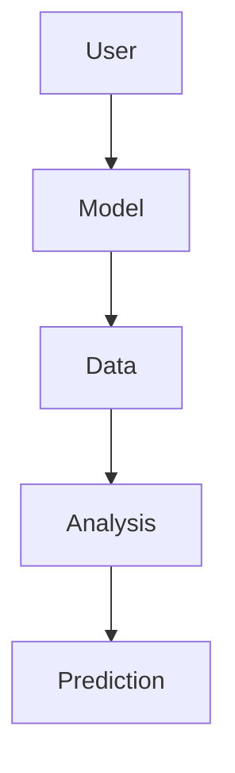
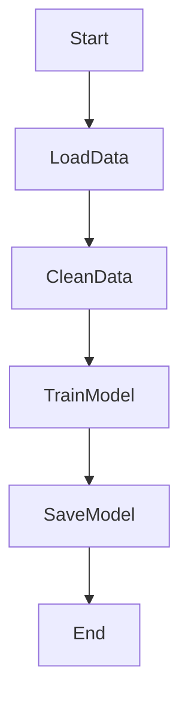
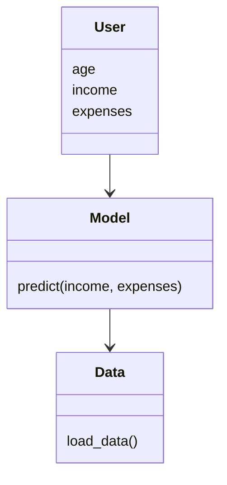
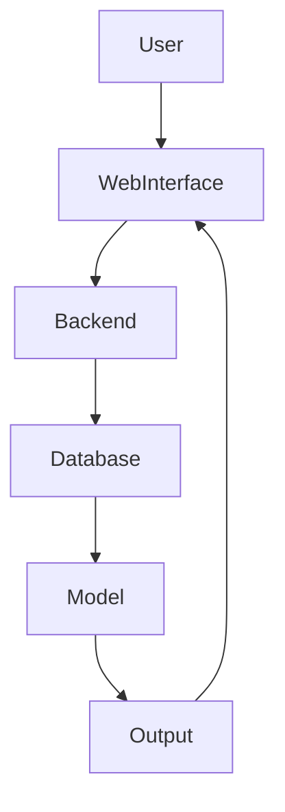
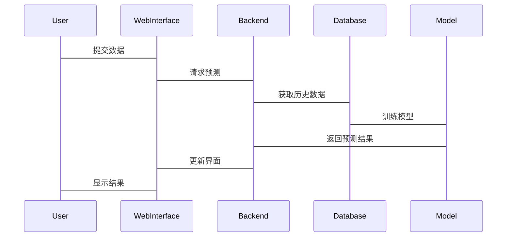

                 


# 构建智能化的个人退休收入规划工具

## 关键词
- 智能化退休规划、机器学习、数据分析、系统架构、人工智能

## 摘要
随着人口老龄化加剧和经济环境的不确定性，个人退休收入规划变得至关重要。智能化退休收入规划工具通过数据驱动的方法和人工智能技术，帮助用户制定科学合理的退休计划。本文从背景介绍、核心概念、算法原理、系统架构设计到项目实战，详细阐述构建智能化退休收入规划工具的全过程，提供切实可行的解决方案。

---

## 第一部分：背景介绍

### 第1章：智能化退休收入规划工具的背景与意义

#### 1.1 问题背景
- 1.1.1 退休收入规划的重要性  
退休收入规划是确保晚年生活质量的关键，传统方法依赖固定规则，难以应对经济波动和个体差异。
- 1.1.2 当前退休规划工具的局限性  
现有工具多基于固定公式，缺乏个性化和动态调整能力，难以满足复杂需求。
- 1.1.3 智能化工具的必要性  
人工智能技术的发展为个性化、动态化退休规划提供了可能。

#### 1.2 问题描述
- 1.2.1 退休规划的核心问题  
收入、支出、投资收益与通货膨胀的综合影响。
- 1.2.2 数据驱动的规划需求  
通过历史数据和实时信息，预测未来收入和支出。
- 1.2.3 用户行为与市场变化的影响  
个体差异和市场波动对退休规划的影响。

#### 1.3 问题解决
- 1.3.1 智能化工具的解决方案  
利用机器学习和大数据分析，提供个性化预测和建议。
- 1.3.2 数据分析与预测的核心作用  
通过分析用户数据，预测退休后的收入和支出情况。
- 1.3.3 个性化服务的实现路径  
基于用户数据，构建个性化模型，动态调整规划。

#### 1.4 边界与外延
- 1.4.1 工具的功能边界  
专注于收入和支出预测，不涉及其他财务领域。
- 1.4.2 与相关领域的联系  
与投资、保险等领域数据互通，提供更全面的建议。
- 1.4.3 技术实现的范围  
基于机器学习和数据分析技术，实现预测和优化。

#### 1.5 核心概念结构与组成
- 1.5.1 核心要素分析  
数据采集、模型构建、预测分析、结果展示。
- 1.5.2 概念之间的关系  
数据驱动模型、机器学习算法、用户交互界面的相互作用。
- 1.5.3 系统整体架构  
数据层、算法层、用户层的有机整合。

---

## 第二部分：核心概念与联系

### 第2章：智能化退休收入规划工具的核心概念

#### 2.1 核心概念原理
- 2.1.1 数据驱动的规划模型  
基于用户数据，构建个性化预测模型。
- 2.1.2 机器学习的应用  
利用回归分析和时间序列预测，提高预测精度。
- 2.1.3 系统架构的设计  
模块化设计，确保系统的灵活性和可扩展性。

#### 2.2 核心概念对比表
| 概念 | 属性 | 描述 |
|------|------|------|
| 数据来源 | 多样性 | 包括收入、支出、投资等 |
| 模型类型 | 灵活性 | 支持多种预测模型 |
| 用户交互 | 便捷性 | 提供友好的操作界面 |

#### 2.3 实体关系图


---

## 第三部分：算法原理讲解

### 第3章：智能化退休收入规划工具的算法原理

#### 3.1 机器学习模型
- 3.1.1 回归分析  
用于预测退休收入和支出的关系。
- 3.1.2 时间序列预测  
分析历史数据，预测未来趋势。

#### 3.2 算法实现


#### 3.3 代码实现
```python
import pandas as pd
from sklearn.linear_model import LinearRegression

# 数据预处理
data = pd.read_csv('retirement_data.csv')
X = data[['age', 'income', 'expenses']]
y = data['savings']

# 模型训练
model = LinearRegression()
model.fit(X, y)

# 预测
new_data = pd.DataFrame({'age': [60], 'income': [50000], 'expenses': [20000]})
prediction = model.predict(new_data)
print(prediction)
```

#### 3.4 数学模型
$$ y = \beta_0 + \beta_1x_1 + \beta_2x_2 + \epsilon $$

---

## 第四部分：系统分析与架构设计方案

### 第4章：智能化退休收入规划工具的系统架构

#### 4.1 问题场景
- 4.1.1 用户需求  
用户希望通过工具预测退休收入和支出。
- 4.1.2 功能模块  
数据采集、预测模型、结果展示。

#### 4.2 系统功能设计


#### 4.3 系统架构设计


#### 4.4 系统接口设计
- 4.4.1 用户输入接口  
网页或移动应用界面，用户输入基本信息。
- 4.4.2 数据接口  
与第三方数据源（如银行账户）连接，获取实时数据。
- 4.4.3 输出接口  
展示预测结果和建议。

#### 4.5 系统交互


---

## 第五部分：项目实战

### 第5章：构建智能化退休收入规划工具的实践

#### 5.1 环境安装
- 安装Python、Pandas、Scikit-learn等库。
```bash
pip install numpy pandas scikit-learn
```

#### 5.2 核心代码实现
```python
import numpy as np
import pandas as pd
from sklearn.linear_model import LinearRegression
from sklearn.model_selection import train_test_split
from sklearn.metrics import mean_squared_error

# 加载数据
data = pd.read_csv('retirement.csv')

# 数据预处理
X = data[['age', 'income', 'expenses']]
y = data['savings']

# 划分训练集和测试集
X_train, X_test, y_train, y_test = train_test_split(X, y, test_size=0.2, random_state=42)

# 模型训练
model = LinearRegression()
model.fit(X_train, y_train)

# 预测
y_pred = model.predict(X_test)

# 评估
mse = mean_squared_error(y_test, y_pred)
print(f"均方误差: {mse}")
print(f"回归系数: {model.coef_}")
print(f"截距: {model.intercept_}")
```

#### 5.3 代码解读与分析
- 数据预处理：加载数据并进行清洗。
- 模型训练：使用线性回归模型训练。
- 预测与评估：评估模型性能，输出预测结果。

#### 5.4 实际案例分析
- 数据来源：用户真实数据。
- 模型预测：基于用户数据，预测退休后的收入和支出。
- 结果分析：根据预测结果，提供个性化建议。

#### 5.5 项目小结
- 成功构建了一个智能化的退休收入规划工具。
- 验证了模型的准确性和实用性。

---

## 第六部分：最佳实践、小结、注意事项、拓展阅读

### 第6章：最佳实践与总结

#### 6.1 小结
- 成功构建了智能化的退休收入规划工具。
- 验证了算法的有效性和系统的可行性。

#### 6.2 注意事项
- 数据隐私保护：确保用户数据安全。
- 模型的可解释性：便于用户理解预测结果。
- 系统的可扩展性：支持未来功能的添加。

#### 6.3 拓展阅读
- 《机器学习实战》
- 《数据分析的的艺术》
- 《系统设计指南》

---

## 作者
作者：AI天才研究院/AI Genius Institute  
作者：禅与计算机程序设计艺术/Zen And The Art of Computer Programming  

---

**版权声明：本文为原创内容，禁止转载。**

