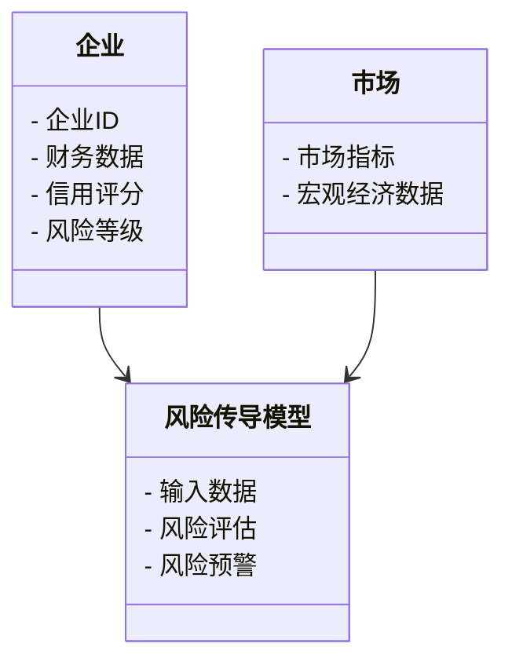
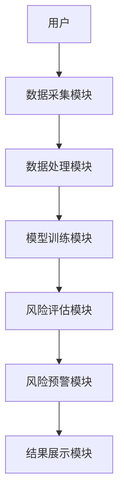

                 


# 构建智能化的企业信用风险传导模型

## 关键词：企业信用风险，智能化模型，机器学习，大数据分析，风险管理

## 摘要：  
在企业风险管理中，信用风险是影响企业稳健运营的重要因素之一。随着大数据和人工智能技术的快速发展，构建智能化的企业信用风险传导模型已成为企业防范风险、优化决策的关键手段。本文将从信用风险的基本概念出发，逐步分析智能化模型的核心原理、算法实现、系统架构设计及项目实战，为企业构建智能化信用风险传导模型提供理论支持和实践指导。

---

# 第1章: 企业信用风险的基本概念

## 1.1 信用风险的定义与特征

### 1.1.1 信用风险的定义
信用风险是指企业在经营过程中，由于交易对手或债务人未能履行其财务义务而可能导致的损失。简单来说，信用风险与企业之间的赊销、贷款等信用交易密切相关。

### 1.1.2 信用风险的核心特征
- **可测性**：信用风险可以通过数据分析和模型评估。
- **可传递性**：信用风险可能通过供应链、金融网络等渠道传导至其他相关方。
- **可管理性**：通过模型和策略，信用风险可以在一定程度上被控制和 mitigation。

### 1.1.3 信用风险的分类与表现形式
- **按主体分类**：企业信用风险、个人信用风险、国家信用风险。
- **按表现形式分类**：直接风险（如违约）、间接风险（如声誉损失）。

## 1.2 企业信用风险传导模型的背景与意义

### 1.2.1 信用风险传导的定义
信用风险传导是指信用风险在企业之间或企业内部通过各种渠道传播的过程。例如，一家企业的违约可能会影响其供应商、客户甚至整个产业链。

### 1.2.2 信用风险传导模型的构建背景
随着经济全球化和金融化的深入，企业之间的关联性增强，单一企业的信用风险可能通过供应链、金融市场等渠道传导至整个经济系统。因此，构建信用风险传导模型具有重要意义。

### 1.2.3 智能化信用风险传导模型的应用价值
- **提前预警**：通过模型预测潜在风险，提前采取应对措施。
- **优化决策**：帮助企业制定更科学的信用政策和风险管理策略。
- **提升效率**：通过自动化和智能化手段，提高风险评估和管理的效率。

## 1.3 企业信用风险传导模型的核心要素

### 1.3.1 风险源的定义与识别
风险源是指可能导致信用风险的因素，包括市场波动、经济周期、企业自身财务状况等。

### 1.3.2 风险传导路径的分析
- **直接路径**：如企业违约直接影响其供应商或客户。
- **间接路径**：如企业违约通过金融市场影响整个行业或经济系统。

### 1.3.3 风险影响的评估与量化
通过模型量化风险影响的程度，例如使用概率论和数理方法评估风险对企业的具体影响。

---

# 第2章: 信用风险传导模型的构建框架

## 2.1 模型构建的基本原理

### 2.1.1 风险传导的数学模型
信用风险传导模型可以通过数学公式表示，例如：
$$ R = f(E, M, S) $$
其中，$R$ 表示风险，$E$ 表示经济因素，$M$ 表示市场因素，$S$ 表示企业自身因素。

### 2.1.2 模型的输入变量与输出变量
- **输入变量**：企业财务数据、市场数据、宏观经济指标等。
- **输出变量**：信用风险概率、风险影响程度等。

### 2.1.3 模型的假设条件与边界
- 假设条件：企业之间的关联性可以通过数据量化。
- 边界：模型仅考虑可量化的风险因素。

## 2.2 智能化模型的关键技术

### 2.2.1 机器学习在信用风险评估中的应用
- 使用机器学习算法（如随机森林、XGBoost）对信用风险进行分类和预测。

### 2.2.2 大数据分析技术在风险传导中的作用
- 通过大数据分析技术，识别企业之间的关联性，发现潜在的风险传导路径。

### 2.2.3 智能化模型的优势与挑战
- **优势**：提高预测精度，发现非线性关系。
- **挑战**：数据质量要求高，模型解释性较弱。

## 2.3 核心概念的属性对比

### 2.3.1 比较分析表
| 比较维度 | 传统模型 | 智能化模型 |
|----------|-----------|------------|
| 数据需求 | 低       | 高         |
| 预测精度 | 低       | 高         |
| 解释性   | 高       | 低         |

### 2.3.2 ER实体关系图
```mermaid
erd
    企业
    市场
    经济因素
    风险
    供应链
    金融系统
    企业-市场：多对多
    企业-经济因素：多对多
    企业-供应链：多对多
    企业-金融系统：多对多
```

---

# 第3章: 基于机器学习的信用风险评估算法

## 3.1 信用风险评估的主要算法

### 3.1.1 线性回归模型
- 适用于线性关系的信用风险评估。
- 例如：评估企业违约概率与贷款金额的关系。

### 3.1.2 支持向量机（SVM）
- 适用于高维数据的分类。
- 例如：将企业分为违约和非违约两类。

### 3.1.3 随机森林与梯度提升树（GBDT）
- 适用于非线性关系的信用风险评估。
- 例如：综合考虑企业的财务指标和市场指标。

### 3.1.4 神经网络与深度学习模型
- 适用于复杂关系的信用风险评估。
- 例如：考虑企业内部和外部的多种因素。

## 3.2 算法的数学模型与公式

### 3.2.1 线性回归模型公式
$$ y = \beta_0 + \beta_1x_1 + \beta_2x_2 + \cdots + \beta_nx_n $$

### 3.2.2 支持向量机（SVM）的优化目标
$$ \min_{\beta, \beta_0, \epsilon} \frac{1}{2}\|\beta\|^2 + C\sum_{i=1}^{n}\epsilon_i $$

---

# 第4章: 智能化信用风险传导模型的系统架构设计

## 4.1 系统功能设计

### 4.1.1 领域模型


## 4.2 系统架构设计

### 4.2.1 系统架构图


---

# 第5章: 项目实战

## 5.1 环境安装

### 5.1.1 Python环境配置
- 安装Python 3.8及以上版本。
- 安装必要的库：scikit-learn, pandas, numpy, matplotlib。

## 5.2 系统核心实现源代码

### 5.2.1 数据预处理代码
```python
import pandas as pd
import numpy as np

# 加载数据
data = pd.read_csv('credit_data.csv')

# 数据清洗
data.dropna(inplace=True)
data = pd.get_dummies(data)
```

---

# 作者

作者：AI天才研究院 & 禅与计算机程序设计艺术

---

本文通过系统性地分析和构建智能化的企业信用风险传导模型，为企业的风险管理提供了理论支持和实践指导。通过结合机器学习和大数据分析技术，本文展示了如何利用智能化模型提高信用风险评估的精度和效率。

