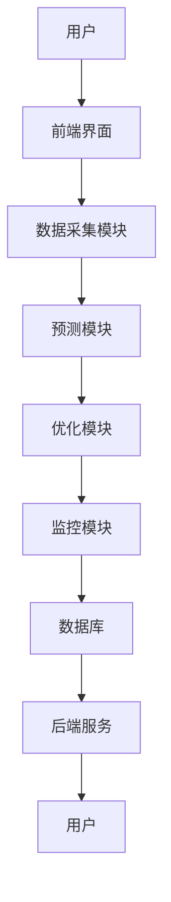

                 


# 《构建智能化的企业现金流管理优化平台》

> **关键词**: 现金流管理, 智能化优化, 机器学习, 大数据分析, 企业财务管理, 现金流预测, 优化算法

> **摘要**: 本文详细探讨了如何构建智能化的企业现金流管理优化平台。通过分析现金流管理的核心概念、智能化优化的必要性以及相关算法和系统架构设计，结合实际案例和代码实现，展示了如何利用人工智能和大数据技术提升企业的现金流管理水平，为企业财务管理的智能化转型提供理论支持和实践指导。

---

## 第1章: 企业现金流管理概述

### 1.1 企业现金流管理的基本概念

现金流管理是企业财务管理的重要组成部分，主要涉及对企业现金流入和流出的预测、监控和优化。现金流入通常包括销售收入、投资收益等，而现金流出则包括原材料采购、员工薪资、税费缴纳等。现金流管理的目标是确保企业在任何时候都能保持足够的现金流，以支持日常运营、偿还债务以及抓住新的投资机会。

**现金流管理的核心要素**包括：
- **现金流预测**: 预测未来一定时期内企业的现金流入和流出情况。
- **现金流监控**: 实时跟踪企业的实际现金流情况，发现偏差并及时调整。
- **现金流优化**: 通过调整资金分配和使用策略，最大化现金流的利用效率。

### 1.2 企业现金流管理的常见问题

在传统的企业管理中，现金流管理往往面临以下问题：
- **预测准确性不足**: 由于市场环境的不确定性，现金流预测的准确性难以保证。
- **现金流波动影响企业运营**: 现金流的波动可能导致企业在某些时期出现资金短缺，影响正常运营。
- **现金流风险控制不足**: 企业难以有效识别和控制现金流中的潜在风险，如汇率波动、客户付款延迟等。

### 1.3 智能化现金流管理的必要性

随着大数据和人工智能技术的快速发展，企业可以通过智能化手段提升现金流管理的效率和准确性。智能化现金流管理可以通过以下方式实现：
- **数据驱动的预测**: 利用历史数据和机器学习模型，提高现金流预测的准确性。
- **实时监控与调整**: 通过实时数据采集和分析，快速发现现金流偏差并进行调整。
- **智能优化算法**: 利用优化算法，动态调整资金分配策略，最大化现金流的利用效率。

### 1.4 本章小结

本章主要介绍了企业现金流管理的基本概念、常见问题以及智能化管理的必要性。现金流管理是企业财务管理的核心之一，而智能化管理则是提升现金流管理水平的重要手段。

---

## 第2章: 现金流管理优化的核心概念与联系

### 2.1 现金流预测模型

现金流预测模型是智能化现金流管理的基础。以下是几种常见的现金流预测模型：

#### 2.1.1 时间序列分析模型

时间序列分析模型是一种基于历史数据预测未来趋势的方法。常用的模型包括ARIMA（自回归积分滑动平均模型）和GARCH（广义自回归条件异方差模型）。

- **ARIMA模型**: ARIMA模型通过自回归和滑动平均的组合，预测未来的时间序列值。其数学公式为：
  $$
  ARIMA(p, d, q) = y_t = \phi_1 y_{t-1} + \phi_2 y_{t-2} + \dots + \phi_p y_{t-p} + \theta_1 \epsilon_{t-1} + \theta_2 \epsilon_{t-2} + \dots + \theta_q \epsilon_{t-q} + \epsilon_t
  $$
  其中，$p$ 是自回归阶数，$d$ 是差分阶数，$q$ 是滑动平均阶数。

- **GARCH模型**: GARCH模型主要用于预测时间序列的波动性，适用于现金流预测中的风险管理。

#### 2.1.2 机器学习模型

机器学习模型在现金流预测中表现出色，尤其是深度学习模型如LSTM（长短期记忆网络）。

- **LSTM模型**: LSTM通过记忆单元和遗忘门，有效捕捉时间序列中的长期依赖关系，适用于现金流预测中的复杂模式识别。

#### 2.1.3 深度学习模型

深度学习模型在处理复杂数据和非线性关系方面具有优势，如卷积神经网络（CNN）和变换器模型（Transformer）。

- **Transformer模型**: Transformer模型通过自注意力机制，捕捉现金流数据中的全局依赖关系，适用于多变量现金流预测。

### 2.2 现金流优化算法

现金流优化算法的目标是通过调整资金分配策略，最大化现金流的利用效率。常用的优化算法包括线性规划、动态规划和遗传算法。

#### 2.2.1 线性规划

线性规划是一种优化方法，适用于目标函数和约束条件均为线性的情况。

- **线性规划模型**: 
  $$
  \text{最大化或最小化} \quad c^T x
  $$
  满足：
  $$
  A x \leq b \\
  A_eq x = b_eq \\
  0 \leq x \leq x_{\text{max}}
  $$

#### 2.2.2 动态规划

动态规划是一种分阶段决策优化方法，适用于现金流优化中的多阶段决策问题。

- **动态规划步骤**:
  1. 确定问题的阶段划分。
  2. 确定每个阶段的决策变量和状态变量。
  3. 建立状态转移方程。
  4. 确定目标函数。

#### 2.2.3 遗传算法

遗传算法是一种基于自然选择和遗传机制的优化方法，适用于复杂非线性问题的优化。

- **遗传算法步骤**:
  1. 初始化种群。
  2. 计算适应度。
  3. 选择优秀个体。
  4. 进行交叉和变异操作。
  5. 重复迭代直到满足终止条件。

### 2.3 现金流风险评估与控制

现金流管理中的风险主要包括市场风险、信用风险和流动性风险。

#### 2.3.1 风险评估

- **VaR模型**: VaR（Value at Risk）模型用于衡量在一定置信水平下，资产组合可能遭受的最大损失。
  $$
  \text{VaR}(\alpha) = \inf\{x | P(L \leq x) \geq \alpha\}
  $$
  其中，$L$ 是损失，$\alpha$ 是置信水平。

#### 2.3.2 风险控制

- **缓冲机制**: 在现金流预测中，预留一定的缓冲资金以应对潜在风险。
- **动态调整**: 根据实时现金流情况动态调整资金分配策略。

### 2.4 本章小结

本章介绍了现金流预测模型和优化算法的核心概念，包括时间序列分析模型、机器学习模型和深度学习模型，以及线性规划、动态规划和遗传算法。同时，还讨论了现金流风险评估与控制的方法，为企业现金流管理提供了理论基础。

---

## 第3章: 现金流预测的数学模型与算法实现

### 3.1 时间序列预测模型

#### 3.1.1 ARIMA模型实现

以下是ARIMA模型的Python实现代码：

```python
from statsmodels.tsa.arima.model import ARIMA
import pandas as pd

# 数据准备
data = pd.read_csv('cash_flow.csv')
train_data = data['cash_flow'].values

# 模型训练
model = ARIMA(train_data, order=(5, 1, 0))
model_fit = model.fit()

# 预测未来值
future_forecast = model_fit.forecast(steps=10)
print(future_forecast)
```

#### 3.1.2 LSTM模型实现

以下是LSTM模型的Python实现代码：

```python
import numpy as np
from tensorflow.keras.models import Sequential
from tensorflow.keras.layers import LSTM, Dense

# 数据准备
data = np.random.rand(1000, 1)
train_data = data[:800]
test_data = data[800:]

# 模型训练
model = Sequential()
model.add(LSTM(64, input_shape=(None, 1)))
model.add(Dense(1))
model.compile(loss='mean_squared_error', optimizer='adam')
model.fit(train_data, train_data, epochs=50, batch_size=32)

# 预测未来值
test预测 = model.predict(test_data)
print(test预测)
```

### 3.2 基于机器学习的现金流预测

#### 3.2.1 支持向量回归（SVR）实现

以下是SVR模型的Python实现代码：

```python
from sklearn.svm import SVR
import numpy as np

# 数据准备
X = np.random.rand(100, 1)
y = np.random.rand(100, 1)

# 模型训练
svr = SVR(kernel='rbf', C=1e3, gamma=0.1)
svr.fit(X, y.ravel())

# 预测未来值
new_X = np.array([[0.5]])
predicted_y = svr.predict(new_X)
print(predicted_y)
```

### 3.3 现金流预测的数学公式

以下是现金流预测中常用的数学公式：

- **线性回归模型**:
  $$
  y = \beta_0 + \beta_1 x + \epsilon
  $$

- **LSTM模型的损失函数**:
  $$
  \text{MSE} = \frac{1}{n}\sum_{i=1}^{n}(y_i - \hat{y}_i)^2
  $$

---

## 第4章: 现金流管理优化系统的架构与设计

### 4.1 系统分析与架构设计方案

#### 4.1.1 问题场景介绍

现金流管理优化平台的目标是通过智能化手段，帮助企业实现现金流的精准预测、实时监控和优化管理。

#### 4.1.2 系统功能设计

- **数据采集模块**: 从企业财务系统中采集现金流数据。
- **预测模块**: 利用机器学习模型预测未来现金流。
- **优化模块**: 通过优化算法调整资金分配策略。
- **监控模块**: 实时监控现金流情况并发出预警。

#### 4.1.3 系统架构设计

以下是系统的架构图：



---

## 第5章: 项目实战与优化

### 5.1 环境搭建

以下是项目环境搭建的步骤：

1. 安装Python和必要的库：
   ```bash
   pip install numpy pandas scikit-learn tensorflow
   ```

2. 下载相关数据集：
   ```bash
   wget https://example.com/cash_flow.csv
   ```

### 5.2 核心实现

以下是现金流预测的核心代码：

```python
import pandas as pd
import numpy as np
from tensorflow.keras.models import Sequential
from tensorflow.keras.layers import LSTM, Dense

# 数据准备
data = pd.read_csv('cash_flow.csv')
train_data = data['cash_flow'].values

# 模型训练
model = Sequential()
model.add(LSTM(64, input_shape=(None, 1)))
model.add(Dense(1))
model.compile(loss='mean_squared_error', optimizer='adam')
model.fit(train_data, train_data, epochs=50, batch_size=32)

# 预测未来值
future_forecast = model.predict(np.array([train_data[-1]]))
print(future_forecast)
```

### 5.3 案例分析

以下是现金流优化的案例分析：

- **案例背景**: 某制造企业面临现金流波动较大的问题，希望通过智能化手段优化现金流管理。
- **实施步骤**:
  1. 数据采集与清洗。
  2. 建立现金流预测模型。
  3. 设计现金流优化算法。
  4. 实施优化方案并监控效果。

### 5.4 项目小结

本章通过实际案例展示了如何利用智能化手段优化企业现金流管理。通过数据采集、模型训练和优化算法的实现，帮助企业实现了现金流的精准预测和优化管理。

---

## 作者信息

作者：AI天才研究院/AI Genius Institute & 禅与计算机程序设计艺术 /Zen And The Art of Computer Programming

---

以上是《构建智能化的企业现金流管理优化平台》的技术博客文章的完整目录大纲和部分内容。如需进一步扩展或详细讲解，请随时告知！

