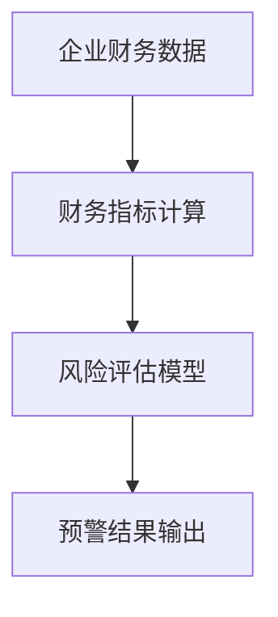
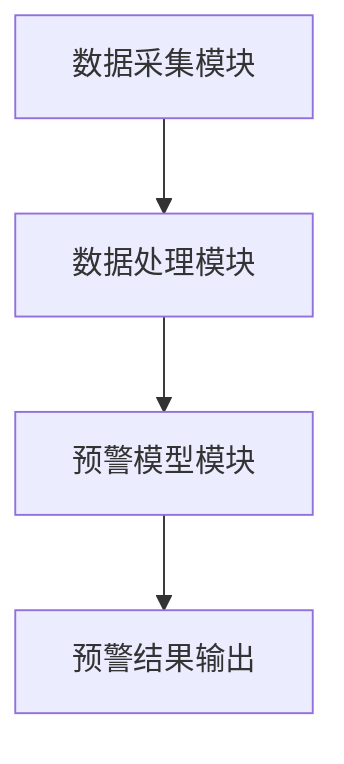
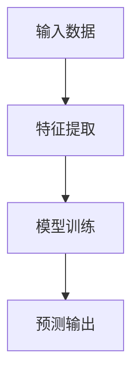

                 


# 《构建智能化的企业财务风险预警系统》

---

## 关键词：  
智能化、财务风险、预警系统、大数据、人工智能、机器学习、金融风控

---

## 摘要：  
本文详细探讨了构建智能化企业财务风险预警系统的全过程，从核心概念、技术基础到系统设计、算法实现，再到项目实战和案例分析，全面解析了如何利用大数据和人工智能技术提升企业财务风险管理能力。通过系统化的分析和实践，本文旨在为企业提供一套高效、准确的财务风险预警解决方案。

---

## 目录大纲

### 第一部分：背景与核心概念

#### 第1章：企业财务风险预警系统概述

##### 1.1 财务风险预警的重要性
- 1.1.1 企业财务风险的常见问题  
- 1.1.2 财务风险对企业的影响  
- 1.1.3 智能化预警的优势  

##### 1.2 核心概念与定义
- 1.2.1 财务风险预警的定义  
- 1.2.2 智能化预警系统的组成部分  
- 1.2.3 系统的核心功能  

#### 1.3 财务风险预警的边界与外延
- 1.3.1 系统边界：数据输入与输出范围  
- 1.3.2 核心要素：企业财务数据、风险指标、预警模型  
- 1.3.3 外延应用：实时监控、决策支持、风险报告  

#### 1.4 核心概念结构图  


---

### 第二部分：技术基础

#### 第2章：大数据与人工智能基础

##### 2.1 数据采集与处理
- 2.1.1 数据来源：企业财务报表、交易记录、市场数据  
- 2.1.2 数据清洗与预处理：去重、缺失值处理、异常值剔除  
- 2.1.3 数据转换：标准化、归一化、特征提取  

##### 2.2 机器学习基础
- 2.2.1 监督学习与非监督学习  
- 2.2.2 常用算法：逻辑回归、决策树、随机森林、神经网络  

#### 第3章：数据挖掘与特征工程

##### 3.1 数据预处理
- 3.1.1 数据清洗：去除噪声数据  
- 3.1.2 数据转换：文本、日期、数值的处理  

##### 3.2 特征提取
- 3.2.1 特征选择：重要性评估、主成分分析  
- 3.2.2 特征工程：特征组合、特征扩展  

---

### 第三部分：系统设计

#### 第4章：系统架构设计

##### 4.1 系统功能设计
- 4.1.1 数据采集模块：实时数据获取  
- 4.1.2 数据处理模块：清洗、转换、特征提取  
- 4.1.3 预警模型模块：训练、预测、结果输出  

##### 4.2 系统架构图


##### 4.3 系统交互设计
- 4.3.1 用户输入：财务数据  
- 4.3.2 系统输出：预警信息、风险报告  

---

### 第四部分：算法实现

#### 第5章：逻辑回归算法实现

##### 5.1 算法原理
- 5.1.1 概率模型：$P(y=1|x) = \frac{e^{\beta x}}{1 + e^{\beta x}}$  
- 5.1.2 损失函数：对数损失函数  
- 5.1.3 优化方法：梯度下降  

##### 5.2 算法流程图


##### 5.3 Python实现
```python
import numpy as np
from sklearn.linear_model import LogisticRegression

# 数据准备
X = np.array([[1, 2], [3, 4], [5, 6]])
y = np.array([0, 1, 0])

# 模型训练
model = LogisticRegression()
model.fit(X, y)

# 预测
print(model.predict(X))
```

---

### 第五部分：项目实战

#### 第6章：环境搭建与核心实现

##### 6.1 环境搭建
- 安装依赖：Python、Jupyter、Scikit-learn、Pandas、Matplotlib  

##### 6.2 数据准备
- 数据来源：企业财务报表、市场数据  

##### 6.3 核心代码实现
- 数据预处理：清洗、特征提取  
- 模型训练：逻辑回归、随机森林  
- 结果分析：准确率、召回率、F1分数  

##### 6.4 代码示例
```python
import pandas as pd
from sklearn.model_selection import train_test_split
from sklearn.metrics import accuracy_score

# 数据加载
data = pd.read_csv('financial_data.csv')

# 数据分割
X = data.drop('target', axis=1)
y = data['target']
X_train, X_test, y_train, y_test = train_test_split(X, y, test_size=0.2)

# 模型训练
from sklearn.ensemble import RandomForestClassifier
model = RandomForestClassifier()
model.fit(X_train, y_train)

# 模型评估
y_pred = model.predict(X_test)
print("Accuracy:", accuracy_score(y_test, y_pred))
```

---

### 第六部分：案例分析与优化

#### 第7章：案例分析

##### 7.1 案例背景
- 某制造企业财务数据  
- 目标：识别潜在的财务风险  

##### 7.2 案例分析
- 数据分析：现金流、应收账款、负债率  
- 模型训练：逻辑回归、随机森林  
- 结果展示：预警等级、风险因素  

##### 7.3 案例优化
- 引入时间序列分析：ARIMA、LSTM  
- 实时监控：数据流处理、动态预警  

---

### 第七部分：总结与展望

#### 第8章：总结与展望

##### 8.1 总结
- 核心技术：大数据、人工智能、机器学习  
- 系统优势：高精度、实时性、可扩展性  

##### 8.2 未来展望
- 更智能的算法：深度学习、强化学习  
- 多源数据融合：文本、图像、语音数据  
- 自动化报告：自然语言生成、可视化展示  

---

## 作者：  
AI天才研究院/AI Genius Institute & 禅与计算机程序设计艺术 /Zen And The Art of Computer Programming  

---

通过以上目录大纲，本文系统地阐述了构建智能化企业财务风险预警系统的各个方面，从理论到实践，从算法到实现，为企业提供了一套完整的解决方案。

