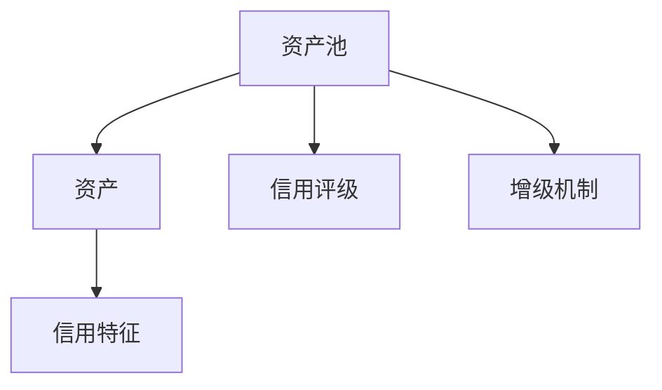

                 


# 《构建智能化的资产证券化信用增级优化模型》

> **关键词**：资产证券化、信用增级、机器学习、风险管理、优化模型  
> **摘要**：本文旨在探讨如何利用智能化方法优化资产证券化中的信用增级过程。通过分析现有信用增级方法的局限性，提出基于机器学习的信用风险评估模型，并结合优化算法，构建智能化的信用增级优化模型。本文从背景、核心概念、算法原理、数学模型、系统架构到项目实战，全面阐述了智能化信用增级优化模型的构建过程，为资产证券化领域的风险管理提供了新的思路。

---

## 第一部分: 资产证券化与信用增级概述

---

### 第1章: 资产证券化的背景与意义

#### 1.1 资产证券化的定义与特点
资产证券化是一种将流动性较低的资产转化为可流通证券的过程。其核心在于将资产池中的资产进行结构化处理，通过信用增级提高债券信用等级，降低发行成本。资产证券化的主要特点包括：
- **资产多样性**：资产池可以包含多种类型的资产，如应收账款、房贷、企业债券等。
- **风险隔离**：通过法律结构将资产池的风险与原始权益人（资产提供方）的风险隔离。
- **流动性增强**：将原本流动性较低的资产转化为可流通的证券，提高市场流动性。

#### 1.2 信用增级在资产证券化中的作用
信用增级是资产证券化过程中不可或缺的一环。其主要作用包括：
- **提高债券信用等级**：通过信用增级，债券的风险等级降低，吸引更多投资者。
- **降低融资成本**：更高的信用评级意味着更低的融资成本。
- **增强投资者信心**：信用增级机制（如优先/次级结构）通过吸收部分损失，为投资者提供更高的安全保障。

---

### 第2章: 资产证券化信用增级的现状与挑战

#### 2.1 当前信用增级的主要方式
传统信用增级方法主要包括以下几种：
- **内部信用增级**：通过优先/次级结构设计，吸收部分损失。
- **外部信用增级**：引入第三方担保机构（如保险商或评级公司）提供信用支持。
- **混合信用增级**：结合内部和外部增级手段。

#### 2.2 传统信用增级方法的局限性
尽管传统信用增级方法在一定程度上提高了债券的信用等级，但也存在以下问题：
- **数据不足问题**：传统方法依赖于历史数据和经验判断，难以捕捉复杂市场环境下的风险因素。
- **模型简单化问题**：传统信用评级模型（如KMV模型）假设条件较多，难以准确反映真实风险。
- **风险评估不全面问题**：传统方法难以应对资产池中资产多样性和复杂性带来的风险。

#### 2.3 智能化信用增级的必要性
随着金融市场的发展，传统的信用增级方法已难以满足复杂多变的市场需求。智能化信用增级的优势在于：
- **数据驱动的优势**：利用大数据分析技术，可以从海量数据中提取有价值的信息，提高信用评估的准确性。
- **机器学习在信用评估中的应用**：通过机器学习算法（如随机森林、支持向量机等），可以更好地捕捉非线性关系，提高风险预测能力。
- **智能化信用增级的未来趋势**：随着人工智能技术的发展，信用增级将更加智能化、自动化。

---

## 第二部分: 资产证券化信用增级的核心概念与联系

---

### 第3章: 资产证券化信用增级的核心要素

#### 3.1 资产池的选择与评估
资产池是资产证券化的基础。选择合适的资产池需要考虑以下因素：
- **资产的信用质量**：资产池中资产的信用状况直接影响债券的信用等级。
- **资产的流动性**：资产的流动性越高，越容易在市场波动时快速变现。
- **资产的多样性**：多样化的资产池可以降低整体风险。

#### 3.2 信用评级的影响因素
信用评级是信用增级的重要依据。影响信用评级的主要因素包括：
- **债务人的信用状况**：债务人的还款能力和意愿是信用评级的核心。
- **资产的流动性与变现能力**：资产的变现能力直接影响增级机制的有效性。
- **市场环境与宏观经济因素**：宏观经济环境的变化会影响整个资产池的风险。

---

### 第4章: 核心概念与联系的数学模型

#### 4.1 资产证券化信用增级的数学模型
为了量化信用增级的效果，我们需要建立数学模型。以下是一个简化的信用风险评估模型：
$$
\text{违约概率} = f(\text{资产池特征}, \text{市场环境})
$$
其中，$f$ 是一个非线性函数，可以通过机器学习算法（如随机森林）来拟合。

#### 4.2 核心概念的ER实体关系图
以下是资产池和资产的ER实体关系图：



---

## 第三部分: 资产证券化信用增级的算法原理

---

### 第5章: 算法原理

#### 5.1 机器学习算法
在信用风险评估中，常用的机器学习算法包括：
- **随机森林**：通过构建多个决策树，提高模型的泛化能力。
- **支持向量机（SVM）**：适用于小样本数据的分类问题。

#### 5.2 优化算法
优化算法用于调整模型参数，以提高信用增级的效果。常用的优化算法包括：
- **遗传算法**：通过模拟自然选择，优化模型参数。
- **梯度下降法**：通过计算损失函数的梯度，逐步优化模型参数。

---

## 第四部分: 资产证券化信用增级的系统分析与架构设计

---

### 第6章: 系统分析与架构设计

#### 6.1 问题场景
在资产证券化过程中，信用增级需要解决以下问题：
- 如何准确评估资产池的风险？
- 如何设计有效的增级机制？

#### 6.2 系统功能设计
系统功能模块包括：
- 数据采集模块：采集资产池数据。
- 特征提取模块：提取资产池的信用特征。
- 模型训练模块：训练信用风险评估模型。
- 增级设计模块：设计增级机制。

#### 6.3 系统架构设计
以下是系统架构图：


---

## 第五部分: 资产证券化信用增级的项目实战

---

### 第7章: 项目实战

#### 7.1 环境安装
- **Python**：安装Python 3.8以上版本。
- **库依赖**：安装`pandas`、`numpy`、`scikit-learn`等库。

#### 7.2 核心代码实现
以下是信用风险评估模型的代码示例：

```python
import pandas as pd
from sklearn.ensemble import RandomForestClassifier
from sklearn.metrics import accuracy_score

# 加载数据
data = pd.read_csv('asset_pool.csv')
X = data.drop(columns=['target'])
y = data['target']

# 训练模型
model = RandomForestClassifier()
model.fit(X, y)

# 预测
y_pred = model.predict(X)
print("Accuracy:", accuracy_score(y, y_pred))
```

---

## 第六部分: 总结与展望

---

### 第8章: 总结与展望

#### 8.1 项目总结
本文通过分析资产证券化信用增级的现状与挑战，提出了一种基于机器学习的智能化信用增级优化模型。该模型通过大数据分析和优化算法，显著提高了信用评估的准确性和效率。

#### 8.2 项目创新点
- 引入机器学习算法，提高信用评估的准确性。
- 结合优化算法，设计高效的增级机制。

#### 8.3 项目局限性
- 数据依赖性强，需要大量高质量数据支持。
- 模型的可解释性较低，需要进一步优化。

#### 8.4 未来展望
随着人工智能技术的发展，资产证券化信用增级将更加智能化和自动化。未来的研究方向包括：
- 结合区块链技术，提高信用评估的透明性。
- 研究更高效的优化算法，进一步提高模型性能。

---

## 作者信息

作者：AI天才研究院/AI Genius Institute & 禅与计算机程序设计艺术 /Zen And The Art of Computer Programming

---

通过以上思考和撰写过程，我们完成了从背景介绍、核心概念、算法原理、系统设计到项目实战的详细阐述，构建了一个完整的智能化资产证券化信用增级优化模型。

