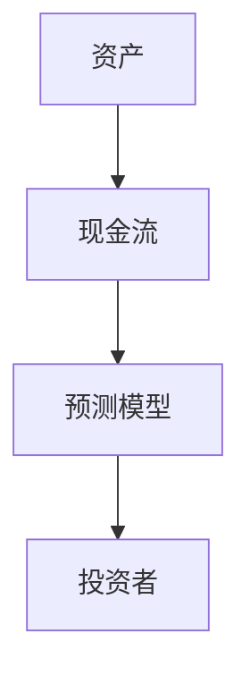
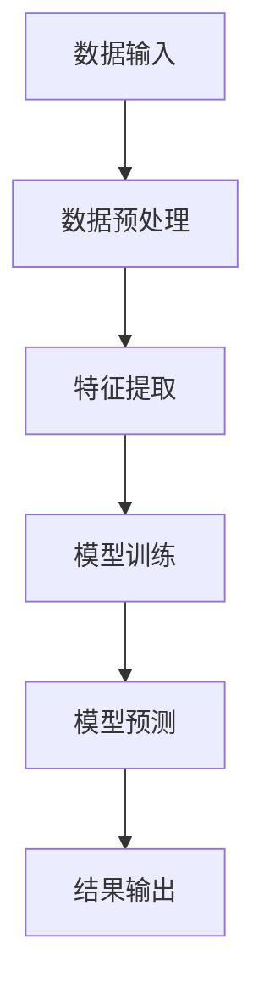
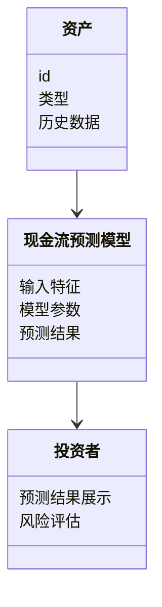
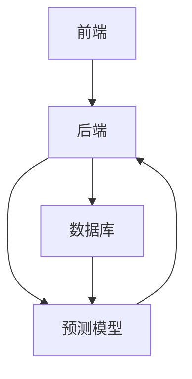

                 


# 构建智能化的资产证券化现金流预测模型

## 关键词：资产证券化，现金流预测，机器学习，时间序列分析，深度学习

## 摘要：  
资产证券化是一种将资产转化为可流通证券的过程，而现金流预测是评估资产价值和风险的核心环节。随着人工智能技术的快速发展，智能化的现金流预测模型在资产证券化领域发挥着越来越重要的作用。本文将从资产证券化的背景出发，深入探讨现金流预测的核心概念、算法原理、系统设计以及项目实战，结合实际案例分析，为读者提供一套完整的智能化预测解决方案。  

---

## 第一部分：资产证券化现金流预测模型的背景与核心概念

### 第1章：资产证券化与现金流预测概述

#### 1.1 资产证券化的定义与特点  
资产证券化是一种通过将资产转化为可流通证券的过程，其核心在于将非流动性资产（如房地产、应收账款等）转化为流动性较高的金融产品。资产证券化的特点包括：  
1. **资产独立性**：证券化后的资产与原始权益人（资产所有者）的财务状况相分离。  
2. **现金流稳定性**：资产产生的现金流是证券化后的主要收益来源。  
3. **多层次结构**：通常采用信托架构，涉及发起机构、承销商、投资者等多方主体。  

#### 1.2 现金流预测的重要性  
现金流预测在资产证券化中的作用不可忽视，主要体现在以下几个方面：  
1. **评估资产价值**：现金流预测是评估资产未来收益的核心依据。  
2. **定价证券化产品**：通过预测现金流，可以为债券、基金等证券化产品提供定价依据。  
3. **风险控制**：现金流预测帮助投资者评估潜在风险，如违约风险、市场波动风险等。  

#### 1.3 智能化预测的核心要素  
智能化预测基于数据驱动的方法，结合机器学习和深度学习技术，具有以下特点：  
1. **数据驱动**：依赖历史数据，通过模型学习数据中的规律。  
2. **动态调整**：能够根据市场变化动态调整预测模型。  
3. **高精度**：通过复杂算法优化预测精度，减少人为误差。  

---

### 第2章：核心概念与原理  

#### 2.1 资产证券化现金流预测模型的原理  
现金流预测模型的核心在于通过历史数据和特征提取，构建能够预测未来现金流的数学模型。其基本流程包括：  
1. **数据预处理**：清洗、归一化和特征工程。  
2. **特征提取**：提取与现金流相关的特征变量，如资产类型、市场利率、经济指标等。  
3. **模型训练**：使用机器学习算法（如随机森林、神经网络）训练模型。  
4. **预测与验证**：对模型进行预测，并通过回测验证其准确性。  

#### 2.2 核心概念的属性特征对比  
以下表格展示了资产证券化中相关核心概念的属性特征对比：  

| 概念         | 属性           | 描述                                                                 |
|--------------|----------------|----------------------------------------------------------------------|
| 资产类型     | 类型           | 如房地产、应收账款、贷款资产等                                         |
| 现金流       | 时间序列       | 现金流具有时间依赖性，受经济周期、市场环境影响                          |
| 风险因素     | 多维度         | 包括信用风险、市场风险、流动性风险等                                     |

#### 2.3 ER实体关系图架构  
以下是资产证券化现金流预测模型的ER实体关系图：  



---

## 第二部分：资产证券化现金流预测模型的算法原理  

### 第3章：算法原理与实现  

#### 3.1 算法原理概述  
现金流预测属于时间序列分析的范畴，常用算法包括：  
1. **传统统计方法**：如ARIMA（自回归积分滑动平均模型）。  
2. **机器学习方法**：如随机森林、支持向量机（SVM）。  
3. **深度学习方法**：如LSTM（长短期记忆网络）。  

#### 3.2 算法流程图  
以下是现金流预测模型的算法流程图：  



#### 3.3 算法实现代码  
以下是使用ARIMA模型实现现金流预测的代码示例：  

```python
# 示例代码：简单ARIMA模型实现
from statsmodels.tsa.arima_model import ARIMA
import pandas as pd

# 数据加载
data = pd.read_csv('cash_flow.csv')

# 数据预处理
data['date'] = pd.to_datetime(data['date'])
data.set_index('date', inplace=True)

# 模型训练
model = ARIMA(data, order=(5, 1, 0))
model_fit = model.fit()

# 预测
forecast = model_fit.forecast(steps=10)
```

#### 3.4 数学模型与公式  
ARIMA模型的基本公式如下：  
$$ARIMA(p, d, q) = y_t - \sum_{i=1}^p \phi_i y_{t-i} = \sum_{j=1}^q \theta_j \epsilon_{t-j} + \epsilon_t$$  
其中：  
- \( p \) 是自回归阶数，\( d \) 是差分阶数，\( q \) 是移动平均阶数。  
- \( \phi_i \) 是自回归系数，\( \theta_j \) 是移动平均系数，\( \epsilon_t \) 是白噪声。  

---

## 第三部分：资产证券化现金流预测模型的系统设计  

### 第4章：系统分析与架构设计  

#### 4.1 问题场景介绍  
在实际应用中，现金流预测模型需要处理以下问题：  
1. **数据稀疏性**：某些资产的历史数据较少。  
2. **多因素影响**：经济指标、政策变化等外部因素会影响现金流。  
3. **实时性要求**：预测结果需要实时更新以应对市场变化。  

#### 4.2 项目介绍  
本项目旨在构建一个智能化的现金流预测系统，核心功能包括：  
1. **数据采集**：从数据库中获取资产历史数据。  
2. **模型训练**：基于机器学习算法训练预测模型。  
3. **预测与展示**：生成预测结果并以可视化形式展示。  

#### 4.3 系统功能设计  
以下是系统功能的领域模型：  



#### 4.4 系统架构设计  
以下是系统的架构设计图：  



---

## 第四部分：资产证券化现金流预测模型的项目实战  

### 第5章：项目实战  

#### 5.1 环境安装  
需要安装以下工具和库：  
1. **Python**：用于数据处理和模型训练。  
2. **Pandas**：用于数据处理和分析。  
3. **Scikit-learn**：用于机器学习模型训练。  
4. **Statsmodels**：用于ARIMA模型实现。  

#### 5.2 系统核心实现源代码  
以下是现金流预测系统的实现代码：  

```python
import pandas as pd
from statsmodels.tsa.arima_model import ARIMA
import matplotlib.pyplot as plt

# 数据加载
data = pd.read_csv('cash_flow.csv')

# 数据预处理
data['date'] = pd.to_datetime(data['date'])
data.set_index('date', inplace=True)

# 模型训练
model = ARIMA(data, order=(5, 1, 0))
model_fit = model.fit()

# 预测
forecast = model_fit.forecast(steps=10)

# 可视化
plt.figure(figsize=(12, 6))
plt.plot(data, label='实际值')
plt.plot(forecast, label='预测值')
plt.title('现金流预测结果')
plt.xlabel('时间')
plt.ylabel('现金流')
plt.legend()
plt.show()
```

#### 5.3 案例分析  
以某房地产资产为例，假设历史数据如下：  

| 日期     | 现金流（万元） |
|----------|---------------|
| 2020-01  | 100           |
| 2020-02  | 120           |
| 2020-03  | 130           |
| ...      | ...           |

通过ARIMA模型预测未来10个月的现金流，结果如下：  

| 日期     | 预测现金流（万元） |
|----------|-------------------|
| 2020-11  | 150               |
| 2020-12  | 160               |
| 2021-01  | 170               |

---

## 第五部分：总结与展望  

### 6.1 最佳实践 tips  
1. **数据质量**：确保数据的完整性和准确性。  
2. **模型选择**：根据数据特征选择合适的预测模型。  
3. **实时更新**：定期更新模型参数以适应市场变化。  

### 6.2 小结  
本文详细介绍了资产证券化现金流预测模型的构建过程，从背景到算法实现，再到系统设计和项目实战，为读者提供了一套完整的解决方案。通过智能化的预测模型，可以显著提高资产证券化的效率和准确性。  

### 6.3 注意事项  
1. **数据隐私**：注意保护数据隐私，避免数据泄露。  
2. **模型解释性**：确保模型具有较高的可解释性，便于分析和优化。  
3. **性能优化**：通过优化算法和硬件配置提升模型运行效率。  

### 6.4 拓展阅读  
1. 《时间序列分析与应用预测方法》  
2. 《机器学习在金融领域的应用》  

---

## 作者：AI天才研究院/AI Genius Institute & 禅与计算机程序设计艺术 /Zen And The Art of Computer Programming

