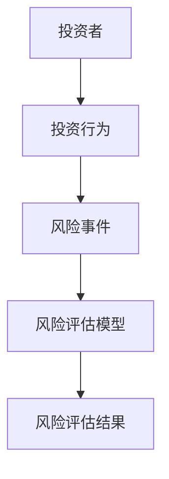
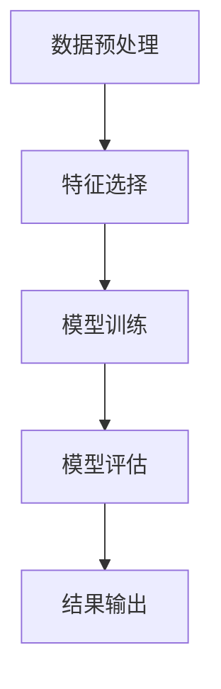

                 


# 构建精准的投资风险评估模型

> **关键词**：投资风险评估模型、金融数据分析、机器学习算法、风险预测、投资决策优化  
> **摘要**：本文详细讲解了如何构建一个精准的投资风险评估模型，通过结合金融数据分析、机器学习算法和系统架构设计，帮助投资者做出科学的投资决策。文章从背景介绍、核心概念、算法原理、系统架构设计、项目实战到总结，全面阐述了构建投资风险评估模型的全过程。

---

## 第1章: 投资风险评估模型的背景与问题背景

### 1.1 投资风险评估的定义与重要性
#### 1.1.1 投资风险的定义
投资风险是指在投资过程中，由于市场波动、经济变化或其他不确定因素，导致投资收益低于预期或出现损失的可能性。投资风险评估的核心目标是量化这些风险，并为投资者提供科学的决策支持。

#### 1.1.2 投资风险评估的重要性
在金融市场中，风险评估是投资决策的核心环节。通过精准的风险评估，投资者可以：
- 量化潜在风险，制定合理的投资策略。
- 优化资产配置，降低整体投资组合的风险。
- 提高投资收益，实现风险与收益的最佳平衡。

#### 1.1.3 投资风险的边界与外延
投资风险的边界主要集中在金融市场的波动性、资产流动性、市场参与者的预期变化等方面。外延则涉及宏观经济指标、行业风险、公司基本面分析等多维度因素。

### 1.2 投资风险评估的核心问题
#### 1.2.1 投资决策中的不确定性
投资者在面对市场波动时，需要考虑多种不确定性因素，如市场周期、政策变化、经济指标等。这些因素直接影响投资组合的风险和收益。

#### 1.2.2 风险与收益的平衡
投资的本质是平衡风险与收益。通过构建精准的风险评估模型，投资者可以在不同风险承受能力下，找到收益与风险的最佳平衡点。

#### 1.2.3 投资风险的分类与特征
投资风险可以分为系统性风险和非系统性风险。系统性风险是市场整体波动带来的风险，如经济衰退、通货膨胀等；非系统性风险则是特定资产或行业特有的风险。

### 1.3 传统投资风险评估方法的局限性
#### 1.3.1 传统方法概述
传统投资风险评估方法主要包括历史数据分析、资产波动率分析、VaR（Value at Risk）模型等。这些方法在一定程度上能够帮助投资者量化风险，但存在一定的局限性。

#### 1.3.2 传统方法的优缺点
- **优点**：简单易懂，易于实施。
- **缺点**：无法捕捉非线性关系，难以应对复杂的市场变化。

#### 1.3.3 传统方法的改进方向
通过引入机器学习算法，可以弥补传统方法的不足，提升风险评估的精准度和实时性。

### 1.4 本章小结
本章介绍了投资风险评估的基本概念、重要性以及传统方法的局限性，为后续构建精准的风险评估模型奠定了基础。

---

## 第2章: 投资风险评估模型的核心概念与联系

### 2.1 核心概念原理
#### 2.1.1 数据特征
数据特征是构建模型的基础，包括资产的历史收益率、波动率、相关性等。

#### 2.1.2 模型选择
根据数据特征和业务需求，选择合适的机器学习算法，如线性回归、随机森林等。

#### 2.1.3 评估指标
常用的评估指标包括准确率、召回率、F1分数等，用于衡量模型的性能。

### 2.2 核心概念属性特征对比表格
| 特征 | 描述 |
|------|------|
| 数据特征 | 输入数据的类型和结构 |
| 模型选择 | 不同算法的适用场景 |
| 评估指标 | 模型性能的量化标准 |

### 2.3 ER实体关系图架构


### 2.4 本章小结
本章详细介绍了投资风险评估模型的核心概念及其之间的联系，为后续的算法选择和系统设计提供了理论基础。

---

## 第3章: 投资风险评估模型的算法原理

### 3.1 算法原理概述
#### 3.1.1 传统统计方法
传统统计方法包括回归分析、时间序列分析等，适用于线性关系较强的场景。

#### 3.1.2 机器学习方法
机器学习方法如随机森林、支持向量机等，能够捕捉复杂的非线性关系。

#### 3.1.3 深度学习方法
深度学习方法通过神经网络模型，能够自动提取数据特征，适用于复杂的金融市场分析。

### 3.2 算法选择与比较
#### 3.2.1 线性回归
线性回归是最简单的回归模型，适用于线性关系明显的场景。

#### 3.2.2 支持向量机
支持向量机（SVM）适用于小样本数据，能够处理高维数据。

#### 3.2.3 随机森林
随机森林是一种基于决策树的集成学习方法，具有较高的鲁棒性。

#### 3.2.4 神经网络
神经网络能够处理复杂的非线性关系，适用于金融市场的时间序列分析。

### 3.3 算法流程图


### 3.4 算法实现代码
```python
import pandas as pd
from sklearn.model_selection import train_test_split
from sklearn.linear_model import LinearRegression
from sklearn.metrics import mean_squared_error

# 加载数据
data = pd.read_csv('investment_risk.csv')

# 数据预处理
X = data[['return', 'volatility']]
y = data['risk_score']

# 划分训练集和测试集
X_train, X_test, y_train, y_test = train_test_split(X, y, test_size=0.2, random_state=42)

# 模型训练
model = LinearRegression()
model.fit(X_train, y_train)

# 模型预测
y_pred = model.predict(X_test)

# 模型评估
mse = mean_squared_error(y_test, y_pred)
print(f"均方误差: {mse}")
```

### 3.5 本章小结
本章详细讲解了投资风险评估模型的算法原理，包括传统统计方法、机器学习方法和深度学习方法的比较，以及具体实现代码的展示。

---

## 第4章: 投资风险评估系统的架构设计

### 4.1 系统功能设计
系统功能设计包括数据采集、模型训练、风险评估和结果展示四个模块。

### 4.2 系统架构设计


### 4.3 系统接口设计
系统接口设计包括数据接口、模型接口和用户接口。

### 4.4 系统交互序列图


### 4.5 本章小结
本章详细介绍了投资风险评估系统的架构设计，包括功能设计、架构图和接口设计。

---

## 第5章: 项目实战

### 5.1 环境安装与配置
安装必要的库，如Python、scikit-learn、pandas等。

### 5.2 核心代码实现
```python
import pandas as pd
from sklearn.model_selection import train_test_split
from sklearn.ensemble import RandomForestRegressor
from sklearn.metrics import mean_absolute_error

# 加载数据
data = pd.read_csv('investment_risk.csv')

# 数据预处理
X = data[['return', 'volatility', 'market_cap']]
y = data['risk_score']

# 划分训练集和测试集
X_train, X_test, y_train, y_test = train_test_split(X, y, test_size=0.2, random_state=42)

# 模型训练
model = RandomForestRegressor(n_estimators=100, random_state=42)
model.fit(X_train, y_train)

# 模型预测
y_pred = model.predict(X_test)

# 模型评估
mae = mean_absolute_error(y_test, y_pred)
print(f"平均绝对误差: {mae}")
```

### 5.3 项目案例分析
通过实际案例分析，展示如何使用构建的模型进行风险评估。

### 5.4 本章小结
本章通过实际案例展示了如何构建投资风险评估模型，并提供了详细的代码实现和分析。

---

## 第6章: 总结与展望

### 6.1 本项目总结
本项目详细介绍了如何构建一个精准的投资风险评估模型，涵盖了从数据预处理到模型训练的全过程。

### 6.2 最佳实践 Tips
- 数据预处理是关键，确保数据的准确性和完整性。
- 选择合适的算法，根据数据特征和业务需求进行调整。
- 定期更新模型，适应市场变化。

### 6.3 未来展望
未来可以进一步优化模型，引入更多数据源和算法，提升模型的精准度和实时性。

### 6.4 本章小结
本章总结了项目的成果，并对未来的研究方向提出了展望。

---

## 作者：AI天才研究院/AI Genius Institute & 禅与计算机程序设计艺术 /Zen And The Art of Computer Programming

---

通过以上内容，我们详细讲解了如何构建一个精准的投资风险评估模型，从背景介绍到系统设计，再到项目实战，全面覆盖了构建模型的各个环节。希望读者能够通过本文，掌握构建投资风险评估模型的核心方法和技巧。

