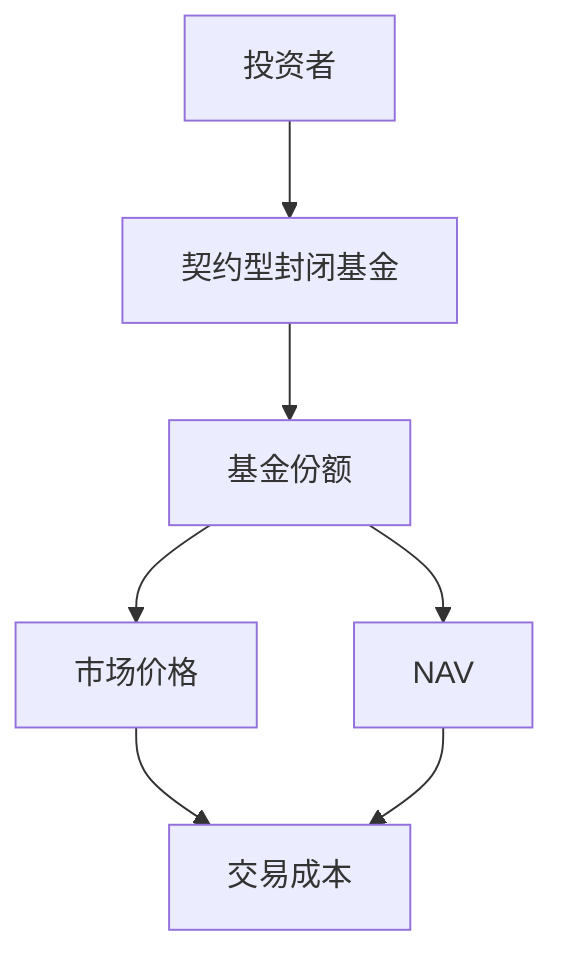
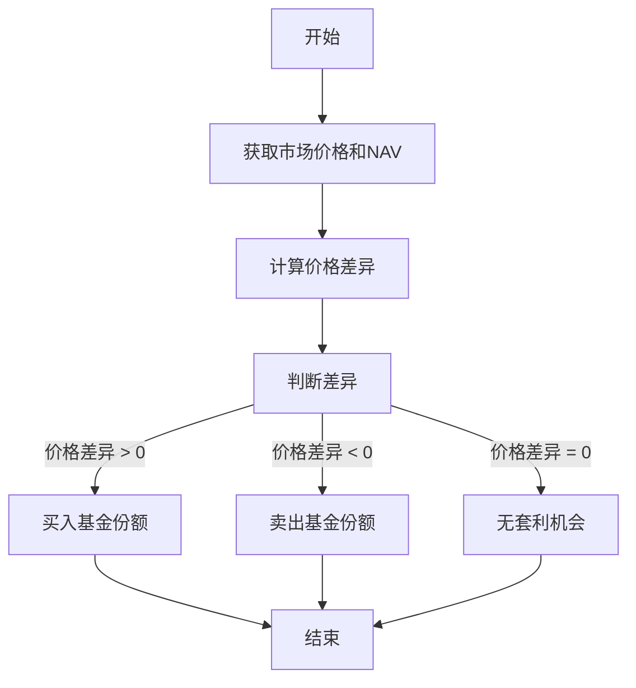
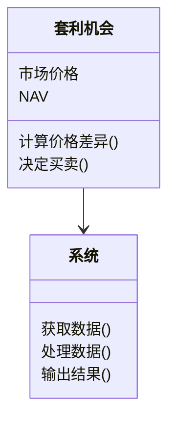
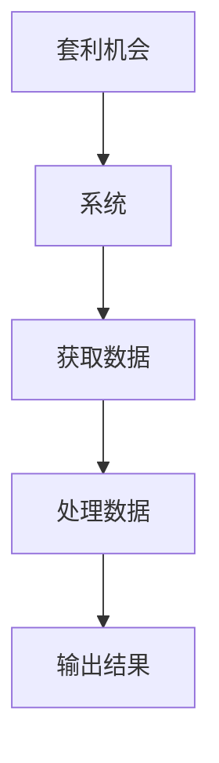
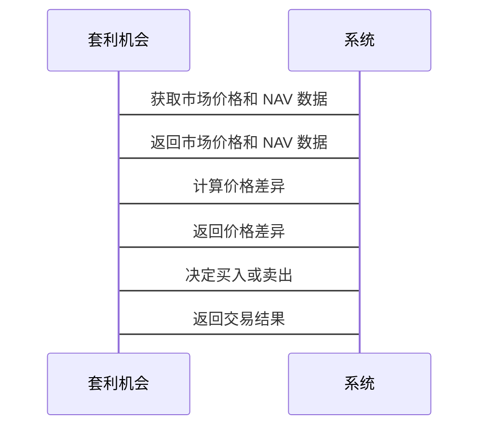

                 


# 查尔斯·布兰德的契约型封闭基金套利

## 关键词：契约型封闭基金，套利，金融市场，算法，数学模型

## 摘要：本文深入探讨了查尔斯·布兰德提出的契约型封闭基金套利策略，结合金融理论与技术实现，详细分析了其算法原理、数学模型和系统架构。通过实际案例分析和项目实战，揭示了该套利方法在金融市场中的应用及其优化方向。

---

# 第一部分: 契约型封闭基金套利的背景与核心概念

## 第1章: 套利的定义与基本原理

### 1.1 套利的定义与基本原理

套利是一种利用资产或金融工具在不同市场、时间和地点之间的价格差异，以无风险或低风险的方式赚取利润的交易策略。其核心在于发现价格差异并利用这些差异进行交易，以期在价格回归均衡时获利。

#### 1.1.1 套利的定义
套利是指在两个或多个市场之间同时买进和卖出同一种资产，以利用价格差异赚取利润的行为。

#### 1.1.2 套利的基本原理
套利的原理基于市场间的不均衡定价。当同一资产在不同市场上的价格出现差异时，套利者可以通过同时买入低价市场和卖出高价市场的资产，从价格回归均衡的过程中获利。

#### 1.1.3 套利的分类与特点
套利可以分为以下几种主要类型：
- **跨市场套利**：在不同市场之间进行套利。
- **跨期套利**：在不同时间点进行套利。
- **跨产品套利**：在不同金融产品之间进行套利。
- **无风险套利**：在无风险的情况下进行套利。

套利的特点包括低风险、高收益、依赖市场不均衡等。

---

### 1.2 契约型封闭基金的定义与特点

#### 1.2.1 套利的定义
契约型封闭基金是一种通过契约形式组织的基金，基金份额在封闭期内不得赎回，且基金份额在交易所上市交易。

#### 1.2.2 套利的基本原理
在契约型封闭基金中，套利者可以通过买入低价的基金份额和卖出高价的基金份额，利用价格差异进行套利。

#### 1.2.3 套利的分类与特点
契约型封闭基金的套利可以分为以下几种类型：
- **折价套利**：当基金份额的市场价格低于其 NAV（净资产价值）时，买入基金份额，等待价格回归 NAV 后卖出获利。
- **溢价套利**：当基金份额的市场价格高于其 NAV 时，卖出基金份额，等待价格回归 NAV 后买入获利。

---

## 第2章: 契约型封闭基金套利的背景与问题背景

### 2.1 问题背景

#### 2.1.1 金融市场中的套利机会
金融市场中的价格差异为套利者提供了机会。契约型封闭基金由于其特殊的组织形式和交易机制，常常存在价格与 NAV 的偏离，为套利者提供了套利空间。

#### 2.1.2 契约型封闭基金的特点
契约型封闭基金具有以下特点：
- 基金份额在封闭期内不得赎回。
- 基金份额在交易所上市交易。
- 基金 NAV 的计算较为复杂。

#### 2.1.3 套利在契约型封闭基金中的应用
套利者可以通过分析契约型封闭基金的市场价格与 NAV 的差异，进行套利交易。

### 2.2 问题描述

#### 2.2.1 套利的基本原理
套利的基本原理是通过价格差异进行交易，以期获得利润。

#### 2.2.2 套利在契约型封闭基金中的具体表现
契约型封闭基金的市场价格与 NAV 之间的差异为套利者提供了套利机会。

#### 2.2.3 套利的实现方式
套利的实现方式包括：
- 跨市套利：在不同的交易所进行套利。
- 跨期套利：在不同的时间段进行套利。
- 跨产品套利：在不同的金融产品之间进行套利。

### 2.3 问题解决

#### 2.3.1 套利的基本原理
通过分析市场价格与 NAV 的差异，套利者可以在契约型封闭基金中进行套利交易。

#### 2.3.2 套利在契约型封闭基金中的具体实现
套利者可以通过买入低价的基金份额和卖出高价的基金份额，利用价格差异进行套利。

#### 2.3.3 边界与外延
契约型封闭基金套利的边界在于市场价格与 NAV 的差异是否足够大以覆盖交易成本。外延则包括其他类型的套利策略。

---

## 第3章: 套利的核心概念与联系

### 3.1 核心概念原理

#### 3.1.1 套利的基本原理
套利的基本原理是通过价格差异进行交易，以期获得利润。

#### 3.1.2 契约型封闭基金的套利机制
契约型封闭基金的套利机制基于市场价格与 NAV 的差异。

#### 3.1.3 套利与市场效率的关系
套利是市场效率的体现，套利者通过套利行为使得市场价格回归均衡。

### 3.2 核心概念对比表

| 对比维度 | 套利 | 投资 | 风险投资 |
|----------|------|------|----------|
| 定义     | 利用价格差异进行交易以获利 | 投资于资产以获得收益 | 投资于高风险资产以获得高收益 |
| 风险     | 低风险或无风险 | 中等风险 | 高风险 |
| 收益     | 稳定收益 | 不稳定收益 | 不稳定收益 |
| 持有期   | 短期 | 长期 | 长期 |

### 3.3 ER 实体关系图



---

# 第二部分: 契约型封闭基金套利的算法原理

## 第4章: 套利算法的数学模型与公式

### 4.1 数学模型

#### 4.1.1 套利的基本数学模型
套利的基本数学模型可以表示为：
$$ \text{利润} = \text{卖出价格} - \text{买入价格} $$

#### 4.1.2 契约型封闭基金套利的数学模型
契约型封闭基金套利的数学模型可以表示为：
$$ \text{利润} = \text{市场价格} - \text{NAV} $$

#### 4.1.3 套利的数学公式
套利的数学公式可以表示为：
$$ \text{套利收益} = \max(\text{市场价格} - \text{NAV}, \text{NAV} - \text{市场价格}) $$

### 4.2 算法原理

#### 4.2.1 套利的基本算法
套利的基本算法如下：
1. 计算契约型封闭基金的市场价格与 NAV 的差异。
2. 如果市场价格低于 NAV，则买入基金份额。
3. 如果市场价格高于 NAV，则卖出基金份额。

#### 4.2.2 套利在契约型封闭基金中的具体实现
套利在契约型封闭基金中的具体实现如下：
1. 计算基金份额的市场价格与 NAV 的差异。
2. 根据差异决定买入或卖出基金份额。

#### 4.2.3 套利算法的优化与改进
套利算法的优化与改进包括：
- 考虑交易成本和滑点。
- 优化套利策略，以提高收益。

---

## 第5章: 套利算法的实现与代码

### 5.1 算法实现

#### 5.1.1 套利算法的实现步骤
套利算法的实现步骤如下：
1. 获取契约型封闭基金的市场价格和 NAV 数据。
2. 计算市场价格与 NAV 的差异。
3. 根据差异决定买入或卖出基金份额。

#### 5.1.2 Python代码实现
以下是一个简单的套利算法的Python代码实现：

```python
def calculate_arbitrage机会(price, nav):
    arbitrage_opportunity = price - nav
    if arbitrage_opportunity > 0:
        return "买入基金份额"
    elif arbitrage_opportunity < 0:
        return "卖出基金份额"
    else:
        return "无套利机会"

# 示例数据
price = 10.5
nav = 10.0
print(calculate_arbitrage机会(price, nav))
```

#### 5.1.3 算法流程图



---

## 第6章: 系统分析与架构设计

### 6.1 项目介绍

#### 6.1.1 问题场景
契约型封闭基金的市场价格与 NAV 之间的差异为套利者提供了套利机会。

#### 6.1.2 系统功能设计
系统功能设计包括：
- 获取市场价格和 NAV 数据。
- 计算价格差异。
- 决定买入或卖出基金份额。

### 6.2 系统架构设计

#### 6.2.1 领域模型类图



#### 6.2.2 系统架构图



#### 6.2.3 接口设计
系统接口设计包括：
- 获取市场价格和 NAV 数据的接口。
- 计算价格差异的接口。
- 决定买入或卖出的接口。

#### 6.2.4 交互流程



---

## 第7章: 项目实战

### 7.1 环境安装

#### 7.1.1 Python安装
安装Python环境，版本建议为3.8或以上。

#### 7.1.2 数据获取
通过API获取契约型封闭基金的市场价格和 NAV 数据。

### 7.2 系统核心实现

#### 7.2.1 Python代码实现
以下是Python代码实现：

```python
import requests

def get_market_price(fund_id):
    response = requests.get(f"http://api.market.com/fund/{fund_id}/price")
    return response.json()["price"]

def get_nav(fund_id):
    response = requests.get(f"http://api.market.com/fund/{fund_id}/nav")
    return response.json()["nav"]

def calculate_arbitrage_opportunity(fund_id):
    price = get_market_price(fund_id)
    nav = get_nav(fund_id)
    arbitrage_opportunity = price - nav
    if arbitrage_opportunity > 0:
        return "买入基金份额"
    elif arbitrage_opportunity < 0:
        return "卖出基金份额"
    else:
        return "无套利机会"

# 示例
fund_id = "123456"
print(calculate_arbitrage_opportunity(fund_id))
```

#### 7.2.2 代码功能解读
上述代码实现了以下功能：
- 通过API获取契约型封闭基金的市场价格和 NAV 数据。
- 计算市场价格与 NAV 的差异。
- 根据差异决定买入或卖出基金份额。

### 7.3 案例分析

#### 7.3.1 案例背景
假设某契约型封闭基金的市场价格为10.5元，NAV为10.0元。

#### 7.3.2 案例分析
根据代码，套利机会为：
$$ \text{套利收益} = 10.5 - 10.0 = 0.5 $$

因此，套利者应该买入基金份额。

#### 7.3.3 交易结果
套利者买入基金份额，等待市场价格回归 NAV 后卖出，获得利润0.5元。

### 7.4 项目小结
通过上述案例分析，可以得出结论：契约型封闭基金的套利机会可以通过市场价格与 NAV 的差异来确定，并通过算法实现套利交易。

---

## 第8章: 最佳实践、小结、注意事项与拓展阅读

### 8.1 最佳实践

#### 8.1.1 交易成本的控制
套利者需要控制交易成本，以确保套利收益大于交易成本。

#### 8.1.2 市场监控
套利者需要实时监控市场价格和 NAV 的变化，及时发现套利机会。

#### 8.1.3 风险管理
套利者需要进行风险管理，避免因市场价格波动而导致的损失。

### 8.2 小结
本文深入探讨了查尔斯·布兰德的契约型封闭基金套利策略，结合金融理论与技术实现，详细分析了其算法原理、数学模型和系统架构。通过实际案例分析和项目实战，揭示了该套利方法在金融市场中的应用及其优化方向。

### 8.3 注意事项

#### 8.3.1 套利风险
套利者需要注意套利风险，包括市场风险、流动性风险等。

#### 8.3.2 套利的合法性
套利者需要遵守相关法律法规，确保套利行为的合法性。

#### 8.3.3 套利的道德性
套利者需要考虑套利行为的道德性，避免对市场造成不当影响。

### 8.4 拓展阅读

#### 8.4.1 金融数学
推荐阅读《金融数学基础》。

#### 8.4.2 套利策略
推荐阅读《套利策略与算法》。

#### 8.4.3 系统架构设计
推荐阅读《系统架构设计实战》。

---

# 作者：AI天才研究院/AI Genius Institute & 禅与计算机程序设计艺术 /Zen And The Art of Computer Programming

