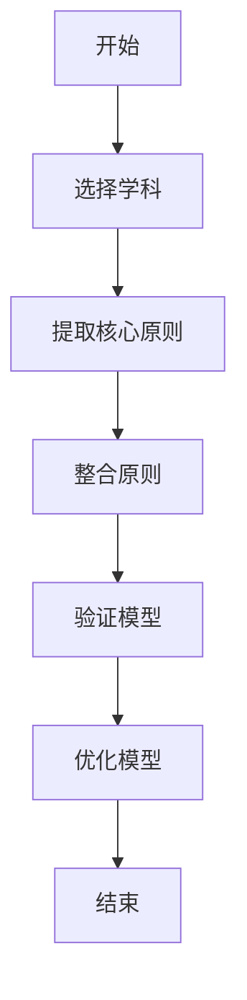
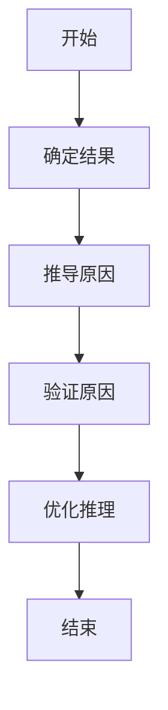
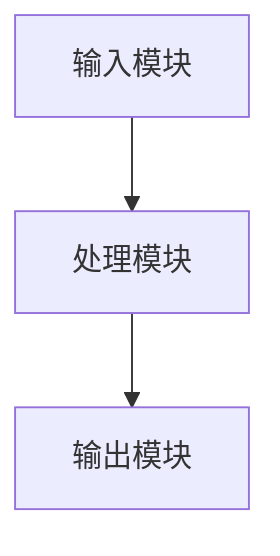
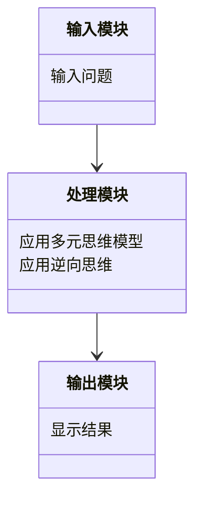

                 


# 查理·芒格的商业模式分析框架

> 关键词：查理·芒格，商业模式分析，多元思维模型，逆向思维，系统架构，算法原理

> 摘要：本文深入探讨了查理·芒格的多元思维模型及其在商业模式分析中的应用。通过分析芒格的核心思想，构建了一个基于逆向思维和多元思维模型的商业模式分析框架，并详细讲解了其算法原理、系统架构设计和项目实战案例。文章最后总结了最佳实践和注意事项，为读者提供了全面的指导。

---

## 第1章：查理·芒格与多元思维模型

### 1.1 查理·芒格的生平与思想

查理·芒格（Charlie Munger）是世界著名投资者和伯克希尔哈撒韦公司副主席，以其独特的多元思维模型闻名。他强调通过跨学科的思维方式来理解和解决复杂问题。

#### 1.1.1 查理·芒格的早年经历

芒格出生于美国密歇根州，早年对法律和心理学产生浓厚兴趣。他的投资哲学深受价值投资之父本杰明·格雷厄姆影响，但芒格的独特之处在于他将多元思维模型应用到投资决策中。

#### 1.1.2 芒格的投资哲学

芒格认为，投资不仅仅是分析数字，更是对商业模式、竞争优势和长期价值的深刻理解。他的投资决策基于对多个领域的深刻洞察，包括心理学、经济学、物理学等。

#### 1.1.3 多元思维模型概述

多元思维模型是指将多个学科的核心原则整合起来，形成一个跨学科的思维方式。芒格认为，通过这种模型，可以更好地理解复杂问题，并做出更明智的决策。

### 1.2 多元思维模型的核心概念

#### 1.2.1 多元思维模型的定义

多元思维模型是一种通过整合多个学科的核心原则，来分析和解决复杂问题的方法。它强调知识的广度和深度的结合，帮助我们从多个角度看待问题。

#### 1.2.2 多元思维模型的构成要素

多元思维模型的构成要素包括：心理学、经济学、物理学、生物学、数学等。每个学科都提供了独特的视角和工具，帮助我们更全面地理解问题。

#### 1.2.3 多元思维模型与商业模式分析的关系

商业模式分析需要考虑市场、客户、竞争等多个方面。多元思维模型提供了跨学科的工具，帮助我们从不同角度分析商业模式，识别潜在风险和机会。

### 1.3 商业模式分析的背景与意义

#### 1.3.1 商业模式分析的定义

商业模式是指企业创造价值、传递价值和获取价值的基本逻辑。商业模式分析是通过对企业价值链的各个环节进行分析，识别其优势和劣势，优化资源配置。

#### 1.3.2 商业模式分析的重要性

在快速变化的商业环境中，商业模式分析帮助企业及时调整战略，应对市场变化，提高竞争力。对于投资者来说，商业模式分析是评估企业长期价值的重要工具。

#### 1.3.3 芒格视角下的商业模式分析框架

芒格的多元思维模型为商业模式分析提供了新的视角。通过逆向思维，芒格能够识别出商业模式中的关键成功要素，并预测可能的风险和挑战。

---

## 第2章：商业模式分析的核心概念

### 2.1 多元思维模型与商业模式分析的关系

#### 2.1.1 多元思维模型在商业模式分析中的应用

通过多元思维模型，可以从多个学科的角度分析商业模式。例如，心理学可以帮助理解消费者行为，经济学可以帮助分析市场结构，物理学可以帮助优化运营效率。

#### 2.1.2 多元思维模型与商业模式分析的联系

多元思维模型提供了跨学科的工具，帮助商业模式分析者从多个角度理解问题，避免单一视角的局限性。

### 2.2 逆向思维与商业模式分析

#### 2.2.1 逆向思维的定义

逆向思维是指从相反的方向思考问题，通过分析问题的结果，推导出可能的原因或解决方案。芒格常用逆向思维来分析商业模式，识别潜在问题。

#### 2.2.2 逆向思维在商业模式分析中的应用

例如，在分析竞争对手时，可以通过逆向思维，思考竞争对手的劣势，找到自己的竞争优势。

#### 2.2.3 逆向思维与传统思维的对比

传统思维倾向于从正面解决问题，而逆向思维则从反面入手，往往能够发现传统方法难以察觉的问题。

---

## 第3章：芒格商业模式分析框架的构建

### 3.1 多元思维模型的构建

#### 3.1.1 多元思维模型的构建步骤

1. **识别问题**：明确需要分析的商业模式问题。
2. **选择相关学科**：根据问题选择相关的学科。
3. **提取核心原则**：从每个学科中提取核心原则。
4. **整合原则**：将各个学科的原则整合起来，形成多元思维模型。

#### 3.1.2 多元思维模型的验证与优化

通过实际案例验证模型的有效性，并根据反馈不断优化模型。

### 3.2 逆向思维的应用

#### 3.2.1 逆向思维在商业模式分析中的具体应用

例如，分析一家公司的盈利能力，可以通过逆向思维分析其利润来源，识别可能的利润增长点。

#### 3.2.2 逆向思维与商业模式创新的关系

逆向思维可以帮助企业发现新的商业模式，突破传统思维的限制。

---

## 第4章：芒格商业模式分析框架的算法原理

### 4.1 多元思维模型的算法实现

#### 4.1.1 多元思维模型的数学表达

$$\text{模型构建} = \sum_{i=1}^{n} \text{学科}_i$$

#### 4.1.2 多元思维模型的算法流程图



#### 4.1.3 多元思维模型的Python实现代码

```python
def build_model(subjects):
    principles = []
    for subject in subjects:
        principles.extend(get_core_principles(subject))
    return principles

def get_core_principles(subject):
    # 根据学科返回核心原则
    pass
```

### 4.2 逆向思维的算法实现

#### 4.2.1 逆向思维的数学模型

$$\text{逆向思维} = \text{问题} \rightarrow \text{结果} \rightarrow \text{原因}$$

#### 4.2.2 逆向思维的算法流程图



#### 4.2.3 逆向思维的Python实现代码

```python
def reverse_think(problem):
    result = analyze_result(problem)
    cause = deduce_cause(result)
    return cause

def analyze_result(problem):
    # 分析问题的结果
    pass

def deduce_cause(result):
    # 推导原因
    pass
```

---

## 第5章：芒格商业模式分析框架的系统架构设计

### 5.1 系统功能设计

#### 5.1.1 系统功能模块划分

- **输入模块**：接收输入的商业模式问题。
- **处理模块**：应用多元思维模型和逆向思维进行分析。
- **输出模块**：展示分析结果。

#### 5.1.2 系统功能模块的交互流程



#### 5.1.3 系统功能模块的领域模型（Mermaid类图）



### 5.2 系统架构设计

#### 5.2.1 系统架构的分层设计

- **表现层**：用户界面。
- **业务逻辑层**：处理商业模式分析的逻辑。
- **数据访问层**：访问和存储数据。

#### 5.2.2 系统架构的Mermaid架构图


---

## 第6章：项目实战

### 6.1 环境安装

- 安装Python和所需的开发工具。
- 安装必要的库，如Mermaid和matplotlib。

### 6.2 核心代码实现

#### 6.2.1 多元思维模型的实现

```python
def build_model(subjects):
    principles = []
    for subject in subjects:
        principles.extend(get_core_principles(subject))
    return principles
```

#### 6.2.2 逆向思维的实现

```python
def reverse_think(problem):
    result = analyze_result(problem)
    cause = deduce_cause(result)
    return cause
```

### 6.3 案例分析

分析一家公司的商业模式，使用芒格的多元思维模型和逆向思维，识别其竞争优势和潜在风险。

### 6.4 项目小结

通过实战项目，验证了芒格商业模式分析框架的有效性，展示了其在实际应用中的优势。

---

## 第7章：最佳实践

### 7.1 小结

芒格的商业模式分析框架结合了多元思维模型和逆向思维，为企业和投资者提供了强大的分析工具。

### 7.2 注意事项

- 在实际应用中，需要根据具体情况调整模型。
- 多元思维模型需要不断更新和优化。
- 逆向思维需要结合实际案例进行验证。

### 7.3 拓展阅读

建议阅读查理·芒格的著作，深入理解多元思维模型的应用。

---

## 作者

作者：AI天才研究院 & 禅与计算机程序设计艺术

