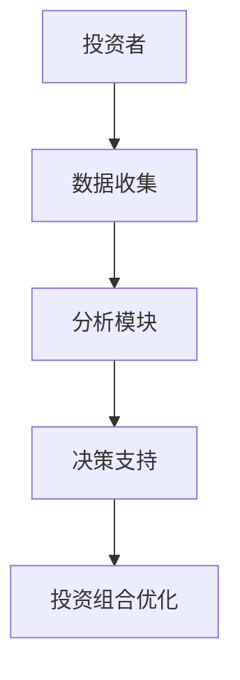
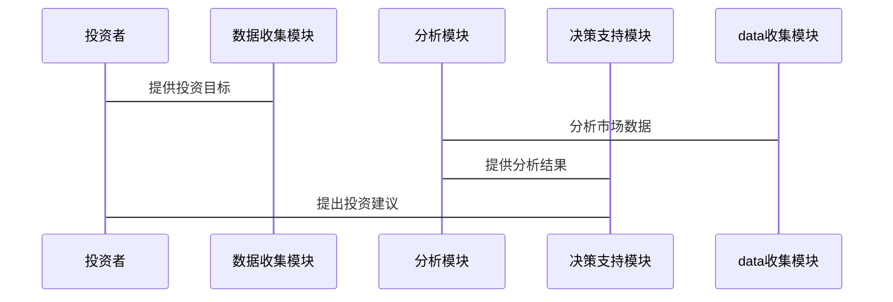

                 

# 查理·芒格的多元思维模型在投资中的应用

> 关键词：查理·芒格，多元思维模型，投资，风险管理，决策框架，系统思维

> 摘要：本文深入探讨了查理·芒格的多元思维模型在投资中的应用。通过分析其核心概念、数学基础、系统架构及实际案例，本文展示了如何将多元思维模型整合到投资决策中，以实现更优的收益与风险平衡。文章从基础理论到实战应用，层层递进，为读者提供了全面的指导。

---

## 第1章: 查理·芒格与多元思维模型的背景

### 1.1 查理·芒格的生平与思想

查理·芒格（Charlie Munger）是美国著名投资家、伯克希尔·哈撒韦公司副董事长，被誉为“巴菲特的智囊”。他不仅是一位成功的投资者，更是一位思想家。芒格的投资哲学强调“多元思维模型”，即通过跨学科的视角来理解世界和做出决策。

#### 1.1.1 查理·芒格的基本经历

芒格于1924年出生于美国密歇根州，早年就读于哈佛大学，后转学到加州大学伯克利分校并获得法律博士学位。他在职业生涯中涉足多个领域，包括法律、能源、媒体和投资等，积累了丰富的跨领域经验。

#### 1.1.2 查理·芒格的投资哲学

芒格的投资哲学以“价值投资”为核心，但与传统的价值投资不同，他强调通过多元思维模型来分析企业。他认为，单一的思维方式容易导致认知偏差，而多元思维模型能够帮助投资者更全面地理解企业的内在价值和外部环境。

#### 1.1.3 多元思维模型的核心理念

多元思维模型的核心理念是通过多个学科的视角（如心理学、经济学、物理学等）来分析问题，从而避免单一思维的局限性。芒格认为，真正的投资高手应该是一个“知识的杂家”，能够将不同领域的知识融会贯通。

---

### 1.2 多元思维模型的定义与特点

#### 1.2.1 多元思维模型的定义

多元思维模型是指通过多个学科的视角来分析问题，从而形成一个全面、系统的决策框架。它强调知识的多维度整合和跨领域应用。

#### 1.2.2 多元思维模型的核心特点

1. **跨学科性**：多元思维模型的核心在于将不同领域的知识结合起来，形成一个完整的认知框架。
2. **系统性**：通过系统性地分析问题，避免单一思维的局限性。
3. **实用性**：多元思维模型不仅是一种理论，更是一种实践工具，能够帮助投资者做出更优的决策。

#### 1.2.3 多元思维模型与传统投资方法的区别

传统投资方法通常依赖于单一的分析框架，如技术分析或基本面分析。而多元思维模型则强调从多个角度综合分析，形成一个更加全面的决策依据。

---

### 1.3 多元思维模型在投资中的应用背景

#### 1.3.1 当前投资环境的复杂性

现代投资环境日益复杂，市场参与者的行为、政策变化、技术进步等因素交织在一起，使得传统的单一分析方法难以应对。

#### 1.3.2 传统投资方法的局限性

传统投资方法往往忽视了市场的复杂性和不确定性，容易导致决策失误。

#### 1.3.3 多元思维模型的优势与适用场景

多元思维模型的优势在于其跨学科的视角和系统性的分析方法，适用于复杂多变的投资环境。

---

## 第2章: 多元思维模型的核心概念与原理

### 2.1 多元思维模型的核心要素

#### 2.1.1 知识的多维度整合

多元思维模型的核心在于将不同领域的知识整合起来，形成一个完整的认知框架。例如，将经济学、心理学、物理学等领域的知识结合起来，分析企业的内在价值和外部环境。

#### 2.1.2 心理倾向的分析

芒格认为，投资者的心理倾向（如贪婪、恐惧）是影响决策的重要因素。通过分析心理倾向，可以更好地理解市场的波动性和投资者的行为。

#### 2.1.3 决策框架的构建

多元思维模型强调构建一个系统的决策框架，将不同领域的知识和心理倾向结合起来，形成一个完整的决策过程。

---

### 2.2 多元思维模型的数学基础

#### 2.2.1 基本概率模型

多元思维模型的数学基础包括概率论、统计学等。例如，可以通过概率模型来评估投资项目的风险和收益。

#### 2.2.2 决策树分析

决策树是一种常用的分析工具，可以用来评估不同决策路径的可能结果。通过决策树分析，投资者可以更好地理解不同决策的潜在影响。

#### 2.2.3 风险评估与收益计算

通过多元思维模型，投资者可以将不同风险因素（如市场风险、流动性风险等）结合起来，进行综合评估。

---

### 2.3 多元思维模型与系统思维的关系

#### 2.3.1 系统思维的定义与特点

系统思维是一种从整体出发，分析问题的思维方式。它强调系统各部分之间的相互关系和整体的动态变化。

#### 2.3.2 多元思维模型与系统思维的联系

多元思维模型与系统思维密切相关。多元思维模型通过整合不同领域的知识，形成一个系统的认知框架，而系统思维则强调从整体出发，分析问题的复杂性。

#### 2.3.3 系统思维在投资中的应用

通过系统思维，投资者可以更好地理解市场的复杂性，避免单一思维的局限性。

---

## 第3章: 多元思维模型在投资中的核心应用

### 3.1 多元思维模型在股票分析中的应用

#### 3.1.1 公司基本面分析的多维度视角

多元思维模型强调从多个维度分析公司的基本面，例如财务状况、行业地位、管理团队等。

#### 3.1.2 行业趋势分析的多维度视角

通过分析行业的历史趋势、政策影响、技术进步等因素，投资者可以更好地判断行业的未来发展方向。

#### 3.1.3 竞争优势分析的多维度视角

竞争优势是企业长期发展的关键因素。多元思维模型强调从多个角度分析企业的竞争优势，例如成本优势、技术优势等。

---

### 3.2 多元思维模型在风险管理中的应用

#### 3.2.1 风险的多维度识别

多元思维模型强调从多个角度识别风险，例如市场风险、流动性风险、信用风险等。

#### 3.2.2 风险的多维度评估

通过多元思维模型，投资者可以综合评估不同风险因素的影响，从而做出更优的风险管理决策。

#### 3.2.3 风险的多维度应对策略

多元思维模型强调从多个角度制定风险管理策略，例如分散投资、对冲策略等。

---

### 3.3 多元思维模型在投资组合管理中的应用

#### 3.3.1 投资组合的多维度构建

通过多元思维模型，投资者可以将不同资产类别、行业、地区等因素结合起来，构建一个多样化的投资组合。

#### 3.3.2 投资组合的多维度优化

多元思维模型可以帮助投资者从多个维度优化投资组合，例如风险调整后的收益、流动性需求等。

#### 3.3.3 投资组合的多维度监控与调整

通过多元思维模型，投资者可以定期监控投资组合的表现，并根据市场变化进行动态调整。

---

## 第4章: 多元思维模型的系统化应用与案例分析

### 4.1 系统化应用的数学模型

#### 4.1.1 投资组合优化的数学模型

通过多元思维模型，投资者可以构建一个数学优化模型，以最大化收益并最小化风险。

#### 4.1.2 风险评估的数学模型

通过多元思维模型，投资者可以构建一个风险评估模型，综合考虑不同风险因素的影响。

---

### 4.2 多元思维模型的系统架构设计

#### 4.2.1 系统功能设计

通过多元思维模型，投资者可以设计一个系统的功能架构，包括数据收集、分析、决策支持等模块。

#### 4.2.2 系统架构图

可以通过mermaid图来展示系统的架构设计，例如：

---

### 4.3 多元思维模型的系统交互设计

#### 4.3.1 系统交互图

可以通过mermaid序列图来展示系统的交互流程，例如：

---

### 4.4 多元思维模型的实战案例

#### 4.4.1 成功案例

例如，芒格通过分析企业的竞争优势和行业趋势，成功投资于伯克希尔·哈撒韦公司。

#### 4.4.2 失败案例

例如，伯克希尔·哈撒韦公司曾因低估了互联网泡沫的影响而遭受损失，但芒格通过多元思维模型总结经验教训，改进了投资策略。

---

## 第5章: 多元思维模型的系统化应用与总结

### 5.1 多元思维模型的系统化应用

通过多元思维模型，投资者可以构建一个系统的投资框架，从多个维度分析问题，从而做出更优的决策。

### 5.2 多元思维模型的总结与展望

多元思维模型是一种跨学科的思维方式，适用于复杂多变的投资环境。未来，随着市场的进一步复杂化，多元思维模型的重要性将更加凸显。

---

## 作者：AI天才研究院/AI Genius Institute & 禅与计算机程序设计艺术 /Zen And The Art of Computer Programming

---

**本文通过详细分析查理·芒格的多元思维模型，展示了其在投资中的应用。从基础理论到系统设计，从案例分析到实战应用，本文为投资者提供了一个全面的指导框架。希望读者能够通过本文，更好地理解多元思维模型的核心思想，并将其应用于实际投资中。**

