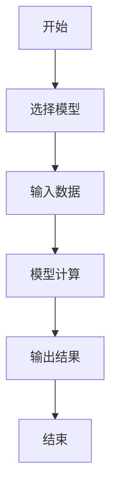
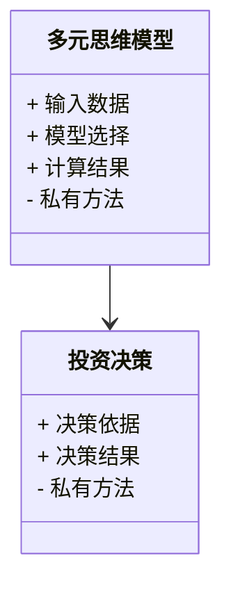
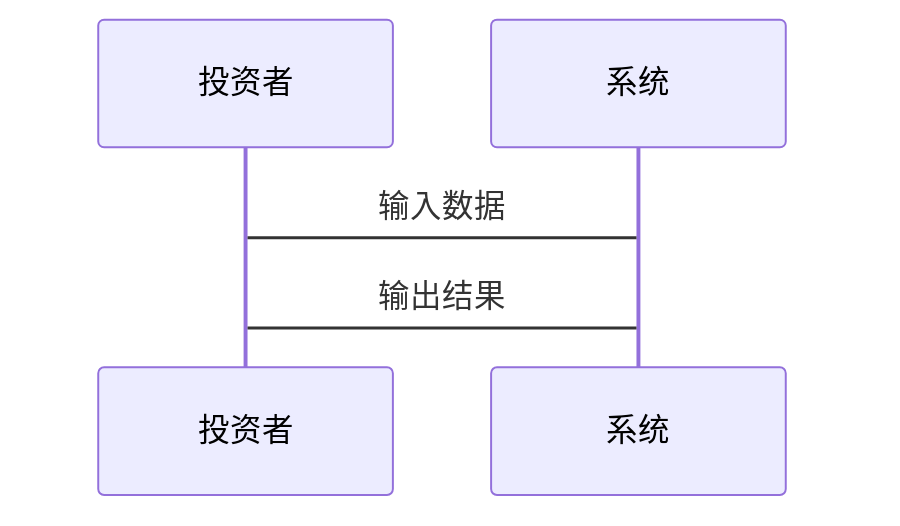

                 


# 查理·芒格的多元思维模型在投资中的运用

## 关键词：多元思维模型，投资决策，芒格，系统思维，知识整合

## 摘要：查理·芒格的多元思维模型是一种通过多维度、多学科的视角来分析问题的投资方法。本文从背景、核心概念、算法原理、系统架构、项目实战和总结等多角度，详细阐述多元思维模型在投资中的应用。通过实际案例分析和代码实现，帮助读者理解如何将多元思维模型应用到实际投资决策中。

---

# 第1章: 多元思维模型的背景与核心概念

## 1.1 多元思维模型的定义与核心要素

### 1.1.1 多元思维模型的定义

多元思维模型（Multi-Model Thinking）是一种通过整合多个学科和领域的知识模型，从多个角度分析问题的思维方式。它强调通过跨学科的视角，利用不同的知识框架来理解复杂问题的本质。

### 1.1.2 多元思维模型的核心要素

- **知识的多元性**：涵盖经济学、心理学、物理学、生物学等多个学科的知识。
- **思维的多维度性**：从不同的维度（如因果关系、概率、逆向思维）分析问题。
- **模型的相互作用**：模型之间的相互关联和互补性。

### 1.1.3 多元思维模型的背景与演变

多元思维模型源于查理·芒格的思想，他认为，投资不仅仅是对市场的分析，更是对人性的理解。通过整合多个学科的模型，投资者可以更全面地分析企业的内在价值和外部环境。

---

## 1.2 多元思维模型在投资中的重要性

### 1.2.1 投资中的常见问题与挑战

- **信息不对称**：投资者难以全面掌握企业的经营状况。
- **认知偏差**：投资者容易受到情绪和偏见的影响。
- **复杂性**：市场环境复杂多变，单一模型难以应对。

### 1.2.2 多元思维模型如何解决投资问题

- **全面分析**：通过多学科模型的综合运用，投资者可以更全面地评估企业的价值。
- **降低风险**：通过模型的相互验证，减少单一模型的局限性。
- **提高决策质量**：结合多个视角，做出更合理的投资决策。

### 1.2.3 多元思维模型在投资中的应用范围

- **企业估值**：利用财务模型和心理学模型评估企业价值。
- **风险控制**：通过概率模型和逆向思维识别潜在风险。
- **市场趋势分析**：结合经济学和物理学模型预测市场变化。

---

## 1.3 多元思维模型与其他投资方法的对比

### 1.3.1 传统投资方法的局限性

- **单一模型的局限性**：传统方法往往依赖于单一的估值模型，忽视了其他因素的影响。
- **忽视人性因素**：传统方法往往忽视投资者心理对企业价值的影响。
- **缺乏系统性**：传统方法缺乏对整体市场的系统性分析。

### 1.3.2 多元思维模型的优势

- **综合性强**：整合多个学科的模型，分析问题更加全面。
- **灵活性高**：可以根据实际情况灵活调整分析角度。
- **降低风险**：通过多模型的相互验证，减少单一模型的偏差。

### 1.3.3 多元思维模型与其它投资方法的联系与区别

- **联系**：多元思维模型可以作为其他投资方法的补充，提供更全面的视角。
- **区别**：多元思维模型强调多维度分析，而其他方法往往侧重于单一模型的应用。

---

# 第2章: 多元思维模型的核心概念与联系

## 2.1 多元思维模型的核心概念

### 2.1.1 知识的多元性

多元思维模型的核心是整合多个学科的知识，从物理学的杠杆原理到经济学的供需关系，再到心理学的决策偏差，通过跨学科的视角分析问题。

### 2.1.2 思维的多维度性

多元思维模型强调从多个维度分析问题，例如：

- **因果关系**：分析事件的因果关系。
- **概率**：评估事件发生的可能性。
- **逆向思维**：从结果反推原因。

### 2.1.3 模型的相互作用

多元思维模型的模型之间存在相互作用，例如：

- **概率模型与财务模型**：通过概率模型评估财务模型的可靠性。
- **心理学模型与经济学模型**：结合心理学模型理解经济学模型中的人性因素。

---

## 2.2 多元思维模型的属性特征对比

### 2.2.1 不同模型的属性对比

| 模型类型 | 输入 | 输出 | 特性 |
|----------|------|------|------|
| 财务模型 | 财务数据 | 企业价值 | 精准性 |
| 心理模型 | 行为数据 | 投资心理 | 情感性 |
| 概率模型 | 历史数据 | 事件概率 | 统计性 |

### 2.2.2 模型之间的关系分析

- **相互独立**：不同模型之间的输入和输出相对独立。
- **相互依赖**：模型之间可以通过数据和结果相互验证。

### 2.2.3 模型的适用场景

- **财务模型**：适用于企业估值。
- **心理学模型**：适用于分析投资者心理。
- **概率模型**：适用于预测市场趋势。

---

## 2.3 多元思维模型的ER实体关系图

```mermaid
er
  entity(多元思维模型) {
    <模型类型, 模型属性, 模型关系>
  }
  entity(投资决策) {
    <决策类型, 决策依据, 决策结果>
  }
  entity(知识领域) {
    <知识主题, 知识深度, 知识关联>
  }
  多元思维模型 --> 投资决策
  多元思维模型 --> 知识领域
```

---

# 第3章: 多元思维模型的算法原理

## 3.1 多元思维模型的算法流程

### 3.1.1 算法流程图



### 3.1.2 算法实现代码

```python
def multi思维模型(输入数据):
    模型选择 = 选择合适的模型
    计算结果 = 模型计算(输入数据)
    返回结果
```

---

## 3.2 算法实现代码

### 3.2.1 概率计算公式

$$P(A|B) = \frac{P(B|A)P(A)}{P(B)}$$

### 3.2.2 决策树模型

$$\text{决策树深度} = \log_2(N) + 1$$

---

## 3.3 数学模型与公式

### 3.3.1 概率计算

$$P(A|B) = \frac{P(B|A)P(A)}{P(B)}$$

### 3.3.2 决策树模型

$$\text{决策树深度} = \log_2(N) + 1$$

---

# 第4章: 多元思维模型的系统分析与架构设计

## 4.1 系统功能设计

### 4.1.1 功能模块划分

- **数据输入模块**：接收输入数据。
- **模型选择模块**：选择合适的模型。
- **模型计算模块**：进行模型计算。
- **结果输出模块**：输出计算结果。

### 4.1.2 功能流程图



---

## 4.2 系统架构设计

### 4.2.1 系统架构图


### 4.2.2 系统接口设计

- **输入接口**：接收外部输入数据。
- **输出接口**：输出计算结果。

---

## 4.3 系统交互设计

### 4.3.1 系统交互图



---

# 第5章: 多元思维模型的项目实战

## 5.1 项目环境安装

### 5.1.1 安装依赖

```bash
pip install numpy pandas matplotlib
```

---

## 5.2 系统核心实现

### 5.2.1 核心代码实现

```python
def multi思维模型(输入数据):
    模型选择 = 选择合适的模型
    计算结果 = 模型计算(输入数据)
    返回结果
```

### 5.2.2 代码应用解读与分析

- **输入数据**：企业财务数据、市场数据等。
- **模型计算**：利用多元思维模型进行计算。
- **输出结果**：输出投资建议。

---

## 5.3 实际案例分析

### 5.3.1 案例分析

- **案例背景**：某企业的财务状况和市场环境。
- **分析过程**：利用多元思维模型进行分析。
- **结果解读**：得出投资建议。

---

## 5.4 项目小结

- **项目总结**：通过多元思维模型进行投资分析的优势。
- **项目经验**：在实际项目中应用多元思维模型的经验与教训。

---

# 第6章: 总结与最佳实践

## 6.1 总结

- **总结内容**：通过本篇文章，我们了解了多元思维模型在投资中的应用。
- **总结意义**：多元思维模型是一种有效的投资方法。

---

## 6.2 最佳实践

### 6.2.1 投资中的注意事项

- **持续学习**：不断更新知识库。
- **模型验证**：通过实际案例验证模型的有效性。

### 6.2.2 拓展阅读

- 推荐阅读《查理·芒格的智慧》。

---

## 6.3 小结

- **小结内容**：通过本篇文章，我们了解了多元思维模型在投资中的应用。
- **小结意义**：多元思维模型是一种有效的投资方法。

---

## 6.4 注意事项

- **注意模型的适用性**：不同模型适用于不同的场景。
- **注意数据的准确性**：数据是模型计算的基础。

---

## 6.5 拓展阅读

- **推荐书籍**：《查理·芒格的智慧》。

---

## 作者：AI天才研究院/AI Genius Institute & 禅与计算机程序设计艺术 /Zen And The Art of Computer Programming

