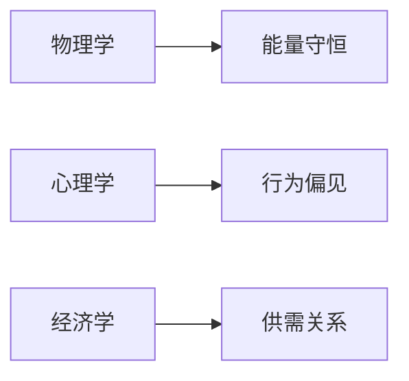
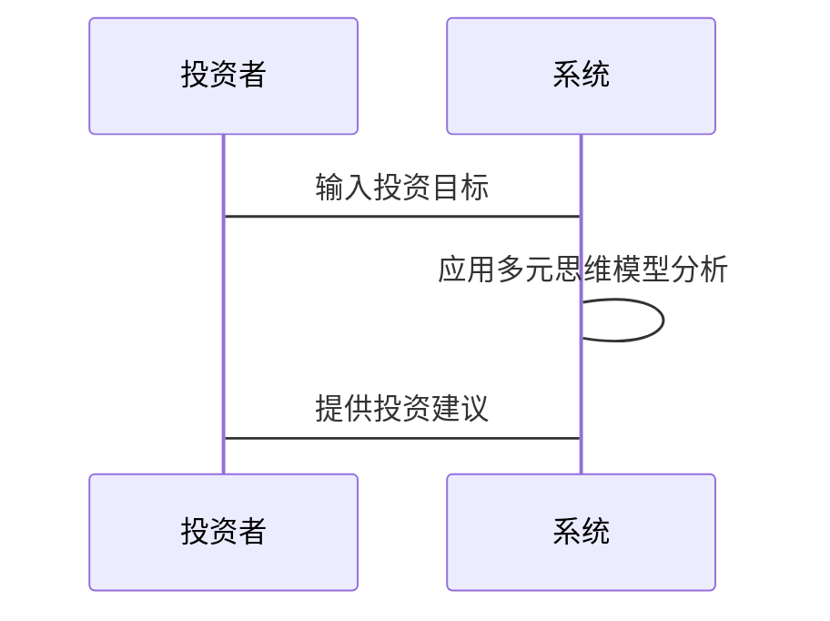

                 


# 查理·芒格的多元思维模型在投资中的运用

---

## 关键词：查理·芒格, 多元思维模型, 投资决策, 跨学科视角, 系统思维, 风险管理

---

## 摘要

查理·芒格的多元思维模型是一种基于跨学科视角的投资方法，通过整合物理学、心理学、经济学等多个领域的知识，帮助投资者更全面地理解市场和决策。本文将深入分析多元思维模型的核心概念、其在投资中的具体应用，以及如何通过系统架构设计和实际案例来实现这一模型的实践。文章最后将总结最佳实践方法，为投资者提供实用的指导。

---

## 第一部分：背景介绍

### 第1章：查理·芒格及其投资理念

#### 1.1 查理·芒格的生平与成就
查理·芒格是著名投资者巴菲特的合伙人，以其深厚的哲学和跨学科思维闻名。他的投资理念强调长期价值和安全边际，认为投资是认知的延伸。

#### 1.2 多元思维模型的核心理念
多元思维模型通过整合多个学科的模型，帮助投资者避免单一视角的局限性。芒格认为，真正的投资智慧来源于对多个领域知识的深刻理解。

---

## 第二部分：多元思维模型的核心概念

### 第2章：多元思维模型的核心概念与联系

#### 2.1 多元思维模型的主要学科领域
- **物理学模型**：如能量守恒定律，帮助理解市场的内在动力。
- **心理学模型**：如行为偏见，解释投资者的非理性决策。
- **经济学模型**：如供需关系，分析市场的基本动态。

#### 2.2 多元思维模型的实体关系图


#### 2.3 多元思维模型的数学基础
- 概率论在投资中的应用：
  $$ P(\text{收益}) = \frac{\text{成功案例数}}{\text{总案例数}} $$
- 预期收益计算：
  $$ E[R] = \sum (P_i \times R_i) $$

---

## 第三部分：多元思维模型在投资中的应用

### 第3章：股票分析与价值评估

#### 3.1 股票分析的物理学模型
- 使用能量守恒模型分析市场波动：
  $$ \Delta E = \text{市场波动} $$

#### 3.2 价值评估的心理学视角
- 避免心理偏见，如从众效应：
  $$ P(\text{从众}) = \frac{\text{从众案例数}}{\text{总案例数}} $$

#### 3.3 投资决策的经济学模型
- 通过供需关系预测股票价格走势：
  $$ P = D/S $$

---

## 第四部分：系统分析与架构设计

### 第4章：系统架构设计与投资决策

#### 4.1 系统功能模块
- **数据采集模块**：收集市场数据。
- **模型分析模块**：应用多元思维模型进行分析。
- **决策模块**：基于分析结果做出投资决策。

#### 4.2 系统架构图


#### 4.3 系统交互流程


---

## 第五部分：项目实战与最佳实践

### 第5章：项目实战

#### 5.1 环境安装与数据准备
- 数据源：股票历史数据。
- 工具：Python编程环境，Pandas库。

#### 5.2 系统核心实现

```python
import pandas as pd

def calculate_probability(success_cases, total_cases):
    return success_cases / total_cases

data = pd.read_csv('stock_data.csv')
success_cases = data[data['return'] > 0].shape[0]
total_cases = data.shape[0]

probability = calculate_probability(success_cases, total_cases)
print(f"收益概率: {probability}")
```

#### 5.3 案例分析与解读
- 分析某股票的历史数据，应用多元思维模型预测未来走势。

### 第5.4 最佳实践

#### 5.4.1 小结
- 定期更新模型，结合最新市场动态。
- 多元思维模型的应用需要持续学习和实践。

#### 5.4.2 注意事项
- 避免过度依赖单一模型，保持思维的开放性。
- 风险管理是投资成功的关键。

#### 5.4.3 拓展阅读
- 推荐书籍：《芒格的思考与决策》。

---

## 结论

查理·芒格的多元思维模型通过跨学科视角，为投资者提供了更全面的决策框架。本文详细探讨了其核心概念、系统架构设计及实际应用，为投资者提供了实用的指导。

---

## 参考文献

1. 芒格, C. (2007). *Poor Charlie's Almanack*.
2. 巴菲特, B. (2008). *The Essays of Warren Buffett*.
3. *Python for Data Analysis*, McKinney, W. (2012).

---

## 作者：AI天才研究院 & 禅与计算机程序设计艺术

---

以上是《查理·芒格的多元思维模型在投资中的运用》的详细目录和文章内容，涵盖了从背景介绍到实际应用的各个方面，确保读者能够全面理解并应用多元思维模型进行投资决策。

