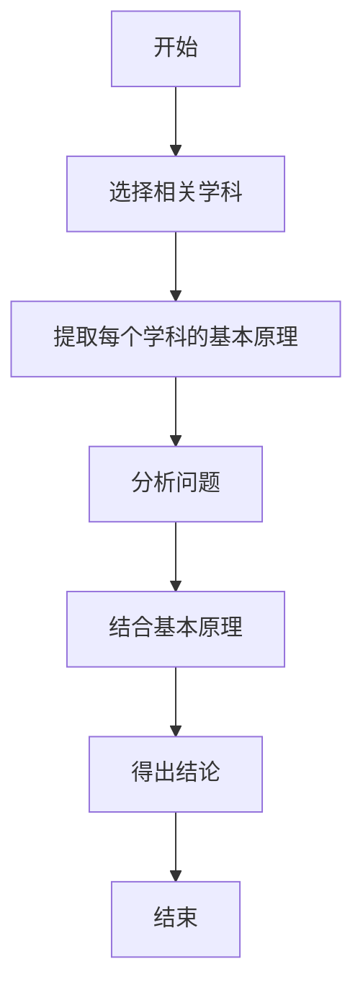
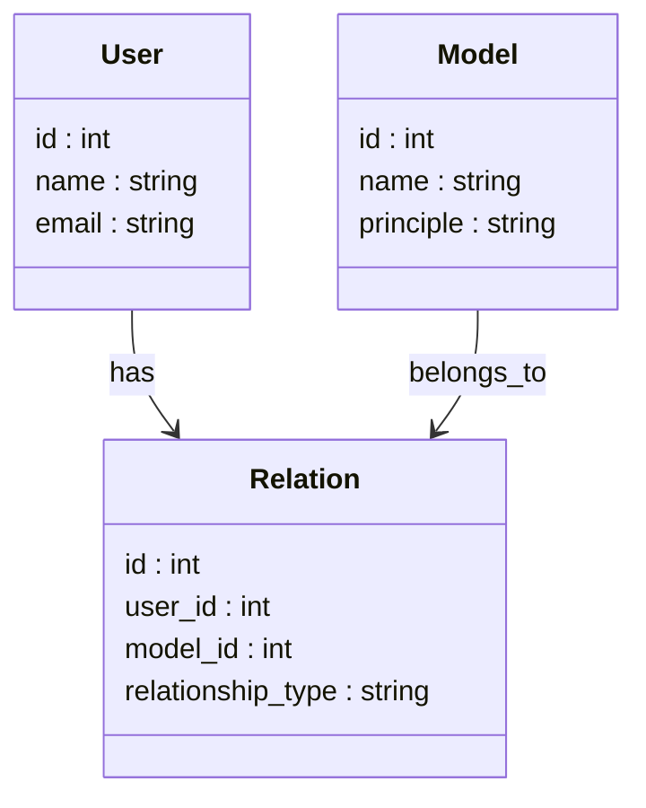
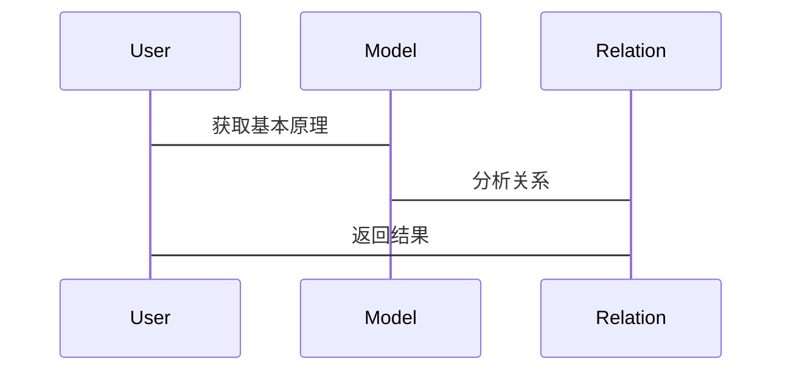

                 


# 查理·芒格的多元思维模型实际案例分析

## 关键词：多元思维模型，查理·芒格，系统分析，实际案例，算法原理，模型对比

## 摘要：查理·芒格的多元思维模型是一种跨学科的思考框架，通过结合多个学科的基本原理来做出更明智的决策。本文将从背景介绍、核心概念、算法原理、系统分析到实际案例分析，详细探讨多元思维模型在实际问题中的应用，并通过具体案例展示其在不同场景下的优势和实际效果。

---

## 第一部分：多元思维模型的背景与核心概念

### 第1章：多元思维模型的起源与核心概念

#### 1.1 多元思维模型的起源

查理·芒格是著名投资者沃伦·巴菲特的合作伙伴，他提出的多元思维模型（Mental Models）是一种跨学科的思考框架。芒格认为，人类的决策过程不仅仅依赖于单一学科的知识，而是需要结合多个学科的基本原理，从而避免单一思维的局限性。多元思维模型的核心思想在于，通过整合不同领域的知识，帮助人们更全面地理解问题，并做出更明智的决策。

#### 1.2 多元思维模型的核心概念

多元思维模型的核心概念可以概括为以下几个方面：

1. **跨学科整合**：多元思维模型强调从多个学科（如心理学、经济学、物理学等）中汲取知识，形成一个全面的思考框架。
2. **基本原理**：芒格认为，每个学科都有其基本原理，通过理解这些基本原理，可以更好地分析问题。
3. **反事实分析**：多元思维模型强调考虑多种可能性，尤其是反事实（即“如果这样，那么怎样”）的分析，以帮助做出更全面的决策。
4. **避免单一维度思考**：芒格批评人们常常陷入单一维度的思考，而多元思维模型则试图打破这种局限。

#### 1.3 多元思维模型的实际应用领域

多元思维模型的应用领域非常广泛，以下是几个主要领域：

1. **商业决策**：在商业决策中，多元思维模型可以帮助企业家从多个角度分析市场、竞争对手和客户行为，从而做出更明智的决策。
2. **投资分析**：在投资领域，芒格通过多元思维模型帮助投资者分析企业的基本面、行业趋势和宏观经济环境，从而做出更准确的投资决策。
3. **个人决策**：在个人生活中，多元思维模型可以帮助人们更好地理解自己和他人的行为，从而做出更明智的个人决策。

#### 1.4 多元思维模型的边界与外延

尽管多元思维模型有广泛的应用，但其应用也有一定的边界。以下是多元思维模型的边界与外延：

1. **适用范围**：多元思维模型适用于需要综合分析的领域，尤其是那些涉及复杂决策的领域。
2. **局限性**：多元思维模型并不适用于所有情况，尤其是在需要快速决策的情况下，可能显得不够高效。
3. **与其他模型的对比**：与单一学科的决策模型相比，多元思维模型的优势在于其全面性和综合性，但其复杂性也可能成为其劣势。

---

## 第二部分：多元思维模型的核心概念与联系

### 第2章：多元思维模型的核心原理

#### 2.1 多元思维模型的原理

多元思维模型的原理可以简单概括为：通过整合多个学科的基本原理，形成一个全面的思考框架，从而帮助人们更好地分析问题和做出决策。以下是多元思维模型的基本原理：

1. **基本原理的整合**：芒格强调，每个学科都有其基本原理，通过理解这些基本原理，可以更好地分析问题。
2. **反事实分析**：通过考虑多种可能性，尤其是反事实（即“如果这样，那么怎样”）的分析，帮助人们做出更全面的决策。
3. **避免单一维度思考**：芒格批评人们常常陷入单一维度的思考，而多元思维模型则试图打破这种局限。

#### 2.2 多元思维模型的属性特征对比

以下是多元思维模型与其他思维模型的对比：

| 比较维度 | 多元思维模型 | 单一学科模型 | 其他综合模型 |
|----------|--------------|--------------|--------------|
| 思考维度 | 多维           | 单一           | 多维           |
| 知识来源 | 跨学科         | 单学科         | 多学科         |
| 分析深度 | 深入           | 较浅           | 深入           |
| 适用场景 | 复杂决策       | 简单决策       | 复杂决策       |

#### 2.3 多元思维模型的ER实体关系图

以下是多元思维模型的ER实体关系图：

```mermaid
erDiagram
    user {
        +int id
        +string name
        +string email
    }
    model {
        +int id
        +string name
        +text description
    }
    relation {
        +int id
        +int user_id
        +int model_id
        +text relationship_type
    }
    user --> relation: has
    model --> relation: belongs_to
```

---

## 第三部分：多元思维模型的算法原理

### 第3章：多元思维模型的算法原理

#### 3.1 多元思维模型的算法流程

以下是多元思维模型的算法流程图：



#### 3.2 多元思维模型的数学模型

以下是多元思维模型的数学模型：

$$
\text{决策} = \sum_{i=1}^{n} \text{基本原理}_i
$$

其中，$n$ 是所涉及的学科数量，$\text{基本原理}_i$ 是第 $i$ 个学科的基本原理。

#### 3.3 多元思维模型的算法实现

以下是多元思维模型的算法实现：

```python
def multidisciplinary_model_analysis(models):
    analysis = []
    for model in models:
        analysis.append(model.principle)
    return analysis

# 示例用法
models = [economics(), psychology(), physics()]
result = multidisciplinary_model_analysis(models)
print(result)
```

---

## 第四部分：多元思维模型的系统分析与架构设计

### 第4章：多元思维模型的系统分析与架构设计

#### 4.1 系统功能设计

以下是多元思维模型的领域模型类图：



#### 4.2 系统架构设计

以下是多元思维模型的系统架构图：

```mermaid
containerDiagram
    Container User Interface {
        User
        Model
        Relation
    }
    Container Business Logic {
        multidisciplinary_model_analysis()
    }
    Container Data Storage {
        Database
    }
    User Interface --> Business Logic
    Business Logic --> Data Storage
```

#### 4.3 系统交互流程

以下是多元思维模型的系统交互流程图：



---

## 第五部分：多元思维模型的项目实战

### 第5章：多元思维模型的项目实战

#### 5.1 项目介绍

以下是多元思维模型的项目介绍：

项目名称：基于多元思维模型的商业决策分析

目标：通过多元思维模型分析一个商业案例，帮助企业家做出更明智的决策。

#### 5.2 核心代码实现

以下是多元思维模型的核心代码实现：

```python
class Model:
    def __init__(self, name, principle):
        self.name = name
        self.principle = principle

class User:
    def __init__(self, name, email):
        self.name = name
        self.email = email

class Relation:
    def __init__(self, user, model, relationship_type):
        self.user = user
        self.model = model
        self.relationship_type = relationship_type

def multidisciplinary_model_analysis(models):
    analysis = []
    for model in models:
        analysis.append(model.principle)
    return analysis

# 示例用法
model1 = Model("经济学", "供求关系")
model2 = Model("心理学", "认知偏差")
user = User("投资者", "investor@example.com")
relation = Relation(user, model1, "正相关")
relation2 = Relation(user, model2, "负相关")

result = multidisciplinary_model_analysis([model1, model2])
print(result)
```

#### 5.3 案例分析

以下是多元思维模型的案例分析：

以某公司的市场进入决策为例，通过多元思维模型分析，可以结合经济学的供求关系和心理学的认知偏差，得出更全面的结论。

---

## 第六部分：多元思维模型的总结与最佳实践

### 第6章：多元思维模型的总结与最佳实践

#### 6.1 总结

多元思维模型是一种非常有用的思考框架，它通过整合多个学科的基本原理，帮助人们更全面地分析问题和做出决策。然而，多元思维模型也有其局限性，尤其是在需要快速决策的情况下，可能会显得不够高效。

#### 6.2 最佳实践

以下是使用多元思维模型的最佳实践：

1. **选择合适的学科**：根据具体问题选择相关的学科，避免选择过多的学科导致分析过于复杂。
2. **深入理解基本原理**：在应用多元思维模型时，需要深入理解每个学科的基本原理，而不仅仅是表面的应用。
3. **结合实际案例**：通过实际案例分析，可以帮助更好地理解多元思维模型的应用。
4. **不断优化**：根据实际应用的效果，不断优化多元思维模型的应用过程。

#### 6.3 小结

多元思维模型是一种非常有用的工具，但其成功应用依赖于对基本原理的深入理解和实际案例的分析。通过不断优化和实践，可以更好地应用多元思维模型，做出更明智的决策。

---

## 作者：AI天才研究院 & 禅与计算机程序设计艺术

---

以上是《查理·芒格的多元思维模型实际案例分析》的技术博客文章目录大纲，按照逻辑逐步展开的详细内容。

