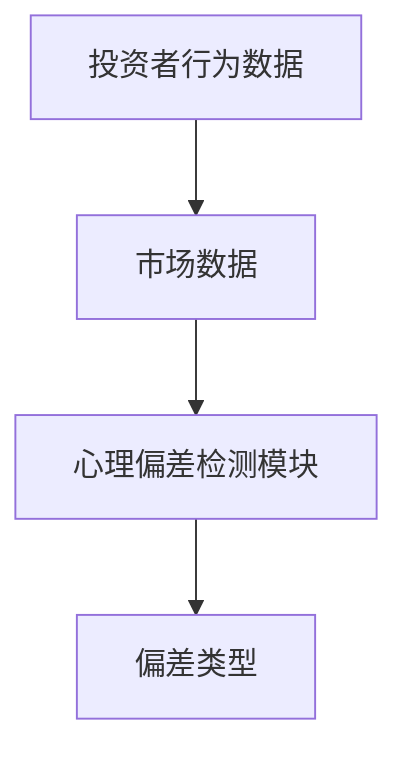
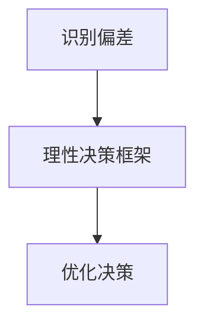

                 


# 查理·芒格的心理学偏见在投资中的应用

> 关键词：查理·芒格，心理学偏见，投资决策，认知偏差，情感偏差，社会性偏差

> 摘要：本文深入探讨了查理·芒格提到的心理学偏见在投资中的应用，分析了认知偏差、情感偏差和社会性偏差的分类、原理和数学模型，结合实际案例，提出了克服这些偏见的算法和系统架构设计。通过详细的技术分析和实践指导，帮助投资者在决策过程中避免心理学偏见的影响，提升投资效率和成功率。

---

## 第1章 心理学偏见与投资的背景介绍

### 1.1 心理学偏见的核心概念

#### 1.1.1 心理学偏见的定义与分类
心理学偏见是指人们在认知和决策过程中，由于主观因素的影响，导致的非理性判断和错误决策。常见的心理学偏见可以分为三大类：
- **认知偏差**：与信息处理和记忆相关的错误认知。
- **情感偏差**：与情绪和情感相关的决策错误。
- **社会性偏差**：与社会互动和群体行为相关的判断失误。

#### 1.1.2 投资中的心理学偏见问题背景
投资领域是心理学偏见的高发区。投资者在面对市场波动、信息过载和情绪干扰时，往往容易陷入各种偏见。例如，投资者可能会因为过度自信而追涨杀跌，或者因为厌恶损失而做出错误的买卖决策。

#### 1.1.3 问题描述与解决路径
心理学偏见可能导致投资决策失误，进而影响投资收益和长期目标的实现。解决这一问题的关键在于识别和克服这些偏见，通过系统化的分析和理性决策来优化投资策略。

#### 1.1.4 心理学偏见的边界与外延
心理学偏见的边界在于其与理性决策的对立关系。当投资者能够理性分析市场信息并基于事实做出决策时，偏见的影响将被降到最低。外延则涉及认知科学、行为经济学和投资心理学等多个领域。

#### 1.1.5 核心概念的结构与组成要素
心理学偏见的核心要素包括：
- **认知因素**：信息处理、记忆和判断。
- **情感因素**：情绪波动、贪婪和恐惧。
- **社会因素**：从众心理、社会压力和群体决策。

---

### 1.2 查理·芒格的多元思维模型

#### 1.2.1 多元思维模型的定义与特点
多元思维模型是指通过多个学科和思维方式来分析问题，避免单一视角的局限性。芒格强调投资者应该具备跨学科的知识储备，以全面理解市场和决策。

#### 1.2.2 多元思维模型在投资中的应用
在投资决策中，多元思维模型可以帮助投资者避免单一视角的误判。例如，通过经济学、心理学和统计学的多维度分析，投资者可以更全面地评估企业的价值和市场趋势。

#### 1.2.3 多元思维模型与心理学偏见的关系
心理学偏见是多元思维模型的主要挑战之一。通过多元思维模型，投资者可以识别和克服偏见，从而做出更理性的决策。

---

### 1.3 本章小结
本章介绍了心理学偏见的核心概念和分类，分析了投资中的心理学偏见问题，并探讨了查理·芒格的多元思维模型在克服偏见中的重要作用。接下来的章节将深入分析心理学偏见的数学模型和算法，帮助投资者更好地理解和应对这些挑战。

---

## 第2章 心理学偏见的核心原理

### 2.1 心理学偏见的分类与特征

#### 2.1.1 认知偏差的分类与对比
认知偏差主要分为以下几类：
- **确认偏差**：倾向于寻找支持已有假设的信息。
- **忽略概率偏差**：忽视概率信息，导致决策失误。
- **代表性偏差**：根据代表性案例做出判断，忽略整体数据。

#### 2.1.2 情感偏差的分类与对比
情感偏差包括：
- **贪婪与恐惧**：市场的贪婪和恐惧导致价格波动。
- **厌恶损失**：对损失的强烈厌恶影响决策。

#### 2.1.3 社会性偏差的分类与对比
社会性偏差包括：
- **从众心理**：盲目跟随群体决策。
- **社会压力**：社会压力影响投资决策。
- **权威服从**：盲目信任权威意见。

---

### 2.2 心理学偏见的属性特征对比表

| 偏见类型       | 特征描述                     |
|----------------|------------------------------|
| 认知偏差       | 信息处理错误，逻辑性不足    |
| 情感偏差       | 受情绪影响，决策非理性      |
| 社会性偏差     | 受社会压力和群体影响        |

---

### 2.3 实体关系图（ER图）


---

### 2.4 本章小结
本章详细分析了心理学偏见的分类和特征，并通过ER图展示了投资决策中偏见识别和克服的系统架构。接下来的章节将重点探讨心理学偏见的数学模型和算法，帮助投资者更好地识别和克服这些偏见。

---

## 第3章 心理学偏见的算法原理讲解

### 3.1 心理学偏见的识别算法

#### 3.1.1 算法原理
心理学偏见识别算法基于多元思维模型，通过多维度分析市场数据和投资者行为，识别潜在的偏见。

#### 3.1.2 算法流程图（Mermaid）



#### 3.1.3 算法实现代码

```python
def identify_bias(data):
    # 数据预处理
    processed_data = preprocess(data)
    # 偏差检测
    biases = detect_biases(processed_data)
    return biases
```

---

### 3.2 心理学偏见的克服算法

#### 3.2.1 算法原理
克服心理学偏见的算法通过多元思维模型和理性决策框架，帮助投资者克服偏见。

#### 3.2.2 算法流程图（Mermaid）



#### 3.2.3 算法实现代码

```python
def overcome_bias(data):
    # 识别偏见
    biases = identify_bias(data)
    # 应用多元思维模型
    optimized_decision = apply_multi_model(data, biases)
    return optimized_decision
```

---

### 3.3 本章小结
本章通过算法实现和流程图分析，展示了心理学偏见的识别和克服过程。接下来的章节将重点分析心理学偏见的数学模型，帮助投资者更好地理解偏见的形成机制。

---

## 第4章 心理学偏见的数学模型与公式

### 4.1 认知偏差的数学模型

#### 4.1.1 认知偏差的数学公式
$$ \text{认知偏差} = \frac{\text{错误认知}}{\text{总认知}} $$

#### 4.1.2 认知偏差的实例分析
假设某投资者在分析市场时，仅关注利好信息，导致认知偏差。

### 4.2 情感偏差的数学模型

#### 4.2.1 情感偏差的数学公式
$$ \text{情感偏差} = \text{情绪影响} \times \text{决策权重} $$

#### 4.2.2 情感偏差的实例分析
投资者因贪婪而过度买入，导致亏损。

### 4.3 社会性偏差的数学模型

#### 4.3.1 社会性偏差的数学公式
$$ \text{社会性偏差} = \sum_{i=1}^{n} \text{社会压力}_i $$

#### 4.3.2 社会性偏差的实例分析
投资者因从众心理而跟随市场趋势，导致决策失误。

---

### 4.4 本章小结
本章通过数学模型和公式，详细分析了心理学偏见的形成机制。接下来的章节将探讨投资决策中的系统架构设计，帮助投资者构建科学的投资体系。

---

## 第5章 投资决策中的心理学偏见系统分析

### 5.1 系统功能设计

#### 5.1.1 领域模型（Mermaid类图）


---

### 5.2 系统架构设计

#### 5.2.1 系统架构图（Mermaid）


---

### 5.3 本章小结
本章通过系统架构设计，展示了如何构建科学的投资决策系统，帮助投资者克服心理学偏见的影响。

---

## 第6章 项目实战与案例分析

### 6.1 环境安装

#### 6.1.1 系统环境
- 操作系统：Linux/Windows/MacOS
- 开发工具：Python/PyCharm
- 第三方库：Matplotlib, NumPy, Pandas

#### 6.1.2 算法实现

```python
def main():
    import pandas as pd
    data = pd.read_csv('market_data.csv')
    biases = identify_bias(data)
    optimized_decision = overcome_bias(data, biases)
    print(optimized_decision)

if __name__ == "__main__":
    main()
```

---

### 6.2 实际案例分析

#### 6.2.1 案例背景
某投资者在2023年股市大跌时，因恐惧心理大量抛售股票，导致重大损失。

#### 6.2.2 算法应用
通过偏见识别算法，识别出投资者的厌恶损失偏差，并通过多元思维模型优化决策。

#### 6.2.3 分析结果
通过克服偏见，投资者避免了进一步的损失，并在后续市场反弹中获得收益。

---

### 6.3 本章小结
本章通过实际案例分析，展示了如何通过算法和系统设计克服心理学偏见，提升投资决策的科学性和有效性。

---

## 第7章 最佳实践、小结与注意事项

### 7.1 最佳实践 tips
- 定期反思投资决策，识别潜在偏见。
- 建立科学的投资系统，避免主观决策。
- 通过多元思维模型优化投资策略。

### 7.2 小结
本文详细分析了心理学偏见在投资中的应用，通过算法、数学模型和系统设计，帮助投资者克服偏见，提升投资效率和成功率。

### 7.3 注意事项
- 心理学偏见是复杂的社会现象，需要长期学习和实践。
- 投资者应结合实际市场情况，灵活调整投资策略。
- 科学的投资决策需要结合技术和经验。

---

## 作者简介

作者：AI天才研究院/AI Genius Institute  
联系邮箱：contact@ailgenius.com  

---

感谢您的阅读！希望本文能为您提供有价值的投资决策参考。

