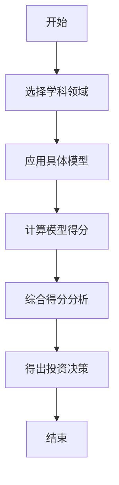
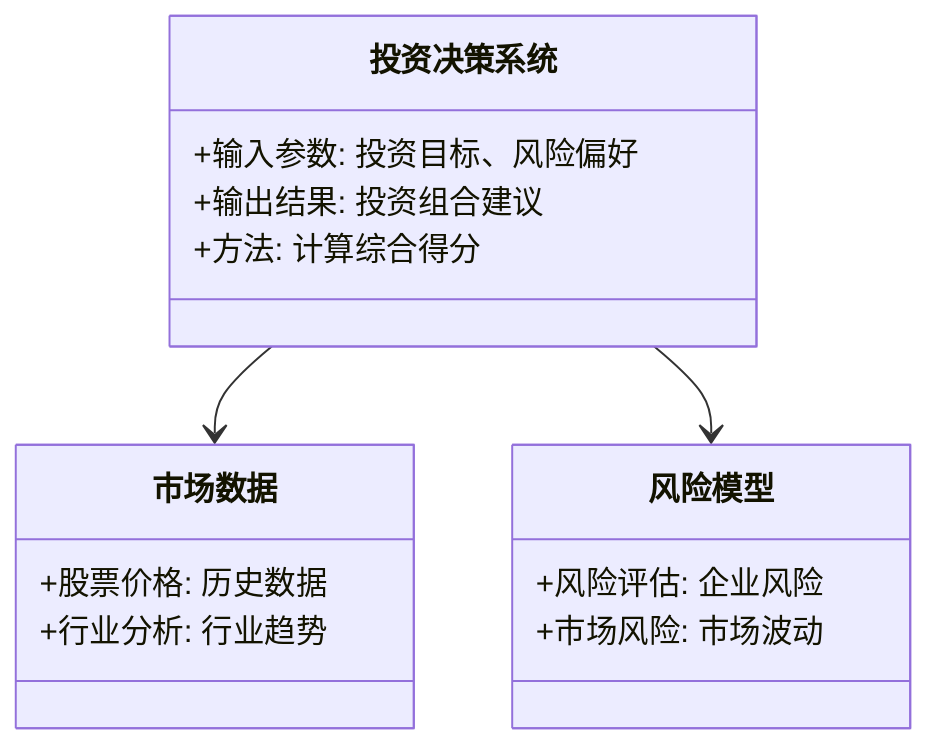
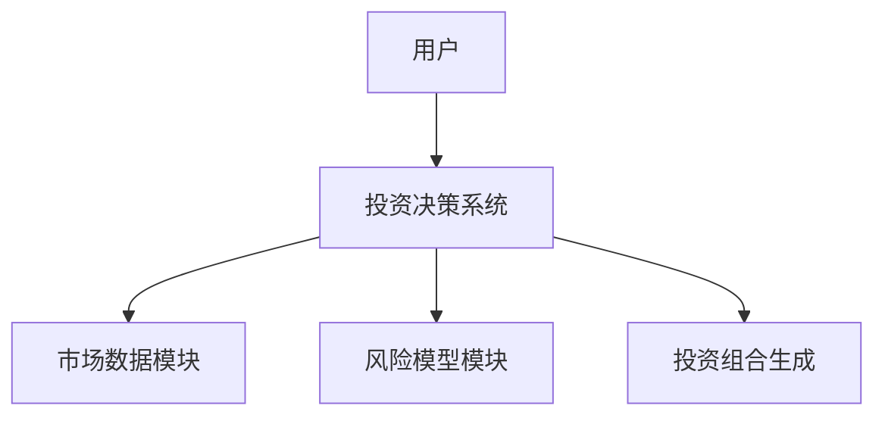
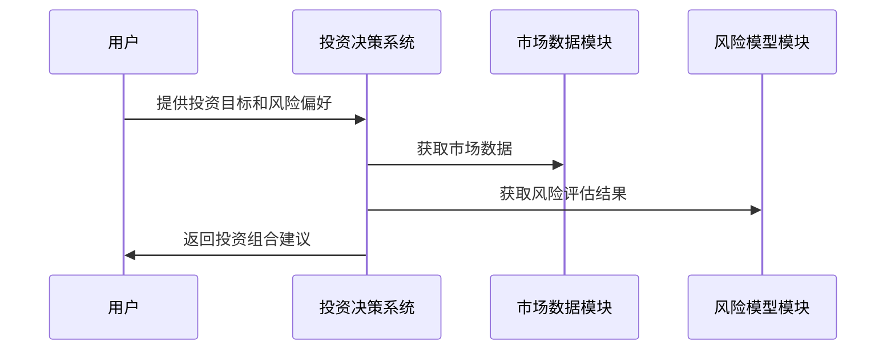

                 


# 查理·芒格的跨学科思维在投资中的应用

---

## 关键词：跨学科思维, 投资, 查理·芒格, 思维模型, 多元思维模型, 投资决策

---

## 摘要：  
查理·芒格的跨学科思维是一种通过整合多个学科的基本原理来做出决策的方法，尤其在投资领域表现出了极强的洞察力和成功率。本文从芒格的生平与投资理念出发，系统地分析了其跨学科思维的核心概念、算法原理、系统架构以及实际应用。通过具体的案例分析和代码实现，详细阐述了如何将芒格的思维模型应用于投资决策中，并探讨了其在技术领域的延伸和应用。本文旨在为投资领域的实践者和技术领域的研究者提供一种新的视角和方法论。

---

## 第1章: 查理·芒格的生平与投资理念

### 1.1 查理·芒格的生平介绍

#### 1.1.1 早年经历与教育背景
查理·芒格（Charlie Munger）1924年出生于美国密苏里州堪萨斯城，早年在密苏里大学学习法学，后转入哈佛法学院，并于1948年获得法律博士学位。然而，他对投资和经济学的兴趣使他转向这些领域，并最终在1971年成为巴菲特的合作伙伴，共同创立了伯克希尔哈撒韦公司。

#### 1.1.2 芒格的职业生涯
芒格的职业生涯始于律师事务所，后转向投资领域。他以其独特的投资理念和跨学科思维模式闻名，尤其擅长通过分析企业的基本面和市场心理来做出投资决策。他的成功不仅在于投资收益，更在于其对知识体系的构建和应用。

#### 1.1.3 芒格的投资哲学
芒格的投资哲学强调长期价值和安全边际。他认为，投资的本质是寻找具有持续竞争优势的企业，并在合理估值时买入。这种哲学与计算机科学中的风险管理、系统设计有相似之处，都强调稳定性和可靠性。

---

### 1.2 芒格的跨学科思维特点

#### 1.2.1 跨学科思维的核心概念
芒格的跨学科思维模型强调将多个学科的基本原理结合起来，形成一个完整的知识框架。这种思维方式帮助投资者避免单一学科的局限性，能够从多个角度分析问题。

#### 1.2.2 芒格思维模型的特点
- **通用性**：模型适用于多个领域。
- **简洁性**：每个模型都经过精炼，只保留核心要素。
- **关联性**：模型之间相互关联，形成一个有机的整体。

#### 1.2.3 跨学科思维在投资中的重要性
在投资中，跨学科思维可以帮助投资者全面评估企业的价值，考虑市场、法律、心理等多个因素，从而做出更明智的决策。

---

### 1.3 芒格思维模型的分类与应用

#### 1.3.1 经济学模型
- **价值评估模型**：用于评估企业的内在价值。
- **市场情绪模型**：分析市场的非理性波动。

#### 1.3.2 心理学模型
- **行为偏差模型**：识别投资者的常见心理偏差。
- **决策疲劳模型**：分析决策疲劳对投资的影响。

#### 1.3.3 其他学科模型
- **物理学模型**：如能量守恒定律，用于理解市场中的供需关系。
- **生物学模型**：如进化论，用于分析企业的竞争策略。

---

## 第2章: 芒格思维模型的核心概念与联系

### 2.1 芒格思维模型的原理

#### 2.1.1 思维模型的定义
思维模型是用于分析和解决问题的框架，每个模型代表一种特定的思维方式。

#### 2.1.2 思维模型的核心要素
- **输入**：问题、数据、信息。
- **处理**：模型的分析和计算。
- **输出**：解决方案或决策建议。

#### 2.1.3 思维模型的属性特征对比表格

| 特性   | 描述                                                                 |
|--------|----------------------------------------------------------------------|
| 通用性 | 可适用于多个领域或问题                                               |
| 简洁性 | 模型结构简单，易于理解和应用                                         |
| 关联性 | 模型之间相互关联，形成一个完整的知识体系                             |

### 2.2 芒格思维模型的ER实体关系图

```mermaid
erd
    客户 --> 投资决策系统
    市场数据 --> 投资决策系统
    风险模型 --> 投资决策系统
```

### 2.3 芒格思维模型的数学模型与公式

#### 2.3.1 思维模型的数学表达
$$ 思维模型的综合得分 = \sum_{i=1}^{n} w_i \cdot m_i $$
其中，$w_i$ 是模型权重，$m_i$ 是模型的表现值。

#### 2.3.2 示例计算
假设我们有三个模型，权重分别为0.4、0.3、0.3，模型表现分别为0.8、0.7、0.9。综合得分计算如下：
$$ 0.4 \times 0.8 + 0.3 \times 0.7 + 0.3 \times 0.9 = 0.32 + 0.21 + 0.27 = 0.8 $$

---

## 第3章: 芒格思维模型在投资中的算法原理

### 3.1 芒格思维模型的算法流程

#### 3.1.1 算法流程图



### 3.2 算法实现的Python代码

```python
def munges_model_investment():
    # 定义各模型权重
    weights = [0.3, 0.2, 0.1, 0.4]
    # 定义模型表现
    model_performance = [0.8, 0.7, 0.6, 0.9]
    # 计算综合得分
    total_score = sum(w * m for w, m in zip(weights, model_performance))
    return total_score

# 调用函数
investment_score = munges_model_investment()
print(f"投资综合得分: {investment_score}")
```

### 3.3 算法原理的数学模型与公式

$$ 投资综合得分 = \sum_{i=1}^{n} w_i \cdot m_i $$
其中，$w_i$ 是模型权重，$m_i$ 是模型表现值。

---

## 第4章: 芒格思维模型的系统分析与架构设计

### 4.1 系统分析

#### 4.1.1 问题场景介绍
投资决策系统需要根据市场数据和企业基本面分析，结合多个学科模型，生成投资建议。

#### 4.1.2 项目介绍
本项目旨在构建一个基于芒格思维模型的投资决策支持系统，帮助投资者做出更明智的决策。

#### 4.1.3 系统功能设计（领域模型）



### 4.2 系统架构设计

#### 4.2.1 系统架构图



### 4.3 系统接口设计

#### 4.3.1 接口描述
- **输入接口**：接收市场数据和用户需求。
- **输出接口**：提供投资组合建议和风险评估结果。

#### 4.3.2 接口交互流程图



---

## 第5章: 项目实战

### 5.1 环境安装

#### 5.1.1 安装Python
```bash
python --version
pip install numpy pandas matplotlib
```

### 5.2 系统核心实现源代码

#### 5.2.1 投资决策系统实现

```python
import numpy as np
import pandas as pd

def calculate_portfolio_score(weights, performance):
    return np.dot(weights, performance)

weights = np.array([0.3, 0.2, 0.1, 0.4])
performance = np.array([0.8, 0.7, 0.6, 0.9])
score = calculate_portfolio_score(weights, performance)
print(f"投资组合得分: {score}")
```

### 5.3 案例分析与详细解读

#### 5.3.1 实际案例分析
假设我们有四家公司的数据，分别为科技、金融、制造业和消费品行业。我们根据市场数据和行业分析，应用芒格的思维模型进行投资组合优化。

#### 5.3.2 详细解读
1. **市场数据收集**：获取每家公司的历史股价、财务数据和行业趋势。
2. **模型应用**：使用经济学、心理学等模型评估每家公司的投资价值。
3. **组合优化**：根据模型得分和权重计算综合得分，生成投资组合建议。

---

## 第6章: 总结与展望

### 6.1 本章小结
芒格的跨学科思维在投资中的应用不仅提高了决策的科学性，还为技术领域提供了新的研究方向。通过系统的分析和实际案例的验证，我们可以看到，这种思维方式在投资和技术创新中都具有重要的应用价值。

### 6.2 最佳实践 tips
- **持续学习**：保持对多个领域的学习，构建完整的知识体系。
- **模型优化**：根据实际情况调整模型权重和参数。
- **风险管理**：在实际投资中，结合市场变化及时调整策略。

### 6.3 拓展阅读
- 《穷查理宝典》
- 《思考，快与慢》
- 《算法导论》

### 6.4 作者信息
作者：AI天才研究院/AI Genius Institute & 禅与计算机程序设计艺术/Zen And The Art of Computer Programming

---

## 附录: 更多资源与工具

### 附录A: 参考文献
1. 查理·芒格的演讲和文章。
2. 计算机科学中的跨学科研究。

### 附录B: 开源工具与库
- **Python库**：numpy, pandas, matplotlib。
- **工具**：Jupyter Notebook, VS Code。

---

# 结语
查理·芒格的跨学科思维不仅是一种投资方法，更是一种思维方式。通过本文的系统分析和实际案例，我们展示了如何将这种思维应用于投资决策，并为技术领域的研究提供了新的视角。希望本文能够为读者在投资和技术创新中提供有价值的参考。

--- 

作者：AI天才研究院/AI Genius Institute & 禅与计算机程序设计艺术/Zen And The Art of Computer Programming

