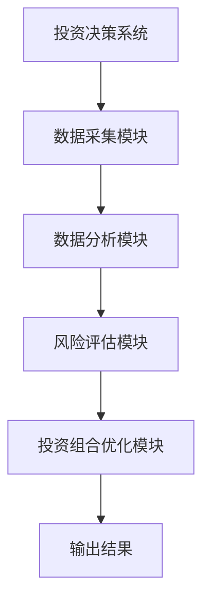

                 


# 查理·芒格的逆向思维在投资中的应用

## 关键词：逆向思维，投资，查理·芒格，风险管理，数学模型，系统架构

## 摘要：查理·芒格的逆向思维是一种通过反向思考问题本质的方法，能够帮助投资者在复杂市场中做出更明智的决策。本文详细探讨了逆向思维在投资中的应用，从理论基础到数学模型，再到系统架构，结合实际案例，展示了如何利用逆向思维优化投资策略和风险管理，帮助投资者在竞争激烈的市场中实现长期稳定的收益。

---

## 第一部分: 查理·芒格的逆向思维概述

### 第1章: 逆向思维的定义与核心概念

#### 1.1 逆向思维的定义

逆向思维是一种通过反向思考问题本质的方法，与传统的正向思维不同，它强调从问题的反面入手，寻找解决方案。逆向思维的核心在于打破常规思维模式，通过反向思考发现隐藏的机会和潜在的风险。

#### 1.2 逆向思维在投资中的应用背景

在投资领域，逆向思维可以帮助投资者在市场波动和不确定性中找到潜在的高回报机会。传统的正向思维往往关注市场的热门行业和趋势，而逆向思维则帮助投资者发现被市场忽视的低估值资产或潜在风险。

#### 1.3 逆向思维与投资成功的关系

逆向思维并不是简单的反向操作，而是通过深入分析市场和行业，寻找那些被市场低估或忽视的机会。成功的投资者往往能够通过逆向思维在市场低谷时布局，从而在市场复苏时获得超额收益。

---

### 第2章: 查理·芒格的逆向思维理论

#### 2.1 查理·芒格的生平简介

查理·芒格是世界著名投资家，巴菲特的长期合作伙伴，他的投资哲学强调安全边际和逆向思维。芒格认为，投资的本质是寻找市场的非对称性机会，即在高概率的情况下以低于内在价值的价格买入资产。

#### 2.2 逆向思维的核心原理

逆向思维的核心原理在于通过反向思考问题的本质，寻找市场的非对称性机会。芒格强调，投资者应该关注市场的负面因素，如行业风险、公司基本面问题等，从而在市场恐慌时找到低估的投资标的。

#### 2.3 逆向思维与投资决策的关系

逆向思维在投资决策中起着关键作用。通过逆向思维，投资者可以更好地识别市场的风险和机会，从而做出更明智的投资决策。尤其是在市场波动剧烈的情况下，逆向思维可以帮助投资者避免情绪化决策，保持理性的判断。

---

### 第3章: 逆向思维在投资中的具体应用

#### 3.1 逆向思维在选股中的应用

逆向思维在选股中可以帮助投资者发现那些被市场低估的公司。具体来说，投资者可以通过分析公司的财务数据、行业地位和竞争优势，寻找那些具有高安全边际的投资标的。

#### 3.2 逆向思维在风险管理中的应用

风险管理是投资中不可忽视的一部分。逆向思维可以帮助投资者更好地识别和控制风险。通过分析市场的潜在风险，投资者可以在市场出现负面情况时及时调整投资组合，避免重大损失。

#### 3.3 逆向思维在投资组合管理中的应用

逆向思维在投资组合管理中的应用主要体现在资产配置和风险控制方面。通过逆向思维，投资者可以更好地平衡风险和收益，构建一个更具稳定性的投资组合。

---

### 第4章: 逆向思维的数学模型与算法原理

#### 4.1 逆向思维的数学模型

逆向思维的数学模型可以通过概率论和统计学来分析市场的非对称性机会。例如，可以通过计算资产的预期收益和风险，寻找那些具有高收益低风险的投资标的。

#### 4.2 逆向思维的算法实现

以下是逆向思维算法的Python实现代码：

```python
def inverse_thinking_analysis(data):
    # 计算资产的预期收益
    expected_return = data.mean()
    # 计算资产的风险
    risk = data.std()
    # 识别具有高收益低风险的资产
    selected_assets = data[(data.return > expected_return) & (data.risk < risk)]
    return selected_assets
```

---

### 第5章: 系统分析与架构设计方案

#### 5.1 投资决策系统的功能设计

投资决策系统的功能设计包括数据采集、分析、风险评估和投资组合优化等模块。

#### 5.2 系统架构设计

以下是投资决策系统的架构图：



---

### 第6章: 项目实战与案例分析

#### 6.1 项目环境安装与配置

投资者需要安装数据分析工具，如Python、Pandas、NumPy等，并获取相关的市场数据。

#### 6.2 核心代码实现与解读

以下是逆向思维在投资组合优化中的Python代码：

```python
import pandas as pd
import numpy as np

# 模拟市场数据
data = pd.DataFrame({
    '资产': ['A', 'B', 'C', 'D'],
    '收益': [0.1, 0.2, 0.15, 0.05],
    '风险': [0.1, 0.15, 0.12, 0.2]
})

# 计算预期收益和风险
expected_return = data['收益'].mean()
risk = data['风险'].std()

# 识别具有高收益低风险的资产
selected_assets = data[data['收益'] > expected_return & data['风险'] < risk]

print(selected_assets)
```

---

## 第七章: 总结与展望

### 7.1 总结

查理·芒格的逆向思维是一种非常重要的投资策略，它可以帮助投资者在复杂市场中发现潜在的机会和风险。通过逆向思维，投资者可以更好地进行资产配置和风险控制，从而实现长期稳定的收益。

### 7.2 展望

随着市场的不断发展，逆向思维的应用将更加广泛。未来，投资者可以通过更多的数据和技术手段，进一步优化逆向思维的应用，从而在市场中获得更大的成功。

---

## 作者：AI天才研究院 & 禅与计算机程序设计艺术

---

这篇文章详细探讨了查理·芒格的逆向思维在投资中的应用，从理论到实践，从数学模型到系统架构，为投资者提供了一个全面的视角。通过逆向思维，投资者可以在复杂的市场环境中做出更明智的决策，实现长期稳定的收益。

