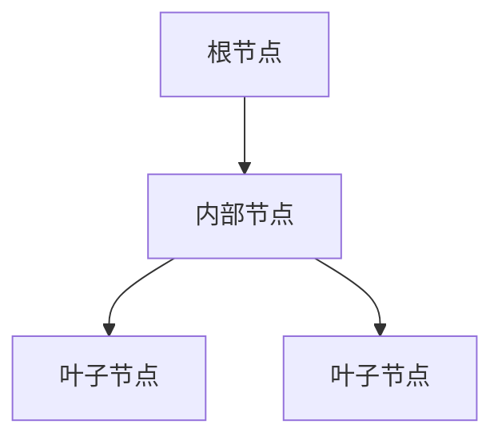
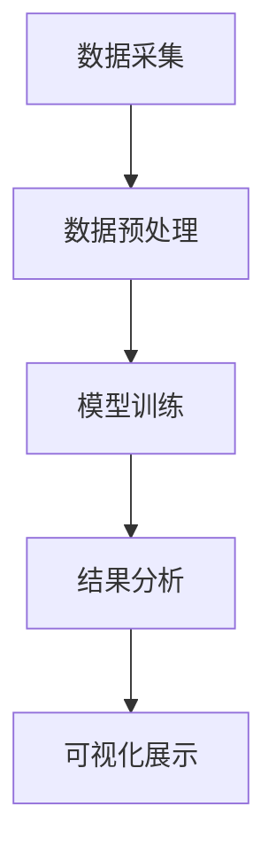

                 


# 查理芒格的商业模式分析

> 关键词：查理芒格，商业模式分析，决策树模型，多元思维模型，系统架构设计，Python实现

> 摘要：本文系统地分析了查理芒格的商业模式分析方法，结合决策树模型和多元思维模型，通过实际案例和系统架构设计，详细阐述了如何应用这些模型进行商业模式分析，最后给出了最佳实践和项目总结。

---

# 第一部分: 查理·芒格的商业模式分析背景介绍

## 第1章: 查理·芒格与商业模式分析概述

### 1.1 查理·芒格的生平与投资理念

查理·芒格（Charlie Munger）是美国著名投资者、巴菲特的长期合作伙伴，同时也是芒格家族公司的董事长。他以独特的投资哲学和决策思维闻名，强调多元思维模型（mental models）在决策中的应用。芒格的商业模式分析方法不仅适用于投资领域，也适用于企业战略规划和商业分析。

#### 1.1.1 查理·芒格的生平简介

查理·芒格于1924年1月17日出生于美国密苏里州堪萨斯城。他毕业于密苏里大学和哈佛法学院，后在伯克希尔哈撒韦公司担任副总裁，与巴菲特共同创立了芒格家族公司。芒格以其深刻的投资哲学和多元思维模型闻名。

#### 1.1.2 芒格的投资哲学与决策思维

芒格的投资哲学强调安全边际和长期价值。他认为，投资者应该通过多元思维模型来理解复杂的商业系统，并通过决策树模型来优化决策过程。芒格的决策思维注重逻辑推理和系统分析，避免情绪化决策。

#### 1.1.3 芒格与巴菲特的合作关系

芒格与巴菲特的合作始于1958年，两人共同创立了伯克希尔哈撒韦公司。芒格在巴菲特的投资决策中起到了关键作用，尤其是在公司治理和风险管理方面。

---

### 1.2 商业模式分析的核心概念

商业模式分析是通过研究企业如何创造价值、传递价值和获取价值的过程，来评估企业的商业可行性。芒格的商业模式分析方法结合了多元思维模型和决策树模型，为商业分析提供了新的视角。

#### 1.2.1 商业模式的定义与重要性

商业模式是企业实现价值创造和传递的核心机制。有效的商业模式能够帮助企业在竞争激烈的市场中获得持续竞争优势。芒格的商业模式分析强调从多个维度（如客户、资源、流程等）进行系统分析。

#### 1.2.2 芒格视角下的商业模式特点

芒格认为，商业模式分析应该关注企业的核心竞争力、成本结构和收入来源。他强调通过多元思维模型来分析商业模式的各个组成部分，并通过决策树模型来优化决策过程。

#### 1.2.3 商业模式分析的边界与外延

商业模式分析的边界包括企业的核心业务流程、客户群体和价值主张。外延则涉及企业战略、风险管理等方面。

---

### 1.3 芒格商业模式分析的背景与意义

#### 1.3.1 当前商业环境的复杂性

现代商业环境日益复杂，企业需要应对多方面的挑战，如技术变革、市场竞争和客户需求变化。芒格的商业模式分析方法为应对这些挑战提供了系统化的解决方案。

#### 1.3.2 芒格模式在现代商业中的应用价值

芒格的商业模式分析方法结合了多元思维模型和决策树模型，能够帮助企业在复杂环境中做出更明智的决策。

#### 1.3.3 本书的研究目标与意义

本书旨在通过分析芒格的商业模式分析方法，结合实际案例，为读者提供系统化的商业模式分析框架。通过本书，读者可以掌握如何应用芒格的模型进行商业分析和决策优化。

---

## 第2章: 芒格商业模式分析的核心要素

### 2.1 芒格决策树模型

决策树模型是一种树状结构，用于表示决策过程。芒格决策树模型将决策过程分解为多个节点，每个节点代表一个决策点或结果。通过分析决策树的结构，可以优化决策路径，降低决策风险。

#### 2.1.1 决策树的基本结构

决策树的基本结构包括根节点、内部节点和叶子节点。根节点代表初始决策点，内部节点代表子决策点，叶子节点代表最终结果。

#### 2.1.2 决策树的属性特征对比

| 属性      | 特征                         |
|-----------|------------------------------|
| 结构       | 树状结构                     |
| 节点类型   | 根节点、内部节点、叶子节点     |
| 决策依据   | 数据特征、决策规则           |

#### 2.1.3 决策树的ER实体关系图

```mermaid
er
  actor: 用户
  entity: 决策树模型
  relation: "分析"
  actor --> entity: 进行分析
```

---

### 2.2 芒格多元思维模型

多元思维模型是一种通过多个思维框架来分析问题的方法。芒格认为，通过整合多个学科的思维模型，可以更好地理解复杂问题。

#### 2.2.1 多元思维模型的定义与特点

多元思维模型的定义是通过多个思维框架（如经济学、心理学、工程学等）来分析问题。其特点是注重系统性、多维度和跨学科分析。

#### 2.2.2 多元思维模型的属性对比

| 属性      | 特征                         |
|-----------|------------------------------|
| 分析维度   | 多维                         |
| 思维框架   | 多学科                       |
| 应用场景   | 复杂问题分析                 |

#### 2.2.3 多元思维模型的ER实体关系图

```mermaid
er
  actor: 用户
  entity: 多元思维模型
  relation: "分析"
  actor --> entity: 进行分析
```

---

### 2.3 芒格决策树与多元思维模型的关系

#### 2.3.1 两者的相互作用

芒格决策树模型和多元思维模型相互补充，前者用于结构化分析，后者用于多维度分析。

#### 2.3.2 模型之间的协同效应

通过结合决策树模型的结构化分析和多元思维模型的多维度分析，可以更全面地理解商业模式。

#### 2.3.3 模型的综合应用

综合应用芒格决策树模型和多元思维模型，可以提高商业模式分析的准确性和全面性。

---

## 第3章: 芒格决策树算法

### 3.1 决策树算法的原理

决策树算法是一种基于树状结构的分类和回归方法。其原理是通过特征分裂来构建决策树，最终实现对目标变量的预测。

#### 3.1.1 决策树算法的数学模型

决策树的数学模型可以表示为一棵树，其中每个内部节点表示一个特征分裂，叶子节点表示最终结果。

$$
\text{决策树} = \{ \text{根节点}, \text{内部节点}, \text{叶子节点} \}
$$

#### 3.1.2 决策树算法的流程图



#### 3.1.3 决策树算法的实现步骤

1. 选择特征分裂的评估指标（如信息增益）。
2. 构建决策树的根节点。
3. 递归构建内部节点和叶子节点。
4. 剪枝优化决策树。

---

## 第4章: 芒格多元思维模型的算法实现

### 4.1 多元思维模型的算法实现

多元思维模型的算法实现可以通过集成学习方法来实现，如随机森林和梯度提升树。

#### 4.1.1 多元思维模型的Python实现

```python
from sklearn.ensemble import RandomForestClassifier
import pandas as pd

# 加载数据集
data = pd.read_csv('data.csv')

# 特征选择
X = data[['feature1', 'feature2', ...]]
y = data['target']

# 模型训练
model = RandomForestClassifier(n_estimators=100)
model.fit(X, y)

# 预测结果
y_pred = model.predict(X)
```

#### 4.1.2 多元思维模型的数学公式

随机森林的数学公式可以表示为多个决策树的集成：

$$
y = \sum_{i=1}^{n} \text{Tree}_i(x)
$$

---

## 第5章: 芒格决策树与多元思维模型的系统架构设计

### 5.1 系统功能设计

系统功能设计包括数据采集、模型训练、结果分析和可视化展示。

#### 5.1.1 系统功能模块

1. 数据采集模块：负责数据的采集和预处理。
2. 模型训练模块：负责决策树和多元思维模型的训练。
3. 结果分析模块：负责分析和解释模型结果。
4. 可视化展示模块：负责结果的可视化展示。

#### 5.1.2 系统功能流程图



---

## 第6章: 芒格决策树与多元思维模型的项目实战

### 6.1 环境安装与配置

项目实战需要安装Python、Scikit-learn和Matplotlib库。

#### 6.1.1 环境配置

```bash
pip install python scikit-learn matplotlib
```

---

## 第7章: 芒格商业模式分析的最佳实践

### 7.1 小结与总结

通过本文的分析，我们可以看到芒格的商业模式分析方法在实际应用中的巨大价值。通过结合决策树模型和多元思维模型，可以更全面地分析商业模式，优化商业决策。

### 7.2 注意事项

在实际应用中，需要注意数据质量和模型的可解释性。

### 7.3 拓展阅读

推荐阅读《芒格投资哲学》和《决策树算法详解》。

---

# 作者信息

作者：AI天才研究院/AI Genius Institute & 禅与计算机程序设计艺术 /Zen And The Art of Computer Programming

---

通过本文的系统分析，我们可以看到芒格的商业模式分析方法在实际应用中的巨大价值。通过结合决策树模型和多元思维模型，可以更全面地分析商业模式，优化商业决策。

