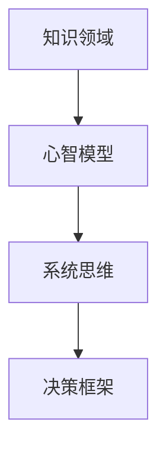
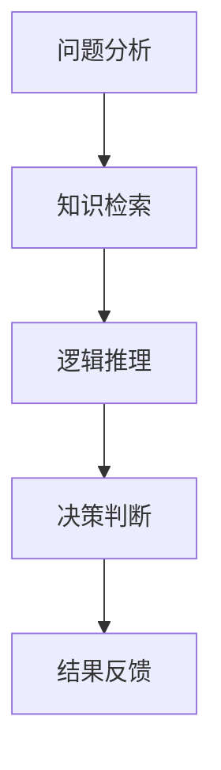
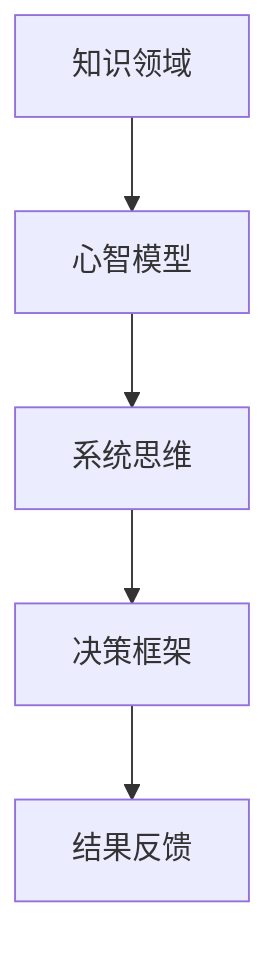

                 


# 查理芒格的多元思维模型

> 关键词：多元思维模型、跨学科思考、知识网络、系统思维、决策框架、芒格思维方法论

> 摘要：本文深入探讨了查理·芒格的多元思维模型，从其核心概念、算法原理到系统架构，再到实际应用，全面解析了这一模型的构建与实践。通过结合数学公式、算法流程图和系统架构图，本文旨在为读者提供一个清晰的框架，帮助他们在复杂问题中做出更明智的决策。

---

## 第一部分: 多元思维模型的背景与核心概念

### 第1章: 多元思维模型的定义与背景

#### 1.1 多元思维模型的定义
多元思维模型是一种通过跨学科知识的整合，形成多个相互关联的心智模型，从而帮助我们更好地理解和解决复杂问题的方法。它强调从多个角度看待问题，避免单一思维的局限性。

#### 1.2 多元思维模型的背景
在当代社会，知识的碎片化和信息的爆炸使得单一的思维方式难以应对复杂的挑战。查理·芒格提出的多元思维模型为我们提供了一种整合多学科知识的框架，帮助我们在决策中考虑更多因素，从而做出更全面的判断。

### 第2章: 多元思维模型的核心要素

#### 2.1 多元思维模型的要素构成
- **知识网络**：多元思维模型的基础是广泛的知识网络，涵盖数学、物理、生物、心理、经济等多个学科。
- **心智模型**：通过不断积累和整合知识，形成多个能够解释问题的心智模型。
- **系统思维**：将各个心智模型整合成一个整体的系统，理解系统之间的相互作用和影响。

#### 2.2 多元思维模型的属性特征
| 属性 | 描述 |
|------|------|
| 跨学科性 | 融合多个学科的知识和原理 |
| 整体性 | 强调系统性思考，而非单一视角 |
| 动态性 | 随着新知识的积累不断更新和优化 |

#### 2.3 多元思维模型的ER实体关系图


---

## 第二部分: 多元思维模型的算法原理与数学基础

### 第3章: 多元思维模型的算法原理

#### 3.1 多元思维模型的决策框架


#### 3.2 多元思维模型的数学基础
- **概率论与统计学**：用于评估不同选择的可能性和风险。
- **进化论与适应性**：帮助理解变化和适应的重要性。
- **经济学与决策理论**：提供决策的经济合理性分析。

#### 3.3 多元思维模型的数学公式
- **概率公式**：
  $$P(A|B) = \frac{P(B|A)P(A)}{P(B)}$$
  这个公式表示在已知B发生的条件下，A发生的概率。

- **边际成本与收益**：
  $$MC = \frac{dTC}{dQ}$$
  边际成本是指每增加一单位产量所增加的成本，用于分析成本和收益的平衡点。

- **投资决策模型**：
  $$V = \sum_{t=1}^n \frac{CF_t}{(1+r)^t}$$
  这个公式用于计算投资项目的价值，其中$CF_t$是第t年的现金流，$r$是贴现率。

### 第4章: 多元思维模型的系统架构设计

#### 4.1 系统架构概述
- **知识体系的构建**：通过不断学习和整合多个学科的知识，形成一个庞大的知识网络。
- **心智模型的优化**：定期更新和优化各个心智模型，确保其准确性和适用性。
- **决策框架的动态调整**：根据实际情况的变化，动态调整决策框架，以应对新的挑战。

#### 4.2 系统架构图


---

## 第三部分: 多元思维模型的项目实战

### 第5章: 多元思维模型的实际应用

#### 5.1 投资决策案例
- **背景分析**：分析市场趋势、公司基本面和行业动态。
- **知识检索**：整合经济学、金融学和心理学知识，评估投资风险和收益。
- **逻辑推理**：通过逻辑推理得出最优投资组合。
- **决策判断**：基于分析结果做出投资决策。
- **结果反馈**：根据市场反馈调整投资策略。

#### 5.2 风险管理案例
- **问题分析**：识别潜在风险因素。
- **知识检索**：结合概率论和统计学知识，评估风险的可能性和影响。
- **逻辑推理**：通过系统思维分析风险之间的相互作用。
- **决策判断**：制定风险管理策略。
- **结果反馈**：根据实际结果优化风险管理模型。

### 第6章: 项目实战的代码实现

#### 6.1 环境安装
- **工具安装**：安装必要的数据分析工具和编程语言，如Python、Pandas、Matplotlib等。

#### 6.2 核心实现
```python
import numpy as np
import pandas as pd
from scipy.stats import norm

def calculate_probability(mean, std, threshold):
    z = (threshold - mean) / std
    p = norm.sf(z)
    return p

# 示例数据
mean = 100
std = 15
threshold = 120

probability = calculate_probability(mean, std, threshold)
print(f"概率为: {probability}")
```

#### 6.3 代码应用解读
- **概率计算**：通过上述代码计算某一事件发生的概率，帮助做出决策。
- **风险管理**：利用概率分布分析潜在风险，制定应对策略。

---

## 第四部分: 最佳实践与总结

### 第7章: 最佳实践

#### 7.1 小结
多元思维模型是一种强大的工具，能够帮助我们在复杂的问题中找到更优的解决方案。通过跨学科的知识整合和系统性思考，我们可以更好地应对现实中的挑战。

#### 7.2 注意事项
- **持续学习**：保持对新知识的吸收和更新。
- **实践应用**：将理论应用于实际问题中，不断优化模型。
- **团队协作**：与他人合作，结合不同的视角和经验。

#### 7.3 拓展阅读
- 推荐书籍：《思考，快与慢》、《穷查理宝典》。
- 在线资源：查阅相关学术论文和博客文章，深入理解多元思维模型的应用。

---

## 作者

**作者：AI天才研究院/AI Genius Institute & 禅与计算机程序设计艺术 /Zen And The Art of Computer Programming**

---

这篇文章通过系统的结构和详细的讲解，全面介绍了查理·芒格的多元思维模型，从理论到实践，为读者提供了丰富的知识和实用的指导。

