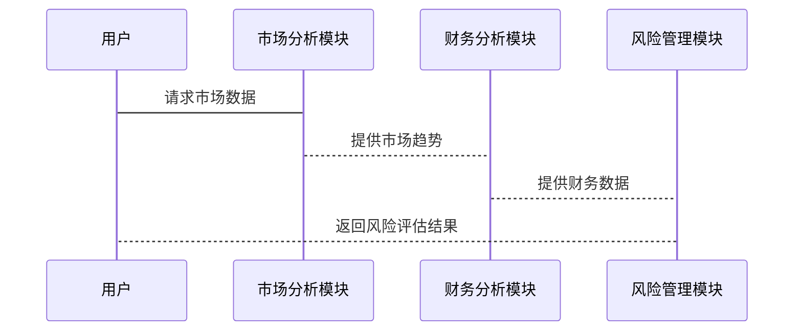

                 


# 查理芒格的多元思维模型：价值投资的跨学科应用

## 关键词：
- 多元思维模型, 价值投资, 跨学科应用, 系统架构设计, 项目实战

## 摘要：
查理·芒格提出的多元思维模型是一种强大的工具，可以帮助投资者在价值投资中做出更明智的决策。本文详细探讨了多元思维模型的核心概念、数学模型、系统架构设计以及在实际项目中的应用。通过跨学科的分析，结合具体的案例，展示了如何将多元思维模型应用于价值投资，帮助投资者更好地理解和应用这一方法。

---

## 第1章: 多元思维模型的核心概念

### 1.1 多元思维模型的定义与背景

#### 1.1.1 多元思维模型的起源与背景
多元思维模型是由查理·芒格提出的一种哲学方法，旨在通过跨学科的思考来解决复杂问题。这种方法强调将不同学科的核心思想结合起来，形成一个全面的思维方式。多元思维模型的起源可以追溯到芒格对心理学、经济学、哲学等多个领域的深入研究。

#### 1.1.2 多元思维模型的核心要素
多元思维模型的核心要素包括：
- **基本原理**：每个学科中的核心思想和原则。
- **关键概念**：这些基本原理之间的联系和相互作用。
- **应用范围**：如何将这些思想应用到实际问题中，如价值投资。

#### 1.1.3 多元思维模型与价值投资的关系
价值投资是一种长期投资策略，强调购买低于内在价值的股票。多元思维模型为价值投资提供了理论支持，帮助投资者更好地理解企业的内在价值和市场波动。

### 1.2 价值投资的基本原理

#### 1.2.1 价值投资的定义与特点
价值投资是一种以基本面分析为基础的投资方法，强调寻找被市场低估的企业。其特点包括长期持有、注重安全边际和逆向思考。

#### 1.2.2 价值投资的核心原则
- **安全边际**：购买价格低于内在价值。
- **长期视角**：关注企业的长期表现。
- **逆向思考**：在市场恐慌时寻找机会。

#### 1.2.3 多元思维模型与价值投资的结合
通过多元思维模型，投资者可以更好地理解企业的内在价值和市场波动，从而做出更明智的投资决策。

---

## 第2章: 多元思维模型的数学模型与公式

### 2.1 多元思维模型的数学基础

#### 2.1.1 基础数学概念
- **期望值**：概率论中的核心概念。
- **方差**：衡量数据的波动性。
- **协方差**：衡量两个变量之间的关系。

#### 2.1.2 多元思维模型的数学表达式
通过多元回归模型，可以将不同学科的思想结合起来，形成一个综合的数学模型。

$$ y = \beta_0 + \beta_1x_1 + \beta_2x_2 + \cdots + \beta_nx_n + \epsilon $$

其中，$y$ 是目标变量，$x_i$ 是自变量，$\beta_i$ 是回归系数，$\epsilon$ 是误差项。

#### 2.1.3 数学模型的应用实例
通过具体的案例分析，展示如何将数学模型应用于价值投资。

### 2.2 价值投资的数学公式

#### 2.2.1 股票估值公式
内在价值的计算公式：

$$ V = \frac{CF}{r - g} $$

其中，$CF$ 是自由现金流，$r$ 是折现率，$g$ 是增长率。

#### 2.2.2 内在价值计算公式
$$ V = \sum_{t=1}^{\infty} \frac{CF_t}{(1 + r)^t} $$

#### 2.2.3 股票投资回报率公式
$$ ROI = \frac{\text{净利润}}{\text{投入资本}} $$

---

## 第3章: 多元思维模型的系统架构设计

### 3.1 系统架构设计概述

#### 3.1.1 系统架构设计的基本原则
- **模块化**：将系统划分为独立的模块。
- **抽象**：关注系统的核心功能。
- **依赖性反转**：降低模块之间的耦合度。

#### 3.1.2 系统架构设计的核心要素
- **功能模块**：市场分析、财务分析、风险管理。
- **交互设计**：用户输入、数据处理、结果输出。

#### 3.1.3 系统架构设计的实施步骤
1. 确定系统目标。
2. 划分功能模块。
3. 设计模块之间的交互。

### 3.2 系统架构设计的实现

#### 3.2.1 系统功能模块划分
- **市场分析模块**：分析市场趋势。
- **财务分析模块**：评估企业财务状况。
- **风险管理模块**：识别和管理投资风险。

#### 3.2.2 系统功能模块的交互设计
使用Mermaid序列图展示模块之间的交互流程。



#### 3.2.3 系统功能模块的实现代码
以下是一个简单的Python实现示例：

```python
class 市场分析模块:
    def 分析市场趋势(self):
        pass

class 财务分析模块:
    def 评估财务状况(self):
        pass

class 风险管理模块:
    def 识别风险(self):
        pass

class 投资系统:
    def __init__(self):
        self.市场分析 = 市场分析模块()
        self.财务分析 = 财务分析模块()
        self.风险管理 = 风险管理模块()

    def 进行分析(self):
        self.市场分析.分析市场趋势()
        self.财务分析.评估财务状况()
        self.风险管理.识别风险()
```

---

## 第4章: 多元思维模型的项目实战

### 4.1 项目实战概述

#### 4.1.1 项目背景
选择一家公司作为案例，分析其内在价值和市场地位。

#### 4.1.2 项目目标
评估该公司的内在价值，判断其是否值得投资。

#### 4.1.3 项目实施步骤
1. 收集公司财务数据。
2. 分析市场趋势。
3. 计算内在价值。
4. 判断投资价值。

### 4.2 项目核心实现

#### 4.2.1 环境安装与配置
安装必要的工具和库，如Python、Pandas、Matplotlib等。

#### 4.2.2 系统核心功能的实现代码
以下是一个简单的Python实现示例：

```python
import pandas as pd
import numpy as np

def 计算内在价值(现金流, 折现率, 增长率):
    return cash_flow / (折现率 - 增长率)

现金流 = [100, 120, 140]
折现率 = 0.1
增长率 = 0.05

内在价值 = 计算内在价值(现金流, 折现率, 增长率)
print("内在价值:", 内在价值)
```

#### 4.2.3 代码解读与分析
解释代码的功能和实现细节，帮助读者理解如何将理论应用于实践。

### 4.3 项目案例分析

#### 4.3.1 案例背景
选择一家具体公司，分析其财务状况和市场地位。

#### 4.3.2 案例分析与解读
通过计算内在价值，判断其是否值得投资。

#### 4.3.3 案例总结与启示
总结案例分析的结果，并提出对未来投资的启示。

---

## 第5章: 多元思维模型的最佳实践与注意事项

### 5.1 最佳实践

#### 5.1.1 多元思维模型的应用技巧
- 结合多个学科的思想。
- 持续学习和更新知识。
- 保持理性和耐心。

#### 5.1.2 价值投资的实战经验
- 选择优质企业。
- 长期持有。
- 定期评估和调整。

#### 5.1.3 跨学科应用的注意事项
- 确保数据的准确性和可靠性。
- 考虑模型的局限性和适用性。
- 不断总结和优化。

### 5.2 小结与展望

#### 5.2.1 本书内容总结
总结全文的主要内容和核心观点。

#### 5.2.2 未来研究方向
探讨未来的研究方向，如人工智能与多元思维模型的结合。

#### 5.2.3 对读者的建议
鼓励读者继续学习和实践，不断提升自己的投资能力。

---

## 作者：AI天才研究院/AI Genius Institute & 禅与计算机程序设计艺术 /Zen And The Art of Computer Programming

