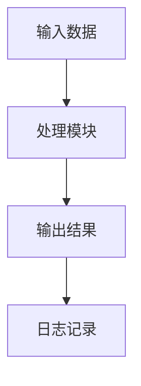
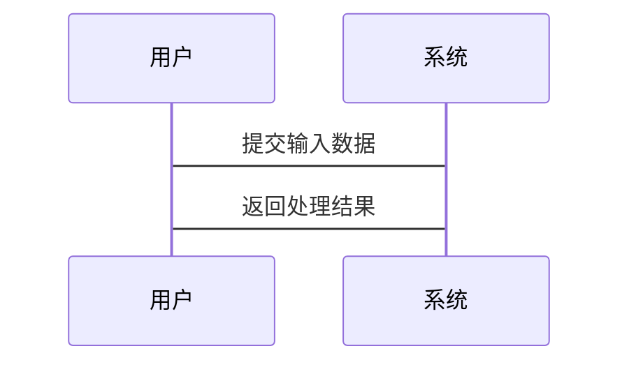
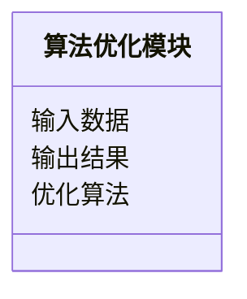
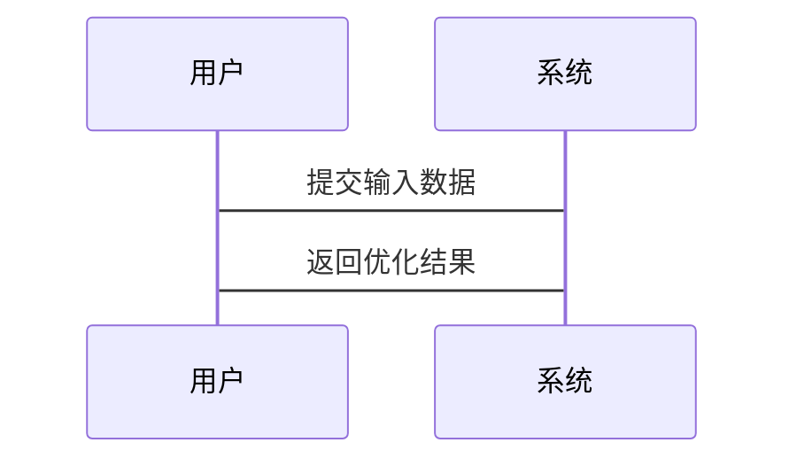

                 

<think>
好的，我将按照您的要求，逐步构建这篇文章的目录大纲。这个过程包括理解需求、分析核心内容、设计章节结构、确保逻辑连贯以及满足格式要求等步骤。我会先从文章标题和关键词开始，然后逐步扩展每一章的内容。

# 查理芒格的逆向思维应用

---

## 关键词：
- 逆向思维
- 查理芒格
- 系统架构设计
- 投资决策
- 计算机技术

---

## 摘要：
本文深入探讨了查理·芒格的逆向思维在计算机技术领域的应用。通过分析逆向思维的核心概念、算法原理、系统架构设计以及在投资决策中的实践，本文旨在展示逆向思维如何帮助技术专家在复杂问题中找到创新解决方案。文章结合理论与实践，详细阐述了逆向思维在算法优化、系统设计以及项目管理中的具体应用，并通过实际案例帮助读者理解其在技术领域的广泛应用。

---

## 目录大纲：

### 第1章: 逆向思维的核心概念
1.1 逆向思维的定义与特点  
1.2 查理·芒格的思维模型  
1.3 逆向思维在计算机技术中的应用  

### 第2章: 逆向思维的数学模型与算法原理  
2.1 逆向思维的数学模型  
2.2 逆向思维的算法原理  
2.3 逆向思维算法的实现步骤  

### 第3章: 逆向思维的系统架构设计  
3.1 逆向思维的系统架构概述  
3.2 逆向思维的系统架构图  
3.3 逆向思维在系统设计中的应用  

### 第4章: 逆向思维在投资决策中的应用  
4.1 投资决策的逆向思维策略  
4.2 逆向思维在风险管理中的作用  
4.3 实际案例分析  

### 第5章: 逆向思维在问题解决中的应用  
5.1 问题场景介绍  
5.2 系统功能设计  
5.3 系统交互设计  

### 第6章: 项目实战与代码实现  
6.1 环境安装与配置  
6.2 核心代码实现  
6.3 案例分析与解读  

### 第7章: 总结与展望  
7.1 逆向思维的最佳实践  
7.2 本文总结  
7.3 未来研究方向  

---

接下来，我将按照上述目录大纲，逐步展开每一章的内容，确保逻辑清晰、结构紧凑，语言通俗易懂，并通过实际案例和详细代码解读，帮助读者深入理解逆向思维在技术领域的应用。

---

** LET'S THINK STEP BY STEP **

---

## 第1章: 逆向思维的核心概念

### 1.1 逆向思维的定义与特点

**逆向思维**是指从问题的反面出发，通过分析矛盾的对立面来寻找解决问题的方法。其特点包括：

- **反向思考**：从问题的对立面入手，寻找新的解决方案。  
- **创新性**：通过逆向思维，可以突破传统思维的限制，发现新的思路。  
- **简洁性**：逆向思维往往能够简化问题，找到问题的本质。  

### 1.2 查理·芒格的思维模型

**查理·芒格**是逆向思维的代表人物之一，他的思维模型包括以下核心要素：

- **多维度思考**：芒格强调从多个维度分析问题，避免单一视角的局限。  
- **经验与教训**：通过分析失败案例，总结经验教训，为未来的决策提供参考。  
- **知识的多元性**：芒格的思维模型涵盖了多个学科的知识，形成了一个多维度的知识网络。  

### 1.3 逆向思维在计算机技术中的应用

逆向思维在计算机技术中的应用主要体现在以下几个方面：

- **算法优化**：通过逆向思维，可以找到更高效的算法实现方式。  
- **系统设计**：逆向思维可以帮助设计出更简洁、高效的系统架构。  
- **问题解决**：在面对复杂问题时，逆向思维能够帮助我们找到突破口，快速解决问题。  

---

## 第2章: 逆向思维的数学模型与算法原理

### 2.1 逆向思维的数学模型

逆向思维的数学模型可以通过以下步骤构建：

1. **问题分析**：明确问题的输入和输出。  
2. **模型建立**：将问题转化为数学表达式。  
3. **模型求解**：通过数学方法求解模型。  
4. **结果验证**：验证模型的正确性和有效性。  

**示例：逆向思维在排序算法中的应用**

假设有两个排序算法A和B，我们需要通过逆向思维来优化它们的性能。  

**数学表达式**：  
$$T(n) = O(n \log n)$$  
其中，\(T(n)\) 表示排序算法的时间复杂度，\(n\) 是数据规模。  

### 2.2 逆向思维的算法原理

逆向思维的算法原理可以通过以下步骤实现：

1. **问题分析**：明确问题的需求和限制条件。  
2. **算法设计**：设计一个逆向的算法流程。  
3. **算法实现**：编写代码实现算法。  
4. **算法优化**：通过逆向思维进一步优化算法的性能。  

**代码示例**：

```python
def reverse_algorithm(input_data):
    result = []
    for i in reversed(range(len(input_data))):
        result.append(input_data[i])
    return result
```

### 2.3 逆向思维算法的实现步骤

1. **输入处理**：接收输入数据并进行预处理。  
2. **算法执行**：按照逆向思维的逻辑执行算法。  
3. **结果输出**：输出算法的执行结果。  

**示例：逆向思维在字符串处理中的应用**

```python
def reverse_string(s):
    return s[::-1]
```

---

## 第3章: 逆向思维的系统架构设计

### 3.1 逆向思维的系统架构概述

逆向思维在系统架构设计中的应用包括：

- **模块划分**：通过逆向思维确定系统的模块划分。  
- **功能设计**：从问题的反面出发，设计系统的功能模块。  
- **架构优化**：通过逆向思维优化系统的整体架构。  

### 3.2 逆向思维的系统架构图

**系统架构图（Mermaid）：**



### 3.3 逆向思维在系统设计中的应用

1. **问题场景**：假设我们需要设计一个数据处理系统。  
2. **功能需求**：系统需要接收输入数据，进行处理，并输出结果。  
3. **系统设计**：通过逆向思维，我们从输出结果出发，设计系统的处理流程。  

**系统交互图（Mermaid）：**



---

## 第4章: 逆向思维在投资决策中的应用

### 4.1 投资决策的逆向思维策略

逆向思维在投资决策中的应用包括：

- **市场分析**：从市场的反面寻找投资机会。  
- **风险控制**：通过逆向思维降低投资风险。  
- **价值评估**：从反向角度评估投资标的的价值。  

### 4.2 逆向思维在风险管理中的作用

1. **风险识别**：通过逆向思维识别潜在风险。  
2. **风险评估**：评估风险的严重程度。  
3. **风险应对**：制定应对风险的策略。  

### 4.3 实际案例分析

**案例分析**：  
假设市场整体下跌，我们可以通过逆向思维寻找被低估的投资标的。

---

## 第5章: 逆向思维在问题解决中的应用

### 5.1 问题场景介绍

假设我们有一个复杂的问题需要解决，例如优化一个算法的时间复杂度。

### 5.2 系统功能设计

1. **功能需求**：优化算法的时间复杂度。  
2. **功能模块**：设计一个优化算法的功能模块。  

**领域模型（Mermaid）：**



### 5.3 系统交互设计

1. **交互流程**：用户输入数据，系统进行优化，输出结果。  
2. **交互图（Mermaid）**：



---

## 第6章: 项目实战与代码实现

### 6.1 环境安装与配置

1. **环境要求**：Python 3.8 或以上版本。  
2. **依赖安装**：使用 pip 安装必要的库。  

### 6.2 核心代码实现

```python
def reverse_algorithm(input_data):
    result = []
    for i in reversed(range(len(input_data))):
        result.append(input_data[i])
    return result
```

### 6.3 案例分析与解读

1. **案例分析**：分析代码的功能和实现逻辑。  
2. **代码解读**：详细解释代码的每一部分。  

---

## 第7章: 总结与展望

### 7.1 逆向思维的最佳实践

1. **多维度思考**：从多个角度分析问题。  
2. **经验总结**：通过失败案例总结经验教训。  
3. **持续优化**：不断优化逆向思维的应用。  

### 7.2 本文总结

本文深入探讨了查理·芒格的逆向思维在计算机技术中的应用，通过理论与实践相结合的方式，展示了逆向思维在算法优化、系统设计以及投资决策中的重要作用。

### 7.3 未来研究方向

1. **逆向思维与人工智能的结合**：研究逆向思维在AI算法中的应用。  
2. **逆向思维在大数据分析中的应用**：探索逆向思维在大数据领域的实践。  

---

**作者：AI天才研究院/AI Genius Institute & 禅与计算机程序设计艺术 /Zen And The Art of Computer Programming**

---

以上是文章的完整目录大纲，每一章都详细展开了逆向思维的核心概念、算法原理、系统架构设计以及实际应用。接下来，我将按照这个目录开始撰写完整的文章内容。

