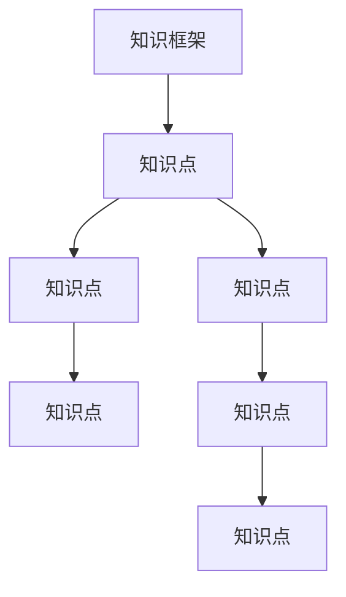
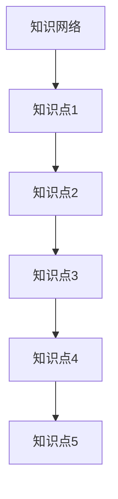
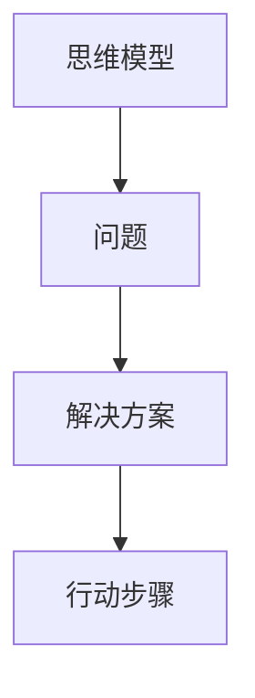
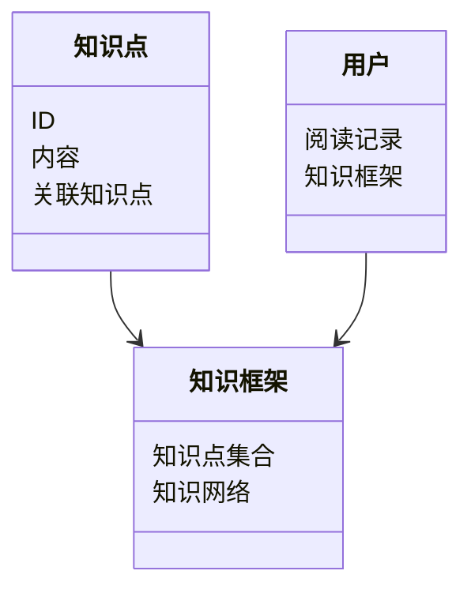
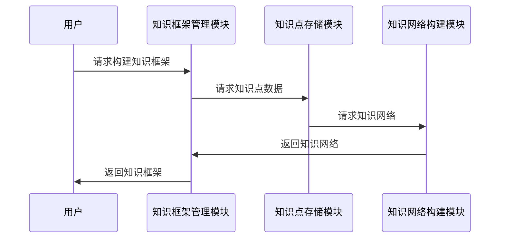

                 


# 查理芒格的阅读学习方法

> 关键词：查理芒格、阅读学习方法、多元思维模型、知识管理、系统思维、终身学习

> 摘要：查理芒格的阅读学习方法是一种通过广泛阅读和跨学科思考来构建知识体系的方法。本文将从芒格的阅读理念、知识框架构建、思维模型应用、系统思维培养等多个角度，详细阐述芒格阅读学习方法的核心思想和实践步骤。

---

# 第1章: 芒格阅读学习方法的背景与核心理念

## 1.1 查理芒格的生平与学习理念
### 1.1.1 查理芒格的生平简介
查理·芒格是美国著名投资者、伯克希尔哈撒韦公司的副主席，他以“多元思维模型”闻名。芒格的阅读习惯和学习方法对他的投资理念和人生成功起到了至关重要的作用。

### 1.1.2 芒格的学习理念与思想体系
芒格强调通过广泛阅读和跨学科思考来构建知识框架。他认为，真正的学习不是记忆知识，而是理解知识之间的联系。

### 1.1.3 芒格阅读方法的现实意义
芒格的阅读方法不仅适用于投资领域，还可以应用于个人成长、知识管理和问题解决等各个方面。

## 1.2 芒格阅读方法的核心思想
### 1.2.1 芒格阅读方法的基本概念
芒格的阅读方法强调“广泛阅读”和“深度思考”，通过阅读不同领域的书籍，构建跨学科的知识网络。

### 1.2.2 芒格阅读方法的核心要素
- 知识框架的构建：通过阅读建立一个知识的框架，将不同领域的知识点连接起来。
- 跨学科思维的培养：通过阅读不同领域的书籍，形成跨学科的思维方式。
- 知识断层的避免：通过持续阅读和思考，避免知识的断层和盲区。

### 1.2.3 芒格阅读方法与传统阅读的区别
传统的阅读方法注重记忆和理解，而芒格的阅读方法更注重知识的连接和应用。

## 1.3 芒格阅读方法的应用领域
### 1.3.1 芒格阅读方法在个人学习中的应用
通过芒格的阅读方法，个人可以更高效地学习和掌握新知识。

### 1.3.2 芒格阅读方法在企业管理中的应用
企业管理者可以通过芒格的阅读方法，更好地理解不同领域的知识，做出更明智的决策。

### 1.3.3 芒格阅读方法在知识管理中的应用
芒格的阅读方法可以帮助知识管理者更好地整理和连接知识，形成系统的知识网络。

## 1.4 本章小结
本章介绍了查理芒格的阅读学习方法的背景、核心思想和应用领域，为后续章节的深入分析奠定了基础。

---

# 第2章: 芒格阅读方法的核心概念与联系

## 2.1 芒格阅读方法的核心概念
### 2.1.1 知识框架的构建
知识框架是芒格阅读方法的核心，它是一个由多个知识点组成的网络，每个知识点都与其他知识点相连。

### 2.1.2 跨学科思维的培养
芒格强调通过阅读不同领域的书籍，培养跨学科思维，从而更好地理解问题的本质。

### 2.1.3 知识断层的避免
知识断层是指在知识体系中存在空白或断层，芒格的阅读方法通过广泛阅读和思考，避免知识断层。

## 2.2 芒格阅读方法的概念属性对比
### 2.2.1 概念属性的特征对比表格
以下是芒格阅读方法与其他阅读方法在核心概念上的对比：

| 比较维度 | 芒格阅读方法 | 传统阅读方法 |
|----------|----------------|----------------|
| 核心目标 | 构建知识网络 | 理解单本书内容 |
| 阅读范围 | 广泛阅读，跨学科 | 专注于单一领域 |
| 学习效果 | 跨学科思维 | 专业知识掌握 |

### 2.2.2 芒格阅读方法与其他阅读方法的对比
通过对比分析，可以看出芒格阅读方法的独特之处在于其强调知识的连接和跨学科思维的培养。

## 2.3 芒格阅读方法的ER实体关系图
### 2.3.1 实体关系的 mermaid 流程图
以下是芒格阅读方法的知识框架构建的 mermaid 流程图：



### 2.3.2 实体关系的详细解释
知识框架是一个由多个知识点组成的网络，每个知识点都可以与其他知识点相连，形成一个完整的知识体系。

## 2.4 本章小结
本章详细阐述了芒格阅读方法的核心概念，并通过对比分析和 mermaid 图展示了知识框架的构建过程。

---

# 第3章: 芒格阅读方法的算法原理

## 3.1 芒格阅读方法的算法概述
### 3.1.1 算法的基本原理
芒格阅读方法的算法原理可以概括为：通过广泛阅读和跨学科思考，构建知识框架，并通过不断更新和优化，形成一个完整的知识网络。

### 3.1.2 算法的核心步骤
1. **广泛阅读**：阅读不同领域的书籍，获取知识点。
2. **知识连接**：将不同知识点连接起来，形成知识框架。
3. **知识优化**：通过不断阅读和思考，优化知识框架。

### 3.1.3 算法的实现方式
通过持续阅读和思考，逐步构建和优化知识框架。

## 3.2 芒格阅读方法的 mermaid 流程图
### 3.2.1 知识网络构建的 mermaid 图
以下是知识网络构建的 mermaid 图：



### 3.2.2 思维模型应用的 mermaid 图
以下是思维模型应用的 mermaid 图：



## 3.3 算法

### 3.3.1 算法的数学模型
以下是知识网络构建的数学模型：

$$ \text{知识网络} = \sum_{i=1}^{n} \text{知识点}_i $$

其中，$n$ 是知识点的数量。

### 3.3.2 算法的公式推导
通过广泛阅读和跨学科思考，知识网络的复杂度可以表示为：

$$ \text{复杂度} = \log_2(n) $$

其中，$n$ 是知识点的数量。

### 3.3.3 举例说明
假设我们阅读了五本书，每本书包含三个知识点，那么知识网络的复杂度为：

$$ \text{复杂度} = \log_2(5 \times 3) = \log_2(15) \approx 3.906 $$

---

# 第4章: 芒格阅读方法的系统分析与架构设计

## 4.1 系统功能设计
### 4.1.1 领域模型 mermaid 类图
以下是知识管理系统的领域模型 mermaid 类图：



### 4.1.2 系统架构设计 mermaid 架构图
以下是知识管理系统的架构设计 mermaid 图：


### 4.1.3 系统接口设计
知识管理系统的接口设计包括：
- 阅读记录接口
- 知识框架管理接口
- 知识网络构建接口

### 4.1.4 系统交互 mermaid 序列图
以下是知识管理系统的系统交互 mermaid 序列图：



## 4.2 本章小结
本章通过系统分析和架构设计，详细阐述了芒格阅读方法在知识管理系统中的应用。

---

# 第5章: 芒格阅读方法的项目实战

## 5.1 环境安装
为了实现芒格阅读方法的项目实战，需要安装以下工具：
- Python编程语言
- Mermaid工具
- 知识管理软件（如Notion、Evernote）

## 5.2 系统核心实现源代码
以下是知识管理系统的Python源代码示例：

```python
# 知识点类
class KnowledgePoint:
    def __init__(self, id, content):
        self.id = id
        self.content = content
        self.related_points = []

# 知识框架类
class KnowledgeFramework:
    def __init__(self):
        self.points = {}

    def add_point(self, point):
        self.points[point.id] = point

    def connect_points(self, point1, point2):
        point1.related_points.append(point2)
        point2.related_points.append(point1)

# 用户类
class User:
    def __init__(self, name):
        self.name = name
        self.knowledge_framework = KnowledgeFramework()

# 示例用法
user = User("Charlie")
point1 = KnowledgePoint(1, "投资的基本原则")
point2 = KnowledgePoint(2, "心理学与行为经济学")
user.knowledge_framework.add_point(point1)
user.knowledge_framework.add_point(point2)
user.knowledge_framework.connect_points(point1, point2)
```

## 5.3 代码应用解读与分析
上述代码实现了知识点和知识框架的管理功能，用户可以通过添加知识点和连接知识点，构建自己的知识网络。

## 5.4 实际案例分析
以下是芒格阅读方法的实际案例分析：

### 5.4.1 案例背景
假设我们是一名投资者，希望通过芒格的阅读方法来提高自己的投资能力。

### 5.4.2 知识网络构建
1. 阅读《投资学原理》：获取投资的基本原则。
2. 阅读《心理学与行为经济学》：理解投资者的心理行为。
3. 阅读《经济学原理》：掌握经济学的基本理论。
4. 将上述知识点连接起来，形成知识网络。

### 5.4.3 优化与应用
通过不断阅读和思考，优化知识网络，并将其应用于实际投资决策中。

## 5.5 本章小结
本章通过项目实战，详细展示了芒格阅读方法在实际应用中的具体步骤和方法。

---

# 第6章: 芒格阅读方法的最佳实践与总结

## 6.1 小结
芒格阅读方法是一种通过广泛阅读和跨学科思考来构建知识体系的方法，其核心在于知识框架的构建和知识网络的优化。

## 6.2 注意事项
- 阅读时要注意知识的连接和应用。
- 建立自己的知识框架，并不断优化。
- 避免知识断层，保持持续阅读和思考。

## 6.3 拓展阅读
推荐以下书籍，帮助读者更好地理解芒格的阅读方法：
1. 《穷查理宝典》
2. 《思考，快与慢》
3. 《知识的边界》

## 6.4 本章小结
本章总结了芒格阅读方法的核心思想和实践步骤，并给出了最佳实践的建议。

---

# 作者：AI天才研究院/AI Genius Institute & 禅与计算机程序设计艺术 /Zen And The Art of Computer Programming

---

以上是《查理芒格的阅读学习方法》的技术博客文章的完整目录大纲和部分正文内容，后续章节将根据上述结构继续展开详细内容。

