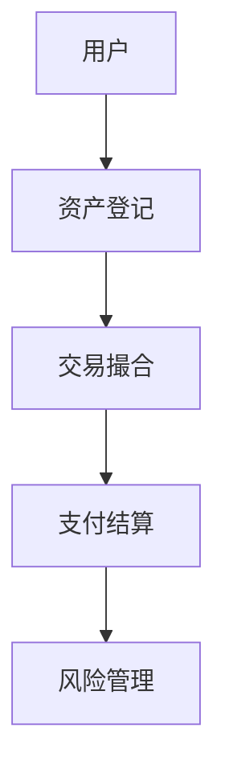
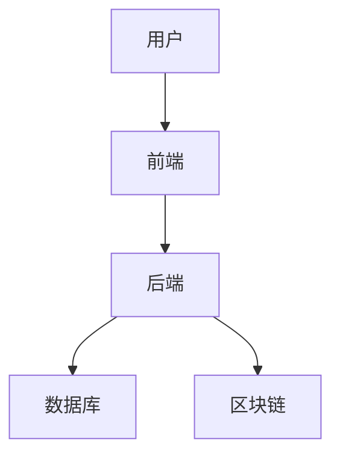
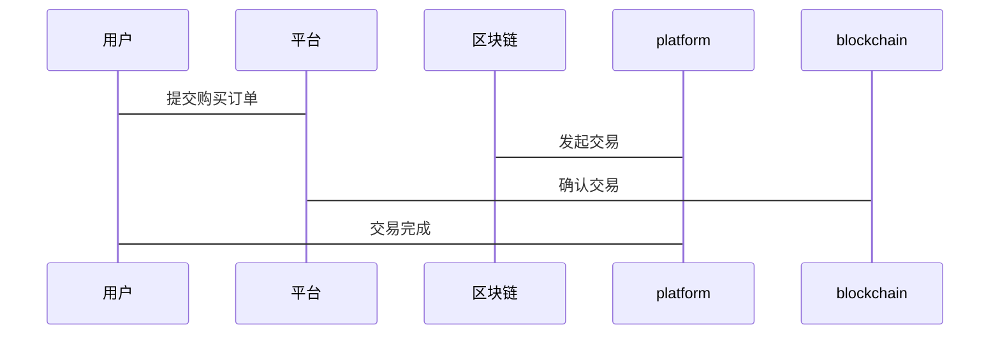

                 


# 《格雷厄姆价值投资理念在元宇宙经济中的重新诠释》

## 关键词：元宇宙，价值投资，虚拟经济，区块链，NFT，经济模型

## 摘要：  
本文旨在探讨格雷厄姆价值投资理念在元宇宙经济中的应用。通过分析元宇宙经济的结构、虚拟资产的价值评估以及投资策略的调整，重新诠释格雷厄姆的内在价值与安全边际理论。结合实际案例和数学模型，本文提出了适用于元宇宙经济的价值投资方法，并展望了其未来发展趋势。

---

## 第一章：引言

### 1.1 元宇宙的基本概念

#### 1.1.1 元宇宙的定义与特征  
元宇宙（Metaverse）是一个虚拟的、持续的、可交互的数字环境，结合了虚拟现实（VR）、增强现实（AR）、区块链、人工智能（AI）等多种技术。其核心特征包括：  
- **去中心化**：基于区块链技术，确保数据的安全性和不可篡改性。  
- **可交互性**：用户可以在元宇宙中进行社交、交易、游戏等活动。  
- **虚拟资产**：包括虚拟货币（如比特币、以太坊）和不可替代的代币（NFTs）。  

#### 1.1.2 元宇宙经济的形成与发展  
元宇宙经济是指在元宇宙中进行的经济活动，包括虚拟货币的流通、NFTs的交易、虚拟土地的买卖等。随着区块链技术的成熟，元宇宙经济逐渐从概念走向现实，形成了一个全新的虚拟经济体系。

#### 1.1.3 元宇宙经济与传统经济的对比  
元宇宙经济与传统经济有显著不同：  
- **虚拟性**：元宇宙经济活动完全依赖数字技术，而传统经济涉及实物资产。  
- **去中心化**：元宇宙经济基于区块链技术，去中心化特征明显，而传统经济通常由政府或金融机构主导。  
- **创新性**：元宇宙经济引入了NFTs、智能合约等新兴概念，传统经济则相对成熟。

### 1.2 格雷厄姆价值投资理念的核心思想

#### 1.2.1 价值投资的定义与历史发展  
价值投资是一种长期投资策略，强调以低于内在价值的价格买入资产。该理念由本杰明·格雷厄姆（Benjamin Graham）提出，核心在于寻找被市场低估的投资标的。

#### 1.2.2 格雷厄姆投资策略的核心原则  
格雷厄姆的价值投资策略主要包括以下几点：  
- **内在价值**：资产的真实价值，与市场波动无关。  
- **安全边际**：买入价格低于内在价值，以确保投资的安全性。  
- **长期视角**：关注长期收益，而非短期市场波动。

#### 1.2.3 价值投资在现代金融中的应用  
价值投资已广泛应用于股票、房地产等领域。其核心思想是通过深入分析资产的真实价值，寻找具有长期增长潜力的投资标的。

### 1.3 本文的研究意义与目标  
本文旨在探讨格雷厄姆价值投资理念在元宇宙经济中的适用性。通过对元宇宙经济结构的分析，提出适用于虚拟资产的价值评估方法，为投资者提供新的投资思路。

---

## 第二章：格雷厄姆价值投资理念的核心理论

### 2.1 安全边际的概念与计算

#### 2.1.1 安全边际的定义与作用  
安全边际是指买入价格与内在价值之间的差额。其作用在于降低市场波动对投资的影响，确保投资的稳健性。

#### 2.1.2 安全边际的计算方法  
安全边际 = 内在价值 - 市场价格  
例如：若某资产的内在价值为100，市场价格为80，则安全边际为20。

### 2.2 内在价值的评估与分析

#### 2.2.1 内在价值的定义与计算公式  
内在价值是资产的真实价值，计算公式为：  
$$ \text{内在价值} = \sum_{t=1}^{n} \frac{C_t}{(1 + r)^t} $$  
其中，\( C_t \) 是第 \( t \) 年的现金流，\( r \) 是折现率。

#### 2.2.2 不同资产的内在价值评估方法  
- **股票**：使用股息贴现模型（DDM）或自由现金流模型（DCF）。  
- **债券**：通过现金流折现法评估其未来收益。  
- **虚拟资产**：结合市场流动性、用户需求等因素进行评估。

### 2.3 市场分析与投资时机的选择

#### 2.3.1 市场分析的基本方法  
- **技术分析**：通过价格走势预测市场趋势。  
- **基本面分析**：分析资产的内在价值和市场环境。  

#### 2.3.2 投资时机的选择策略  
格雷厄姆建议在市场低迷时买入，市场高涨时卖出。这种逆向投资策略在元宇宙经济中同样适用。

---

## 第三章：元宇宙经济的结构与特点

### 3.1 元宇宙经济的参与者与角色

#### 3.1.1 用户（消费者）的角色与行为  
用户是元宇宙经济的主要参与者，通过购买虚拟商品、参与游戏等方式推动经济活动。

#### 3.1.2 开发者（生产者）的角色与行为  
开发者负责设计和创建虚拟资产，如NFTs、虚拟土地等，是经济活动的核心推动者。

#### 3.1.3 平台（中介机构）的角色与行为  
平台负责维护元宇宙的运行，提供交易撮合、支付结算等服务。

### 3.2 元宇宙经济的主要组成部分

#### 3.2.1 虚拟货币与支付系统  
虚拟货币（如比特币、以太坊）是元宇宙经济的主要货币形式，用于支付和交易。

#### 3.2.2 NFTs与数字艺术品  
NFTs（不可替代的代币）代表虚拟资产的所有权，常用于数字艺术品、虚拟土地等领域。

#### 3.2.3 虚拟商品与服务  
包括虚拟装备、虚拟游戏道具等，是元宇宙经济的重要组成部分。

---

## 第四章：价值投资理念在元宇宙经济中的应用

### 4.1 虚拟资产的价值评估

#### 4.1.1 虚拟资产的分类与特点  
虚拟资产可分为虚拟货币、NFTs、虚拟商品等，每类资产具有不同的价值评估方法。

#### 4.1.2 虚拟资产的估值模型  
- **NFTs估值模型**：考虑市场流动性、创作者声誉等因素。  
- **虚拟货币估值模型**：结合技术特征、市场采用率等因素。

#### 4.1.3 虚拟资产的波动性分析  
由于市场波动较大，虚拟资产的投资风险较高，需谨慎评估。

### 4.2 安全边际在虚拟经济中的应用

#### 4.2.1 安全边际的计算与调整  
在虚拟经济中，需根据市场波动频繁调整安全边际，确保投资的稳健性。

#### 4.2.2 安全边际与风险控制  
通过设置止损点、分散投资等方式，降低投资风险。

### 4.3 投资策略的调整与优化

#### 4.3.1 长期投资与短期交易的结合  
投资者可根据自身风险承受能力，选择长期持有或短期交易策略。

#### 4.3.2 优质资产的选择标准  
优先选择具有强大技术支撑、良好社区支持的虚拟资产。

---

## 第五章：系统分析与架构设计

### 5.1 系统功能设计

#### 5.1.1 用户需求分析  
用户需要便捷的资产购买、交易和管理功能。

#### 5.1.2 系统功能模块  
包括资产登记、交易撮合、支付结算、风险管理等功能。

#### 5.1.3 系统功能设计图（Mermaid）  


### 5.2 系统架构设计

#### 5.2.1 系统架构图（Mermaid）  


#### 5.2.2 系统接口设计  
- 用户接口：资产购买、交易确认、余额查询。  
- 后台接口：订单处理、支付结算、风险管理。

### 5.3 系统交互设计

#### 5.3.1 交易流程（Mermaid）  


---

## 第六章：项目实战

### 6.1 环境安装

#### 6.1.1 开发环境配置  
安装必要的开发工具，如以太坊钱包、Solidity编译器等。

#### 6.1.2 依赖安装  
使用npm安装项目所需的依赖包。

### 6.2 核心代码实现

#### 6.2.1 智能合约开发（Solidity）  
```solidity
// SPDX-License-Identifier: MIT
pragma solidity ^0.8.0;

contract NFTMarket {
    uint256 public tokenCount = 0;
    mapping(address => uint256) public balances;

    function buyToken(address _tokenContract, uint256 _tokenId) public payable {
        require(msg.value >= getMarketPrice(_tokenContract, _tokenId), "Insufficient funds");
        balances[msg.sender]++;
        // 其他逻辑...
    }

    function getMarketPrice(address _tokenContract, uint256 _tokenId) public view returns (uint256) {
        // 计算市场价...
        return 0;
    }
}
```

#### 6.2.2 前端界面设计  
使用React框架搭建用户友好的交易界面。

### 6.3 案例分析

#### 6.3.1 案例背景  
以NFT交易为例，分析其内在价值和市场价。

#### 6.3.2 交易流程  
用户通过平台购买NFT，平台通过智能合约完成交易。

### 6.4 项目总结  
通过实际案例分析，验证了格雷厄姆价值投资理念在元宇宙经济中的可行性。

---

## 第七章：结论与展望

### 7.1 本文总结  
本文探讨了格雷厄姆价值投资理念在元宇宙经济中的应用，提出了适用于虚拟资产的价值评估方法。

### 7.2 未来研究方向  
未来可进一步研究如何在元宇宙中实现更精准的价值评估和风险控制。

### 7.3 致谢  
感谢读者的支持与关注。

---

## 作者：AI天才研究院/AI Genius Institute & 禅与计算机程序设计艺术 /Zen And The Art of Computer Programming

---

以上是文章的详细目录和内容概述，涵盖了从理论到实践的各个方面，确保读者能够全面理解格雷厄姆价值投资理念在元宇宙经济中的应用。

