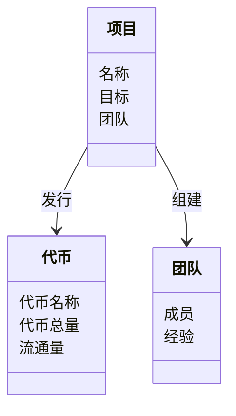
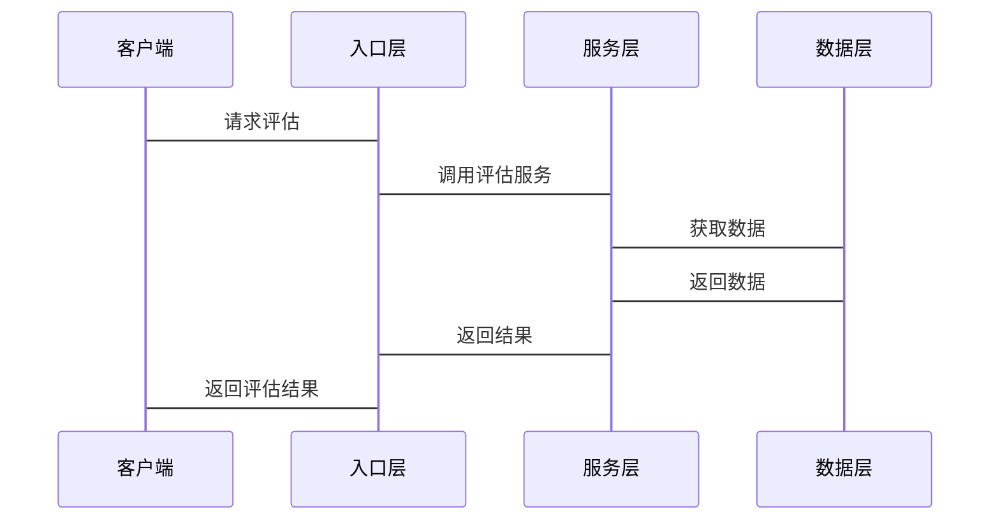

                 


# 格雷厄姆价值投资理念在区块链时代的新解读

## 关键词：价值投资、区块链、格雷厄姆、DeFi、数字资产

## 摘要：本文探讨格雷厄姆的价值投资理念在区块链时代的新应用，分析区块链技术对投资的影响，并提出新的价值评估模型和投资策略。

---

# 第一部分: 格雷厄姆价值投资理念的背景与基础

## 第1章: 价值投资的基本概念与核心理念

### 1.1 价值投资的定义与核心要素

#### 1.1.1 价值投资的起源与发展
价值投资由本杰明·格雷厄姆提出，强调以低于内在价值的价格购买资产，注重安全边际和长期收益。

#### 1.1.2 格雷厄姆的价值投资理论
格雷厄姆认为市场是理性的，投资者应寻找被低估的股票，关注长期收益而非短期波动。

#### 1.1.3 价值投资的核心原则
- 安全边际：购买价格低于内在价值。
- 长期投资：避免短期市场波动的影响。
- 风险控制：分散投资以降低风险。

### 1.2 价值投资与现代金融市场的结合

#### 1.2.1 现代金融市场的特点
现代市场波动大，信息透明，技术驱动，传统价值投资面临新挑战。

#### 1.2.2 价值投资在现代市场中的应用
投资者需结合新技术和市场变化，调整评估模型和策略。

#### 1.2.3 价值投资与风险控制的关系
通过分散投资和安全边际，降低市场波动带来的风险。

## 第2章: 区块链技术的基本原理与特点

### 2.1 区块链的定义与技术原理

#### 2.1.1 区块链的基本概念
区块链是分布式账本技术，通过去中心化和共识机制确保数据安全。

#### 2.1.2 区块链的核心技术
- 分布式账本：记录交易信息。
- 共识机制：节点达成一致。
- 加密算法：确保数据安全。

#### 2.1.3 区块链的分类与应用场景
区块链分为公链、私链和联盟链，应用于金融、供应链等多个领域。

### 2.2 区块链对金融市场的深远影响

#### 2.2.1 区块链技术对传统金融的挑战
降低中间成本，提高效率，改变传统金融结构。

#### 2.2.2 区块链技术对投资方式的改变
引入数字资产和智能合约，改变资产持有和交易方式。

#### 2.2.3 区块链技术与价值投资理念的结合
区块链的透明性和去中心化特性为价值投资提供了新工具和新视角。

---

# 第二部分: 价值投资理念在区块链时代的创新与应用

## 第3章: 格雷厄姆价值投资理念在区块链中的新解读

### 3.1 区块链时代价值投资的核心变化

#### 3.1.1 从传统资产到数字资产的转变
数字资产如加密货币和代币成为新的投资对象。

#### 3.1.2 区块链技术对价值评估的影响
区块链的透明性和去中心化特性改变了资产的价值评估方式。

#### 3.1.3 数字资产的价值发现机制
通过去中心化交易和社区治理，数字资产的价值发现更加动态和透明。

### 3.2 区块链时代的价值评估模型

#### 3.2.1 传统价值评估模型的局限性
传统模型难以适应数字资产的快速变化和去中心化特性。

#### 3.2.2 区块链时代价值评估模型的构建
新的模型需考虑技术实现、经济模型和团队背景等因素。

#### 3.2.3 数学模型与公式
$$\text{代币价值} = \frac{\text{项目价值}}{\text{流通代币总量}} \times \text{其他因素}$$

## 第4章: 区块链项目的价值评估与投资策略

### 4.1 区块链项目的评估维度

#### 4.1.1 项目背景与团队实力
评估团队的经验和项目目标是否合理。

#### 4.1.2 技术实现与创新性
检查技术实现的可行性和创新点。

#### 4.1.3 代币经济模型与应用场景
分析经济模型的合理性及应用场景的广泛性。

### 4.2 价值投资在区块链项目中的应用策略

#### 4.2.1 选择优质项目的标准
寻找具备技术优势、良好经济模型和强大团队的项目。

#### 4.2.2 风险控制与安全边际的构建
通过分散投资和严格筛选降低风险。

#### 4.2.3 长期持有与价值增长的结合
坚持长期投资，等待项目价值的逐步显现。

## 第5章: 区块链时代的价值投资实践案例分析

### 5.1 典型区块链项目的分析与解读

#### 5.1.1 以太坊的案例分析
以太坊作为智能合约平台，具备强大的生态系统和应用潜力。

#### 5.1.2 某DeFi项目的案例分析
分析其经济模型、应用场景和团队背景，评估其投资价值。

#### 5.1.3 案例分析总结
通过具体案例，展示如何应用新的价值评估模型进行投资决策。

---

# 第三部分: 区块链时代价值投资的系统分析与架构设计

## 第6章: 系统分析与架构设计方案

### 6.1 问题场景介绍

#### 6.1.1 传统价值评估模型的局限性
无法适应区块链时代的快速变化和新技术特点。

#### 6.1.2 区块链项目评估的需求
投资者需要系统化的方法来评估区块链项目。

### 6.2 系统功能设计

#### 6.2.1 领域模型设计
使用Mermaid类图展示各实体及其关系，如项目、代币、团队等。



### 6.3 系统架构设计

#### 6.3.1 系统架构设计
使用Mermaid架构图展示系统主要组件及其关系。


### 6.4 系统接口设计

#### 6.4.1 接口设计
定义系统的主要接口，如评估接口和数据接口。

#### 6.4.2 接口交互流程
使用Mermaid序列图展示接口交互过程。



### 6.5 项目实战

#### 6.5.1 环境安装
安装必要的开发工具和区块链节点。

#### 6.5.2 核心实现源代码
展示评估系统的核心代码，如代币价值计算函数。

```python
def calculate_token_value(project_value, circulating_supply):
    return project_value / circulating_supply
```

#### 6.5.3 代码应用解读与分析
解释代码的功能和使用场景，展示如何在实际项目中应用。

#### 6.5.4 实际案例分析
以具体项目为例，展示如何应用系统进行评估。

#### 6.5.5 项目小结
总结项目的实现过程和应用效果，提出改进建议。

### 6.6 最佳实践 tips

#### 6.6.1 投资前的注意事项
- 了解项目背景和团队。
- 分析技术实现和经济模型。
- 考虑市场风险和波动性。

#### 6.6.2 风险管理策略
- 分散投资，避免集中风险。
- 设置止损点，控制亏损。
- 长期持有，避免频繁交易。

#### 6.6.3 持续学习与适应
- 关注行业动态和技术发展。
- 学习新知识和案例分析。
- 调整投资策略以适应市场变化。

### 6.7 拓展阅读

#### 6.7.1 推荐书籍
- 《The Intelligent Investor》 by Benjamin Graham
- 《Mastering Blockchain》 by Imran Bashir

#### 6.7.2 推荐博客和资源
- 加密货币论坛和社区。
- 技术博客和行业报告。

---

# 结语

## 作者：AI天才研究院 & 禅与计算机程序设计艺术

---

通过以上结构，我们可以系统地分析和解读格雷厄姆价值投资理念在区块链时代的新应用，帮助投资者在新的技术环境下做出更明智的投资决策。

