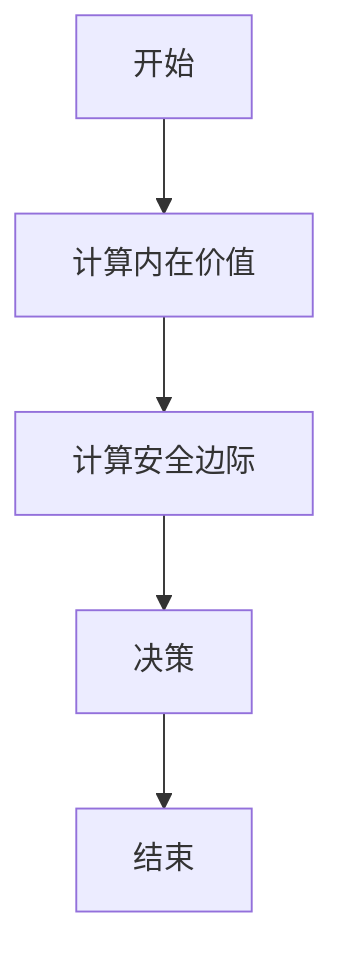
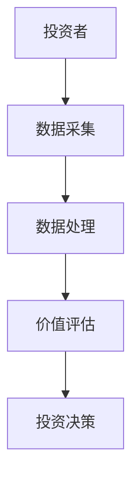

                 


# 《格雷厄姆价值投资理念在数字经济时代的新解读》

> 关键词：价值投资、数字经济、格雷厄姆、投资策略、风险管理、系统架构

> 摘要：本文旨在探讨格雷厄姆价值投资理念在数字经济时代的新应用。通过分析数字经济发展中的投资机会与挑战，结合格雷厄姆的核心投资理论，提出适合数字经济环境的价值投资策略。本文不仅从理论层面解读，还通过实际案例和系统架构设计，展示如何在数字时代应用格雷厄姆的投资理念。

---

## 第1章：价值投资理念的背景与演变

### 1.1 格雷厄姆价值投资概述

#### 1.1.1 价值投资的核心概念
- 安全边际：安全边际是指股票价格与其内在价值之间的差距，是投资中的“安全空间”。
- 内在价值：内在价值是股票的公允价值，反映了公司未来现金流的现值。
- 市场先生理论：市场先生是格雷厄姆用来描述市场波动的概念，投资者应利用市场的非理性波动来获取超额收益。

#### 1.1.2 格雷厄姆的投资哲学
- 长期投资：格雷厄姆强调长期投资的重要性，避免短期市场的波动干扰。
- 逆向思维：在市场恐慌时买入，市场狂热时卖出。
- 风险控制：通过安全边际来降低投资风险。

#### 1.1.3 数字经济时代的价值投资新维度
- 数字经济的兴起为价值投资提供了新的标的，如科技公司和数据资产。
- 数字经济中的不确定性增加，对传统的价值评估方法提出了挑战。

### 1.2 数字经济时代的特点

#### 1.2.1 数字经济的定义与特征
- 数字经济是以数据为关键生产要素的经济形态。
- 数字经济具有快速迭代、技术创新频繁的特点。

#### 1.2.2 数字经济对投资的影响
- 数字经济中的公司具有高成长性，但也伴随着高风险。
- 数字经济中的投资机会主要集中在科技、人工智能、大数据等领域。

#### 1.2.3 数字经济中的投资机会
- 科技公司：如人工智能、云计算、区块链等领域的公司。
- 数据资产：数据成为新的生产要素，数据资产的价值评估成为重要课题。

---

## 第2章：价值投资的核心概念

### 2.1 格雷厄姆的核心理论

#### 2.1.1 核心概念属性对比表格
| 概念       | 定义                                                         | 属性                   |
|------------|--------------------------------------------------------------|------------------------|
| 安全边际   | 股票价格与内在价值的差额                                   | 降低投资风险           |
| 内在价值   | 公允价值，反映未来现金流的现值                             | 投资决策的基础         |
| 市场先生   | 市场波动的概念                                             | 投资机会的来源         |

#### 2.1.2 ER实体关系图
```mermaid
er
actor Investor {
  类别 投资者
}
actor Market {
  类别 市场
}
actor Company {
  类别 公司
}
```

---

## 第3章：价值投资的算法模型

### 3.1 算法原理

#### 3.1.1 算法流程


#### 3.1.2 数学模型
- 内在价值公式：
  $$ V = \sum_{t=1}^{n} \frac{CF_t}{(1+r)^t} $$
  其中，\( V \) 是内在价值，\( CF_t \) 是第 \( t \) 年的现金流，\( r \) 是折现率。

- 安全边际公式：
  $$ \text{安全边际} = \text{内在价值} - \text{市场价格} $$

#### 3.1.3 Python代码实现
```python
def calculate_intrinsic_value(cash_flows, discount_rate):
    intrinsic_value = sum(cf / (1 + discount_rate)**t for t, cf in enumerate(cash_flows))
    return intrinsic_value

cash_flows = [100, 120, 150, 200]  # 现金流预测
discount_rate = 0.08  # 折现率
iv = calculate_intrinsic_value(cash_flows, discount_rate)
print("内在价值:", iv)
```

---

## 第4章：数字经济时代的价值投资系统

### 4.1 问题场景介绍

#### 4.1.1 数字经济中的投资挑战
- 数据资产的评估难度大。
- 科技公司的技术更新快，投资风险高。

### 4.2 系统架构设计

#### 4.2.1 系统功能设计
- 数据采集与处理：收集公司财务数据、市场数据等。
- 价值评估：计算内在价值和安全边际。
- 投资决策：根据评估结果制定投资策略。

#### 4.2.2 系统架构图


---

## 第5章：数字经济中的投资实践

### 5.1 环境安装与配置

#### 5.1.1 投资分析工具的安装
- Python环境：安装Anaconda。
- 数据分析库：安装Pandas、NumPy、Matplotlib。

#### 5.1.2 数据获取与处理
- 数据源：使用Yahoo Finance获取股票数据。
- 数据清洗：处理缺失值、异常值。

### 5.2 核心实现源代码

#### 5.2.1 投资评估代码
```python
import pandas as pd
import numpy as np
import matplotlib.pyplot as plt

# 示例数据
data = {'公司': ['A', 'B', 'C'], '内在价值': [100, 150, 200], '市场价格': [80, 160, 180]}
df = pd.DataFrame(data)

# 计算安全边际
df['安全边际'] = df['内在价值'] - df['市场价格']
print(df)
```

#### 5.2.2 数据分析与可视化代码
```python
# 示例数据可视化
plt.figure(figsize=(10, 6))
plt.bar(df['公司'], df['内在价值'], label='内在价值')
plt.bar(df['公司'], df['市场价格'], label='市场价格')
plt.title('内在价值与市场价格对比')
plt.legend()
plt.show()
```

---

## 第6章：风险管理与策略优化

### 6.1 风险管理的重要性

#### 6.1.1 数字经济中的风险类型
- 市场风险：市场波动导致的投资损失。
- 信用风险：公司违约风险。

#### 6.1.2 风险评估与管理策略
- 多元化投资：分散投资以降低风险。
- 定期复评：根据市场变化调整投资组合。

### 6.2 策略优化

#### 6.2.1 策略优化方法
- 调整安全边际要求：在数字经济中，适当提高安全边际。
- 动态评估：定期更新内在价值评估。

#### 6.2.2 策略优化的数学模型
- 折现率调整：
  $$ r_{\text{新}} = r_{\text{旧}} \times (1 + \text{行业风险调整}) $$

---

## 第7章：总结与展望

### 7.1 本书小结

#### 7.1.1 核心观点回顾
- 格雷厄姆的价值投资理念在数字经济时代仍然适用。
- 数字经济中的投资需要结合新的技术和市场环境。

#### 7.1.2 未来展望
- 随着技术的发展，价值投资将更加依赖数据分析和算法。

### 7.2 投资建议与注意事项

#### 7.2.1 最佳实践 tips
- 长期投资，避免短期波动干扰。
- 结合技术分析，优化投资决策。

#### 7.2.2 风险提示
- 数字经济中的投资风险较高，需谨慎选择标的。

---

## 附录：拓展阅读与资源

### 附录A：相关书籍与文献

- 格雷厄姆经典著作：《 Intelligent Investor》。
- 数字经济相关文献：《The Fourth Industrial Revolution》。

### 附录B：工具与资源

- 投资分析工具：Python、Pandas、NumPy。
- 数据源：Yahoo Finance、Google Finance。

---

## 图表索引

1. 核心概念对比表格。
2. ER实体关系图。
3. 算法流程图。
4. 系统架构图。
5. 投资评估与可视化代码示例。

---

## 作者：AI天才研究院 & 禅与计算机程序设计艺术

---

**注：本文根据用户提供的需求逐步展开，结合技术语言和专业分析，详细解读格雷厄姆价值投资理念在数字经济时代的新应用。**

