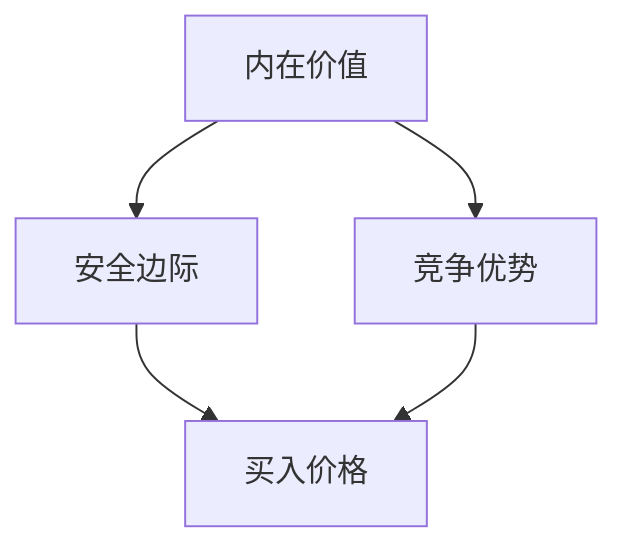
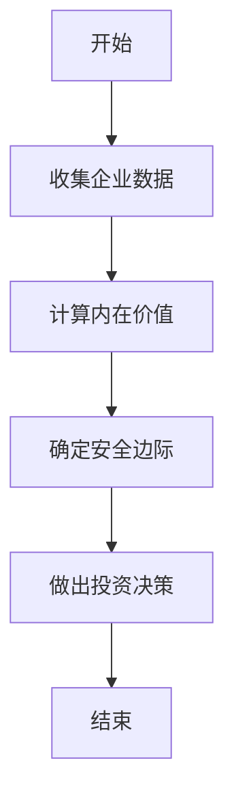
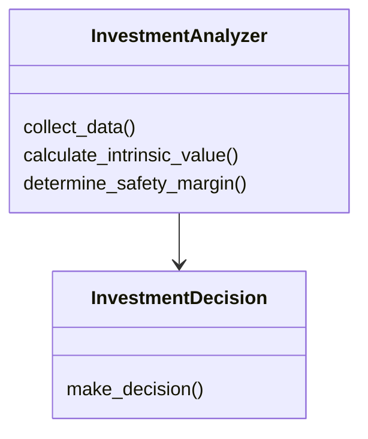
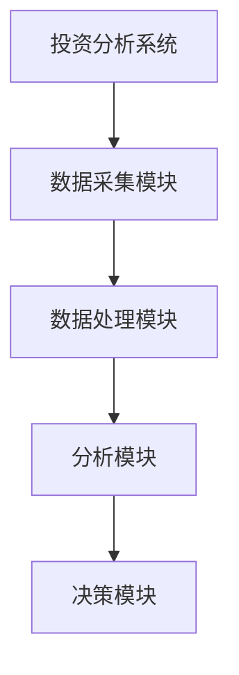
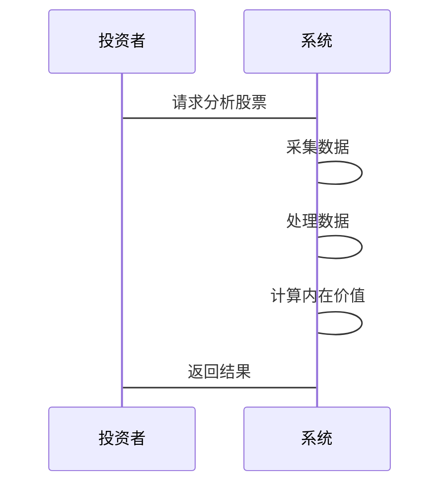

                 


# 格雷厄姆到巴菲特：价值投资理念的传承与发展

## 关键词：价值投资，格雷厄姆，巴菲特，投资策略，安全边际，内在价值

## 摘要：价值投资理念从格雷厄姆到巴菲特的发展历程，分析其核心思想、算法原理、系统架构和实战应用，揭示其在现代投资中的重要性。

---

## 第1章：价值投资的背景与起源

### 1.1 价值投资的背景与问题

在20世纪20年代，美国股市经历了繁荣与崩溃，投资者亟需稳定的投资策略。传统投资基于市场情绪和短期波动，缺乏可靠性和稳定性。1929年大萧条后，本杰明·格雷厄姆和戴维·多德提出价值投资理念，强调以低于内在价值的价格买入优质股票，注重安全边际和长期回报。

### 1.2 价值投资的核心思想

格雷厄姆的价值投资强调：
- **安全边际**：买入价格低于内在价值，确保投资的安全性。
- **内在价值**：通过基本面分析计算股票的真正价值。
- **长期视角**：关注企业的长期盈利能力，而非短期市场波动。

### 1.3 巴菲特对价值投资的传承与创新

沃伦·巴菲特继承并发展了格雷厄姆的价值投资理念，引入了：
- **护城河**：选择具有竞争优势的企业。
- **集中投资**：将资金集中在少数优质企业，提高回报率。
- **长期持有**：避免频繁交易，降低交易成本，享受复利效应。

---

## 第2章：价值投资的核心概念与联系

### 2.1 核心概念与联系

价值投资的核心概念包括：
- **内在价值**：股票的真正价值，不随市场波动而变化。
- **安全边际**：买入价格与内在价值的差距，提供风险缓冲。
- **竞争优势**：企业在市场中的独特优势，确保长期盈利能力。

### 2.2 核心概念对比表

| 概念         | 描述                                                                 |
|--------------|----------------------------------------------------------------------|
| 内在价值     | 股票的真正价值，基于企业未来现金流的现值。                         |
| 安全边际     | 购买价格低于内在价值，提供安全空间。                                 |
| 竞争优势     | 企业独特的竞争优势，如专利、品牌或成本优势。                       |

### 2.3 实体关系图



---

## 第3章：价值投资的算法原理

### 3.1 算法原理

价值投资的分析流程如下：



### 3.2 数学模型与公式

内在价值计算公式：

$$V = \frac{CF}{r - g}$$

其中，\( CF \) 是自由现金流，\( r \) 是折现率，\( g \) 是增长率。

### 3.3 Python代码示例

```python
def calculate_intrinsic_value(cash_flow, discount_rate, growth_rate):
    return cash_flow / (discount_rate - growth_rate)

# 示例
CF = 100
r = 0.1
g = 0.05
V = calculate_intrinsic_value(CF, r, g)
print(f"内在价值为: {V}")
```

---

## 第4章：系统分析与架构设计

### 4.1 问题场景介绍

投资者需要一个系统来分析股票的内在价值和安全边际，辅助投资决策。

### 4.2 系统功能设计



### 4.3 系统架构设计



### 4.4 系统接口与交互



---

## 第5章：项目实战

### 5.1 环境安装与准备

- **工具**：Python、Jupyter Notebook、数据抓取库（如requests、BeautifulSoup）
- **库**：pandas、numpy、scipy

### 5.2 核心实现与代码

```python
import pandas as pd
import numpy as np

def calculate_intrinsic_value(cash_flow, discount_rate, growth_rate):
    return cash_flow / (discount_rate - growth_rate)

# 示例数据
data = {'公司': ['公司A', '公司B'], '现金流': [100, 150], '折现率': [0.1, 0.12], '增长率': [0.05, 0.03]}
df = pd.DataFrame(data)

# 计算内在价值
df['内在价值'] = df.apply(lambda x: calculate_intrinsic_value(x['现金流'], x['折现率'], x['增长率']), axis=1)

print(df)
```

### 5.3 案例分析

以公司A为例，现金流为100，折现率为10%，增长率为5%：

$$V = \frac{100}{0.1 - 0.05} = 2000$$

若当前股价为1900，安全边际为100/2000=5%，具有投资价值。

---

## 第6章：最佳实践与小结

### 6.1 实战经验总结

- **关键点**：准确评估内在价值和安全边际，选择具有竞争优势的企业。
- **注意事项**：避免情绪化投资，定期复盘和调整。

### 6.2 拓展阅读

- 格雷厄姆的《证券分析》
- 巴菲特的《巴菲特致股东的信》
- 彼得·林奇的《选股的艺术》

---

## 附录：工具与资源

### 附录A：价值投资分析工具

- Python库：pandas、numpy
- 数据源：Yahoo Finance、Morningstar

### 附录B：相关书籍

- 《The Intelligent Investor》 by Benjamin Graham
- 《The Warren Buffett Way》 by Bruce Greenwald

### 附录C：术语表

- 内在价值：股票的真实价值，不随市场波动而变化。
- 安全边际：买入价格低于内在价值的部分，提供保护。

---

## 作者：AI天才研究院 & 禅与计算机程序设计艺术

---

这篇文章系统地介绍了价值投资的理念、算法、系统架构和实战应用，帮助读者全面理解并实践这一投资策略。

