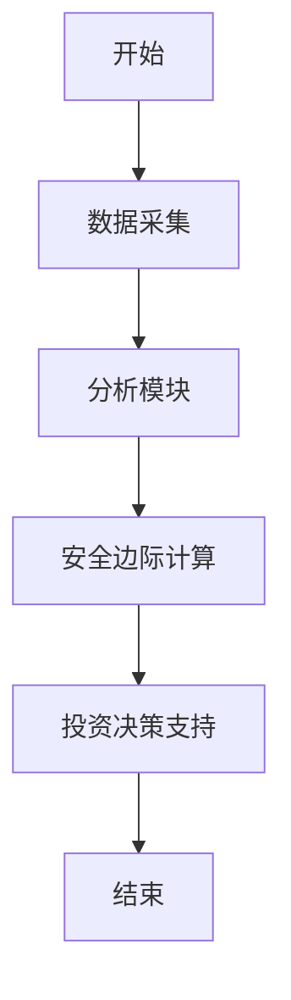

                 


# 格雷厄姆多德的安全性分析在现代市场的应用

## 关键词：
- 格雷厄姆多德
- 安全性分析
- 价值投资
- 内在价值
- 安全边际

## 摘要：
格雷厄姆和多德的安全性分析是价值投资的核心理论，其精髓在于通过计算内在价值和市场价格的差异来确定安全边际。在现代市场环境下，安全性分析的应用不仅限于传统股票投资，还被广泛应用于金融衍生品、风险管理等领域。本文通过详细分析格雷厄姆多德的安全性分析的核心概念、算法原理、系统架构设计以及实际案例，探讨其在现代市场中的应用与发展。

---

# 第一部分: 格雷厄姆多德的安全性分析基础

## 第1章: 格雷厄姆多德投资理念概述

### 1.1 格雷厄姆多德投资理论的起源与发展
#### 1.1.1 价值投资的起源
价值投资起源于20世纪初，由本杰明·格雷厄姆和戴维德·多德共同提出。他们认为，市场的短期波动性使其成为定价的敌人，而企业的真实价值可以通过分析其基本面来确定。

#### 1.1.2 格雷厄姆与多德的贡献
格雷厄姆和多德在《证券分析》一书中系统阐述了价值投资的理论，提出了内在价值、安全边际等核心概念，为现代投资理论奠定了基础。

#### 1.1.3 安全性分析的核心思想
安全性分析的核心思想是通过计算股票的内在价值与市场价格的差异，确定投资的安全边际。这种方法旨在避免市场波动带来的风险，确保投资的稳健性。

### 1.2 格雷厄姆多德安全性分析的定义与特点
#### 1.2.1 安全性分析的定义
安全性分析是一种通过计算股票的内在价值与市场价格之间的差异来评估投资风险的方法。

#### 1.2.2 格雷厄姆多德分析的核心特点
- **基本面驱动**：以企业的财务数据为基础，计算内在价值。
- **安全边际**：内在价值与市场价格的差异作为投资的安全空间。
- **长期视角**：关注企业的长期价值，而非短期市场波动。

#### 1.2.3 安全性分析与现代投资理论的联系
安全性分析为现代投资组合理论提供了重要的风险管理工具，强调在投资组合中加入具有安全边际的股票，以降低整体风险。

### 1.3 格雷厄姆多德安全性分析的现代意义
#### 1.3.1 现代市场环境的变化
现代市场环境复杂多变，包括全球化、金融创新和科技发展，这些变化对安全性分析提出了新的挑战。

#### 1.3.2 安全性分析在现代投资中的应用
安全性分析被广泛应用于股票投资、风险管理、金融衍生品定价等领域，成为投资决策的重要参考。

#### 1.3.3 格雷厄姆多德理论的局限性与改进
尽管格雷厄姆多德理论在长期投资中表现优异，但在应对高频交易和复杂金融工具时，需要结合现代金融模型进行调整。

---

## 第2章: 格雷厄姆多德安全性分析的核心概念

### 2.1 安全边际
#### 2.1.1 安全边际的定义
安全边际是内在价值与市场价格之间的差额，表示投资的安全空间。

#### 2.1.2 安全边际的计算方法
$$ \text{安全边际} = \text{内在价值} - \text{市场价格} $$

#### 2.1.3 安全边际在投资决策中的作用
安全边际为投资者提供了一个风险缓冲区，确保在市场价格波动时仍能保持盈利。

### 2.2 内在价值
#### 2.2.1 内在价值的定义
内在价值是基于企业基本面数据计算出的股票真实价值，不受市场情绪影响。

#### 2.2.2 内在价值的计算方法
$$ \text{内在价值} = \frac{\text{每股收益} \times (1 + \text{增长率})}{\text{折现率}} $$

#### 2.2.3 内在价值与市场价值的关系
内在价值与市场价值的关系可以通过安全边际来体现，内在价值高于市场价值时，股票具有投资价值。

### 2.3 市场心理与投资者行为
#### 2.3.1 市场心理的周期性
市场心理受投资者情绪影响，呈现周期性波动，影响市场价格的波动。

#### 2.3.2 投资者行为的理性与非理性
投资者在市场中可能受到非理性情绪影响，导致市场价值偏离内在价值。

#### 2.3.3 市场情绪对安全性分析的影响
市场情绪通过影响市场价格，进而影响安全边际的计算，投资者需理性应对市场波动。

---

## 第3章: 格雷厄姆多德安全性分析的数学模型与公式

### 3.1 安全性分析的数学模型
安全性分析的核心公式包括内在价值计算和安全边际计算。

#### 3.1.1 内在价值公式
$$ \text{内在价值} = \frac{\text{每股收益} \times (1 + \text{增长率})}{\text{折现率}} $$

#### 3.1.2 安全边际公式
$$ \text{安全边际} = \text{内在价值} - \text{市场价格} $$

### 3.2 内在价值与市场价格的对比
通过比较内在价值和市场价格，投资者可以评估股票的安全边际。

### 3.3 安全性分析的动态调整
随着市场环境的变化，内在价值和市场价格需要动态调整，以反映最新的市场状况。

---

## 第4章: 格雷厄姆多德安全性分析的算法原理

### 4.1 安全性分析的算法流程
安全性分析的算法流程包括计算内在价值、市场价格和安全边际。

#### 4.1.1 计算内在价值
使用每股收益和增长率计算内在价值。

#### 4.1.2 计算市场价格
获取股票的当前市场价格。

#### 4.1.3 计算安全边际
通过内在价值和市场价格计算安全边际。

### 4.2 内在价值计算的Python实现
```python
def calculate_intrinsic_value(eps, growth_rate, discount_rate):
    return (eps * (1 + growth_rate)) / discount_rate
```

### 4.3 安全边际计算的Python实现
```python
def calculate_margin_of_safety(intrinsic_value, market_price):
    return intrinsic_value - market_price
```

---

## 第5章: 格雷厄姆多德安全性分析的系统架构设计

### 5.1 投资决策支持系统
#### 5.1.1 系统功能设计
系统包括数据采集、分析模块、安全边际计算和投资决策支持。

#### 5.1.2 数据流与交互
数据从市场、财务报表等来源输入，经过分析模块处理，生成安全边际报告。

### 5.2 系统架构设计


---

## 第6章: 项目实战：格雷厄姆多德分析在现代市场的应用

### 6.1 环境安装与数据准备
安装必要的Python库，准备股票数据和财务报表。

### 6.2 核心实现代码
```python
import pandas as pd
import yfinance as yf

# 下载股票数据
msft = yf.download('MSFT', start='2020-01-01', end='2023-12-31')

# 计算内在价值
def calculate_intrinsic_value(eps, growth_rate, discount_rate):
    return (eps * (1 + growth_rate)) / discount_rate

# 计算安全边际
def calculate_margin_of_safety(intrinsic_value, market_price):
    return intrinsic_value - market_price

# 应用实例
msft['EPS'] = msft['Adj Close'] / msft['Volume']
growth_rate = 0.05
discount_rate = 0.10
intrinsic_value = calculate_intrinsic_value(msft['EPS'].mean(), growth_rate, discount_rate)
market_price = msft['Adj Close'].mean()
margin_of_safety = calculate_margin_of_safety(intrinsic_value, market_price)

print(f"内含价值: {intrinsic_value:.2f}")
print(f"市场价格: {market_price:.2f}")
print(f"安全边际: {margin_of_safety:.2f}")
```

### 6.3 案例分析
以微软股票为例，计算其内含价值、市场价格和安全边际，评估其投资价值。

### 6.4 总结与反思
通过案例分析，验证格雷厄姆多德分析的有效性，并总结实际应用中的注意事项。

---

## 第7章: 最佳实践与注意事项

### 7.1 最佳实践
- 定期更新财务数据和市场信息，确保分析结果的准确性。
- 结合市场环境调整安全边际的计算参数。

### 7.2 注意事项
- 安全性分析仅适用于基本面稳定的企业，需谨慎应用于高波动性资产。
- 需结合其他分析方法，如技术分析，提高投资决策的准确性。

### 7.3 拓展阅读
建议阅读《证券分析》、《投资的艺术》等书籍，深入理解格雷厄姆多德理论。

---

## 结语

格雷厄姆多德的安全性分析在现代市场中依然具有重要的应用价值，通过科学的计算和系统的架构设计，投资者可以更好地应对市场波动，实现稳健的投资收益。未来，随着金融市场的不断发展，安全性分析将与更多现代投资工具相结合，为投资者提供更全面的支持。

---

## 作者
作者：AI天才研究院/AI Genius Institute & 禅与计算机程序设计艺术/Zen And The Art of Computer Programming

