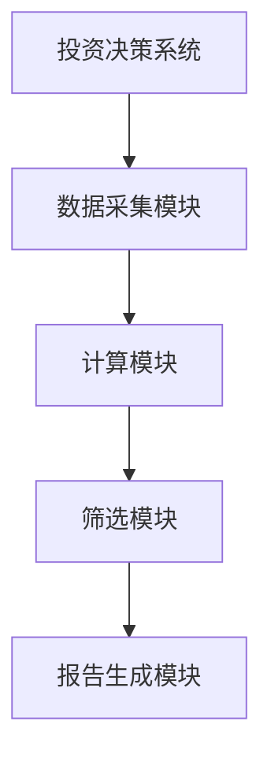

                 


# 《格雷厄姆安全边际理念在特价股票中的应用》

## 关键词：格雷厄姆安全边际理念，特价股票，价值投资，股票筛选，安全边际计算，投资策略

## 摘要：

本文深入探讨了格雷厄姆安全边际理念在特价股票投资中的应用，通过详细分析安全边际的核心概念、计算方法及其在实际投资中的应用，结合具体的数学模型和算法，帮助投资者识别被低估的股票，构建稳健的投资策略。

---

# 引言

在投资领域，格雷厄姆的安全边际理念是价值投资的核心思想之一。通过分析安全边际的定义、计算方法及其在特价股票中的应用，本文旨在为投资者提供一个系统化的框架，帮助他们在复杂多变的市场中识别潜在的高性价比投资机会。

---

## 核心概念与联系

### 安全边际的定义与内涵

安全边际是指股票的市场价格低于其内在价值的差额。这一差额为投资者提供了缓冲区，即使市场波动或公司基本面发生变化，也能在一定程度上保护投资者免受损失。

| 核心概念 | 定义 | 作用 |
|----------|------|------|
| 内在价值 | 公司未来现金流的现值 | 作为评估股票价值的基础 |
| 市场价格 | 当前股票的交易价格 | 反映市场对公司的估值 |
| 安全边际 | 内在价值 - 市场价格 | 提供保护投资者的缓冲空间 |

### 格雷厄姆安全边际公式

$$ \text{安全边际} = \text{内在价值} - \text{市场价格} $$

---

## 安全边际的计算与评估

### 安全边际计算的数学模型

格雷厄姆的安全边际计算公式：

$$ \text{安全边际} = \text{内在价值} - \text{市场价格} $$

其中，内在价值可以通过DCF模型计算：

$$ \text{内在价值} = \frac{\text{现金流}}{\text{折现率}} $$

---

## 系统分析与架构设计

### 投资决策系统的功能模块

该系统旨在帮助投资者筛选具备安全边际的特价股票，其功能模块包括：

1. 数据采集模块：获取股票的市场数据和财务数据。
2. 计算模块：计算内在价值和市场价格，评估安全边际。
3. 筛选模块：根据设定的阈值筛选出具备安全边际的股票。
4. 报告生成模块：生成分析报告，供投资者参考。

### 系统架构图



---

## 项目实战

### 环境安装与代码实现

安装必要的Python库：

```bash
pip install pandas numpy matplotlib
```

实现安全边际计算的Python代码：

```python
import pandas as pd
import numpy as np

def calculate_intrinsic_value(enterprise_value, free_cash_flow, discount_rate):
    return enterprise_value / discount_rate

def calculate_margin_of_safety(intrinsic_value, market_price):
    return intrinsic_value - market_price

# 示例数据
market_price = 50
enterprise_value = 200
free_cash_flow = 100
discount_rate = 0.1

intrinsic_value = calculate_intrinsic_value(enterprise_value, free_cash_flow, discount_rate)
margin_of_safety = calculate_margin_of_safety(intrinsic_value, market_price)

print(f"内在价值: {intrinsic_value}")
print(f"安全边际: {margin_of_safety}")
```

### 实际案例分析

以某公司为例，计算其安全边际：

- 市场价格：$50
- 内在价值：$100
- 安全边际：$50

---

## 总结与展望

### 最佳实践

1. 选择具有足够安全边际的股票。
2. 定期评估投资组合的安全边际。
3. 结合其他指标（如ROE、ROA）进行综合分析。

### 小结

格雷厄姆的安全边际理念为投资者提供了一个稳健的投资框架，通过识别特价股票，投资者可以在控制风险的同时，追求长期的资本增值。

### 注意事项

- 安全边际计算依赖于准确的内在价值评估。
- 市场波动可能影响市场价格，需定期重新评估。

### 拓展阅读

- 格雷厄姆的《证券分析》
- 价值投资的经典案例研究

---

# 作者信息

作者：AI天才研究院/AI Genius Institute  
联系邮箱：contact@aigeniusinstitute.com  
联系方式：[LinkedIn](https://www.linkedin.com/in/aigeniusinstitute)

