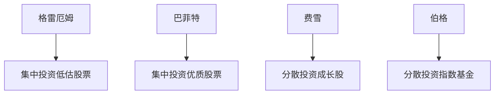
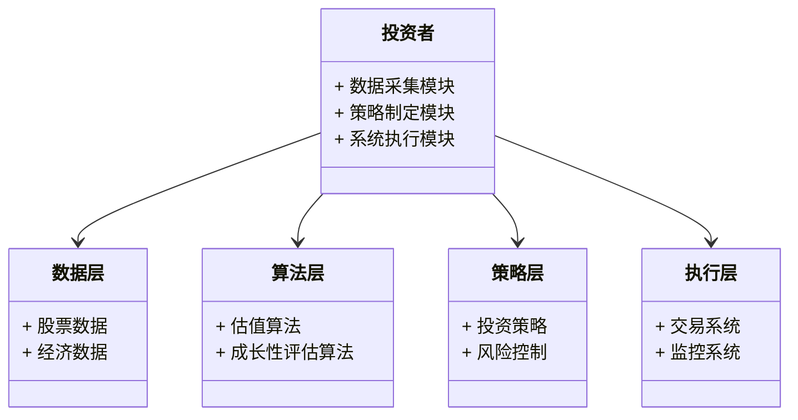
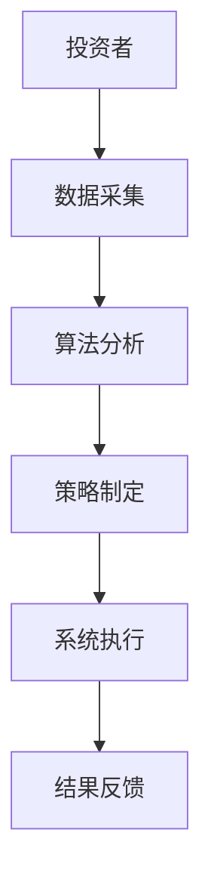

                 


# 格雷厄姆、巴菲特、费雪和伯格投资理念的比较与融合

> 关键词：投资理念，格雷厄姆，巴菲特，费雪，伯格，价值投资，成长股投资，指数投资

> 摘要：本文将详细介绍格雷厄姆、巴菲特、费雪和伯格四位投资大师的投资理念，并通过比较分析，探讨如何将这些理念融合，制定出更加科学和高效的投资策略。文章将从背景介绍、核心概念对比、算法原理、系统架构设计、项目实战等多方面展开，为投资者提供全面的指导。

---

## 第一部分：投资理念的背景与基础

### 第1章：格雷厄姆、巴菲特、费雪和伯格的背景介绍

#### 1.1 格雷厄姆的生平与贡献

##### 1.1.1 格雷厄姆的生平简介
本杰明·格雷厄姆（Benjamin Graham），被誉为“价值投资之父”，出生于1894年，逝世于1976年。他是20世纪最伟大的投资理论家之一，曾就读于哥伦比亚大学，并在华尔街从事证券交易工作。他的投资理念深刻影响了后来的多位投资大师，包括巴菲特。

##### 1.1.2 格雷厄姆的投资理念核心
格雷厄姆的核心理念是“安全边际”，即买入价格远低于其内在价值的股票。他认为市场先生是疯狂的，股票价格经常偏离其真实价值，这为理性投资者提供了套利机会。

##### 1.1.3 格雷厄姆的著作与影响
格雷厄姆的著作《证券分析》和《聪明的投资者》是投资领域的经典之作，尤其是《股票作手回忆录》（虽非他所著，但深受其影响）成为投资者必读的书籍。

#### 1.2 巴菲特的生平与贡献

##### 1.2.1 巴菲特的生平简介
沃伦·巴菲特（Warren Buffett），生于1934年，是全球最著名的职业投资者之一。他毕业于哥伦比亚大学，师从格雷厄姆，后创立了伯克希尔·哈撒韦公司，并成为世界首富。

##### 1.2.2 巴菲特投资理念的深化与发展
巴菲特继承并发展了格雷厄姆的价值投资理念，提出了“护城河”概念，即企业必须具备竞争优势，能够在长期内保持高利润率。

##### 1.2.3 巴菲特的著作与影响
巴菲特的《巴菲特致股东的信》是其投资理念的集大成之作，他的思想被广泛传播和学习。

#### 1.3 费雪的生平与贡献

##### 1.3.1 费雪的生平简介
菲利普·费雪（Philip Fisher），生于1907年，逝于2004年，被誉为“成长股之父”。他与巴菲特齐名，是20世纪最伟大的投资者之一。

##### 1.3.2 费雪的投资理念核心
费雪专注于成长股投资，认为企业的成长性是最重要的因素，寻找那些收入和利润能够持续增长的企业。

##### 1.3.3 费雪的著作与影响
费雪的《投资常识》是其投资理念的总结，他的思想影响了一代成长股投资者。

#### 1.4 伯格的生平与贡献

##### 1.4.1 伯格的生平简介
约翰·伯格（John Bogle），生于1934年，逝于2011年，是指数基金的创始人。他是 Vanguard 集团的创始人，致力于为普通投资者提供低成本投资工具。

##### 1.4.2 伯格的投资理念核心
伯格主张通过指数基金进行分散投资，认为市场是不可预测的，低成本和分散化是实现长期收益的最佳方式。

##### 1.4.3 伯格的著作与影响
伯格的《投资的革命》详细阐述了指数投资的理念，他的思想深刻影响了现代投资组合理论。

#### 1.5 本章小结
本章介绍了四位投资大师的生平及其核心理念，为后续的比较分析奠定了基础。

---

### 第2章：格雷厄姆、巴菲特、费雪和伯格的投资理念详解

#### 2.1 格雷厄姆的价值投资理念

##### 2.1.1 格雷厄姆的价值投资定义
价值投资是指以低于内在价值的价格买入股票，并长期持有，等待价格回归其真实价值。

##### 2.1.2 格雷厄姆的安全边际理论
安全边际 = 内在价值 - 购买价格，确保在市场波动中不会出现重大损失。

##### 2.1.3 格雷厄姆的买入策略
买入股票时，重点关注企业的财务状况，如低市盈率、低市净率、高股息率等。

#### 2.2 巴菲特的价值投资深化

##### 2.2.1 巴菲特的“企业护城河”理论
企业护城河是指企业竞争优势的持久性，如品牌优势、成本优势、技术壁垒等。

##### 2.2.2 巴菲特的长期投资策略
巴菲特强调长期持有优质股票，避免频繁交易，降低交易成本。

##### 2.2.3 巴菲特的合伙人制度
通过合伙制将利益与投资者绑定，确保长期稳定的合作关系。

#### 2.3 费雪的成长股投资策略

##### 2.3.1 费雪的成长股定义
成长股是指那些收入和利润能够持续增长，并且增速远高于行业平均水平的股票。

##### 2.3.2 费雪的内在价值评估
内在价值 = 未来现金流的现值，关注企业的成长性和盈利能力。

##### 2.3.3 费雪的选股标准
寻找那些管理层优秀、行业地位稳固、成长性显著的企业。

#### 2.4 伯格的指数投资法

##### 2.4.1 伯格的指数投资定义
指数投资是指通过投资指数基金，获得市场的平均收益。

##### 2.4.2 伯格的低成本分散投资策略
通过分散投资降低风险，同时保持低成本，以提高长期收益。

##### 2.4.3 伯格的长期持有理念
长期持有指数基金，避免频繁交易，获得市场的长期上涨收益。

#### 2.5 本章小结
本章详细阐述了四位大师的投资理念，突出了各自的核心思想和策略。

---

## 第三部分：投资理念的比较与融合

### 第3章：四位投资理念的比较与分析

#### 3.1 格雷厄姆与巴菲特的比较

##### 3.1.1 核心理念的异同
格雷厄姆的价值投资强调安全边际，巴菲特进一步强调企业的竞争优势。

##### 3.1.2 投资策略的差异
格雷厄姆注重估值，巴菲特注重企业的护城河。

##### 3.1.3 适用场景的分析
格雷厄姆适合市场估值低的时候，巴菲特适合企业具备强大竞争优势的时候。

#### 3.2 巴菲特与费雪的比较

##### 3.2.1 核心理念的异同
巴菲特注重价值和护城河，费雪注重成长性和未来盈利能力。

##### 3.2.2 投资策略的差异
巴菲特倾向于集中投资，费雪倾向于分散投资成长股。

##### 3.2.3 适用场景的分析
巴菲特适合长期稳定的市场，费雪适合成长型企业较多的市场。

#### 3.3 费雪与伯格的比较

##### 3.3.1 核心理念的异同
费雪注重成长股的长期潜力，伯格注重分散投资和市场平均收益。

##### 3.3.2 投资策略的差异
费雪倾向于主动选股，伯格倾向于被动投资指数基金。

##### 3.3.3 适用场景的分析
费雪适合市场中有大量成长型企业的时候，伯格适合市场波动较大时。

#### 3.4 格雷厄姆与伯格的比较

##### 3.4.1 核心理念的异同
格雷厄姆注重安全边际和低估股票，伯格注重分散投资和市场平均收益。

##### 3.4.2 投资策略的差异
格雷厄姆倾向于集中投资低估股票，伯格倾向于分散投资指数基金。

##### 3.4.3 适用场景的分析
格雷厄姆适合市场估值低的时候，伯格适合市场波动较大时。

#### 3.5 四位投资理念的综合比较

##### 3.5.1 核心观点对比表
| 投资者 | 核心理念 | 投资策略 | 适用场景 |
|--------|----------|----------|----------|
| 格雷厄姆 | 安全边际 | 集中投资低估股票 | 市场估值低时 |
| 巴菲特 | 企业护城河 | 集中投资优质股票 | 企业竞争优势明显时 |
| 费雪 | 成长股 | 分散投资成长股 | 市场中有大量成长型企业时 |
| 伯格 | 指数投资 | 分散投资指数基金 | 市场波动大时 |

##### 3.5.2 投资策略对比图


---

### 第4章：四位投资理念的融合策略

#### 4.1 动态调整投资组合

##### 4.1.1 根据市场环境调整策略
在市场估值低时，增加格雷厄姆和巴菲特的理念；在市场估值高时，增加费雪和伯格的理念。

##### 4.1.2 根据个人风险偏好调整
风险厌恶型投资者可以增加伯格的指数投资；风险承受能力强的投资者可以增加巴菲特和费雪的策略。

#### 4.2 风险控制与长期投资

##### 4.2.1 风险控制
通过分散投资和设置止损点，降低投资风险。

##### 4.2.2 长期投资策略
坚持长期持有，避免短期波动的影响。

#### 4.3 融合策略的具体实施步骤

##### 4.3.1 步骤一：评估市场环境
分析当前市场估值、企业盈利情况和经济周期。

##### 4.3.2 步骤二：制定投资策略
根据市场环境和个人风险偏好，制定相应的投资策略。

##### 4.3.3 步骤三：执行投资策略
根据策略进行投资，并定期调整投资组合。

---

## 第五部分：系统架构与实战应用

### 第5章：系统架构设计与实现

#### 5.1 投资决策系统设计

##### 5.1.1 系统功能设计


##### 5.1.2 系统架构设计


#### 5.2 项目实战

##### 5.2.1 环境安装
需要安装Python、Pandas、NumPy等数据分析工具，以及Matplotlib或Seaborn用于数据可视化。

##### 5.2.2 核心代码实现
```python
import pandas as pd
import numpy as np

# 示例：计算内在价值（简化版）
def calculate_intrinsic_value(price, growth_rate, required_return):
    return price * (1 + growth_rate) / (1 + required_return)

# 示例：评估企业护城河（简化版）
def assess护城河(revenue_growth, profit_margin):
    if revenue_growth > 10 and profit_margin > 20:
        return "宽"
    elif revenue_growth > 5 and profit_margin > 15:
        return "中"
    else:
        return "窄"

# 示例：指数基金配置
def index_fund_allocation(portfolio_value, allocation_ratio):
    return portfolio_value * allocation_ratio
```

##### 5.2.3 实际案例分析
假设当前市场估值为15倍PE，企业A的PE为10，企业B的PE为25，指数基金的预期收益为7%。投资者的风险承受能力中等，投资期限为5年。根据市场环境，投资者可以选择集中投资企业A（格雷厄姆策略）和指数基金，同时适当配置成长股（费雪策略）。

---

### 第6章：总结与最佳实践

#### 6.1 总结
通过比较分析，我们可以发现，四位大师的投资理念各有侧重，但又相互补充。将这些理念结合起来，可以制定出更加灵活和高效的投资策略。

#### 6.2 最佳实践 tips

##### 6.2.1 灵活调整
根据市场环境和个人情况，灵活调整投资策略。

##### 6.2.2 风险控制
通过分散投资和风险控制，降低投资风险。

##### 6.2.3 长期投资
坚持长期投资，避免短期波动的影响。

#### 6.3 拓展阅读
推荐阅读《证券分析》（格雷厄姆）、《巴菲特致股东的信》（巴菲特）、《投资常识》（费雪）和《投资的革命》（伯格）。

---

## 作者

作者：AI天才研究院/AI Genius Institute & 禅与计算机程序设计艺术/Zen And The Art of Computer Programming

---

以上是《格雷厄姆、巴菲特、费雪和伯格投资理念的比较与融合》的文章大纲和部分具体内容。希望这篇文章能为投资者提供有价值的参考和启发。

