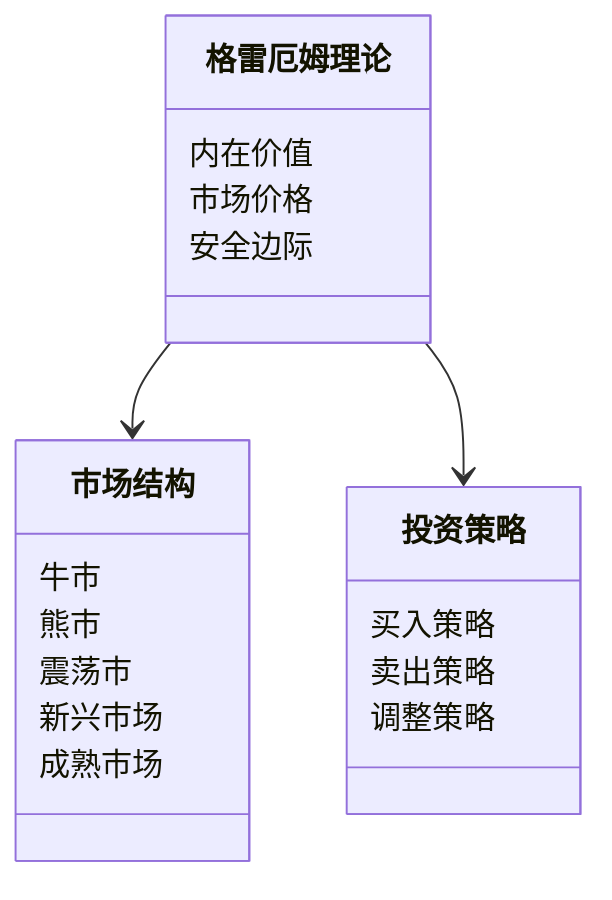
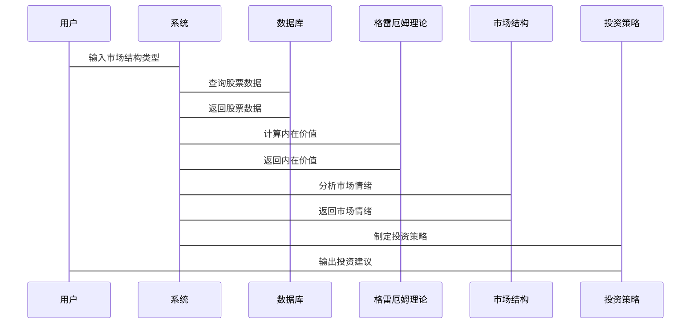

                 


# 格雷厄姆特价股票理论在不同市场结构中的效果

> 关键词：格雷厄姆特价股票理论, 市场结构, 价值投资, 安全边际, 内在价值

> 摘要：格雷厄姆的特价股票理论是价值投资的重要基石，该理论强调通过寻找市场价格低于内在价值的股票来实现长期收益。本文系统分析了格雷厄姆理论在不同市场结构中的效果，包括牛市、熊市、震荡市、新兴市场和成熟市场的差异，并结合数学模型和实际案例，深入探讨了理论的应用和调整策略。通过构建分析框架和实战案例，本文为投资者提供了在不同市场环境下应用格雷厄姆理论的有效指导。

---

# 第一部分: 格雷厄姆特价股票理论的背景与基础

## 第1章: 格雷厄姆特价股票理论概述

### 1.1 价值投资的起源与发展

#### 1.1.1 价值投资的核心理念
- 价值投资是一种基于股票内在价值的投资策略，强调以低于内在价值的价格买入股票。
- 格雷厄姆的学生彼得·林奇进一步发展了这一理论，使其更加系统化。

#### 1.1.2 格雷厄姆的贡献与影响
- 格雷厄姆被誉为“价值投资之父”，其著作《证券分析》奠定了价值投资的理论基础。
- 格雷厄姆的学生包括沃伦·巴菲特，他将格雷厄姆的理论发扬光大。

#### 1.1.3 特价股票理论的定义与目标
- 特价股票理论的核心是寻找市场价格低于内在价值的股票。
- 目标是通过长期持有这些股票，实现超越市场平均收益的投资回报。

### 1.2 市场结构的基本概念

#### 1.2.1 市场结构的分类
- 牛市：市场整体呈现上涨趋势，投资者情绪乐观。
- 熊市：市场整体呈现下跌趋势，投资者情绪悲观。
- 震荡市：市场波动较大，缺乏明确趋势。
- 新兴市场：市场波动剧烈，信息不透明。
- 成熟市场：市场波动较小，信息透明，监管完善。

#### 1.2.2 不同市场结构的特点
- 牛市：股票价格被高估的可能性较大，但优质股票仍有机会。
- 熊市：股票价格被低估的可能性较大，是价值投资者的机会。
- 震荡市：需要灵活调整策略，寻找结构性机会。
- 新兴市场：波动性高，但成长性好。
- 成熟市场：波动性低，价值投资更易实施。

#### 1.2.3 市场结构对投资策略的影响
- 牛市：价值投资者需要更加谨慎，避免被高估的股票影响。
- 熊市：价值投资者可以寻找被低估的股票，进行买入布局。
- 震荡市：需要结合技术分析和基本面分析，寻找短期和长期的机会。
- 新兴市场：需要关注公司的成长性和行业前景。
- 成熟市场：需要关注公司的财务健康和行业地位。

---

## 第2章: 格雷厄姆特价股票理论的核心概念

### 2.1 安全边际

#### 2.1.1 安全边际的定义
- 安全边际是指股票的市场价格低于其内在价值的部分。
- 安全边际越大，投资风险越小，回报潜力越大。

#### 2.1.2 安全边际的计算方法
- 安全边际 = 内在价值 - 市场价格

#### 2.1.3 安全边际在投资中的作用
- 降低投资风险，避免因市场波动导致的短期损失。
- 提高投资回报，确保在市场波动中获得超额收益。

### 2.2 内在价值的评估

#### 2.2.1 内在价值的定义
- 内在价值是股票在未来现金流的现值。
- 内在价值不受市场波动的影响，是股票的真正价值。

#### 2.2.2 内在价值的计算方法
- 现金流折现模型：将未来现金流折现，计算现值。
- 市盈率与市净率分析：通过市盈率和市净率比较，评估股票的价值。

#### 2.2.3 内在价值与市场价值的对比
- 内在价值是股票的真正价值，市场价值是股票的市场价格。
- 当市场价格低于内在价值时，股票具有投资价值。

### 2.3 市场情绪与投资者行为

#### 2.3.1 市场情绪的周期性
- 市场情绪具有周期性，从乐观到悲观，再到乐观。
- 市场情绪的周期性影响股票的市场价格。

#### 2.3.2 投资者行为的理性与非理性
- 投资者行为受情绪影响，常常表现出非理性特征。
- 非理性行为导致市场波动，为价值投资者提供机会。

#### 2.3.3 市场情绪对股票定价的影响
- 乐观情绪导致股票价格高估。
- 悲观情绪导致股票价格低估。

---

## 第3章: 格雷厄姆特价股票理论的数学模型与公式

### 3.1 内在价值的计算公式

#### 3.1.1 现金流折现模型
$$ \text{内在价值} = \sum_{t=1}^{n} \frac{\text{现金流}_t}{(1 + r)^t} $$
其中，$r$ 是折现率，$n$ 是预测年数。

#### 3.1.2 市盈率与市净率分析
- 市盈率 = 股价 / 每股收益
- 市净率 = 股价 / 每股净资产

#### 3.1.3 股息率与股息增长模型
$$ \text{股息率} = \frac{\text{股息}}{\text{股价}} $$
$$ \text{股息增长模型} = \frac{\text{股息}_0 \times (1 + g)}{r - g} $$
其中，$g$ 是股息增长率，$r$ 是贴现率。

### 3.2 安全边际的量化方法

#### 3.2.1 安全边际的计算公式
$$ \text{安全边际} = \text{内在价值} - \text{市场价格} $$

#### 3.2.2 安全边际的量化指标
- 安全边际率 = (内在价值 - 市场价格) / 市场价格
- 安全边际率越高，投资风险越小。

### 3.3 内在价值与市场价值的对比

#### 3.3.1 市场价值的波动性
- 市场价值受情绪影响，波动性较大。
- 市场价值与内在价值的差异为投资机会。

#### 3.3.2 内在价值的稳定性
- 内在价值受公司基本面影响，波动性较小。
- 内在价值是股票的真正价值，不受市场情绪影响。

---

## 第4章: 格雷厄姆特价股票理论的系统分析与架构设计

### 4.1 问题场景介绍
- 格雷厄姆理论在不同市场结构中的应用效果。
- 不同市场结构下的投资策略调整。

### 4.2 系统功能设计

#### 4.2.1 领域模型


### 4.3 系统架构设计

#### 4.3.1 系统架构图
```mermaid
architecturalDiagram
    System {
        格雷厄姆理论
        市场结构
        投资策略
    }
```

### 4.4 系统接口设计

#### 4.4.1 系统接口
- 输入：市场结构类型、股票数据。
- 输出：投资策略建议。

### 4.5 系统交互设计

#### 4.5.1 系统交互图


---

## 第5章: 格雷厄姆特价股票理论的项目实战

### 5.1 环境安装

#### 5.1.1 系统环境
- 操作系统：Windows 10 或 macOS 10.15
- Python版本：Python 3.8 或更高
- 依赖库：Pandas, NumPy, Matplotlib, Scikit-learn

### 5.2 核心实现源代码

#### 5.2.1 格雷厄姆理论实现
```python
def calculate_intrinsic_value(cash_flows, discount_rate):
    intrinsic_value = 0
    for year, cash_flow in enumerate(cash_flows):
        intrinsic_value += cash_flow / (1 + discount_rate) ** (year + 1)
    return intrinsic_value

def calculate_margin_of_safety(intrinsic_value, market_price):
    return intrinsic_value - market_price
```

#### 5.2.2 市场结构分析
```python
def analyze_market_structure(market_data):
    # 示例分析牛市和熊市
    if market_data['指数'].mean() > market_data['指数'].quantile(0.75):
        return "牛市"
    elif market_data['指数'].mean() < market_data['指数'].quantile(0.25):
        return "熊市"
    else:
        return "震荡市"
```

### 5.3 实际案例分析

#### 5.3.1 历史牛市案例
- 2009年-2020年牛市：格雷厄姆理论在牛市中的应用。
- 2020年新冠疫情后的反弹：价值投资者的机会。

#### 5.3.2 新兴市场案例
- 中国股市：新兴市场的波动性和成长性。
- 印度股市：新兴市场的行业增长。

### 5.4 代码应用解读与分析
- 使用Python代码实现格雷厄姆理论的计算和市场结构分析。
- 通过实际案例分析，验证理论在不同市场结构中的效果。

---

## 第6章: 格雷厄姆特价股票理论的总结与展望

### 6.1 总结
- 格雷厄姆特价股票理论是价值投资的重要基石。
- 不同市场结构下，理论的应用效果有所不同。
- 通过系统分析和实际案例，验证了理论的有效性和适应性。

### 6.2 展望
- 结合其他投资理论和技术分析，进一步优化投资策略。
- 在新兴市场和成熟市场中，进一步研究理论的应用效果。
- 利用大数据和人工智能技术，提高理论的应用效率和准确性。

---

作者：AI天才研究院/AI Genius Institute & 禅与计算机程序设计艺术 /Zen And The Art of Computer Programming

