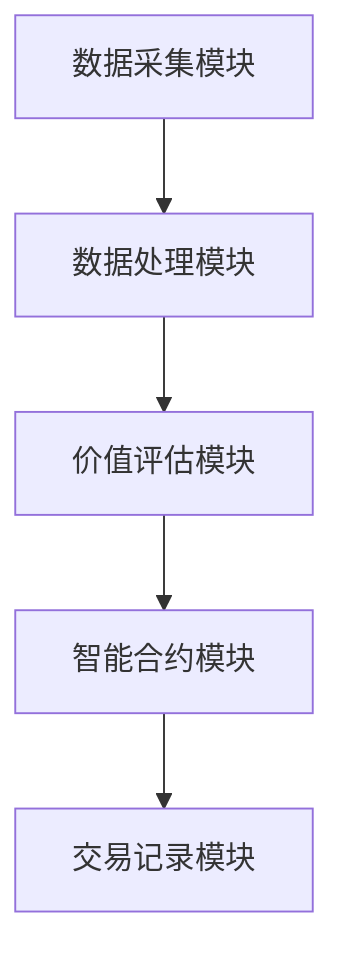
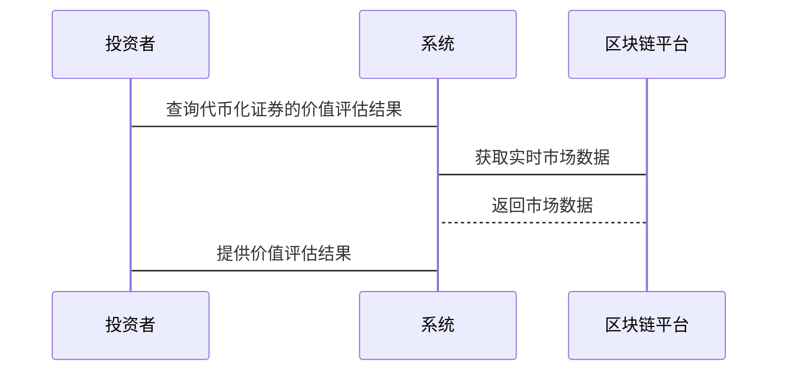

                 


# 格雷厄姆特价股票理论在代币化证券中的运用

> 关键词：格雷厄姆投资理论，代币化证券，价值投资，安全边际，区块链技术，智能合约

> 摘要：本文将探讨格雷厄姆价值投资理论在代币化证券中的应用，分析如何将传统股票投资策略与现代区块链技术相结合，以实现更高效、更安全的证券交易和投资。

---

## 第一部分: 格雷厄姆投资理论与代币化证券的背景介绍

### 第1章: 格雷厄姆投资理论概述

#### 1.1 格雷厄姆投资理论的核心概念
格雷厄姆价值投资理论是现代投资学的重要基石，其核心理念是寻找市场价格低于其内在价值的证券进行投资。以下是格雷厄姆理论的关键点：

- **安全边际**：格雷厄姆强调在投资时，市场价格应显著低于内在价值，以确保投资的安全性。
- **低市盈率与低市净率**：格雷厄姆倾向于投资市盈率和市净率较低的股票，认为这些股票更有可能被市场低估。
- **价值评估**：格雷厄姆提出了多种方法来评估证券的内在价值，包括股息贴现模型和资产重置价值评估。

#### 1.2 格雷厄姆投资理论的数学模型
格雷厄姆的价值评估方法可以用以下公式表示：
$$
\text{内在价值} = \text{股息} \times (1 + \text{增长率})^{-1}
$$

### 第2章: 代币化证券的基本概念

#### 2.1 代币化证券的定义与特征
代币化证券是指通过区块链技术将传统证券（如股票、债券等）数字化，使其以代币形式存在于区块链上。以下是代币化证券的主要特征：

- **可分割性**：代币化证券可以被分割成更小的单位，提高流动性。
- **透明性**：区块链技术确保了代币化证券的交易记录公开、透明。
- **智能合约**：代币化证券可以通过智能合约自动执行交易和结算，减少中间人和交易成本。

#### 2.2 代币化证券的优势与挑战
- **优势**：
  - 提高交易效率
  - 降低交易成本
  - 增强透明度和信任
- **挑战**：
  - 技术复杂性
  - 法律与监管不确定性
  - 市场波动性

---

## 第二部分: 格雷厄姆理论在代币化证券中的核心概念与联系

### 第3章: 格雷厄姆理论与代币化证券的核心概念

#### 3.1 格雷厄姆理论的核心要素
格雷厄姆理论在代币化证券中的应用需要考虑以下要素：

- **安全边际**：确保代币化证券的市场价格显著低于其内在价值。
- **低市盈率与低市净率**：选择市盈率和市净率较低的代币化证券进行投资。
- **内在价值评估**：利用格雷厄姆的估值方法对代币化证券进行价值评估。

#### 3.2 代币化证券的核心属性
代币化证券的核心属性包括：

- **流动性**：代币化证券可以通过区块链技术实现高流动性。
- **透明度**：区块链技术确保了代币化证券的交易记录公开可查。
- **可编程性**：智能合约可以实现自动化的交易和结算。

### 第4章: 格雷厄姆理论与代币化证券的联系

#### 4.1 格雷厄姆理论在代币化证券中的适用性分析
格雷厄姆理论的核心理念是寻找被低估的证券，这与代币化证券的特点高度契合。代币化证券的透明性和可分割性使其更容易被低估，同时也为投资者提供了更多的分析数据。

#### 4.2 格雷厄姆理论与代币化证券的对比分析
以下是格雷厄姆理论与代币化证券的对比分析：

| 对比维度       | 格雷厄姆理论                        | 代币化证券                              |
|----------------|------------------------------------|----------------------------------------|
| 投资对象       | 传统股票、债券等                   | 数字化证券，基于区块链技术             |
| 交易方式       | 传统交易所交易                     | 区块链上的智能合约交易                 |
| 透明度         | 较低                              | 高，基于区块链技术                      |
| 成本           | 较高，涉及中介费用                 | 较低，智能合约减少中间人                |

---

## 第三部分: 格雷厄姆理论在代币化证券中的算法原理与数学模型

### 第5章: 格雷厄姆理论的算法原理

#### 5.1 格雷厄姆安全边际的计算方法
格雷厄姆的安全边际计算方法如下：
$$
\text{安全边际} = \text{内在价值} - \text{市场价格}
$$

#### 5.2 低市盈率与低市净率的计算公式
- 市盈率公式：
$$
\text{市盈率} = \frac{\text{股价}}{\text{每股收益}}
$$
- 市净率公式：
$$
\text{市净率} = \frac{\text{股价}}{\text{每股净资产}}
$$

#### 5.3 内在价值的评估方法
格雷厄姆提出了多种内在价值评估方法，包括：
- 股息贴现模型（DDM）
- 资产重置价值评估

---

## 第四部分: 代币化证券的系统分析与架构设计

### 第6章: 系统分析与架构设计

#### 6.1 问题场景介绍
代币化证券的交易系统需要满足以下需求：
- 实时数据分析
- 智能合约自动执行
- 交易记录透明可查

#### 6.2 系统功能设计
- 数据采集模块：收集代币化证券的市场数据。
- 价值评估模块：基于格雷厄姆理论对代币化证券进行价值评估。
- 智能合约模块：实现自动化的交易和结算。

#### 6.3 系统架构设计
以下是系统的架构图：



#### 6.4 系统接口设计
- 数据接口：与交易所API对接，获取实时市场数据。
- 合约接口：与区块链平台对接，执行智能合约。

#### 6.5 系统交互设计
以下是系统的交互流程图：



---

## 第五部分: 项目实战

### 第7章: 项目实战

#### 7.1 环境安装
- 安装Python和相关库（Pandas, Matplotlib）
- 安装区块链开发框架（如Solidity, Web3.js）

#### 7.2 核心代码实现
以下是价值评估模块的代码示例：

```python
import pandas as pd

def calculate_intrinsic_value(stock_price, earnings_per_share):
    pe_ratio = stock_price / earnings_per_share
    if pe_ratio < 15:  # 假设格雷厄姆的低市盈率标准为15
        return "低估"
    else:
        return "高估"

# 示例数据
data = {
    '股票代码': ['ABC', 'DEF', 'GHI'],
    '股价': [100, 80, 120],
    '每股收益': [5, 4, 6]
}

df = pd.DataFrame(data)
df['估值'] = df.apply(lambda x: calculate_intrinsic_value(x['股价'], x['每股收益']), axis=1)
print(df)
```

#### 7.3 案例分析
以代币化证券XYZ为例，计算其内在价值：

```python
stock_price = 20
earnings_per_share = 1.5
pe_ratio = stock_price / earnings_per_share  # 13.33
if pe_ratio < 15:
    print("该代币化证券被低估")
else:
    print("该代币化证券被高估")
```

---

## 第六部分: 总结与展望

### 第8章: 总结与展望

#### 8.1 总结
格雷厄姆价值投资理论在代币化证券中的应用为投资者提供了新的视角。通过结合区块链技术和智能合约，投资者可以更高效地发现被低估的证券，实现价值投资。

#### 8.2 展望
未来，随着区块链技术的不断发展，代币化证券将更加普及。格雷厄姆理论的应用也将更加广泛，为投资者提供更多的投资机会。

---

## 作者

作者：AI天才研究院 & 禅与计算机程序设计艺术

