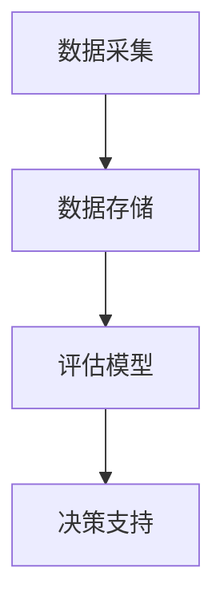

                 


# 格雷厄姆特价股票理论在家族企业投资中的应用

> 关键词：格雷厄姆、价值投资、家族企业、股票投资、内在价值、安全边际

> 摘要：本文详细探讨了格雷厄姆的价值投资理论在家族企业投资中的应用，分析了如何通过寻找低估股票实现长期稳健的财富增长，结合家族企业的特殊需求，提供了具体的策略和方法。

---

## 第一部分：格雷厄姆特价股票理论概述

### 第1章：格雷厄姆投资理论的核心要素

#### 1.1 格雷厄姆投资理论的背景与核心思想

格雷厄姆是价值投资之父，其理论基于“市场先生”的概念，强调以低于内在价值的价格买入股票。以下是格雷厄姆理论的几个关键点：

- **安全边际**：买入价格低于内在价值，确保投资的安全性。
- **内在价值**：通过基本面分析确定股票的真实价值。
- **市场波动**：市场先生的情绪波动为投资者提供了机会。

#### 1.2 格雷厄姆投资策略的具体步骤

1. **识别低估股票**：寻找市场价格低于内在价值的股票。
2. **计算内在价值**：使用格雷厄姆的公式估算股票价值。
3. **评估安全边际**：确保买入价格与内在价值的差距足够大。
4. **长期持有**：避免频繁交易，耐心等待价值回归。

#### 1.3 格雷厄姆理论的数学模型

格雷厄姆的内在价值计算公式如下：

$$
\text{内在价值} = \frac{\text{净利润} \times (5 + 市盈率)}{\text{资本成本}}
$$

### 第2章：家族企业投资的特点与需求

#### 2.1 家族企业的组织形式

- **股权结构**：家族成员通常持有大部分股权。
- **传承性**：家族企业注重长期传承，投资需稳健。

#### 2.2 家族企业投资的特殊需求

- **资产保值**：避免短期波动导致财富缩水。
- **长期收益**：注重稳健增长，而非短期暴利。

#### 2.3 格雷厄姆理论在家族企业中的优势

- **长期视角**：适合家族企业的长期投资需求。
- **安全性**：安全边际确保投资本金的安全。

---

## 第二部分：格雷厄姆理论在家族企业中的应用

### 第3章：内在价值评估与投资决策

#### 3.1 内在价值的计算

以某家族企业为例，计算其内在价值：

$$
\text{净利润} = 1000 \text{万元}
$$

$$
\text{市盈率} = 15
$$

$$
\text{内在价值} = \frac{1000 \times (5 + 15)}{10\%} = 20000 \text{万元}
$$

#### 3.2 寻找低估股票

通过比较市场价格与内在价值，确定低估股票。例如：

- **市场价格**：1500万元
- **内在价值**：2000万元
- **安全边际**：2000 - 1500 = 500万元

### 第4章：投资策略与风险管理

#### 4.1 投资组合的构建

- **分散投资**：避免过度集中，降低风险。
- **定期评估**：每年复评估内在价值，调整投资组合。

#### 4.2 风险管理策略

- **止损机制**：设定止损点，避免亏损过大。
- **流动性管理**：确保资金流动性，应对突发事件。

---

## 第三部分：系统分析与架构设计

### 第5章：系统架构与实现

#### 5.1 系统功能设计

- **数据采集模块**：收集财务数据。
- **评估模型模块**：计算内在价值。
- **决策支持模块**：提供投资建议。

#### 5.2 系统架构图



### 第6章：项目实战与案例分析

#### 6.1 案例分析

以某家族企业为例，分析其投资决策过程：

1. **数据收集**：收集过去5年的财务数据。
2. **计算内在价值**：使用格雷厄姆公式。
3. **制定投资策略**：寻找低估股票，分散投资。

#### 6.2 代码实现

```python
def calculate_intrinsic_value(net_profit, pe_ratio, cost_of_capital):
    return (net_profit * (5 + pe_ratio)) / cost_of_capital

net_profit = 1000  # 万元
pe_ratio = 15
cost_of_capital = 0.10
intrinsic_value = calculate_intrinsic_value(net_profit, pe_ratio, cost_of_capital)
print(f"内在价值：{intrinsic_value} 万元")
```

---

## 第四部分：总结与展望

### 第7章：总结与启示

#### 7.1 核心观点回顾

- 格雷厄姆理论为家族企业提供了稳健的投资策略。
- 安全边际和内在价值是投资成功的关键。

#### 7.2 未来展望

- 结合大数据和人工智能，进一步优化投资决策。
- 探索更多适合家族企业的投资策略。

### 第8章：风险管理与最佳实践

#### 8.1 风险管理

- 定期复评估投资组合，及时调整。
- 设定止损点，控制风险敞口。

#### 8.2 最佳实践

- 保持长期视角，避免短期波动影响决策。
- 结合家族企业的特点，灵活调整投资策略。

---

## 作者信息

作者：AI天才研究院/AI Genius Institute & 禅与计算机程序设计艺术 /Zen And The Art of Computer Programming

---

以上是文章的完整大纲和内容，涵盖了格雷厄姆理论在家族企业投资中的应用，从理论到实践，系统性地分析了其在投资决策中的重要性，并通过具体案例和系统设计提供了可操作的指导。

