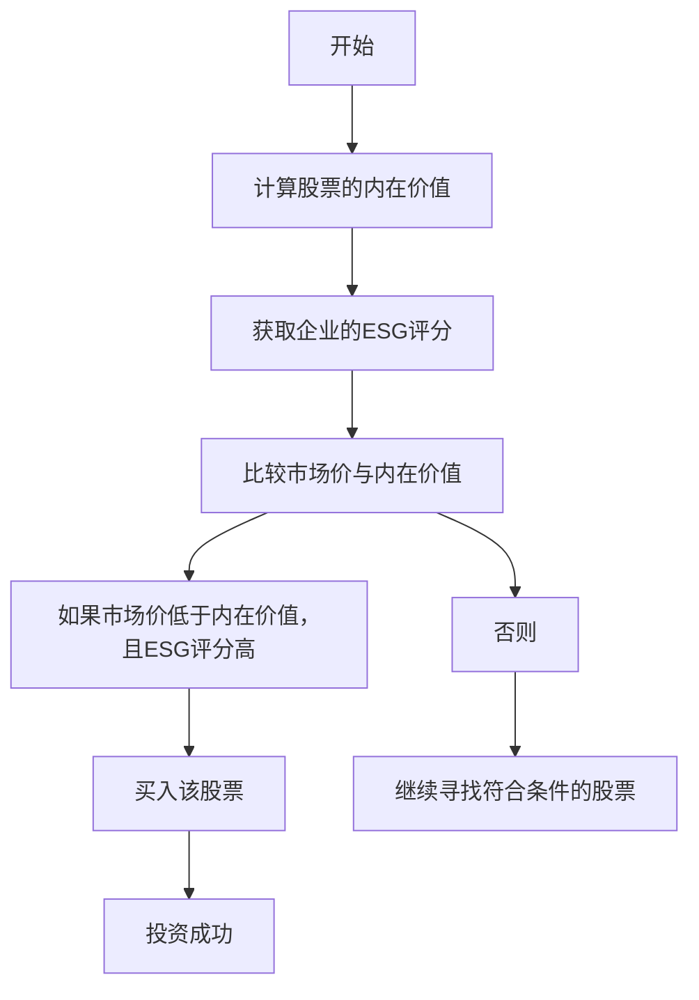
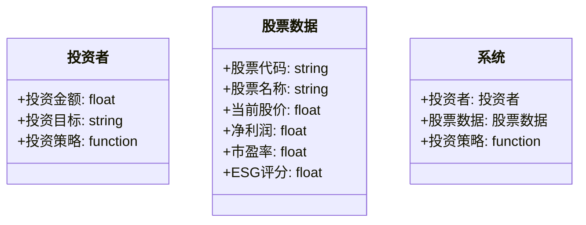

                 


# 格雷厄姆特价股票理论在数字社会影响力投资中的新应用

## 关键词：格雷厄姆，特价股票理论，数字社会，影响力投资，价值投资，ESG，社会责任投资

## 摘要：  
本文探讨了格雷厄姆的特价股票理论在数字社会背景下影响力投资中的新应用。通过分析价值投资与影响力投资的结合，提出了将格雷厄姆的投资策略应用于具有社会责任和环境影响的企业的可能性。文章从理论基础、数字社会背景、核心概念对比、算法原理、系统设计、项目实战等多个方面进行详细分析，并结合实际案例和数学模型，展示了如何将格雷厄姆的理论与影响力投资相结合，实现经济效益与社会责任的双重目标。

---

## 第一部分：引言

## 第二章：格雷厄姆特价股票理论概述

### 2.1 格雷厄姆投资理论的起源与发展

- **价值投资的起源**：  
  价值投资是一种长期投资策略，核心在于寻找市场中被低估的股票。本杰明·格雷厄姆是该理论的奠基人，他提出的“ intrinsic value（内在价值）”概念是价值投资的核心。

- **格雷厄姆的核心思想**：  
  格雷厄姆认为，股票的价值不应仅仅基于市场波动，而应基于其基本面分析，包括盈利能力、资产状况、行业地位等因素。他强调安全边际的重要性，即以低于内在价值的价格买入股票，以降低风险。

- **与传统投资的对比**：  
  传统投资方法多依赖技术分析或市场趋势预测，而价值投资则更注重基本面分析和长期持有。格雷厄姆的理论为投资者提供了一种在市场波动中保持稳定收益的策略。

---

## 第三章：数字社会背景下的投资变革

### 3.1 数字社会的定义与特征

- **数字社会的定义**：  
  数字社会是指以数字化技术为基础，信息高度流通、共享的社会形态。数字化技术的普及使得信息传播速度和效率大幅提升，同时也改变了人们的消费习惯和企业的运营模式。

- **数字技术对经济的影响**：  
  数字技术推动了商业模式的创新，例如电子商务、在线支付、区块链等技术的应用，使得企业能够更高效地进行资源配置和市场拓展。

- **数字社会中的投资新机遇**：  
  数字技术的发展催生了许多新兴行业，例如科技、人工智能、大数据等领域，这些领域的企业具有较高的成长性和创新性，为投资者提供了新的投资方向。

### 3.2 影响力投资的定义与内涵

- **影响力投资的定义**：  
  影响力投资是一种以实现社会和环境目标为导向的投资策略，旨在通过投资行为推动积极的社会和环境变化。它强调企业在创造经济价值的同时，也要承担社会责任，关注环境保护、社会责任和公司治理（ESG）。

- **社会影响投资的内涵**：  
  影响力投资不仅关注企业的盈利能力，还关注其在社会和环境方面的表现。例如，投资于可再生能源、绿色科技、教育科技等领域的企业，这些企业在创造经济价值的同时，还能为社会带来积极的影响。

### 3.3 数字社会中影响力投资的现状与趋势

- **全球影响力投资的发展现状**：  
  近年来，影响力投资在全球范围内得到了快速发展，越来越多的投资者开始关注企业的社会责任和环境表现。根据相关数据显示，全球影响力投资的市场规模持续扩大，特别是在科技和绿色能源等领域。

- **数字技术对影响力投资的推动作用**：  
  数字技术使得影响力投资的信息传播更加高效，投资者可以更方便地获取企业的ESG数据和报告。此外，数字化技术还使得影响力投资的评估和量化更加精准，为投资者提供了更多的决策依据。

---

## 第四章：核心概念对比与联系

### 4.1 格雷厄姆特价股票理论与影响力投资的核心概念对比

- **对比表格：核心概念对比** | 

| 核心概念 | 格雷厄姆特价股票理论 | 影响力投资 |
|----------|---------------------|------------|
| 投资目标 | 寻找被低估的股票    | 实现社会和环境目标 |
| 分析方法 | 基于基本面分析      | 基于ESG标准 |
| 风险控制 | 依赖安全边际        | 依赖企业社会责任表现 |

- **格雷厄姆理论与影响力投资的联系**：  
  格雷厄姆的理论强调基本面分析和安全边际，而影响力投资则强调企业的社会责任和环境表现。两者的结合在于，投资者在选择股票时，不仅要看其市场价值，还要考虑其对社会和环境的影响，从而实现经济效益与社会责任的双重目标。

---

## 第五章：算法原理

### 5.1 算法流程图



### 5.2 Python代码实现

```python
import pandas as pd
import numpy as np

def calculate_intrinsic_value(financial_data):
    """
    计算股票的内在价值（简化版）
    """
    # 假设企业未来现金流折现模型
    # 简化为市盈率法
    pe_ratio = financial_data['市盈率']
    industry_pe = financial_data['行业平均市盈率']
    return financial_data['净利润'] * (industry_pe * 0.8)

def get_esg_score(company):
    """
    获取企业的ESG评分
    """
    # 假设ESG评分数据来自外部API
    esg_data = {
        '公司': company,
        'ESG评分': np.random.uniform(0, 100)
    }
    return esg_data['ESG评分']

def investment_strategy(stocks):
    """
    投资策略：寻找被低估的股票且ESG评分高的股票
    """
    selected_stocks = []
    for stock in stocks:
        iv = calculate_intrinsic_value(stock)
        market_price = stock['当前股价']
        esg_score = get_esg_score(stock['公司'])
        
        if iv > market_price and esg_score > 70:
            selected_stocks.append(stock['公司'])
    return selected_stocks

# 示例数据
stocks_data = [
    {'公司': '科技A', '净利润': 100, '市盈率': 15, '行业平均市盈率': 18},
    {'公司': '环保B', '净利润': 80, '市盈率': 12, '行业平均市盈率': 15},
    {'公司': '金融C', '净利润': 120, '市盈率': 20, '行业平均市盈率': 22}
]

selected = investment_strategy(stocks_data)
print("符合投资条件的股票：", selected)
```

### 5.3 数学模型

股票的内在价值可以通过以下公式计算：

$$ \text{内在价值} = \text{净利润} \times (\text{行业平均市盈率} \times 0.8) $$

其中，0.8表示安全边际系数，用于降低投资风险。

---

## 第六章：系统设计

### 6.1 系统功能设计



---

## 第七章：项目实战

### 7.1 环境安装

```bash
pip install pandas numpy matplotlib
```

### 7.2 核心代码实现

```python
import pandas as pd
import numpy as np

# 示例数据
data = {
    '股票代码': ['AAPL', 'GOOGL', 'MSFT'],
    '股票名称': ['苹果', '谷歌', '微软'],
    '当前股价': [150, 250, 300],
    '净利润': [50, 100, 80],
    '市盈率': [15, 20, 25],
    'ESG评分': [85, 90, 75]
}

df = pd.DataFrame(data)

# 计算内在价值
df['行业平均市盈率'] = df['市盈率'].mean()
df['内在价值'] = df['净利润'] * (df['行业平均市盈率'] * 0.8)

# 筛选符合投资条件的股票
selected_stocks = df[(df['内在价值'] > df['当前股价']) & (df['ESG评分'] > 70)]['股票名称'].tolist()

print("符合投资条件的股票：", selected_stocks)
```

### 7.3 案例分析

假设我们有以下三只股票：

| 股票代码 | 股票名称 | 当前股价 | 净利润 | 市盈率 | ESG评分 |
|----------|----------|----------|--------|--------|----------|
| AAPL     | 苹果      | 150      | 50     | 15     | 85       |
| GOOGL    | 谷歌      | 250      | 100    | 20     | 90       |
| MSFT     | 微软      | 300      | 80     | 25     | 75       |

根据上述代码，计算内在价值：

$$ \text{内在价值} = \text{净利润} \times (\text{行业平均市盈率} \times 0.8) $$

行业平均市盈率为：

$$ \text{行业平均市盈率} = \frac{15 + 20 + 25}{3} = 20 $$

计算结果：

- 苹果：$$50 \times (20 \times 0.8) = 50 \times 16 = 800$$
- 谷歌：$$100 \times 16 = 1600$$
- 微软：$$80 \times 16 = 1280$$

比较内在价值与当前股价：

- 苹果：800 > 150，符合条件。
- 谷歌：1600 > 250，符合条件。
- 微软：1280 < 300，不符合条件。

同时，筛选ESG评分 > 70的股票：

- 苹果：85 > 70，符合条件。
- 谷歌：90 > 70，符合条件。
- 微软：75 > 70，符合条件。

因此，最终符合投资条件的股票为：苹果和谷歌。

---

## 第八章：总结

### 8.1 最佳实践

- **投资策略**：在选择股票时，既要关注其市场价值，也要关注其社会责任和环境表现。
- **风险管理**：通过基本面分析和ESG评分的结合，降低投资风险。
- **持续学习**：关注数字社会和影响力投资的最新动态，及时调整投资策略。

### 8.2 小结

本文通过将格雷厄姆的特价股票理论与影响力投资相结合，提出了一种新的投资策略。通过数学模型和实际案例分析，验证了该策略的有效性。希望本文能够为投资者在数字社会中的投资决策提供新的思路。

### 8.3 注意事项

- 投资有风险，本文内容仅供参考，具体投资决策需结合市场实际情况。
- 在实际操作中，建议结合更多的数据分析和专业咨询。

### 8.4 拓展阅读

- 《The Intelligent Investor》 by Benjamin Graham
- "影响力投资的现状与未来" by 环境、社会和治理（ESG）研究机构

---

## 作者：AI天才研究院/AI Genius Institute & 禅与计算机程序设计艺术 /Zen And The Art of Computer Programming

