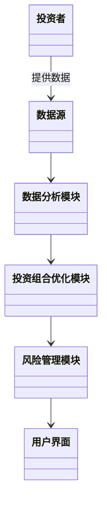
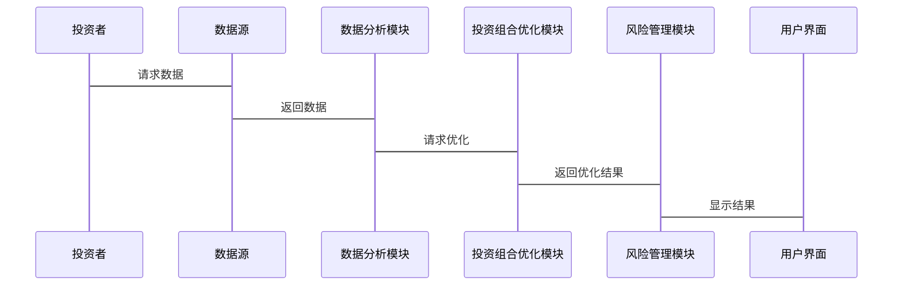

                 


# 《格雷厄姆特价股票理论在数字经济时代的新解读》

## 关键词：
- 格雷厄姆特价股票理论
- 数字经济时代
- 投资策略
- 价值投资
- 数据分析

## 摘要：
格雷厄姆特价股票理论作为价值投资的基石，在数字经济时代面临新的挑战和机遇。本文从背景、核心概念、算法原理、系统设计、项目实战等方面，详细解读格雷厄姆理论在数字时代的演变和应用。通过分析数字经济的特点，结合现代投资工具和技术，提出新的投资策略，优化投资组合，降低风险。文章还通过实际案例和代码实现，展示如何在数字化转型中应用这些新理论。

---

# 第一部分：格雷厄姆特价股票理论的背景与核心概念

## 第1章：格雷厄姆特价股票理论概述

### 1.1 格雷厄姆特价股票理论的起源与发展

#### 1.1.1 价值投资的起源
价值投资起源于20世纪初，本杰明·格雷厄姆是这一理念的鼻祖。他强调以低于内在价值的价格购买股票，长期持有，等待市场的重新评估。这种投资策略在20世纪的多次经济危机中表现出色，尤其是在1929年大萧条期间，格雷厄姆的投资策略帮助投资者在市场低迷中获利。

#### 1.1.2 格雷厄姆的投资理念
格雷厄姆的价值投资理论基于以下几个核心原则：
1. **安全边际**：购买股票时，价格应远低于其内在价值，以提供足够的安全边际。
2. **市场先生**：市场情绪波动不定，投资者应利用市场的非理性来寻找低估资产。
3. **逆向思维**：在市场恐慌时买入，在市场狂热时卖出。

#### 1.1.3 特价股票理论的核心思想
格雷厄姆认为，股票市场的短期波动是由投资者情绪驱动的，而长期价值则取决于公司的基本面。因此，投资者应关注企业的内在价值，而不是市场的短期波动。通过分析财务报表和估值指标（如市盈率、市净率），投资者可以找到那些被市场低估的股票。

### 1.2 数字经济时代的投资环境变化

#### 1.2.1 数字经济的定义与特征
数字经济是指以数字化技术为核心驱动力的经济形态。其主要特征包括：
1. **数据驱动**：数据成为最重要的生产要素。
2. **技术驱动**：人工智能、大数据、区块链等技术广泛应用。
3. **全球化**：数字经济打破了地理限制，实现了全球化的资源配置。
4. **快速变化**：技术更新和市场变化速度极快，投资者需要快速适应。

#### 1.2.2 数字化转型对投资的影响
数字化转型使得企业的运营模式和盈利方式发生了根本性变化。例如，传统制造业通过数字化转型实现了智能制造，提升了效率和产品质量。这些变化直接影响企业的财务表现和市场估值。

#### 1.2.3 新兴经济模式对传统投资理论的挑战
数字经济催生了新的经济模式，如共享经济、平台经济、网红经济等。这些模式传统财务指标（如市盈率、市净率）可能不再适用，需要新的估值方法来评估这些新兴企业的价值。

### 1.3 格雷厄姆理论与数字经济的结合

#### 1.3.1 格雷厄姆理论的适用性分析
尽管数字经济带来了新的挑战，但格雷厄姆的核心理念——寻找低估资产、注重安全边际、长期投资——依然有效。在数字经济时代，这些原则可以帮助投资者在快速变化的市场中保持理性，避免盲目跟风。

#### 1.3.2 数字经济时代的新投资机会
数字经济时代催生了许多新兴行业，如人工智能、大数据、云计算等。这些行业的企业可能具有较高的成长性和创新性，符合格雷厄姆理论中对内在价值的关注。

#### 1.3.3 理论边界与外延的扩展
格雷厄姆理论的边界主要在于其适用范围和时间跨度。在数字经济时代，需要扩展理论的应用场景，例如将数据资产纳入企业估值，考虑技术对企业长期价值的影响。

---

## 第2章：格雷厄姆特价股票理论的核心算法原理

### 2.1 格雷厄姆投资模型的数学模型

#### 2.1.1 投资价值计算公式
格雷厄姆提出的核心投资价值公式为：
$$
\text{内在价值} = \text{未来现金流的现值}
$$
内在价值的计算需要考虑企业的未来盈利能力、成长性和财务稳定性。

#### 2.1.2 市盈率与市净率的比较
市盈率（P/E）和市净率（P/B）是常用的估值指标。格雷厄姆更倾向于使用市净率，因为市净率在企业亏损时更具参考价值。

#### 2.1.3 投资组合优化的数学模型
格雷厄姆的投资组合优化模型可以表示为：
$$
\min_{w} \sigma^2(w) \quad \text{subject to} \quad w^T \mu \geq \text{目标收益}
$$
其中，$\sigma^2(w)$ 是投资组合的方差，$\mu$ 是收益向量，$w$ 是投资权重。

### 2.2 现代投资组合理论与格雷厄姆理论的结合

#### 2.2.1 马科维茨有效前沿模型
马科维茨的有效前沿模型通过优化投资组合的风险和收益，构建了现代投资组合理论的基础。格雷厄姆的理论在某种程度上与有效前沿模型一致，但更注重安全边际和价值发现。

#### 2.2.2 现代投资组合理论与格雷厄姆理论的异同
- **相同点**：两者都强调风险与收益的平衡，注重长期投资。
- **不同点**：格雷厄姆更注重个股的估值，而现代投资组合理论更注重组合优化。

#### 2.2.3 算法原理的数学推导
通过结合格雷厄姆和马科维茨的理论，可以构建一个动态优化的投资组合模型：
$$
\min_{w} \sigma^2(w) \quad \text{subject to} \quad w^T \mu \geq \text{目标收益} \quad \text{和} \quad \text{个股估值} \leq \text{内在价值}
$$

### 2.3 算法实现与代码示例

#### 2.3.1 投资组合优化的Python代码实现
```python
import numpy as np
from scipy.optimize import minimize

# 示例数据：收益和协方差矩阵
mu = np.array([0.1, 0.15, 0.08])
Sigma = np.array([[0.04, 0.02, 0.01],
                  [0.02, 0.06, 0.03],
                  [0.01, 0.03, 0.05]])

# 定义优化目标函数
def objective(w):
    return np.dot(w.T, np.dot(Sigma, w))

# 定义约束条件
cons = ({'type': 'eq', 'fun': lambda w: np.sum(w) - 1},
        {'type': 'ineq', 'fun': lambda w: mu.T @ w - 0.1})

# 初始化权重
w0 = np.array([1/3, 1/3, 1/3])

# 进行优化
result = minimize(objective, w0, constraints=cons)

print("最优权重：", result.x)
print("最小方差：", result.fun)
```

#### 2.3.2 数据分析与可视化代码
```python
import pandas as pd
import matplotlib.pyplot as plt

# 示例数据分析
data = pd.DataFrame({'股票': ['A', 'B', 'C'], '内在价值': [10, 15, 8], '市场价格': [8, 12, 9]})
data['折价率'] = (data['内在价值'] - data['市场价格']) / data['市场价格']

# 绘制折价率分布图
plt.bar(data['股票'], data['折价率'])
plt.title('股票折价率分布')
plt.show()
```

#### 2.3.3 算法流程图（Mermaid）
```mermaid
graph TD
    A[开始] -> B[计算内在价值]
    B -> C[分析市场数据]
    C -> D[计算折价率]
    D -> E[优化投资组合]
    E -> F[输出结果]
```

---

## 第3章：数字经济时代的投资策略创新

### 3.1 数据驱动的投资分析

#### 3.1.1 大数据分析在投资中的应用
通过大数据分析，投资者可以识别市场趋势、预测企业业绩、评估风险。例如，利用社交媒体数据预测市场情绪。

#### 3.1.2 机器学习在股票预测中的应用
机器学习算法（如随机森林、神经网络）可以用于预测股票价格、识别市场模式。

#### 3.1.3 数据可视化与投资决策支持
数据可视化工具（如Tableau、Power BI）可以帮助投资者更直观地分析数据，辅助决策。

### 3.2 数字化投资工具与平台

#### 3.2.1 在线投资分析工具的功能模块
- 数据采集与清洗
- 财务分析与估值
- 投资组合优化
- 风险管理

#### 3.2.2 投资组合管理系统的架构设计


#### 3.2.3 系统接口设计和交互序列图（Mermaid）


### 3.3 投资策略的动态调整与优化

#### 3.3.1 动态投资模型的构建
动态投资模型需要考虑市场的实时变化，利用反馈机制不断调整投资组合。

#### 3.3.2 策略优化的数学模型
$$
\min_{w} \sigma^2(w) \quad \text{subject to} \quad w^T \mu \geq \text{动态目标收益}
$$

#### 3.3.3 实际案例分析与代码实现
```python
# 动态调整示例代码
import pandas as pd
import numpy as np

# 示例数据：动态收益和风险
data = pd.DataFrame({'时间': range(10), '收益': np.random.normal(0.1, 0.1, 10), '风险': np.random.normal(0.05, 0.02, 10)})

# 动态优化权重
weights = np.random.dirichlet([1,1,1], 10)

# 计算风险收益比
data['风险收益比'] = data['收益'] / data['风险']

print("最优权重：", weights.max(axis=1))
```

---

## 第4章：数字经济时代的投资风险与应对策略

### 4.1 数字经济时代的投资风险

#### 4.1.1 市场波动性增加
数字技术的广泛应用导致市场信息不对称减少，但同时也可能导致市场波动性增加。

#### 4.1.2 技术风险与数据安全
数据泄露、技术故障等风险可能对数字经济时代的投资造成重大影响。

#### 4.1.3 政策风险与监管不确定性
数字经济的发展需要政府的大力支持，但也可能面临政策变化和监管不确定性。

### 4.2 投资风险的应对策略

#### 4.2.1 构建多元化投资组合
通过分散投资降低风险。

#### 4.2.2 强化风险管理
利用现代风险管理工具（如VaR、C VaR）量化和监控风险。

#### 4.2.3 加强合规与风险管理
密切关注政策变化，建立合规体系。

---

## 第5章：总结与展望

### 5.1 核心观点总结
格雷厄姆特价股票理论在数字经济时代依然具有重要的指导意义。通过结合现代技术，投资者可以在复杂多变的市场中找到低估资产，实现长期稳定的投资收益。

### 5.2 理论的局限性与未来研究方向
尽管格雷厄姆理论在数字经济时代依然有效，但其局限性也逐渐显现。例如，如何评估数据资产的内在价值、如何在快速变化的市场中动态调整投资策略等，仍需进一步研究。

### 5.3 对投资者的建议
- **长期投资**：保持耐心，避免短期波动的干扰。
- **风险管理**：构建多元化投资组合，降低风险。
- **技术驱动**：利用大数据和人工智能提升投资效率。

---

# 作者：AI天才研究院 & 禅与计算机程序设计艺术

