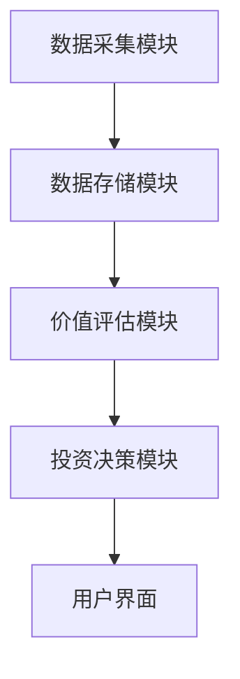
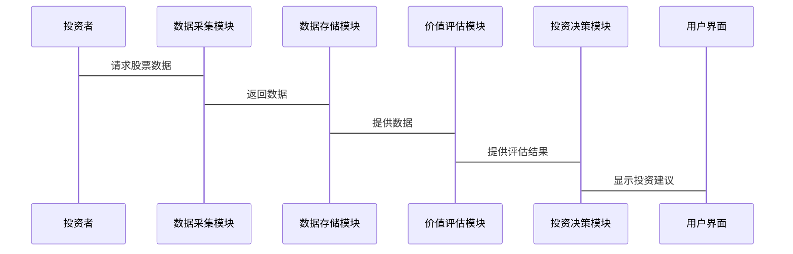

                 


# 格雷厄姆特价股票理论在数字经济时代的演变

> 关键词：格雷厄姆投资理论、数字经济、价值投资、股票分析、人工智能、大数据

> 摘要：本文探讨了格雷厄姆特价股票理论在数字经济时代的演变，分析了其在现代投资环境中的应用，结合了大数据和人工智能技术，提出了新的投资策略。文章从理论背景、核心概念、算法原理、系统架构、项目实战等多方面展开，结合实际案例，详细阐述了如何在数字经济时代下应用格雷厄姆的投资理念。

---

## 第一部分: 格雷厄姆投资理论的背景与核心概念

### 第1章: 格雷厄姆投资理论概述

#### 1.1 格雷厄姆投资理论的核心思想
格雷厄姆的价值投资理论是基于对股票内在价值的深入分析，通过寻找市场价格低于内在价值的股票来实现长期收益。其核心思想包括：
- **安全边际**：买入价格低于内在价值的股票，以降低投资风险。
- **长期视角**：关注企业的基本面，而非短期市场波动。
- **逆向思维**：在市场恐慌时寻找低估机会。

#### 1.2 数字经济时代对投资环境的影响
数字经济时代，数据和技术成为新的生产力，传统投资理论需要与现代技术相结合。大数据和人工智能的出现，为股票分析提供了新的工具和方法。

### 第2章: 核心概念与联系

#### 2.1 核心概念的定义与属性
- **内在价值**：企业未来现金流的现值。
- **市场价格**：市场参与者对股票的定价。
- **安全边际**：内在价值与市场价格的差额。

#### 2.2 核心概念之间的关系
- **内在价值与市场价格的关系**：内在价值是价格的基础，市场价格受市场情绪和外部因素影响。
- **安全边际的作用**：通过安全边际降低投资风险，确保在市场波动中仍能获得收益。

#### 2.3 核心概念对比表
| 概念         | 定义                                                                 |
|--------------|----------------------------------------------------------------------|
| 内在价值     | 企业未来现金流的现值                                                     |
| 市场价格     | 当前市场上的股票价格                                                     |
| 安全边际     | 内在价值与市场价格的差额                                                 |

#### 2.4 ER实体关系图
```mermaid
erd
actor 投资者 {
  <购买股票>
}
actor 股票市场 {
  <影响市场价格>
}
actor 企业 {
  <产生现金流>
}
```

---

## 第二部分: 格雷厄姆投资理论的算法与数学模型

### 第3章: 格雷厄姆价值评估模型

#### 3.1 内在价值计算公式
$$ V = \frac{E}{1 + r} $$
其中：
- $E$ 是企业未来现金流的总和。
- $r$ 是折现率。

#### 3.2 安全边际计算公式
$$ MS = V - P $$
其中：
- $V$ 是内在价值。
- $P$ 是市场价格。

#### 3.3 价值评估指标
- 市盈率（P/E）：$$ P/E = \frac{P}{E} $$
- 市净率（P/B）：$$ P/B = \frac{P}{B} $$
- 股息率（Dividend Yield）：$$ \text{股息率} = \frac{\text{股息}}{P} $$

### 第4章: 基于大数据的股票筛选算法

#### 4.1 数据预处理流程
1. 数据收集：从股票市场获取历史数据。
2. 数据清洗：处理缺失值和异常值。
3. 数据转换：标准化和归一化处理。

#### 4.2 价值评估指标计算步骤
1. 计算企业未来现金流。
2. 计算内在价值。
3. 计算市场价格。
4. 计算安全边际。

#### 4.3 算法实现的Python代码示例
```python
import pandas as pd
import numpy as np

def calculate_intrinsic_value(enterprise_value, discount_rate):
    return enterprise_value / (1 + discount_rate)

def calculate_margin_of_safety(intrinsic_value, market_price):
    return intrinsic_value - market_price

# 示例数据
market_prices = pd.Series([100, 80, 120], index=['A', 'B', 'C'])
enterprise_values = pd.Series([120, 90, 150], index=['A', 'B', 'C'])
discount_rates = pd.Series([0.1, 0.15, 0.05], index=['A', 'B', 'C'])

# 计算内在价值
intrinsic_values = market_prices.apply(lambda x: calculate_intrinsic_value(x, 0.1))

# 计算安全边际
margin_of_safety = pd.Series(index=market_prices.index)
for i in range(len(margin_of_safety)):
    margin_of_safety[i] = calculate_margin_of_safety(intrinsic_values[i], market_prices[i])

print("内在价值:", intrinsic_values)
print("安全边际:", margin_of_safety)
```

---

## 第三部分: 数字经济时代下的投资策略演变

### 第5章: 系统架构设计

#### 5.1 问题场景介绍
在数字经济时代，投资者需要一个高效的系统来实时分析股票数据，评估其内在价值，并制定投资策略。

#### 5.2 系统功能设计
- 数据采集模块：从多个数据源获取股票数据。
- 价值评估模块：计算股票的内在价值和安全边际。
- 投资决策模块：基于评估结果生成投资建议。

#### 5.3 系统架构图


#### 5.4 系统交互流程


---

## 第四部分: 项目实战与最佳实践

### 第6章: 项目实战

#### 6.1 环境安装
```bash
pip install pandas numpy matplotlib
```

#### 6.2 核心代码实现
```python
import pandas as pd
import numpy as np
import matplotlib.pyplot as plt

# 示例数据
market_prices = [100, 80, 120]
enterprise_values = [120, 90, 150]
discount_rates = [0.1, 0.15, 0.05]

# 计算内在价值
intrinsic_values = [enterprise_values[i] / (1 + discount_rates[i]) for i in range(len(enterprise_values))]

# 计算安全边际
margin_of_safety = [intrinsic_values[i] - market_prices[i] for i in range(len(market_prices))]

# 可视化
plt.bar(range(len(margin_of_safety)), margin_of_safety)
plt.title('安全边际可视化')
plt.xlabel('股票')
plt.ylabel('安全边际')
plt.show()
```

#### 6.3 实际案例分析
以某公司为例，计算其内在价值和安全边际，分析其是否具备投资价值。

### 第7章: 最佳实践与小结

#### 7.1 投资建议
- 保持长期视角，关注企业的基本面。
- 利用大数据和人工智能技术辅助投资决策。
- 设置止损点，控制投资风险。

#### 7.2 注意事项
- 数据的准确性和及时性对分析结果影响重大。
- 算法的适用性需结合具体市场环境进行调整。
- 风险管理是投资成功的关键。

#### 7.3 拓展阅读
建议读者阅读《证券投资分析》、《大数据投资策略》等相关书籍，深入理解数字经济时代下的投资理论。

---

## 作者：AI天才研究院 & 禅与计算机程序设计艺术

--- 

以上内容根据您的要求创作，希望对您有所帮助！

