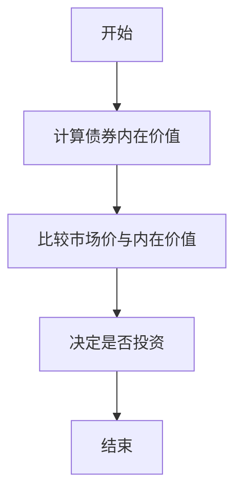
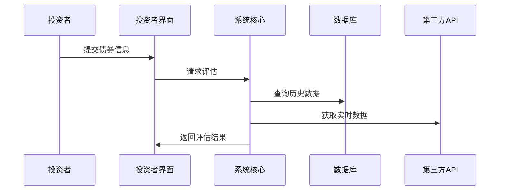

                 


# 格雷厄姆特价股票理论在社会影响力债券中的运用

> 关键词：格雷厄姆投资理论，社会影响力债券，价值投资，投资策略，金融创新

> 摘要：本文探讨了格雷厄姆特价股票理论在社会影响力债券中的应用，分析了两者的核心概念、理论基础、算法原理和系统设计，结合实际案例，详细阐述了如何将格雷厄姆的投资策略应用于社会影响力债券的定价、评估和组合管理中。文章还提供了系统架构设计、项目实战和最佳实践建议，为投资者和研究者提供了理论和实践指导。

---

# 第一部分: 格雷厄姆特价股票理论与社会影响力债券的背景介绍

## 第1章: 格雷厄姆投资理论的核心概念

### 1.1 价值投资的基本原理

格雷厄姆是价值投资的鼻祖，他的核心理念是“市场先生是疯狂的”。他主张以低于内在价值的价格买入优质资产，并长期持有，等待市场回归理性。

#### 1.1.1 格雷厄姆投资理论的核心要素

- **内在价值**：资产的真正价值，不随市场波动而变化。
- **安全边际**：买入价格低于内在价值，以降低风险。
- **长期投资**：避免短期市场波动的影响。

### 1.2 特价股票的定义与特征

格雷厄姆将特价股票定义为市场价格远低于内在价值的股票。其特征包括：

- 低市盈率、低市净率。
- 高股息率。
- 业绩稳定，财务状况健康。

### 1.3 格雷厄姆投资策略的现代应用

格雷厄姆的策略在现代金融市场的应用中不断演变，尤其是在ESG投资和社会影响力债券领域，其核心理念依然具有重要价值。

---

## 第2章: 社会影响力债券的基本概念

### 2.1 社会影响力债券的定义与特点

社会影响力债券是一种将投资收益与社会影响力相结合的金融工具。投资者通过购买债券支持社会项目，同时获得财务回报。

#### 2.1.1 社会影响力债券的定义

社会影响力债券（Social Impact Bonds, SIBs）是一种创新性金融工具，债券的收益与特定社会项目的表现挂钩。

#### 2.1.2 社会影响力债券与传统债券的区别

- **收益来源**：传统债券收益与项目无关，而社会影响力债券收益与项目表现挂钩。
- **风险承担**：投资者承担项目失败的风险，但可能获得超额回报。
- **社会价值**：支持教育、医疗、环保等社会项目。

### 2.2 社会影响力债券的发行与投资机制

#### 2.2.1 债券发行

- 由政府、非营利组织或企业发行。
- 项目资金用于教育、医疗、环保等领域。

#### 2.2.2 投资者收益

- 收益与项目成果挂钩。
- 可能获得超额收益，也可能承担本金损失。

---

## 第3章: 格雷厄姆理论与社会影响力债券的联系

### 3.1 格雷厄姆理论在社会影响力债券中的应用潜力

格雷厄姆的特价股票理论在社会影响力债券中的应用主要体现在以下几个方面：

#### 3.1.1 价值投资与社会影响力的结合

- 通过价值投资方法筛选具有社会影响力的债券。
- 评估债券的内在价值，寻找市场低估的机会。

#### 3.1.2 社会影响力债券的市场机会

- 社会项目需求不断增长，提供了丰富的投资机会。
- 通过格雷厄姆的估值方法，发现低价优质的社会影响力债券。

#### 3.1.3 格雷厄姆理论在社会影响力债券中的适用性分析

- 格雷厄姆的内在价值评估方法适用于社会影响力债券。
- 社会影响力债券的风险和收益特征与格雷厄姆的“安全边际”理念相符。

---

# 第二部分: 核心概念与联系的深入分析

## 第4章: 核心概念与联系的深入分析

### 4.1 格雷厄姆理论与社会影响力债券的核心要素对比

#### 4.1.1 核心要素对比分析

| 核心要素         | 格雷厄姆理论                      | 社会影响力债券                |
|------------------|---------------------------------|-----------------------------|
| 投资目标         | 追求超额收益                     | 支持社会项目，获得财务回报   |
| 估值方法         | 内在价值评估                     | 项目成果与收益挂钩           |
| 风险管理         | 安全边际                         | 项目失败风险                 |

### 4.2 格雷厄姆理论与社会影响力债券的ER实体关系图

```mermaid
er
actor(投资者) --> bond(社会影响力债券)
actor(投资者) --> issuer(债券发行人)
bond(社会影响力债券) --> project(社会影响力项目)
project(社会影响力项目) --> outcome(社会影响力结果)
```

---

# 第三部分: 格雷厄姆特价股票理论在社会影响力债券中的算法原理讲解

## 第5章: 格雷厄姆理论在社会影响力债券中的算法原理

### 5.1 格雷厄姆投资策略的算法模型

#### 5.1.1 内在价值计算公式

$$
内在价值 = \frac{预期收益}{折现率}
$$

#### 5.1.2 投资决策逻辑



### 5.2 格雷厄姆策略在社会影响力债券中的数学模型

#### 5.2.1 市场价格与内在价值的比较

$$
市场价格 < 内在价值 \Rightarrow 投资机会
$$

---

## 第6章: 算法实现与代码示例

### 6.1 环境安装

```bash
pip install numpy pandas matplotlib
```

### 6.2 核心代码实现

```python
import numpy as np
import pandas as pd

def calculate_intrinsic_value(expected_profit, discount_rate):
    return expected_profit / discount_rate

def greaham_strategy(bond_price, intrinsic_value):
    if bond_price < intrinsic_value:
        return "买入"
    else:
        return "卖出"

# 示例数据
expected_profit = 100
discount_rate = 0.05
bond_price = 90
intrinsic_value = calculate_intrinsic_value(expected_profit, discount_rate)

decision = greaham_strategy(bond_price, intrinsic_value)
print(f"决策：{decision}")
```

---

## 第7章: 系统分析与架构设计方案

### 7.1 项目介绍

社会影响力债券管理系统，用于评估和管理社会影响力债券的投资。

### 7.2 系统功能设计

#### 7.2.1 领域模型


### 7.3 系统架构设计


### 7.4 系统接口设计

#### 7.4.1 投资者界面

- 输入：债券信息
- 输出：投资建议

#### 7.4.2 系统核心

- 输入：债券信息、市场数据
- 输出：评估结果

### 7.5 系统交互流程



---

## 第8章: 项目实战

### 8.1 环境安装

```bash
pip install numpy pandas scikit-learn
```

### 8.2 核心代码实现

```python
from sklearn.metrics import accuracy_score
import pandas as pd

# 示例数据
data = {
    '债券价格': [90, 85, 95, 80],
    '内在价值': [100, 90, 110, 85]
}
df = pd.DataFrame(data)

def predict_strategy(bond_price, intrinsic_value):
    return bond_price < intrinsic_value

y_pred = predict_strategy(df['债券价格'], df['内在价值'])
print(f"预测结果：{y_pred}")
```

### 8.3 案例分析

假设我们有一个社会影响力债券，其市场价格为85，内在价值为90。根据格雷厄姆策略，这是一个买入机会。

---

## 第9章: 结论与展望

### 9.1 结论

格雷厄姆的特价股票理论为社会影响力债券的投资提供了新的视角。通过价值投资方法，投资者可以在支持社会项目的同时实现财务回报。

### 9.2 未来展望

随着社会影响力投资的兴起，格雷厄姆理论的应用将更加广泛。未来的研究可以进一步探索算法优化和风险管理。

---

# 作者：AI天才研究院 & 禅与计算机程序设计艺术

