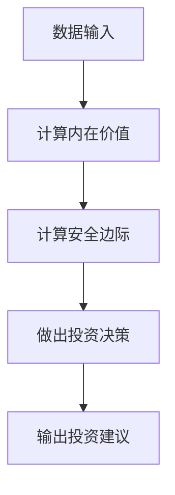

                 


# 格雷厄姆特价股票理论在私募股权投资中的运用

> 关键词：格雷厄姆投资理论，特价股票，私募股权投资，价值投资，安全边际

> 摘要：本文探讨了格雷厄姆特价股票理论在私募股权投资中的应用，通过分析其核心概念、数学模型、系统架构及实际案例，详细阐述了如何将价值投资理念与私募股权投资相结合。文章内容涵盖背景介绍、核心概念、算法原理、系统设计、项目实战及最佳实践，为投资者提供了深入的理论支持和实践指导。

---

## 第一部分：格雷厄姆特价股票理论概述

### 第1章：格雷厄姆特价股票理论的背景与核心概念

#### 1.1 格雷厄姆投资理论的起源与发展

##### 1.1.1 价值投资的起源
价值投资起源于20世纪初，由本杰明·格雷厄姆（Benjamin Graham）和戴维德·多德（David Dodd）提出。格雷厄姆是哥伦比亚大学的教授，他的学生包括沃伦·巴菲特（Warren Buffett）等著名投资者。价值投资的核心理念是寻找市场低估的股票，通过分析企业的内在价值来做出投资决策。

##### 1.1.2 格雷厄姆的投资理念
格雷厄姆强调安全边际（Margin of Safety），即以低于内在价值的价格买入股票，以降低投资风险。他认为市场情绪波动会导致股票价格偏离其实际价值，因此投资者应该利用这种偏差，寻找被低估的投资标的。

##### 1.1.3 安全边际的概念
安全边际是格雷厄姆理论中的核心概念，它是指股票的市场价格低于其内在价值的部分。通过计算安全边际，投资者可以评估投资的风险和潜在收益。安全边际越大，投资的可靠性越高。

#### 1.2 特价股票的定义与特征

##### 1.2.1 特价股票的定义
特价股票是指市场价格显著低于其内在价值的股票。这种股票通常被视为被市场低估的投资机会，适合长期持有。

##### 1.2.2 特价股票的特征
- 市盈率（P/E）低于行业平均水平
- 市净率（P/B）低于行业平均水平
- 股息率较高
- 公司基本面稳定，具有长期增长潜力

##### 1.2.3 特价股票与市场波动的关系
市场波动会导致股票价格短期偏离其实际价值，格雷厄姆利用这种波动性，寻找被低估的股票进行投资。

#### 1.3 格雷厄姆投资理论的核心要素

##### 1.3.1 内在价值的计算
内在价值是股票的真实价值，与市场波动无关。计算内在价值需要考虑公司的财务状况、盈利能力、行业地位等因素。

##### 1.3.2 市场价值与内在价值的对比
市场价值是股票的市场价格，内在价值是其真实价值。当市场价格低于内在价值时，股票被视为被低估。

##### 1.3.3 安全边际的应用
通过计算安全边际，投资者可以评估投资的风险和潜在收益。安全边际越大，投资的可靠性越高。

---

### 第2章：格雷厄姆特价股票理论的数学模型与公式

#### 2.1 内在价值的计算公式

##### 2.1.1 格雷厄姆的内在价值公式
内在价值的计算公式如下：

$$
\text{内在价值} = \frac{\text{净利润} \times (5 + 4.4T)}}{\text{资本总额}}
$$

其中，T是资本充足率的系数。

##### 2.1.2 内在价值计算的步骤
1. 计算公司的净利润
2. 计算资本总额
3. 计算资本充足率系数T
4. 代入公式计算内在价值

##### 2.1.3 公式示例
假设某公司的净利润为100万元，资本总额为500万元，资本充足率系数T为1，那么其内在价值为：

$$
\text{内在价值} = \frac{100 \times (5 + 4.4 \times 1)}{500} = \frac{100 \times 9.4}{500} = 1.88 \text{元/股}
$$

#### 2.2 安全边际的计算与应用

##### 2.2.1 安全边际的定义
安全边际是指股票的市场价格低于其内在价值的部分。

##### 2.2.2 安全边际的计算方法
安全边际的计算公式如下：

$$
\text{安全边际} = \text{内在价值} - \text{市场价格}
$$

##### 2.2.3 安全边际在投资决策中的应用
当安全边际为正时，股票被视为被低估，适合买入；当安全边际为负时，股票被视为被高估，适合卖出。

#### 2.3 特价股票的筛选公式

##### 2.3.1 市盈率（P/E）的计算
市盈率的计算公式如下：

$$
\text{市盈率} = \frac{\text{股价}}{\text{每股净利润}}
$$

##### 2.3.2 市净率（P/B）的计算
市净率的计算公式如下：

$$
\text{市净率} = \frac{\text{股价}}{\text{每股净资产}}
$$

##### 2.3.3 股息率的计算
股息率的计算公式如下：

$$
\text{股息率} = \frac{\text{每股股息}}{\text{股价}} \times 100\%
$$

---

### 第3章：格雷厄姆特价股票理论的系统架构

#### 3.1 投资决策系统的概述

##### 3.1.1 系统的目标
投资决策系统的目的是帮助投资者筛选被低估的股票，制定投资策略。

##### 3.1.2 系统的组成部分
- 数据输入模块：收集公司的财务数据、市场数据等。
- 内在价值计算模块：计算股票的内在价值。
- 安全边际计算模块：计算股票的安全边际。
- 投资决策模块：根据安全边际和市场数据，做出投资决策。

##### 3.1.3 系统的输入与输出
- 输入：公司财务数据、市场数据
- 输出：内在价值、安全边际、投资建议

#### 3.2 投资决策系统的流程图



---

## 第二部分：私募股权投资的理论与实践

### 第4章：私募股权投资的基本原理

#### 4.1 私募股权投资的定义
私募股权投资是指通过收购企业股权，进行长期投资，以实现资本增值。

#### 4.2 私募股权投资的运作模式
私募股权基金通过收购企业股权，对其进行重组和优化，以提高企业价值，最终通过上市或并购退出，实现收益。

#### 4.3 私募股权投资与传统投资的区别
- 投资对象：私募股权投资主要投资于未上市企业，传统投资主要投资于上市公司股票。
- 投资期限：私募股权投资通常为中长期投资，传统投资为短期投资。
- 投资风险：私募股权投资风险较高，传统投资风险较低。

---

## 第三部分：格雷厄姆理论在私募股权投资中的应用

### 第5章：格雷厄姆特价股票理论与私募股权投资的结合

#### 5.1 格雷厄姆理论在私募股权投资中的应用
格雷厄姆的特价股票理论可以应用于私募股权投资的筛选和评估。

#### 5.2 私募股权投资中的价值评估
私募股权基金需要对目标公司的内在价值进行评估，以确定其投资价值。

#### 5.3 私募股权投资中的安全边际
通过计算目标公司的安全边际，私募股权基金可以降低投资风险，提高投资收益。

---

## 第四部分：系统设计与实现

### 第6章：私募股权投资决策系统的系统架构

#### 6.1 系统功能设计
- 数据输入模块：收集公司财务数据、市场数据等。
- 内在价值计算模块：计算股票的内在价值。
- 安全边际计算模块：计算股票的安全边际。
- 投资决策模块：根据安全边际和市场数据，做出投资决策。

#### 6.2 系统架构设计


---

## 第五部分：项目实战与案例分析

### 第7章：私募股权投资中的项目实战

#### 7.1 项目环境安装
需要安装数据分析工具（如Python、Excel）和财务分析工具。

#### 7.2 系统核心实现源代码

##### 7.2.1 内在价值计算代码
```python
def calculate_intrinsic_value(net_profit, capital, T):
    return (net_profit * (5 + 4.4 * T)) / capital
```

##### 7.2.2 安全边际计算代码
```python
def calculate_margin_of_safety(intrinsic_value, market_price):
    return intrinsic_value - market_price
```

#### 7.3 代码应用解读与分析
通过代码计算目标公司的内在价值和安全边际，做出投资决策。

#### 7.4 实际案例分析
通过具体案例分析，展示格雷厄姆理论在私募股权投资中的应用。

#### 7.5 项目小结
总结项目实施的经验和教训，提出改进建议。

---

## 第六部分：总结与展望

### 第8章：总结与展望

#### 8.1 核心观点总结
格雷厄姆特价股票理论在私募股权投资中的应用具有重要的现实意义。

#### 8.2 未来研究方向
未来可以进一步研究格雷厄姆理论在不同市场环境下的应用，探索其在不同类型私募股权投资中的适用性。

#### 8.3 注意事项与最佳实践
- 投资者应充分了解目标公司的财务状况和市场环境。
- 投资者应合理控制投资风险，避免过度集中投资。
- 投资者应持续关注市场变化，及时调整投资策略。

---

## 作者

作者：AI天才研究院/AI Genius Institute & 禅与计算机程序设计艺术 /Zen And The Art of Computer Programming

