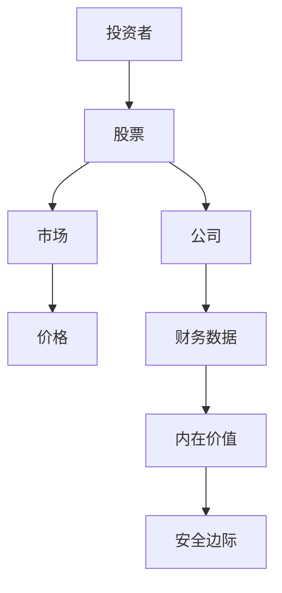
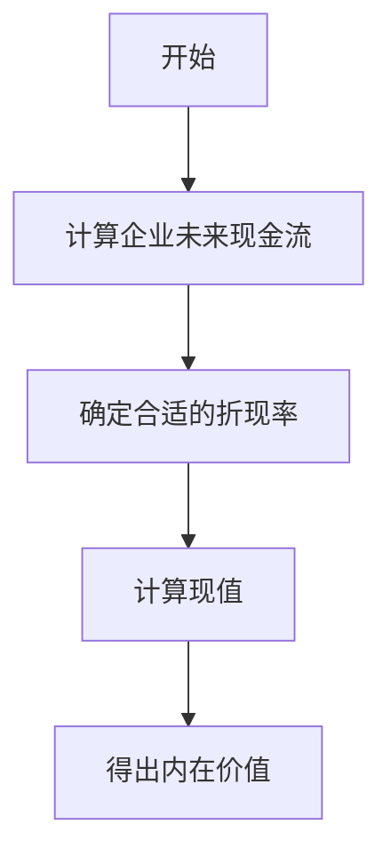
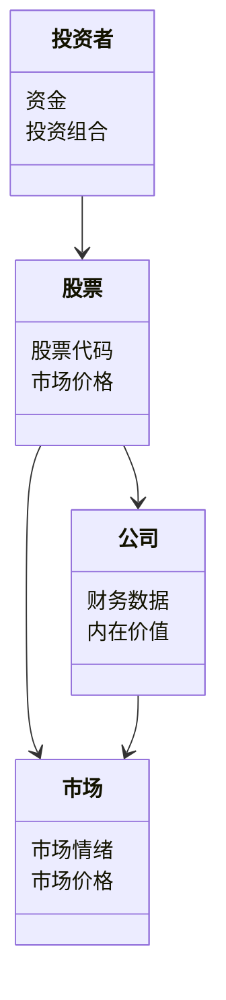

                 


# 格雷厄姆特价股票理论对公司估值方法的影响

## 关键词：
格雷厄姆、股票估值、内在价值、安全边际、价值投资、基本面分析、数学模型

## 摘要：
本文探讨了本杰明·格雷厄姆的特价股票理论对公司估值方法的影响。通过分析内在价值、安全边际等核心概念，结合数学模型和实际案例，展示了如何利用格雷厄姆理论进行投资决策，并评估其在现代投资策略中的价值。

---

# 第1章: 格雷厄姆特价股票理论的背景与核心概念

## 1.1 问题背景与问题描述

### 1.1.1 传统股票估值方法的局限性
传统的股票估值方法主要依赖于市盈率（P/E）、市净率（P/B）等指标，这些指标在市场波动较大时往往失效，无法准确反映企业的实际价值。

### 1.1.2 格雷厄姆特价股票理论的提出背景
本杰明·格雷厄姆在20世纪初提出的价值投资理念，强调以企业的内在价值为基础，而非市场情绪决定股票价格。这种方法在市场恐慌或低估时尤为有效。

### 1.1.3 格雷厄姆理论的核心目标
格雷厄姆的目标是通过识别市场价格低于内在价值的股票，为投资者提供安全边际，降低投资风险。

## 1.2 格雷厄姆理论的核心概念

### 1.2.1 内在价值
内在价值是基于企业基本面分析的真正价值，计算公式为：
$$ \text{内在价值} = \frac{\text{息税前利润} \times (1 - \text{税率})}{\text{资本成本}} $$

### 1.2.2 安全边际
安全边际 = 内在价值 - 市场价格，确保投资者在市场价格波动时仍能获利。

### 1.2.3 市场价格与内在价值的关系
市场价格受市场情绪影响，而内在价值反映企业的真实情况。通过安全边际，投资者可以在市场低估时买入，高估时卖出。

## 1.3 格雷厄姆理论的边界与外延

### 1.3.1 适用范围
格雷厄姆理论适用于基本面稳定、财务透明的企业，尤其在市场低迷时更具优势。

### 1.3.2 理论局限性
格雷厄姆方法不适合高增长行业或新兴市场，且需要大量历史数据支持。

### 1.3.3 对比其他估值方法
与技术分析相比，格雷厄姆理论更注重基本面，强调长期投资而非短期波动。

---

# 第2章: 格雷厄姆理论的核心概念与联系

## 2.1 内在价值、市场价格、安全边际的对比

| 特性         | 内在价值                  | 市场价格                  | 安全边际                  |
|--------------|---------------------------|---------------------------|---------------------------|
| 定义         | 企业的真实价值             | 市场供需决定的价格         | 内在价值与市场价格差值     |
| 计算方法     | 基于基本面分析             | 市场供需                    | 内在价值减去市场价格       |
| 稳定性       | 稳定                     | 波动                     | 动态变化                  |
| 影响因素     | 财务状况、行业地位         | 市场情绪、投资者心理       | 内在价值、市场价格         |

## 2.2 核心概念的ER实体关系图



---

# 第3章: 格雷厄姆理论的算法原理

## 3.1 内在价值计算算法



## 3.2 内在价值计算的Python代码

```python
def calculate_intrinsic_value(cash_flows, discount_rate):
    present_value = sum(flow / (1 + discount_rate) ** year for year, flow in enumerate(cash_flows))
    return present_value

cash_flows = [100, 150, 200, 250]
discount_rate = 0.08

intrinsic_value = calculate_intrinsic_value(cash_flows, discount_rate)
print(f"内在价值为：{intrinsic_value}")
```

## 3.3 安全边际计算公式
$$ \text{安全边际} = \text{内在价值} - \text{市场价格} $$

---

# 第4章: 格雷厄姆理论的系统分析与架构设计

## 4.1 系统功能设计



---

# 第5章: 格雷厄姆理论的项目实战

## 5.1 项目环境安装
安装必要的Python库，如`pandas`和`numpy`，用于数据处理和计算。

## 5.2 核心代码实现

```python
import pandas as pd
import numpy as np

def calculate_intrinsic_value(finance_data, discount_rate):
    # 计算未来现金流的现值
    cash_flows = finance_data['现金流'].tolist()
    present_value = sum(flow / (1 + discount_rate) ** idx for idx, flow in enumerate(cash_flows))
    return present_value

# 示例数据
data = {
    '现金流': [100, 150, 200, 250]
}
finance_data = pd.DataFrame(data)
discount_rate = 0.08

iv = calculate_intrinsic_value(finance_data, discount_rate)
print(f"内在价值：{iv}")
```

## 5.3 实际案例分析
以某公司为例，计算其内在价值和安全边际，判断是否具备投资价值。

---

# 第6章: 格雷厄姆理论的总结与展望

## 6.1 最佳实践Tips
- 定期更新财务数据和市场信息。
- 结合多种估值方法进行综合判断。

## 6.2 小结
格雷厄姆的特价股票理论为投资者提供了基于基本面的估值方法，强调安全边际的重要性。

## 6.3 注意事项
- 确保数据来源可靠。
- 了解格雷厄姆理论的适用场景。

## 6.4 拓展阅读
建议阅读格雷厄姆的《聪明的投资者》和彼得·林奇的投资著作。

---

# 作者：AI天才研究院/AI Genius Institute & 禅与计算机程序设计艺术/Zen And The Art of Computer Programming

