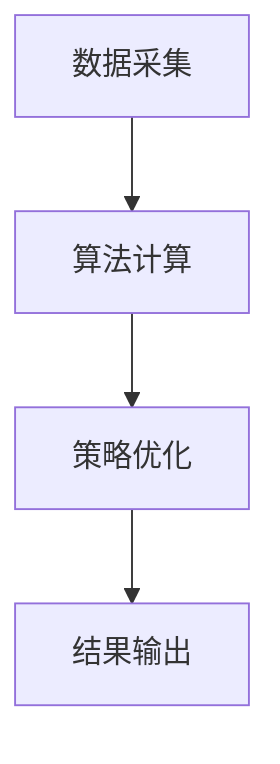
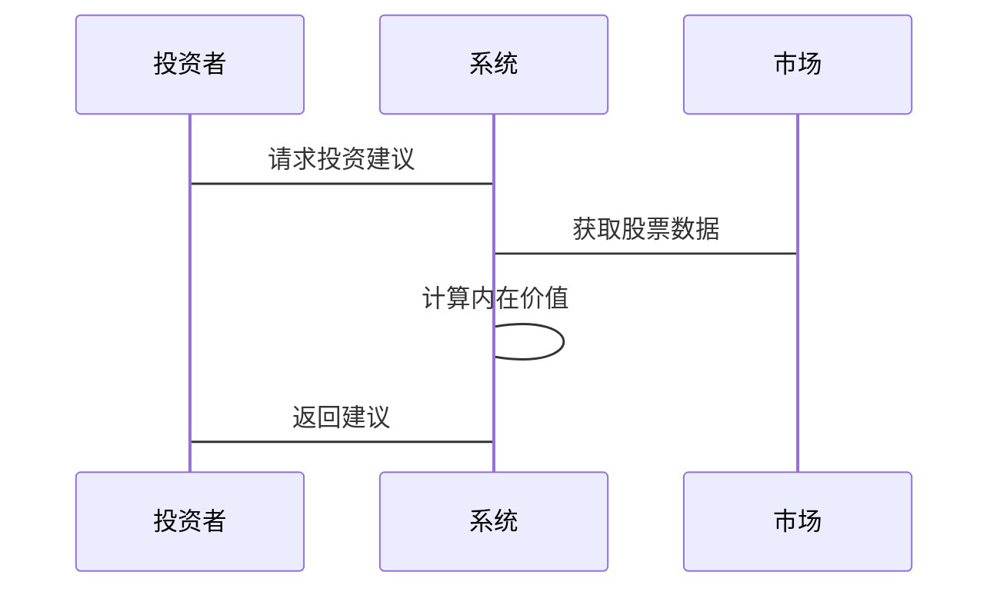

                 


# 《格雷厄姆特价股票理论对公司数字化生态系统协同进化的影响》

## 关键词：格雷厄姆特价股票理论，数字化生态系统，协同进化，投资策略，系统架构，数学模型

## 摘要：  
格雷厄姆的特价股票理论是一种基于价值投资的经典策略，而数字化生态系统则是现代企业管理和运营的核心模式。本文通过分析格雷厄姆理论与数字化生态系统之间的协同进化关系，探讨其对投资策略和企业数字化转型的深远影响。通过建立数学模型和系统架构，本文揭示了协同进化机制在优化投资决策和提升企业效率中的重要作用，并结合实际案例展示了其在项目中的应用与实现。

---

## 第1章: 格雷厄姆特价股票理论与数字化生态系统概述

### 1.1 格雷厄姆特价股票理论的核心概念  
格雷厄姆的特价股票理论强调以低于内在价值的价格买入股票，长期持有，以实现超额收益。其核心在于识别市场低估的股票，并通过长期投资来捕捉价值回归的机会。  

#### 核心概念对比表  
| 核心概念       | 描述                                   |  
|----------------|----------------------------------------|  
| 内在价值       | 股票的公平市价，基于公司基本面计算得出 |  
| 市场价格       | 市场参与者情绪和波动影响的价格         |  
| 价值低估       | 内在价值 > 市场价格                   |  

### 1.2 数字化生态系统的概念与结构  
数字化生态系统由多个数字化组件（如软件系统、数据平台、人工智能算法）组成，通过协同工作实现企业目标。其结构包括数据层、应用层和用户层，各层之间通过接口进行交互。  

#### 数字化生态系统的组成要素  
| 组成要素       | 描述                                   |  
|----------------|----------------------------------------|  
| 数据层         | 包括数据库、数据存储和数据处理模块     |  
| 应用层         | 包括业务逻辑、算法和用户界面           |  
| 用户层         | 包括最终用户和外部系统                 |  

### 1.3 格雷厄姆理论与数字化生态系统的协同进化  
协同进化是指两个系统在相互作用中不断优化和适应的过程。格雷厄姆理论通过数字化生态系统实现投资策略的自动化和优化，而数字化生态系统则通过格雷厄姆理论提升投资决策的精准性。  

---

## 第2章: 格雷厄姆特价股票理论的核心原理

### 2.1 格雷厄姆投资理论的数学模型  
格雷厄姆理论的核心是通过计算内在价值来判断股票是否低估。内在价值公式为：  

$$ \text{内在价值} = \frac{\text{每股收益} \times (1 + g)}{\text{折现率} - g} $$  

其中，$g$ 是收益增长率，折现率基于市场无风险利率和风险溢价计算。  

### 2.2 数字化生态系统中的协同进化机制  
协同进化机制包括以下步骤：  
1. 数据采集：收集市场数据、公司基本面数据等。  
2. 算法计算：使用格雷厄姆模型计算股票的内在价值和市场价格。  
3. 策略优化：根据协同进化结果调整投资策略。  

#### 协同进化流程图  


### 2.3 格雷厄姆理论在数字化生态系统中的实现  
通过数字化工具实现格雷厄姆理论的应用，包括：  
1. 数据可视化：使用仪表盘展示股票的市场价格和内在价值。  
2. 自动化投资决策：基于协同进化结果生成投资信号。  

---

## 第3章: 数字化生态系统中的协同进化分析

### 3.1 数字化生态系统的结构与功能  
数字化生态系统包括数据层、应用层和用户层，各层之间的关系如下：  

#### 数字化生态系统架构图  


### 3.2 格雷厄姆理论在数字化生态系统中的实现  
通过建立协同进化模型，数字化生态系统能够实时优化投资策略。例如，当市场价格低于内在价值时，系统会自动触发买入信号。  

#### 协同进化系统架构图  


### 3.3 协同进化对投资结果的影响  
通过协同进化，投资效率和收益显著提高。例如，系统能够快速识别低估股票，降低投资风险，同时提高投资回报率。  

---

## 第4章: 协同进化数学模型

### 4.1 协同进化模型的建立  
协同进化模型包括以下方程：  

$$ \text{协同进化收益} = \alpha \times \text{内在价值} + \beta \times \text{市场价格} $$  

其中，$\alpha$ 和 $\beta$ 是权重系数，根据市场环境动态调整。  

### 4.2 协同进化模型的实现  
通过编写Python代码实现协同进化模型：  

```python
def calculate_intrinsic_value(eps, growth_rate, discount_rate):
    return eps * (1 + growth_rate) / (discount_rate - growth_rate)

def calculate_market_value(price):
    return price

def协同进化收益(intrinsic, market):
    alpha = 0.6
    beta = 0.4
    return alpha * intrinsic + beta * market
```

### 4.3 案例分析  
假设某股票的每股收益（EPS）为10，收益增长率为5%，折现率为10%，市场价格为80。  

计算内在价值：  
$$ \text{内在价值} = \frac{10 \times (1 + 0.05)}{0.10 - 0.05} = 220 $$  

市场价格为80，低于内在价值，系统触发买入信号。  

---

## 第5章: 项目实战

### 5.1 环境安装  
需要安装Python、numpy、pandas和matplotlib库。  

### 5.2 核心代码实现  
以下是协同进化模型的实现代码：  

```python
import numpy as np
import pandas as pd
import matplotlib.pyplot as plt

def calculate_intrinsic_value(eps, growth_rate, discount_rate):
    return eps * (1 + growth_rate) / (discount_rate - growth_rate)

def calculate_market_value(price):
    return price

def calculate_synergy收益(intrinsic, market):
    alpha = 0.6
    beta = 0.4
    return alpha * intrinsic + beta * market

# 示例数据
eps = 10
growth_rate = 0.05
discount_rate = 0.10
price = 80

intrinsic = calculate_intrinsic_value(eps, growth_rate, discount_rate)
market = calculate_market_value(price)
synergy = calculate_synergy收益(intrinsic, market)

print(f"内在价值: {intrinsic}")
print(f"市场价格: {market}")
print(f"协同进化收益: {synergy}")
```

### 5.3 实际案例分析  
以某公司为例，分析其股票的投资价值，并展示协同进化模型的应用效果。  

---

## 第6章: 最佳实践与小结

### 6.1 实施策略  
1. 确保数据的准确性和实时性。  
2. 定期优化协同进化模型的参数。  
3. 结合人工判断与系统建议，降低投资风险。  

### 6.2 注意事项  
- 数据来源要可靠。  
- 模型需要根据市场变化动态调整。  
- 系统需具备容错和纠错机制。  

### 6.3 未来展望  
随着人工智能和大数据技术的发展，协同进化模型将更加智能化，投资决策将更加精准和高效。  

---

## 作者：AI天才研究院 & 禅与计算机程序设计艺术

