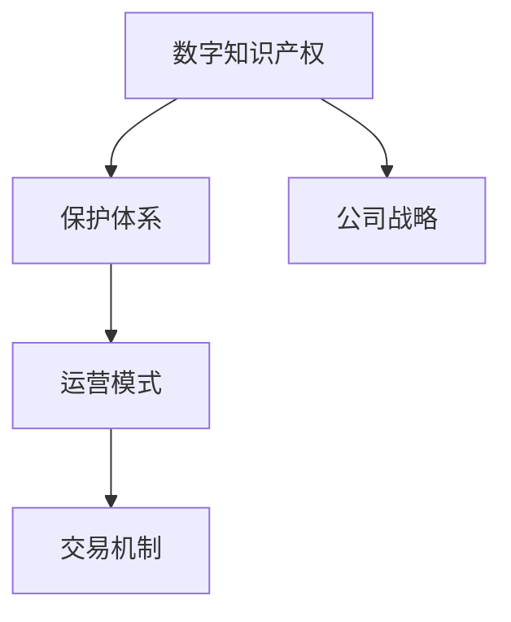
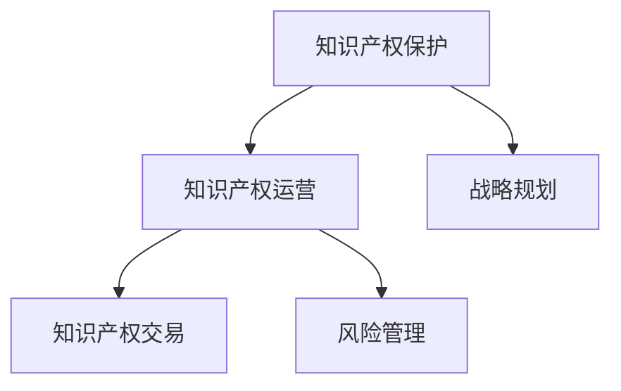
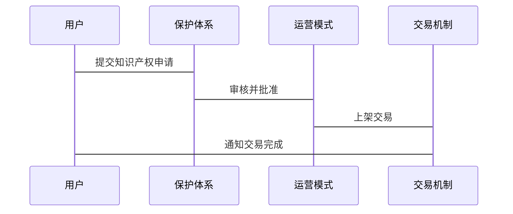

                 


# 《格雷厄姆特价股票理论对公司数字知识产权生态系统战略的影响》

---

## 关键词：
格雷厄姆理论、数字知识产权、股票投资、生态系统、知识产权战略

---

## 摘要：
本文探讨了格雷厄姆特价股票理论如何影响公司数字知识产权生态系统的战略。通过分析安全边际和价值评估方法，本文揭示了如何将格雷厄姆理论应用于数字知识产权的保护、运营和交易中。结合数学模型和系统架构设计，本文提出了一个创新的数字知识产权生态系统架构，并通过实际案例展示了如何在实践中应用这些理论。最终，本文总结了最佳实践和注意事项，为公司制定数字知识产权战略提供了宝贵的指导。

---

## 第一部分：背景介绍

### 第1章：格雷厄姆特价股票理论的核心概念

#### 1.1 安全边际
安全边际是格雷厄姆投资理论中的核心概念，指股票的市场价格与其内在价值之间的差距。这种差距提供了投资的安全性，确保在市场波动中投资者不会遭受重大损失。

- **定义**：安全边际 = 内在价值 - 市场价格
- **计算方法**：通过分析公司的财务数据和市场环境，估算其内在价值，然后与市场价格进行比较。
- **应用**：在投资决策中，选择具有较大安全边际的股票，以降低风险并确保长期收益。

#### 1.2 价值评估方法
格雷厄姆提出了多种价值评估方法，包括现金流量折现法、市盈率和市净率分析，以及内在价值计算。

- **现金流量折现法**：通过预测公司未来的现金流，并将其折现为当前价值。
- **市盈率和市净率分析**：通过比较股票的市盈率和市净率与行业平均水平，判断其估值是否合理。
- **内在价值计算**：使用公式 $$ V = \frac{CF}{r} $$，其中 \( V \) 是内在价值，\( CF \) 是现金流，\( r \) 是折现率。

### 第2章：数字知识产权的生态系统

#### 2.1 数字知识产权的定义与特征
数字知识产权是指在数字环境下产生的各种知识产权，包括软件、数据、算法、品牌等。其核心特征包括无形性、可复制性和易于传播。

- **定义**：数字知识产权是指在数字环境中通过技术手段创造的智力成果，具有法律保护的独占权。
- **特征对比表**：

| 特征    | 描述                                   |
|---------|----------------------------------------|
| 无形性   | 数字知识产权通常表现为数据或信息，而非实物。 |
| 可复制性 | 数字内容可以轻松复制和传播。           |
| 易于传播 | 数字内容可以通过互联网快速传播。       |

#### 2.2 数字知识产权生态系统架构
数字知识产权生态系统由多个模块组成，包括知识产权保护、运营和交易。

- **知识产权保护体系**：通过法律和技术手段保护数字知识产权，防止侵权。
- **知识产权运营模式**：通过许可、转让等方式实现知识产权的商业化。
- **知识产权交易机制**：建立高效的市场机制，促进数字知识产权的流通。

---

## 第二部分：格雷厄姆理论与数字知识产权战略的结合

### 第3章：格雷厄姆理论在数字知识产权评估中的应用

#### 3.1 安全边际在数字知识产权定价中的应用
安全边际的概念可以应用于数字知识产权的定价，确保其估值合理，降低投资风险。

- **数学模型**：
  $$ \text{安全边际} = \text{内在价值} - \text{市场价格} $$

- **应用案例**：假设某数字知识产权的内在价值为 $100 万，市场价格为 $80 万，则安全边际为 $20 万，具有较高的投资价值。

#### 3.2 格雷厄姆价值评估方法在数字知识产权战略中的应用
通过格雷厄姆的价值评估方法，公司可以更准确地评估数字知识产权的价值，制定合理的投资策略。

- **现金流量折现法**：用于评估数字知识产权的未来收益，确保其内在价值计算的准确性。
- **市盈率和市净率分析**：通过比较同类知识产权的市场估值，判断当前估值是否合理。

### 第4章：数字知识产权生态系统中的投资策略

#### 4.1 格雷厄姆策略在数字知识产权领域的适用性
格雷厄姆的投资策略在数字知识产权领域同样适用，但需要考虑其特殊性。

- **特殊性**：数字知识产权的无形性和可复制性增加了其估值的复杂性。
- **调整策略**：在评估数字知识产权时，需考虑其技术风险和市场风险，动态调整安全边际。

#### 4.2 数字知识产权生态系统中的价值发现
价值发现是数字知识产权战略的重要组成部分，通过识别高价值的知识产权，提升公司的核心竞争力。

- **价值发现步骤**：
  1. 确定目标市场和竞争对手。
  2. 分析潜在知识产权的市场前景。
  3. 评估其内在价值和市场价格。
  4. 制定相应的投资策略。

---

## 第三部分：数字知识产权生态系统中的战略实施

### 第5章：数字知识产权生态系统中的战略规划

#### 5.1 数字知识产权战略规划的步骤
战略规划是数字知识产权生态系统成功实施的关键。

- **步骤**：
  1. 确定战略目标：如提升品牌影响力、扩大市场份额等。
  2. 分析市场环境：包括竞争对手、市场需求和技术趋势。
  3. 制定实施计划：包括资源分配、时间表和风险管理。

#### 5.2 数字知识产权生态系统中的风险管理
有效的风险管理可以降低战略实施中的不确定性。

- **风险识别与评估**：通过分析潜在风险，制定应对策略。
- **风险应对策略**：包括分散投资、保险和法律保护等。
- **风险监控与反馈**：定期评估风险应对效果，及时调整策略。

### 第6章：数字知识产权生态系统中的投资组合优化

#### 6.1 投资组合优化的定义与目标
投资组合优化是通过合理配置资源，实现最大收益和最小风险。

- **定义**：投资组合优化是通过调整投资比例，使风险和收益达到最佳平衡。
- **目标**：实现收益最大化，同时降低投资风险。

#### 6.2 数字知识产权生态系统中的投资组合优化
通过优化投资组合，公司可以更有效地配置资源，提升整体收益。

- **数学模型**：
  $$ \text{收益} = \sum (w_i \times r_i) $$
  $$ \text{风险} = \sum (w_i^2 \times \sigma_i^2) $$
  其中，\( w_i \) 是投资比例，\( r_i \) 是预期收益，\( \sigma_i \) 是收益的标准差。

---

## 第四部分：系统分析与架构设计

### 第7章：数字知识产权生态系统中的系统架构

#### 7.1 领域模型设计
领域模型描述了数字知识产权生态系统的核心要素及其关系。

- **领域模型**（Mermaid图）：



#### 7.2 系统架构设计
系统架构设计展示了数字知识产权生态系统的整体结构。

- **系统架构图**（Mermaid图）：



#### 7.3 接口和交互设计
接口设计和交互流程确保系统的高效运行。

- **接口设计**：定义了系统内部各模块之间的接口，确保数据流和功能调用的顺利进行。
- **交互流程**（Mermaid图）：



---

## 第五部分：项目实战

### 第8章：数字知识产权生态系统中的项目实战

#### 8.1 环境配置
项目实战需要配置合适的开发环境和工具。

- **工具安装**：安装必要的开发工具，如Python、Git等。
- **环境设置**：配置开发环境，确保各模块能够协同工作。

#### 8.2 核心代码实现
以下是核心代码实现，展示了如何将格雷厄姆理论应用于数字知识产权评估。

```python
def calculate_intrinsic_value(cash_flows, discount_rate):
    return sum(cash_flow / (1 + discount_rate)**i for i, cash_flow in enumerate(cash_flows))

def calculate_margin_of_safety(intrinsic_value, market_price):
    return intrinsic_value - market_price

# 示例
cash_flows = [1000000] * 5  # 假设每年现金流为100万
discount_rate = 0.1  # 折现率10%
intrinsic_value = calculate_intrinsic_value(cash_flows, discount_rate)
market_price = 800000  # 市场价格为80万
margin_of_safety = calculate_margin_of_safety(intrinsic_value, market_price)

print(f"内在价值: {intrinsic_value}")
print(f"市场价格: {market_price}")
print(f"安全边际: {margin_of_safety}")
```

#### 8.3 案例分析
通过一个具体案例，分析如何应用格雷厄姆理论制定数字知识产权战略。

- **案例分析**：假设一家公司开发了一种新型算法，评估其内在价值和市场价格，计算安全边际，制定投资策略。

---

## 第六部分：最佳实践与总结

### 第9章：总结与最佳实践

#### 9.1 总结
本文探讨了格雷厄姆理论在数字知识产权战略中的应用，通过数学模型和系统架构设计，提出了一个创新的生态系统架构。

#### 9.2 最佳实践
- **小结**：格雷厄姆理论为数字知识产权评估提供了有力工具，但需结合实际情况进行调整。
- **注意事项**：在实际应用中，需考虑数字知识产权的特殊性，动态调整策略。
- **拓展阅读**：建议进一步研究数字知识产权保护的法律和技术手段。

---

## 作者：AI天才研究院/AI Genius Institute & 禅与计算机程序设计艺术/Zen And The Art of Computer Programming

---

本文通过详细分析格雷厄姆理论与数字知识产权战略的结合，为公司制定数字知识产权生态系统战略提供了理论依据和实践指导。希望本文能为读者在数字知识产权管理方面提供新的思路和方法。

