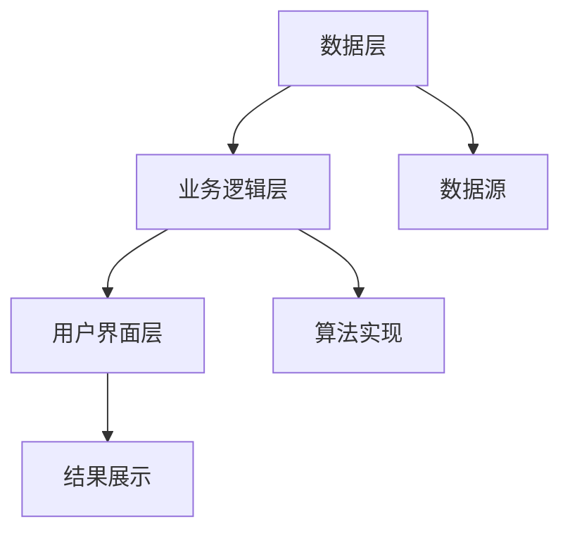
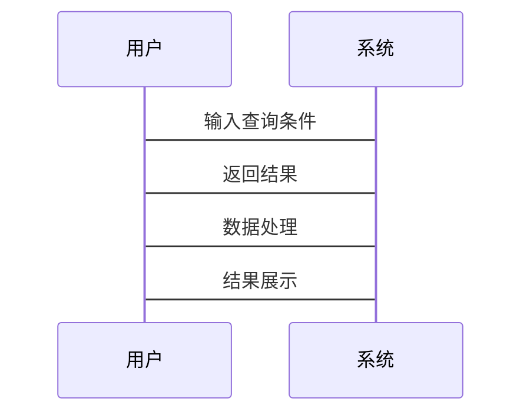

                 


# 《格雷厄姆特价股票理论对公司资本结构决策的影响》

> 关键词：格雷厄姆特价股票理论，资本结构决策，安全边际，内在价值，价值投资，资本成本

> 摘要：本文系统探讨了格雷厄姆特价股票理论对公司资本结构决策的影响。通过分析安全边际、内在价值等核心概念，结合数学模型和系统架构设计，阐述了格雷厄姆理论在资本结构优化中的应用。并通过对实际案例的分析，验证了格雷厄姆理论的有效性，同时提出了改进建议。

---

## 第一部分: 格雷厄姆特价股票理论概述

### 第1章: 格雷厄姆特价股票理论的核心概念

#### 1.1 格雷厄姆投资理论的背景与起源

- 1.1.1 价值投资的起源与发展
  - 价值投资的定义与特点
  - 格雷厄姆与巴菲特的师承关系
  - 价值投资在金融史上的地位

- 1.1.2 格雷厄姆的学术贡献与投资理念
  - 格雷厄姆的著作《证券分析》的核心思想
  - 格雷厄姆对安全边际的强调
  - 价值投资与成长投资的对比

- 1.1.3 特价股票的定义与核心特征
  - 特价股票的定义
  - 特价股票与低估股票的区别
  - 特价股票的市场特征

#### 1.2 格雷厄姆特价股票理论的核心要素

- 1.2.1 安全边际的概念与计算
  - 安全边际的定义
  - 安全边际的计算公式：$$\text{安全边际} = \text{市场价格} - \text{内在价值}$$
  - 安全边际的意义

- 1.2.2 内在价值的评估方法
  - 内在价值的定义
  - 内在价值的计算公式：$$\text{内在价值} = \frac{\text{预期收益}}{\text{折现率}}$$
  - 内在价值评估的关键因素

- 1.2.3 市场先生与投资者心理
  - 市场先生的定义
  - 投资者心理对市场的影响
  - 如何利用市场先生的波动性进行投资

#### 1.3 格雷厄姆理论与现代投资理论的联系

- 1.3.1 格雷厄姆理论在现代金融学中的地位
  - 格雷厄姆理论对CAPM模型的影响
  - 格雷厄姆理论与资产定价理论的联系

- 1.3.2 格雷厄姆理论与CAPM模型的异同
  - 格雷厄姆理论的价值导向
  - CAPM模型的市场导向
  - 两者的互补性

- 1.3.3 格雷厄姆理论与资产定价理论的融合
  - 内在价值与市场价值的统一
  - 折现率与市场利率的关系

### 第2章: 格雷厄姆特价股票理论的数学模型与公式

#### 2.1 格雷厄姆内在价值计算模型

- 2.1.1 内在价值公式：$$V = \frac{E}{1 + k}$$
  - E：预期收益
  - k：风险溢价
  - V：内在价值

- 2.1.2 安全边际计算公式：$$Margin \ of \ Safety = P - V$$
  - P：市场价格
  - V：内在价值

- 2.1.3 折现率计算公式：$$r = \frac{V}{P}$$
  - r：折现率
  - V：内在价值
  - P：市场价格

#### 2.2 格雷厄姆投资组合优化模型

- 2.2.1 投资组合的分散化效应
  - 分散化对风险的影响
  - 分散化对收益的影响

- 2.2.2 风险调整后的收益计算
  - 风险调整后的收益公式：$$R_{\text{调整后}} = R - \beta \cdot (R_m - R_f)$$
    - $\beta$：贝塔系数
    - $R_m$：市场收益
    - $R_f$：无风险利率

#### 2.3 格雷厄姆理论与CAPM模型的结合

- 2.3.1 CAPM模型的引入
  - CAPM模型的基本公式：$$R = R_f + \beta (R_m - R_f)$$

- 2.3.2 格雷厄姆理论对CAPM的修正
  - 考虑内在价值的因素
  - 考虑安全边际的因素

### 第3章: 格雷厄姆特价股票理论的系统分析与架构设计

#### 3.1 问题场景介绍

- 3.1.1 资本结构决策的复杂性
  - 资本结构的定义
  - 资本结构对公司价值的影响
  - 资本结构决策的难点

- 3.1.2 格雷厄姆理论在资本结构中的应用潜力
  - 格雷厄姆理论对资本结构优化的启示
  - 格雷厄姆理论在资本成本计算中的应用

#### 3.2 系统功能设计

- 3.2.1 资本结构评估模块
  - 资本结构评估的输入与输出
  - 资本结构评估的算法流程

- 3.2.2 内在价值计算模块
  - 内在价值计算的输入与输出
  - 内在价值计算的算法流程

- 3.2.3 安全边际分析模块
  - 安全边际分析的输入与输出
  - 安全边际分析的算法流程

#### 3.3 系统架构设计

- 3.3.1 分层架构设计
  - 数据层：数据获取与存储
  - 业务逻辑层：算法实现
  - 用户界面层：结果展示

- 3.3.2 模块间的交互关系
  - 数据流：从数据层到业务逻辑层再到用户界面层
  - 控制流：用户输入 -> 数据处理 -> 结果输出

#### 3.4 系统接口设计

- 3.4.1 输入接口设计
  - 数据输入格式
  - 数据输入接口的API设计

- 3.4.2 输出接口设计
  - 结果输出格式
  - 结果输出接口的API设计

- 3.4.3 数据流设计
  - 数据从输入到输出的流动过程
  - 数据处理的中间步骤

#### 3.5 系统交互设计

- 3.5.1 用户与系统的交互流程
  - 用户输入查询条件
  - 系统返回结果

- 3.5.2 数据处理流程
  - 数据清洗
  - 数据计算
  - 数据存储

- 3.5.3 结果展示流程
  - 结果的可视化
  - 结果的导出

### 第4章: 格雷厄姆特价股票理论的项目实战

#### 4.1 环境安装与配置

- 4.1.1 数据获取
  - 数据源的选择
  - 数据的清洗与预处理

- 4.1.2 环境配置
  - Python环境的安装与配置
  - 开发工具的安装与配置

- 4.1.3 依赖库的安装
  - Pandas、NumPy、Matplotlib等库的安装

#### 4.2 系统核心实现源代码

- 4.2.1 格雷厄姆内在价值计算代码
  ```python
  def calculate_intrinsic_value(enterprise_value, risk_premium):
      return enterprise_value / (1 + risk_premium)
  ```

- 4.2.2 安全边际计算代码
  ```python
  def calculate_margin_of_safety(market_price, intrinsic_value):
      return market_price - intrinsic_value
  ```

- 4.2.3 资本结构优化代码
  ```python
  def optimize_capital_structure(value, cost_of_debt, cost_of_equity):
      # 简化版资本结构优化公式
      return (cost_of_debt / (cost_of_equity - cost_of_debt)) * value
  ```

#### 4.3 代码应用解读与分析

- 4.3.1 格雷厄姆内在价值计算代码解读
  - 计算内在价值的意义
  - 风险溢价的选择

- 4.3.2 安全边际计算代码解读
  - 安全边际的重要性
  - 如何选择市场价格

- 4.3.3 资本结构优化代码解读
  - 资本结构优化的目标
  - 如何平衡债务与股权成本

#### 4.4 案例分析与详细讲解

- 4.4.1 案例背景介绍
  - 某公司资本结构现状
  - 案例目标

- 4.4.2 案例分析与结果展示
  - 内在价值计算结果
  - 安全边际计算结果
  - 资本结构优化建议

- 4.4.3 结果解读与总结
  - 格雷厄姆理论的应用效果
  - 改进建议

#### 4.5 项目小结

- 4.5.1 项目总结
  - 格雷厄姆理论在资本结构决策中的应用价值
  - 项目实现的意义

- 4.5.2 项目局限性
  - 数据依赖性
  - 理论的局限性

- 4.5.3 未来改进方向
  - 数据来源的扩展
  - 理论的进一步完善

---

## 第二部分: 格雷厄姆特价股票理论对资本结构决策的影响

### 第5章: 格雷厄姆理论与资本结构优化

#### 5.1 格雷厄姆理论对资本结构决策的启示

- 5.1.1 内在价值与资本结构的关系
  - 内在价值对资本结构的影响
  - 资本结构对内在价值的影响

- 5.1.2 安全边际在资本结构优化中的应用
  - 安全边际对资本成本的影响
  - 安全边际对资本结构稳定性的影响

- 5.1.3 格雷厄姆理论对资本结构决策的具体建议
  - 如何通过安全边际优化资本结构
  - 如何通过内在价值评估调整资本结构

#### 5.2 格雷厄姆理论在资本成本计算中的应用

- 5.2.1 资本成本的定义与计算
  - 资本成本的定义
  - 资本成本的计算方法

- 5.2.2 格雷厄姆理论对资本成本的影响
  - 内在价值对资本成本的影响
  - 安全边际对资本成本的影响

- 5.2.3 资本成本与资本结构的关系
  - 资本成本对资本结构的影响
  - 资本结构对资本成本的影响

#### 5.3 格雷厄姆理论在企业融资决策中的应用

- 5.3.1 融资方式的多样性
  - 债务融资
  - 股权融资
  - 混合融资

- 5.3.2 格雷厄姆理论对企业融资方式的选择
  - 安全边际对企业融资方式的影响
  - 内在价值对企业融资方式的影响

- 5.3.3 融资成本与融资结构的关系
  - 融资成本对企业价值的影响
  - 融资结构对企业价值的影响

### 第6章: 格雷厄姆理论与现代资本结构理论的融合

#### 6.1 格雷厄姆理论与CAPM模型的结合

- 6.1.1 CAPM模型的引入
  - CAPM模型的基本公式
  - CAPM模型在资本结构决策中的应用

- 6.1.2 格雷厄姆理论对CAPM模型的修正
  - 内在价值对CAPM模型的影响
  - 安全边际对CAPM模型的影响

- 6.1.3 格雷厄姆与CAPM模型的优缺点对比
  - 格雷厄姆理论的优点
  - CAPM模型的优点
  - 两者的局限性

#### 6.2 格雷厄姆理论与MM定理的对比

- 6.2.1 MM定理的基本内容
  - MM定理的定义
  - MM定理在资本结构决策中的应用

- 6.2.2 格雷厄姆理论对MM定理的补充
  - 内在价值对MM定理的影响
  - 安全边际对MM定理的影响

- 6.2.3 格雷厄姆理论与MM定理的结合
  - 结合两者的优势
  - 结合两者的方法

#### 6.3 格雷厄姆理论与资产定价理论的融合

- 6.3.1 资产定价理论的基本内容
  - 资产定价理论的定义
  - 资产定价理论在资本结构决策中的应用

- 6.3.2 格雷厄姆理论对资产定价理论的补充
  - 内在价值对资产定价的影响
  - 安全边际对资产定价的影响

- 6.3.3 格雷厄姆理论与资产定价理论的优缺点对比
  - 格雷厄姆理论的优点
  - 资产定价理论的优点
  - 两者的局限性

### 第7章: 格雷厄姆理论在实际资本结构决策中的应用案例

#### 7.1 案例背景介绍

- 7.1.1 某公司的资本结构现状
  - 资本结构的现状
  - 资本结构对公司价值的影响
  - 资本结构对公司风险的影响

- 7.1.2 案例目标
  - 优化资本结构
  - 降低资本成本
  - 提高公司价值

#### 7.2 案例分析与结果展示

- 7.2.1 内在价值计算
  - 内在价值计算的步骤
  - 内在价值计算的结果

- 7.2.2 安全边际分析
  - 安全边际分析的步骤
  - 安全边际分析的结果

- 7.2.3 资本结构优化建议
  - 资本结构优化的步骤
  - 资本结构优化的结果

#### 7.3 结果解读与总结

- 7.3.1 格雷厄姆理论的应用效果
  - 内在价值计算的意义
  - 安全边际分析的意义
  - 资本结构优化的意义

- 7.3.2 格雷厄姆理论的局限性
  - 数据依赖性
  - 理论的局限性

- 7.3.3 未来研究方向
  - 数据来源的扩展
  - 理论的进一步完善

---

## 第三部分: 结论与展望

### 第8章: 结论与展望

#### 8.1 格雷厄姆理论对资本结构决策的影响总结

- 8.1.1 格雷厄姆理论的核心贡献
  - 内在价值与安全边际的提出
  - 价值投资理念的创新

- 8.1.2 格雷厄姆理论在资本结构决策中的应用
  - 内在价值与资本结构的关系
  - 安全边际与资本结构的关系

#### 8.2 格雷厄姆理论的局限性与改进方向

- 8.2.1 格雷厄姆理论的局限性
  - 数据依赖性
  - 理论的局限性

- 8.2.2 未来研究方向
  - 数据来源的扩展
  - 理论的进一步完善

#### 8.3 对未来资本结构决策的建议

- 8.3.1 结合格雷厄姆理论与现代资本结构理论
  - 结合格雷厄姆理论与CAPM模型
  - 结合格雷厄姆理论与MM定理

- 8.3.2 提高资本结构决策的科学性
  - 提高资本结构决策的准确性
  - 提高资本结构决策的可操作性

- 8.3.3 加强理论与实践的结合
  - 理论指导实践
  - 实践验证理论

---

## 附录

### 附录A: 格雷厄姆理论相关公式汇总

- 内在价值公式：$$V = \frac{E}{1 + k}$$
- 安全边际公式：$$Margin \ of \ Safety = P - V$$
- 折现率公式：$$r = \frac{V}{P}$$

### 附录B: 系统架构图



### 附录C: 系统交互图



---

## 作者：AI天才研究院/AI Genius Institute & 禅与计算机程序设计艺术 /Zen And The Art of Computer Programming

---

**说明：**
以上是《格雷厄姆特价股票理论对公司资本结构决策的影响》的技术博客文章的完整目录大纲。本文将通过逐步分析与实际案例，深入探讨格雷厄姆特价股票理论对公司资本结构决策的影响，结合数学公式、系统架构设计与实际案例分析，提供详实的理论支持与实践指导。

