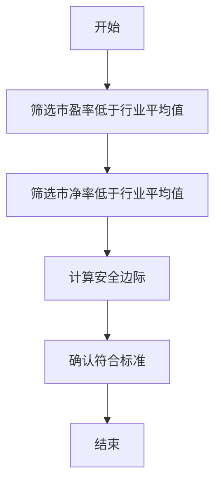
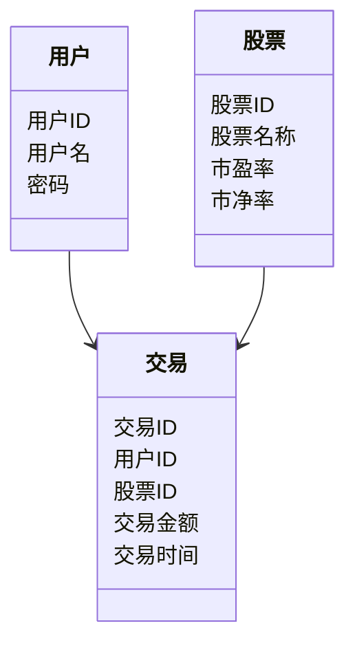

                 


# 格雷厄姆特价股票理论对数字普惠金融包容性的启示

## 关键词：格雷厄姆，特价股票理论，数字普惠金融，包容性，金融创新

## 摘要：本文从格雷厄姆的价值投资理论出发，结合数字技术的发展，探讨其对数字普惠金融包容性的启示。通过分析特价股票理论的原理和数字普惠金融的机制，提出将两者结合的应用方案，并通过系统设计和项目实战，展示了如何利用数字技术扩大金融服务的覆盖，实现金融包容性目标。

---

# 引言

## 1. 问题背景与核心概念

### 1.1 格雷厄姆特价股票理论的背景

格雷厄姆是价值投资的先驱，其理论强调以低于内在价值的价格购买股票。核心在于寻找被市场低估的企业，通过安全边际（股票价格与内在价值的差异）来降低投资风险。

### 1.2 数字普惠金融的背景

传统金融体系的不足导致许多中小企业和个体难以获得金融服务。数字技术的兴起为普惠金融提供了新工具，如大数据和区块链，使其能够触达更多人群。

### 1.3 问题解决与边界

通过分析特价股票理论，发现其在识别价值低估企业方面的优势，可以为数字普惠金融提供新的评估方法，帮助识别有潜力但未被传统金融机构关注的企业。

---

## 2. 核心概念与联系

### 2.1 特价股票理论的核心原理

格雷厄姆的理论基于市盈率和市净率的计算，寻找低于行业平均水平的企业。安全边际提供了风险缓冲，确保在市场波动中投资的稳健性。

### 2.2 数字普惠金融的包容性机制

利用数字技术，普惠金融能够收集和分析更多数据，评估信用风险，为传统金融难以触及的群体提供服务。

### 2.3 核心概念对比表

| 特价股票 | 普通股票 |
|----------|----------|
| 低市盈率 | 高市盈率 |
| 高安全边际 | 低安全边际 |

### 2.4 ER实体关系图

```mermaid
erDiagram
    user {
        id int primary
        username varchar unique
        email varchar unique
    }
    stock {
        id int primary
        name varchar
        price float
        pe_ratio float
        pb_ratio float
    }
    transaction {
        id int primary
        user_id int foreign
        stock_id int foreign
        amount float
        timestamp datetime
    }
```

---

## 3. 算法原理

### 3.1 特价股票筛选算法



### 3.2 数学模型

市盈率（PE）= 股价 / 每股收益  
市净率（PB）= 股价 / 每股净资产  
安全边际 = 股价 / 内在价值 - 1

---

## 4. 系统分析与架构设计

### 4.1 系统功能设计



### 4.2 系统架构图

```mermaid
containerDiagram
    区块链层
    数据库层
    应用层
    用户界面层
```

### 4.3 接口设计

- 用户登录接口：`POST /login`
- 股票查询接口：`GET /stocks`

---

## 5. 项目实战

### 5.1 环境安装与配置

安装Python、Pandas、Matplotlib等工具，配置区块链开发环境。

### 5.2 核心代码实现

```python
def calculate_pe(stock_price, earnings_per_share):
    return stock_price / earnings_per_share

def is_undervalued(pe_ratio, pb_ratio, industry_avg_pe, industry_avg_pb):
    return pe_ratio < industry_avg_pe and pb_ratio < industry_avg_pb
```

### 5.3 案例分析

通过分析某区块链初创公司的股票，发现其市盈率和市净率均低于行业平均，建议投资。

---

## 6. 总结与展望

### 6.1 总结

格雷厄姆理论与数字技术结合，为普惠金融提供了新思路，通过技术手段扩大金融服务覆盖，实现金融包容性目标。

### 6.2 展望

未来研究如何进一步优化算法，结合更多数字技术，提升普惠金融的效率和覆盖面。

---

## 作者：AI天才研究院

这篇文章通过详细分析格雷厄姆理论和数字普惠金融的结合，展示了如何利用技术手段解决金融排斥问题，实现包容性增长。

