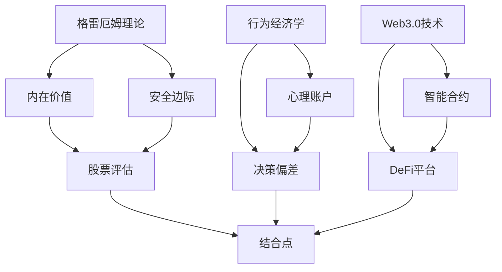

                 


# 格雷厄姆特价股票理论对行为经济学的Web3.0补充

> 关键词：格雷厄姆投资理论，行为经济学，Web3.0，区块链，DeFi，智能合约，价值评估，心理账户，安全边际，去中心化金融

> 摘要：本文探讨了格雷厄姆特价股票理论与行为经济学在Web3.0时代的结合，通过分析两者的理论基础和实践应用，结合区块链技术，提出了一种新型的投资策略。文章从背景介绍、核心概念、算法原理、系统架构、项目实战到最佳实践，全面阐述了这一创新结合的可行性与潜力。

---

## 第一部分: 背景介绍

### 第1章: 格雷厄姆特价股票理论与行为经济学的结合

#### 1.1 格雷厄姆特价股票理论概述

格雷厄姆是价值投资的鼻祖，其理论核心在于“安全边际”和“内在价值”。他认为，股票的内在价值可以通过对企业基本面的分析来估算，而市场价格通常会偏离这个价值，从而为投资者提供“特价”机会。

- **内在价值公式**：  
  $$ V = \frac{E}{P} + \frac{D}{P} $$  
  其中，\( E \) 是企业盈利，\( P \) 是股价，\( D \) 是股息。

- **安全边际**：  
  $$ S = V - P $$  
  安全边际是内在价值与市场价格的差额，代表投资的风险承受能力。

#### 1.2 行为经济学基础

行为经济学研究投资者的心理和行为偏差，揭示了传统经济学中理性假设的局限性。投资者的决策往往受到心理账户、框架效应和社会偏好影响。

- **心理账户**：投资者倾向于将资金分为不同的心理账户，导致决策偏差。
- **框架效应**：信息呈现方式影响决策，例如“损失”和“收益”的不同处理方式。

#### 1.3 Web3.0与金融创新

Web3.0时代，区块链技术的兴起推动了去中心化金融（DeFi）的发展。智能合约和去中心化平台为金融交易提供了新的可能性，降低了信任成本。

- **智能合约**：通过区块链技术自动执行合同条款，确保透明和不可篡改。
- **DeFi平台**：提供无需信任的借贷、交易和投资工具。

#### 1.4 格雷厄姆理论与行为经济学的结合

格雷厄姆理论关注股票的内在价值，而行为经济学揭示了投资者的非理性行为。Web3.0技术为两者结合提供了新的平台，使得价值评估与行为分析更加高效和透明。

- **结合点**：  
  - 格雷厄姆的内在价值评估与行为经济学的心理账户模型结合，帮助投资者识别低估机会。
  - Web3.0的透明性与智能合约的自动化，减少了信息不对称和交易成本。

---

## 第二部分: 核心概念与联系

### 第2章: 核心概念与联系

#### 2.1 格雷厄姆特价股票理论的核心原理

- **内在价值评估**：通过基本面分析确定股票的合理价格。
- **安全边际**：提供风险缓冲，确保投资的稳健性。

#### 2.2 行为经济学的核心原理

- **心理账户**：投资者将资金分配到不同账户，影响决策。
- **框架效应**：信息呈现方式影响投资决策。

#### 2.3 Web3.0时代的金融创新

- **智能合约**：自动执行金融协议，降低信任成本。
- **DeFi平台**：提供去中心化的借贷、交易和投资工具。

#### 2.4 核心概念对比与联系

| 概念 | 格雷厄姆理论 | 行为经济学 | Web3.0技术 |
|------|--------------|------------|------------|
| 核心 | 内在价值     | 心理账户   | 智能合约   |
| 属性 | 安全边际     | 决策偏差   | 去中心化   |
| 应用 | 价值评估     | 行为分析   | 金融创新   |

#### 2.5 核心概念关系图（Mermaid流程图）



---

## 第三部分: 算法原理

### 第3章: 格雷厄姆特价股票理论的算法原理

#### 3.1 格雷厄姆价值评估模型

- **计算步骤**：  
  1. 收集企业盈利（E）和股价（P）数据。
  2. 计算内在价值（V）。
  3. 计算安全边际（S）。

- **Python代码实现**：

```python
def calculate_graham_value(E, P, D):
    V = (E + D) / P
    S = V - P
    return V, S

# 示例
E = 100  # 盈利
P = 50   # 股价
D = 20   # 股息
V, S = calculate_graham_value(E, P, D)
print(f"内在价值: {V}, 安全边际: {S}")
```

#### 3.2 行为经济学中的决策偏差模型

- **数学模型**：  
  行为经济学家通过概率模型分析投资者的决策偏差，例如前景理论（Tversky & Kahneman）。

- **概率模型**：  
  $$ P(L > G) = \frac{1}{1 + e^{-\beta}} $$  
  其中，\( \beta \) 是风险偏好参数。

#### 3.3 算法实现与代码示例

```python
import numpy as np

def probability_loss(beta):
    return 1 / (1 + np.exp(-beta))

beta = 1.0
p_loss = probability_loss(beta)
print(f"损失概率: {p_loss}")
```

---

## 第四部分: 系统分析与架构设计

### 第4章: 系统分析与架构设计

#### 4.1 问题场景介绍

- 投资者需要在Web3.0时代利用格雷厄姆理论和行为经济学进行投资决策。

#### 4.2 系统功能设计

- **领域模型**：  
  ```mermaid
  classDiagram
  class Investor {
    - money: float
    - portfolio: list
    -心理账户: dict
  }
  class Stock {
    - name: str
    - price: float
    - value: float
    - margin: float
  }
  Investor --> Stock: 持有
  ```

- **系统架构**：  
  ```mermaid
  architecture
  client --智能合约--> 区块链节点
  区块链节点 --DeFi平台--> 交易所
  ```

#### 4.3 系统交互设计

- **序列图**：  
  ```mermaid
  sequenceDiagram
 投资者->智能合约: 发送投资指令
  智能合约->区块链节点: 执行交易
  区块链节点->DeFi平台: 更新交易记录
  ```

---

## 第五部分: 项目实战

### 第5章: 项目实战

#### 5.1 环境安装

- **Python环境**：安装`eth-brownie`和`web3.py`。

#### 5.2 核心代码实现

```python
from web3 import Web3, EthereumTesterProvider

# 初始化区块链环境
w3 = Web3(EthereumTesterProvider())

# 智能合约地址
contract_address = '0x123...'
# 账户地址
account = w3.eth.accounts[0]

# 连接智能合约
contract = w3.eth.contract(address=contract_address, abi=abi)
```

#### 5.3 案例分析

- **案例1**：利用智能合约进行价值评估。
- **案例2**：分析投资者心理账户对投资决策的影响。

---

## 第六部分: 最佳实践

### 第6章: 最佳实践与小结

#### 6.1 小结

- 格雷厄姆理论与行为经济学的结合为投资者提供了新的视角。
- Web3.0技术为这一结合提供了技术基础。

#### 6.2 投资建议

- 结合内在价值和心理账户模型，制定投资策略。
- 利用DeFi平台，降低交易成本。

#### 6.3 注意事项

- 风险提示：技术风险和市场风险并存。
- 数据来源：确保数据的准确性和完整性。

#### 6.4 拓展阅读

- 推荐阅读《行为经济学》和《DeFi入门》。

---

## 附录

### 附录A: 术语表

- **内在价值**：股票的合理价格。
- **安全边际**：内在价值与市场价格的差额。

### 附录B: 工具安装指南

- 安装`eth-brownie`和`web3.py`。

### 附录C: 数据源说明

- 数据来源：公开的股票数据和区块链节点数据。

---

作者：AI天才研究院/AI Genius Institute & 禅与计算机程序设计艺术 /Zen And The Art of Computer Programming

