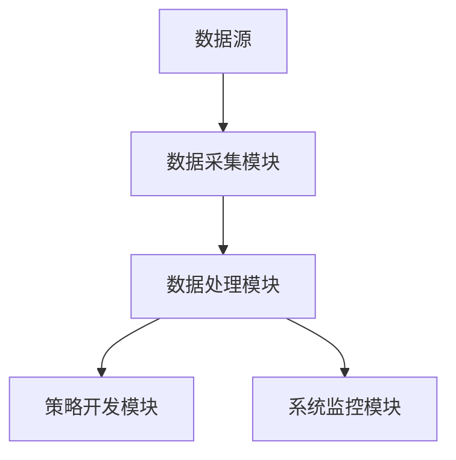

                 


# 格雷厄姆特价股票理论对量化投资的启示

> 关键词：格雷厄姆投资理论，量化投资，安全边际，低市盈率策略，数学模型

> 摘要：本文探讨了格雷厄姆的价值投资理论，特别是其特价股票策略，如何为量化投资提供启示。通过分析格雷厄姆的安全边际、低市盈率策略等核心思想，结合量化投资的数学模型和算法，本文展示了如何将格雷厄姆的理论转化为可操作的量化策略。文章还讨论了系统设计、数据处理以及实际案例，为读者提供了从理论到实践的完整指导。

---

# 第一部分: 格雷厄姆特价股票理论的核心思想

## 第1章: 格雷厄姆投资理论概述

### 1.1 格雷厄姆投资理论的起源与发展

#### 1.1.1 投资理论的演变历程

现代投资理论的发展经历了多个阶段，从传统的基本面分析到现代的量化模型，每一次演变都带来了新的视角和方法。格雷厄姆的投资理论诞生于20世纪30年代，当时正值大萧条时期，他的理论强调安全性和稳定性，旨在帮助投资者在市场波动中找到避风港。

#### 1.1.2 格雷厄姆的价值投资理念

格雷厄姆的价值投资理念的核心是寻找市场低估的股票，即市场价格低于其内在价值的股票。他主张通过基本面分析，尤其是对公司财务状况的深入研究，来识别这些被低估的投资标的。

#### 1.1.3 格雷厄姆理论的核心思想

- **安全边际**：买入价格低于内在价值，以确保有足够的安全边际。
- **低市盈率策略**：通过低市盈率筛选出潜在的低估股票。
- **长期视角**：关注公司的长期价值，而非短期市场波动。

### 1.2 格雷厄姆安全边际的概念

#### 1.2.1 安全边际的定义

安全边际是格雷厄姆理论中的核心概念，指的是买入价格与内在价值之间的差距。这个差距为投资者提供了缓冲区，以应对市场的不确定性。

$$ \text{安全边际} = \text{内在价值} - \text{市场价格} $$

#### 1.2.2 安全边际的计算方法

为了计算安全边际，首先需要估算股票的内在价值。格雷厄姆通常使用现金流折现法来计算内在价值。

$$ V = \frac{E}{1 + r} $$

其中，\( V \) 是内在价值，\( E \) 是未来现金流的现值，\( r \) 是折现率。

#### 1.2.3 安全边际在投资决策中的作用

安全边际不仅是一个数值，更是一种风险管理的工具。通过确保足够的安全边际，投资者可以降低本金损失的风险，并在市场波动中保持稳健的投资组合。

### 1.3 格雷厄姆的低市盈率策略

#### 1.3.1 低市盈率股票的定义

低市盈率股票是指市盈率低于市场平均水平的股票。市盈率的计算公式为：

$$ \text{市盈率} = \frac{\text{股价}}{\text{每股收益}} $$

#### 1.3.2 低市盈率策略的优势

- **估值优势**：低市盈率通常意味着股票被市场低估。
- **风险较低**：低市盈率股票通常具有较强的防御性，风险较小。
- **长期回报**：历史数据显示，低市盈率股票往往能为投资者带来超额回报。

#### 1.3.3 低市盈率策略的局限性

- **流动性风险**：某些低市盈率股票可能流动性较差。
- **行业限制**：低市盈率策略在某些行业可能效果有限。

---

## 第2章: 格雷厄姆特价股票理论的数学模型

### 2.1 格雷厄姆的内在价值计算公式

#### 2.1.1 内在价值的定义

内在价值是指股票基于其基本面因素（如盈利能力、现金流、资产价值等）所具有的真实价值，与市场波动无关。

#### 2.1.2 内在价值的计算公式

格雷厄姆的内在价值计算公式可以简化为：

$$ V = \frac{E}{1 + r} $$

其中，\( E \) 是未来现金流的现值，\( r \) 是折现率。

#### 2.1.3 内在价值的估算方法

- **现金流折现法**：通过预测未来现金流并进行折现，估算内在价值。
- **资产重置法**：通过评估公司资产的重置成本，估算内在价值。

### 2.2 格雷厄姆的安全边际计算公式

#### 2.2.1 安全边际的计算公式

$$ \text{安全边际} = \text{内在价值} - \text{市场价格} $$

#### 2.2.2 安全边际的应用

安全边际不仅用于选股，还可以用于动态调整投资组合的配置。当市场价格低于内在价值时，增加头寸；当市场价格接近内在价值时，减少头寸。

### 2.3 格雷厄姆的低市盈率筛选公式

#### 2.3.1 市盈率的定义

$$ \text{市盈率} = \frac{\text{股价}}{\text{每股收益}} $$

#### 2.3.2 低市盈率股票的筛选标准

$$ \text{市盈率} < \text{行业平均市盈率} \times k $$

其中，\( k \) 为折扣系数，通常取0.8或0.9。

---

# 第二部分: 量化投资的基本原理

## 第3章: 量化投资的定义与特点

### 3.1 量化投资的定义

#### 3.1.1 量化投资的定义

量化投资是一种基于数学模型的投资方法，通过算法交易和大数据分析，寻找市场的规律和机会。

#### 3.1.2 量化投资的核心特征

- **数据驱动**：依赖大量数据进行分析。
- **算法交易**：通过算法自动执行交易指令。
- **高频交易**：利用高速计算和网络技术进行高频交易。

### 3.2 量化投资与传统投资的区别

| 特性 | 量化投资 | 传统投资 |
|------|----------|----------|
| 数据依赖 | 高 | 低 |
| 算法交易 | 是 | 否 |
| 频率 | 高 | 低 |
| 风险控制 | 强 | 弱 |

---

## 第4章: 量化投资的数据获取与处理

### 4.1 数据来源与分类

#### 4.1.1 市场数据

- **股价数据**：包括开盘价、收盘价、最高价、最低价等。
- **成交量数据**：包括成交额、换手率等。

#### 4.1.2 公司基本面数据

- **财务数据**：包括收入、利润、资产、负债等。
- **管理团队**：包括CEO、 CFO等高管的信息。

#### 4.1.3 行业与宏观经济数据

- **行业数据**：包括行业平均市盈率、行业增长率等。
- **宏观经济数据**：包括GDP、利率、通货膨胀率等。

### 4.2 数据清洗与预处理

#### 4.2.1 数据清洗

- **处理缺失值**：使用均值、中位数或插值法填补缺失值。
- **异常值处理**：通过Z-score或IQR方法识别并处理异常值。

#### 4.2.2 数据转换

- **标准化**：将数据标准化到0-1范围。
- **归一化**：将数据归一化到均值为0，标准差为1。

---

# 第三部分: 格雷厄姆理论的量化实现

## 第5章: 格雷厄姆安全边际的量化实现

### 5.1 安全边际的量化计算

#### 5.1.1 内在价值的估算

使用现金流折现法估算内在价值：

$$ V = \frac{E}{1 + r} $$

其中，\( E \) 是未来现金流的现值，\( r \) 是折现率。

#### 5.1.2 安全边际的计算

$$ \text{安全边际} = V - P $$

其中，\( P \) 是市场价格。

### 5.2 安全边际的筛选策略

#### 5.2.1 筛选条件

$$ \text{安全边际} > 0 $$

#### 5.2.2 动态调整

根据市场变化，动态调整安全边际的阈值。

---

## 第6章: 格雷厄姆低市盈率策略的量化实现

### 6.1 低市盈率股票的筛选

#### 6.1.1 筛选条件

$$ \text{市盈率} < \text{行业平均市盈率} \times k $$

其中，\( k \) 为折扣系数。

#### 6.1.2 行业平均市盈率的计算

$$ \text{行业平均市盈率} = \frac{\sum \text{市盈率}}{N} $$

其中，\( N \) 是行业内的股票数量。

### 6.2 低市盈率策略的优化

#### 6.2.1 多因子模型

结合其他因子，如市净率、股息率等，构建多因子筛选模型。

#### 6.2.2 回测与优化

通过回测分析策略的收益和风险，优化筛选条件。

---

# 第四部分: 系统设计与实现

## 第7章: 量化投资系统的设计

### 7.1 系统功能设计

#### 7.1.1 数据采集模块

- 从多个数据源获取市场数据、基本面数据等。

#### 7.1.2 数据处理模块

- 对数据进行清洗、转换和存储。

#### 7.1.3 策略开发模块

- 实现格雷厄姆策略的量化模型。

#### 7.1.4 系统监控模块

- 实时监控交易执行情况。

### 7.2 系统架构设计

#### 7.2.1 数据流设计



#### 7.2.2 系统架构图


---

## 第8章: 量化投资系统的实现

### 8.1 环境安装

#### 8.1.1 安装Python

```bash
pip install python
```

#### 8.1.2 安装数据处理库

```bash
pip install pandas numpy
```

### 8.2 核心代码实现

#### 8.2.1 数据获取与处理

```python
import pandas as pd

# 获取数据
data = pd.read_csv('data.csv')

# 数据清洗
data = data.dropna()
data = (data - data.mean()) / data.std()
```

#### 8.2.2 策略实现

```python
def calculate_margin(intrinsic_value, price):
    return intrinsic_value - price

# 计算安全边际
margin = calculate_margin(data['V'], data['P'])
```

### 8.3 实际案例分析

#### 8.3.1 案例背景

假设我们有一个包含多个股票的数据集，我们需要筛选出具有足够安全边际的股票。

#### 8.3.2 案例分析

```python
# 筛选条件
data['Margin'] = data['V'] - data['P']
selected = data[data['Margin'] > 0]
```

#### 8.3.3 案例结论

通过筛选，我们找到了多只具有安全边际的股票，这些股票可能具有较高的投资价值。

---

# 第五部分: 总结与展望

## 第9章: 总结

### 9.1 格雷厄姆理论的量化优势

- **科学性**：通过数学模型量化安全边际和低市盈率策略。
- **可操作性**：量化策略可以自动执行，提高投资效率。

### 9.2 量化投资的未来发展

- **人工智能**：利用机器学习技术进一步优化量化模型。
- **大数据分析**：通过更广泛的数据源和更复杂的数据处理技术，提高策略的准确性。

---

## 第10章: 注意事项与最佳实践

### 10.1 注意事项

- **风险管理**：量化投资虽然科学，但市场风险依然存在。
- **模型优化**：定期优化模型，适应市场变化。

### 10.2 最佳实践

- **持续学习**：关注市场动态，不断优化投资策略。
- **分散投资**：避免过度集中在某一只股票或行业。

---

# 作者

作者：AI天才研究院/AI Genius Institute & 禅与计算机程序设计艺术 /Zen And The Art of Computer Programming

