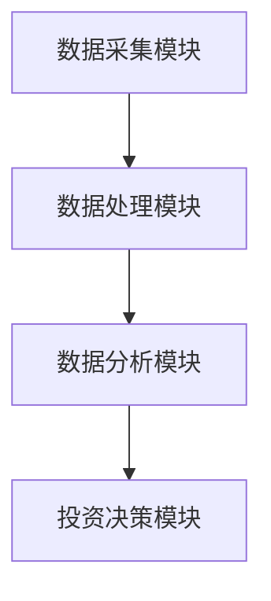

                 


# 格雷厄姆特价股票理论对金融科技的启示

> 关键词：格雷厄姆，价值投资，金融科技，大数据分析，人工智能，股票筛选，风险管理

> 摘要：本文深入探讨了本杰明·格雷厄姆的特价股票理论及其对金融科技领域的影响。通过分析价值投资的核心原则、数学模型、以及在金融科技中的应用，本文展示了如何利用现代技术手段提升投资决策的科学性和效率。结合系统架构设计和项目实战案例，本文为金融科技领域的实践者提供了有益的参考。

---

## 第1章: 格雷厄姆特价股票理论的核心概念

### 1.1 格雷厄姆投资理论的背景与起源

#### 1.1.1 价值投资的起源与发展

价值投资是一种以基本面分析为基础的投资策略，起源于20世纪初。本杰明·格雷厄姆（Benjamin Graham）是这一理论的奠基人，他的思想深刻影响了沃伦·巴菲特（Warren Buffett）等一代投资者。价值投资的核心理念是寻找市场中被低估的股票，即那些市场价格低于其内在价值的股票。

#### 1.1.2 格雷厄姆的投资理念与方法

格雷厄姆提出的价值投资方法强调安全性和确定性。他认为，投资者应该关注股票的内在价值，而不是市场的短期波动。他提倡通过基本面分析，包括对公司财务状况、行业地位和未来盈利能力的评估，来确定股票的合理价格。

#### 1.1.3 格雷厄姆理论在金融领域的应用

格雷厄姆的理论不仅影响了学术界，还被广泛应用于实践。他的方法论为机构投资者和个人投资者提供了分析和选择股票的框架。通过分析历史案例，我们可以看到价值投资在长期中的有效性。

### 1.2 特价股票理论的核心原则

#### 1.2.1 安全边际的概念与计算

安全边际是格雷厄姆理论中的一个重要概念，指股票的市场价格低于其内在价值的部分。通过计算安全边际，投资者可以确定是否买入股票，以降低投资风险。

#### 1.2.2 内在价值的评估方法

内在价值是基于公司基本面分析得出的股票价值。格雷厄姆强调，内在价值可以通过对公司财务报表的分析来估算。常用的评估方法包括DCF模型和市盈率分析。

#### 1.2.3 股票市场与价值投资的关系

股票市场是价值投资的战场。格雷厄姆认为，市场波动为投资者提供了低价买入优质股票的机会。通过长期持有优质资产，投资者可以实现财富的稳健增长。

### 1.3 格雷厄姆理论的现代发展

#### 1.3.1 理论的演变与创新

随着金融市场的变化，价值投资理论也在不断发展。现代投资者将更多的技术分析和量化方法融入到价值投资中，提高了投资决策的科学性。

#### 1.3.2 数量分析与价值投资的结合

数量分析为价值投资提供了新的工具和方法。通过大数据分析和机器学习，投资者可以更准确地评估股票的内在价值，发现市场中的低估机会。

#### 1.3.3 当代投资者对格雷厄姆理论的重新诠释

现代投资者在继承格雷厄姆理论的基础上，进行了创新和调整。他们结合市场环境的变化，优化投资策略，以应对新的挑战。

---

## 第2章: 格雷厄姆特价股票理论的数学模型与公式

### 2.1 内在价值的计算公式

内在价值是股票的理论上的公平价格，可以通过多种方法进行估算。其中，现金流折现模型（DCF）是常用的方法之一。

#### 2.1.1 内在价值的定义与公式

$$ V = \frac{E}{k} $$

其中，$V$ 是内在价值，$E$ 是预期收益，$k$ 是折现率。

#### 2.1.2 现金流折现模型（DCF）

$$ V = \sum_{t=1}^{n} \frac{CF_t}{(1 + r)^t} + \frac{TV}{(1 + r)^n} $$

其中，$CF_t$ 是第$t$年的现金流，$r$ 是贴现率，$TV$ 是终值。

### 2.2 安全边际的计算方法

安全边际是市场价格与内在价值之间的差额，反映了投资的安全程度。

#### 2.2.1 安全边际的定义

$$ \text{安全边际} = \text{内在价值} - \text{市场价格} $$

#### 2.2.2 安全边际的应用

通过计算安全边际，投资者可以确定是否买入股票。安全边际越高，投资风险越小。

### 2.3 股票估值的数学模型

股票估值可以通过多种指标进行分析，如市盈率和市净率。

#### 2.3.1 市盈率与市净率分析

$$ \text{市盈率} = \frac{\text{股价}}{\text{每股收益}} $$

$$ \text{市净率} = \frac{\text{股价}}{\text{每股净资产}} $$

### 2.4 理论与实践的结合

数学模型为价值投资提供了理论基础，但实际应用中需要结合市场环境和公司基本面进行调整。

#### 2.4.1 数学模型在价值投资中的应用

数学模型可以帮助投资者更准确地估算股票的内在价值，制定投资决策。

#### 2.4.2 理论模型的局限性与改进方向

数学模型虽然精确，但市场中的不确定因素较多，模型需要不断优化和调整。

---

## 第3章: 格雷厄姆理论与金融科技的结合

### 3.1 金融科技的定义与现状

#### 3.1.1 金融科技的定义

金融科技（FinTech）是指利用现代信息技术优化或替代传统金融服务的技术和创新。它涵盖了支付、借贷、投资管理等多个领域。

#### 3.1.2 当前金融科技的发展趋势

金融科技的发展趋势包括数字化、智能化、场景化和普惠化。技术的进步正在改变金融服务的方式，提高效率和降低成本。

#### 3.1.3 金融科技对传统金融的影响

金融科技通过技术创新，提高了金融服务的效率和可及性，改变了传统金融行业的运作方式。

### 3.2 格雷厄姆理论在金融科技中的应用领域

#### 3.2.1 智能投顾

智能投顾通过大数据分析和机器学习，为投资者提供个性化的投资建议。格雷厄姆的理论为智能投顾提供了基本面分析的框架。

#### 3.2.2 自动化交易

自动化交易系统利用算法快速执行交易，提高了交易效率。格雷厄姆的理论为自动化交易提供了价值评估的依据。

#### 3.2.3 数据驱动的投资决策

大数据分析为价值投资提供了新的工具。通过分析海量数据，投资者可以更准确地评估股票的内在价值，发现市场中的低估机会。

### 3.3 金融科技如何提升格雷厄姆理论的实践效果

#### 3.3.1 大数据分析在价值投资中的应用

大数据分析可以帮助投资者更全面地评估公司的基本面，发现潜在的投资机会。

#### 3.3.2 人工智能在股票筛选中的作用

人工智能技术可以自动筛选股票，识别符合价值投资标准的标的，提高投资效率。

#### 3.3.3 区块链技术在证券交易中的潜在影响

区块链技术可以提高证券交易的透明度和效率，降低交易成本，为价值投资提供更好的环境。

---

## 第4章: 基于格雷厄姆理论的金融科技系统架构

### 4.1 系统架构设计

#### 4.1.1 系统模块划分

系统架构包括数据采集模块、数据处理模块、数据分析模块和投资决策模块。

#### 4.1.2 系统功能设计

系统功能包括数据采集、数据清洗、价值评估、投资决策和风险控制。

#### 4.1.3 系统架构图



### 4.2 系统实现

#### 4.2.1 环境安装

系统需要安装Python、Pandas、NumPy和Scikit-learn等库。

#### 4.2.2 核心实现源代码

```python
import pandas as pd
import numpy as np
from sklearn.linear_model import LinearRegression

# 数据处理
def process_data(data):
    # 数据清洗
    data.dropna()
    return data

# 价值评估
def calculate_intrinsic_value(data):
    # 计算内在价值
    data['Intrinsic Value'] = data['Earnings'] / data['Discount Rate']
    return data

# 投资决策
def make_investment_decision(data):
    # 筛选低估股票
    data['Undervalued'] = data['Intrinsic Value'] > data['Price']
    return data

# 系统实现
data = pd.read_csv('stock_data.csv')
processed_data = process_data(data)
intrinsic_data = calculate_intrinsic_value(processed_data)
decision_data = make_investment_decision(intrinsic_data)
```

#### 4.2.3 案例分析

通过实际案例分析，展示系统如何筛选低估股票，制定投资策略。

---

## 第5章: 项目实战

### 5.1 环境安装

安装所需的库和工具，包括Python、Pandas、NumPy、Scikit-learn等。

### 5.2 核心实现源代码

```python
import pandas as pd
import numpy as np
from sklearn.linear_model import LinearRegression

# 数据处理
def process_data(data):
    # 数据清洗
    data.dropna()
    return data

# 价值评估
def calculate_intrinsic_value(data):
    # 计算内在价值
    data['Intrinsic Value'] = data['Earnings'] / data['Discount Rate']
    return data

# 投资决策
def make_investment_decision(data):
    # 筛选低估股票
    data['Undervalued'] = data['Intrinsic Value'] > data['Price']
    return data

# 系统实现
data = pd.read_csv('stock_data.csv')
processed_data = process_data(data)
intrinsic_data = calculate_intrinsic_value(processed_data)
decision_data = make_investment_decision(intrinsic_data)
```

### 5.3 案例分析

通过实际案例分析，展示系统如何筛选低估股票，制定投资策略。

---

## 第6章: 总结与展望

### 6.1 总结

本文深入探讨了格雷厄姆特价股票理论对金融科技的启示，展示了如何通过现代技术手段提升投资决策的科学性和效率。

### 6.2 展望

未来，随着技术的不断发展，价值投资与金融科技的结合将更加紧密。投资者可以通过更先进的工具和方法，实现更精准的投资决策。

---

## 作者：AI天才研究院/AI Genius Institute & 禅与计算机程序设计艺术/Zen And The Art of Computer Programming

---

通过以上思考和撰写，我们详细探讨了格雷厄姆特价股票理论对金融科技的启示，从理论到实践，为读者提供了全面的视角和深入的分析。

