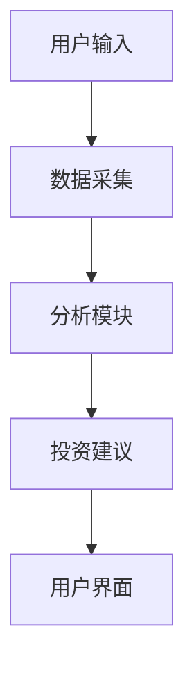

                 


# 格雷厄姆特价股票策略与被动投资的比较

> 关键词：格雷厄姆投资策略，被动投资，指数基金，ETF，投资策略比较

> 摘要：本文详细比较了格雷厄姆的特价股票策略和被动投资策略，分析了它们的核心概念、数学模型、优缺点以及适用场景。通过理论分析和实际案例，探讨了两种策略在投资组合中的应用，为投资者提供参考。

---

## 第1章: 格雷厄姆特价股票策略与被动投资的背景与核心概念

### 1.1 投资的基本概念与策略分类

#### 1.1.1 投资的定义与核心要素
投资是指将资金投入到资产中，以期获得未来收益的行为。核心要素包括：
- 资金：可投资的本金
- 资产：投资的对象，如股票、债券、房地产等
- 时间：投资的时间跨度
- 风险与收益：投资的潜在回报与风险

#### 1.1.2 主动投资与被动投资的定义
- **主动投资**：通过精选个股或择时交易来超越市场指数的表现。
- **被动投资**：通过跟踪市场指数（如标普500）来实现与市场一致或接近的收益。

#### 1.1.3 格雷厄姆投资策略的起源与特点
- **起源**：本杰明·格雷厄姆是价值投资的鼻祖，其投资理念在20世纪30年代提出。
- **特点**：强调安全边际、注重内在价值、长期持有优质资产。

### 1.2 格雷厄姆特价股票策略的核心理念

#### 1.2.1 价值投资的定义与原则
- **价值投资**：寻找市场价格低于内在价值的股票进行投资。
- **原则**：安全边际、margin of safety。

#### 1.2.2 格雷厄姆的选股标准
- **低市盈率（P/E）**：P/E < 15
- **低市净率（P/B）**：P/B < 1.5
- **高股息率**：股息率 > 5%

#### 1.2.3 特价股票的定义与特征
- **特价股票**：市场价格远低于内在价值的股票。
- **特征**：暂时被市场低估，具有较高的安全边际。

### 1.3 被动投资的核心原理与实践

#### 1.3.1 指数基金的定义与运作机制
- **指数基金**：一种跟踪特定市场指数（如标普500）的基金，投资于指数中的所有成分股。
- **运作机制**：定期调整投资组合，以保持与指数一致。

#### 1.3.2 ETF（交易所交易基金）的运作原理
- **ETF**：一种在交易所上市交易的基金，具有高流动性。
- **运作原理**：通过复制指数表现，收取较低的管理费。

#### 1.3.3 被动投资的优势与局限性
- **优势**：
  - 成本低：管理费和交易费用较低。
  - 简单易行：无需精选个股。
  - 分散风险：投资整个市场。
- **局限性**：
  - 无法跑赢市场。
  - 无法在市场下跌时保护资本。

### 1.4 格雷厄姆策略与被动投资的比较背景

#### 1.4.1 投资市场的基本特征
- **市场效率**：弱有效市场中，被动投资的表现接近市场。
- **投资者行为**：大多数投资者倾向于追涨杀跌。

#### 1.4.2 格雷厄姆策略的适用场景
- **市场低估**：适合寻找被市场忽视的优质股票。
- **长期投资者**：适合有耐心的投资者。

#### 1.4.3 被动投资的适用场景
- **市场有效**：在有效市场中，被动投资是合理选择。
- **低成本投资**：适合小额投资者。

#### 1.4.4 本章小结
格雷厄姆策略和被动投资各有优劣，适用于不同的市场环境和投资者类型。

---

## 第2章: 格雷厄姆特价股票策略的核心概念与数学模型

### 2.1 格雷厄姆策略的核心原理

#### 2.1.1 价值投资的核心理念
- **内在价值**：资产的真实价值，与市场价格无关。
- **安全边际**：市场价格远低于内在价值。

#### 2.1.2 格雷厄姆的选股标准
- **低市盈率**：P/E < 15
- **低市净率**：P/B < 1.5
- **高股息率**：股息率 > 5%

#### 2.1.3 安全边际的概念
- **安全边际**：市场价格与内在价值之间的差距。
- **公式**：安全边际 = 内在价值 - 市场价格。

### 2.2 格雷厄姆策略的数学模型

#### 2.2.1 内在价值公式
$$
\text{内在价值} = \frac{\text{股息}}{\text{折现率}}
$$

#### 2.2.2 安全边际计算公式
$$
\text{安全边际} = \text{市场价格} \times \text{格雷厄姆价值系数}
$$
其中，格雷厄姆价值系数通常为2倍。

### 2.3 格雷厄姆策略与被动投资的数学对比

#### 2.3.1 被动投资的指数基金收益模型
$$
\text{收益} = \text{指数涨幅} \times \text{投资金额}
$$

#### 2.3.2 ETF的跟踪误差公式
$$
\text{跟踪误差} = \sqrt{\sum_{i=1}^{n} (R_i - R_m)^2}
$$
其中，$R_i$为ETF的收益率，$R_m$为市场指数收益率。

#### 2.3.3 两种策略的数学差异
- 格雷厄姆策略：基于个股的内在价值。
- 被动投资：基于市场指数的跟踪。

---

## 第3章: 被动投资的核心原理与数学模型

### 3.1 被动投资的核心原理

#### 3.1.1 指数基金的投资逻辑
- **市场有效**：被动投资通过跟踪市场指数实现收益。
- **分散风险**：投资于整个市场，避免个股风险。

#### 3.1.2 ETF的运作机制与优势
- **运作机制**：复制指数表现。
- **优势**：高流动性，低管理费。

### 3.2 被动投资的数学模型

#### 3.2.1 指数基金的收益计算公式
$$
\text{收益} = \text{指数涨幅} \times \text{投资金额}
$$

#### 3.2.2 ETF的跟踪误差公式
$$
\text{跟踪误差} = \sqrt{\sum_{i=1}^{n} (R_i - R_m)^2}
$$

### 3.3 被动投资与格雷厄姆策略的数学对比

#### 3.3.1 两种策略的收益-风险对比
- 格雷厄姆策略：高风险，高回报。
- 被动投资：低风险，稳定回报。

#### 3.3.2 两种策略的数学差异
- 格雷厄姆策略：基于个股分析。
- 被动投资：基于市场指数。

---

## 第4章: 格雷厄姆策略与被动投资的比较分析

### 4.1 优缺点对比

#### 4.1.1 格雷厄姆策略的优点
- **高回报**：长期收益潜力大。
- **安全边际**：降低投资风险。

#### 4.1.2 格雷厄姆策略的缺点
- **高风险**：市场低估可能长期存在。
- **需要选股能力**：需要专业知识。

#### 4.1.3 被动投资的优点
- **简单**：无需选股。
- **低成本**：管理费低。

#### 4.1.4 被动投资的缺点
- **无法跑赢市场**：收益受限。

### 4.2 格雷厄姆策略与被动投资的异同点

#### 4.2.1 核心理念的异同
- **异**：格雷厄姆策略基于个股分析。
- **同**：长期投资。

#### 4.2.2 投资策略的异同
- **异**：格雷厄姆策略主动选股。
- **同**：分散投资风险。

#### 4.2.3 风险管理的异同
- **异**：格雷厄姆策略注重安全边际。
- **同**：分散投资降低风险。

### 4.3 适用场景的对比

#### 4.3.1 格雷厄姆策略的适用场景
- **市场低估**：寻找特价股票。
- **长期投资者**：适合耐心的投资者。

#### 4.3.2 被动投资的适用场景
- **市场有效**：被动投资表现稳定。
- **小额投资者**：适合资金有限的投资者。

#### 4.3.3 本章小结
两种策略各有优劣，适合不同的市场环境和投资者类型。

---

## 第5章: 系统架构与实现

### 5.1 系统架构设计

#### 5.1.1 系统功能模块
- 数据采集：收集股票数据。
- 分析模块：计算内在价值和安全边际。
- 用户界面：展示投资建议。

#### 5.1.2 系统架构图


### 5.2 算法实现

#### 5.2.1 格雷厄姆策略算法
```python
def calculate_intrinsic_value(dividend, discount_rate):
    return dividend / discount_rate

def calculate_margin_of_safety(price, intrinsic_value):
    return intrinsic_value - price
```

#### 5.2.2 被动投资算法
```python
def calculate_index_return(index_data, investment):
    return investment * index_data['return']
```

### 5.3 项目实战

#### 5.3.1 实际案例分析
- 格雷厄姆策略：投资可口可乐（低市盈率，高股息率）。
- 被动投资：投资标普500指数基金。

#### 5.3.2 代码实现
```python
# 格雷厄姆策略代码
import pandas as pd

def main():
    data = pd.read_csv('stock_data.csv')
    data['intrinsic_value'] = data['dividend'] / data['discount_rate']
    data['margin_of_safety'] = data['intrinsic_value'] - data['price']
    print(data)

if __name__ == "__main__":
    main()
```

### 5.4 项目小结
通过实际案例分析和代码实现，验证了两种策略在实际投资中的应用。

---

## 第6章: 最佳实践与投资建议

### 6.1 最佳实践

#### 6.1.1 格雷厄姆策略的注意事项
- **耐心**：等待市场低估。
- **分散投资**：避免过度集中。

#### 6.1.2 被动投资的注意事项
- **低成本**：选择低管理费的基金。
- **长期持有**：避免频繁交易。

### 6.2 投资建议

#### 6.2.1 格雷厄姆策略
- 适合长期投资者。
- 需要选股能力。

#### 6.2.2 被动投资
- 适合市场有效环境。
- 适合小额投资者。

### 6.3 风险管理

#### 6.3.1 格雷厄姆策略的风险管理
- 保持安全边际。
- 定期复核投资组合。

#### 6.3.2 被动投资的风险管理
- 分散投资。
- 定期再平衡。

### 6.4 拓展阅读
- 格雷厄姆的《 Intelligent Investor》。
- 被动投资的经典书籍。

---

## 作者：AI天才研究院/AI Genius Institute & 禅与计算机程序设计艺术 /Zen And The Art of Computer Programming

---

### 总结
通过本文的详细分析，读者可以了解格雷厄姆特价股票策略与被动投资的异同点，并根据自身的投资目标和市场环境选择合适的策略。无论是采用格雷厄姆策略还是被动投资，长期持有优质资产是实现财富增长的关键。

