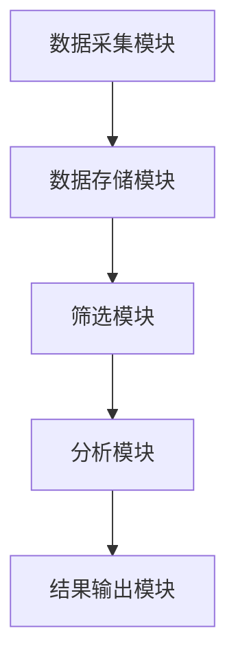
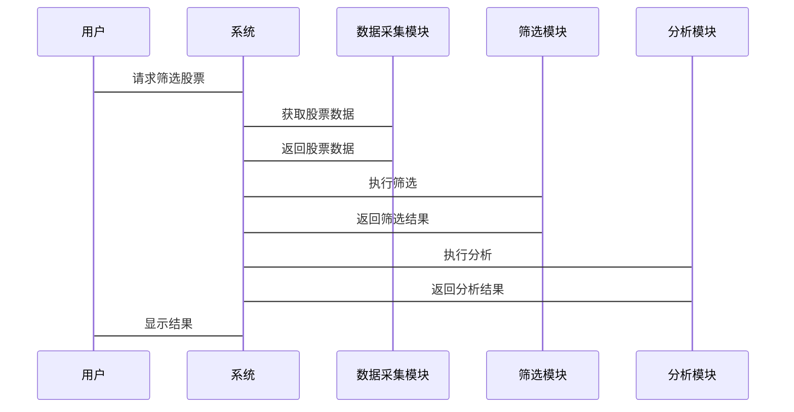

                 


```markdown
# 格雷厄姆特价股票策略在不同企业文化生态中的适应

> 关键词：价值投资，格雷厄姆策略，特价股票，企业文化，投资策略，系统设计

> 摘要：本文探讨了格雷厄姆特价股票策略在不同企业文化生态中的适应性。首先介绍了价值投资的基本概念和格雷厄姆的投资策略，然后分析了不同企业文化的特征及其对投资策略的影响。接着，详细讲解了格雷厄姆策略的算法原理、数学模型和系统设计，最后通过实际案例分析了策略在不同企业环境中的应用，并总结了最佳实践。

---

## 第一部分: 格雷厄姆价值投资理论基础

### 第1章: 格雷厄姆价值投资理论概述

#### 1.1 价值投资的核心理念

##### 1.1.1 投资的定义与核心要素

投资是指将资金投入到能够产生收益的资产中，其核心要素包括资金、风险、收益和时间。投资的本质是通过合理配置资产，在风险可控的前提下，实现收益的最大化。

##### 1.1.2 价值投资的起源与发展

价值投资是一种以基本面分析为基础的投资策略，起源于20世纪20年代。 Benjamin Graham 和 David Dodd 是该理论的奠基人，他们在《证券分析》一书中首次系统地提出了价值投资的理念。

##### 1.1.3 格雷厄姆的投资哲学与方法

格雷厄姆认为，市场是理性的，但人类是情绪化的，因此市场往往会偏离理性。投资者应以低于内在价值的价格买入股票，并长期持有，等待市场回归理性。

#### 1.2 格雷厄姆特价股票策略的定义

##### 1.2.1 特价股票的定义与特征

特价股票是指市场价格远低于其内在价值的股票。其特征包括低市盈率、低市净率、高股息率等。

##### 1.2.2 格雷厄姆策略的核心原则

格雷厄姆策略的核心原则包括：寻找低估的股票、分散投资、长期持有、避免情绪化决策。

##### 1.2.3 策略与传统投资方法的区别

与技术分析和趋势投资不同，格雷厄姆策略注重基本面分析，强调安全边际和长期持有。

#### 1.3 现代市场环境下的策略演变

##### 1.3.1 现代市场与传统策略的差异

现代市场信息透明度高，交易频繁，流动性强，但波动性也更大。

##### 1.3.2 策略在不同经济周期中的表现

在经济繁荣期，策略表现可能不佳；在经济衰退期，策略可能表现优异。

##### 1.3.3 数字化与数据化对策略的影响

大数据和人工智能技术的应用，使得基本面分析更加精准，策略的实施更加高效。

---

## 第二部分: 不同企业文化生态对策略的影响

### 第2章: 企业文化生态的多样性与复杂性

#### 2.1 企业文化生态的定义与分类

##### 2.1.1 企业文化的定义与构成要素

企业文化是企业在长期经营中形成的、与企业战略目标相一致的价值观、行为准则和管理风格的总和。

##### 2.1.2 不同类型企业文化的特点

- **创新型企业文化**：鼓励创新，注重研发和产品升级。
- **稳健型企业文化**：注重稳健经营，强调风险控制。
- **成本导向型企业文化**：以成本控制为核心，追求效率和规模。
- **客户导向型企业文化**：以客户需求为导向，注重客户关系和服务质量。

##### 2.1.3 企业生态与投资策略的关系

企业文化生态影响企业的经营战略、管理风格和财务状况，进而影响投资策略的有效性。

#### 2.2 企业生态对投资策略的影响

##### 2.2.1 企业治理结构对策略的影响

良好的治理结构能够确保企业稳健经营，减少管理层决策失误的风险。

##### 2.2.2 企业文化对股价波动的影响

积极的企业文化能够提升投资者信心，稳定股价；消极的企业文化可能导致股价波动。

##### 2.2.3 企业战略与策略适应性的关系

企业战略的灵活性和适应性影响策略的实施效果。

#### 2.3 不同行业中的企业生态分析

##### 2.3.1 高 tech 行业的企业文化特征

高 tech 行业注重创新，强调快速迭代和技术创新，企业文化往往具有较强的冒险精神和竞争意识。

##### 2.3.2 传统制造业的企业文化特征

传统制造业注重成本控制和效率提升，企业文化相对稳健，注重长期稳定发展。

##### 2.3.3 服务业与金融行业的企业文化差异

服务业注重客户体验和关系管理，而金融行业则注重风险控制和合规性。

---

## 第三部分: 格雷厄姆策略在不同企业文化生态中的应用

### 第3章: 美国企业生态中的策略应用

#### 3.1 美国企业文化的特征

美国企业文化以自由竞争、创新和多元化为特点，为企业提供了良好的创新环境和市场机制。

#### 3.2 格雷厄姆策略在美国市场的适应性

##### 3.2.1 美国市场中的特价股票机会

美国市场信息透明，市场效率高，适合实施格雷厄姆策略。

##### 3.2.2 美国企业治理结构对策略的影响

美国企业治理结构完善，董事会独立性强，能够有效监督管理层。

##### 3.2.3 不同行业中的策略应用

在高 tech 行业，投资者需要关注企业的技术创新能力和市场竞争力；在传统制造业，投资者需要关注企业的成本控制和生产效率。

### 第4章: 中国企业生态中的策略应用

#### 4.1 中国企业文化的特征

中国企业文化注重集体主义和团队合作，强调执行力和效率，同时具有较强的应变能力和灵活性。

#### 4.2 格雷厄姆策略在中国市场的适应性

##### 4.2.1 中国市场中的特价股票机会

中国市场波动性大，但存在较多的低估股票，适合格雷厄姆策略的应用。

##### 4.2.2 中国企业治理结构对策略的影响

中国企业治理结构较为集中，董事会和管理层的关系较为紧密，需要关注企业的内部控制和风险管理。

##### 4.2.3 不同行业中的策略应用

在互联网行业，投资者需要关注企业的用户增长和商业模式；在传统制造业，投资者需要关注企业的成本控制和技术创新。

---

## 第四部分: 格雷厄姆策略的系统设计与实现

### 第5章: 格雷厄姆策略的算法原理与实现

#### 5.1 格雷厄姆策略的筛选标准

##### 5.1.1 市盈率（P/E）计算

市盈率 = 股票价格 / 每股净利润

##### 5.1.2 市净率（P/B）计算

市净率 = 股票价格 / 每股净资产

##### 5.1.3 股息率计算

股息率 = 每股股息 / 股票价格

#### 5.2 策略的数学模型与公式

##### 5.2.1 内在价值计算公式

$$
\text{内在价值} = \sum_{t=1}^{\infty} \frac{\text{现金流}_t}{(1 + r)^t}
$$

##### 5.2.2 安全边际计算公式

$$
\text{安全边际} = \text{内在价值} \times \text{安全系数}
$$

#### 5.3 策略的Python实现代码

```python
import pandas as pd
import yfinance as yf

# 下载数据
def get_stock_data(ticker):
    df = yf.download(ticker, start='2020-01-01', end='2023-12-31')
    return df

# 计算市盈率和市净率
def calculate_valuation_ratios(df):
    df['PE'] = df['Close'] / df['EPS']
    df['PB'] = df['Close'] / df['Book Value Per Share']
    return df

# 格雷厄姆策略筛选
def graham_strategy(df, pe_threshold=15, pb_threshold=2):
    df = df[df['PE'] < pe_threshold]
    df = df[df['PB'] < pb_threshold]
    return df

# 主函数
def main():
    tickers = ['AAPL', 'MSFT', 'GOOGL']
    for ticker in tickers:
        data = get_stock_data(ticker)
        data = calculate_valuation_ratios(data)
        selected = graham_strategy(data)
        if not selected.empty:
            print(f"符合条件的股票：{ticker}")

if __name__ == "__main__":
    main()
```

#### 5.4 系统架构设计

##### 5.4.1 系统功能设计

- 数据采集模块：负责采集股票数据。
- 筛选模块：根据格雷厄姆策略筛选股票。
- 分析模块：对筛选结果进行分析和评估。

##### 5.4.2 系统架构图



##### 5.4.3 接口设计

- 数据接口：提供数据获取和存储的接口。
- 筛选接口：提供策略筛选的接口。
- 分析接口：提供结果分析和展示的接口。

##### 5.4.4 交互流程



---

## 第五部分: 格雷厄姆策略的项目实战与小结

### 第6章: 项目实战

#### 6.1 环境安装与配置

##### 6.1.1 安装Python和相关库

```bash
pip install pandas yfinance matplotlib
```

##### 6.1.2 数据源配置

选择合适的股票数据源，如Yahoo Finance。

#### 6.2 核心代码实现

##### 6.2.1 筛选模块实现

```python
def graham_strategy(df, pe_threshold=15, pb_threshold=2):
    mask = (df['PE'] < pe_threshold) & (df['PB'] < pb_threshold)
    return df[mask]
```

##### 6.2.2 可视化实现

```python
import matplotlib.pyplot as plt

def plot_stock_data(df, ticker):
    plt.figure(figsize=(10,6))
    plt.plot(df['Close'], label='Close Price')
    plt.xlabel('Date')
    plt.ylabel('Price')
    plt.title(f'{ticker} Stock Price')
    plt.legend()
    plt.show()
```

#### 6.3 实际案例分析

##### 6.3.1 筛选过程

以苹果公司（AAPL）为例，筛选其历史数据中的低估时期。

##### 6.3.2 策略表现

分析策略在不同时间段的表现，评估其稳定性和收益性。

#### 6.4 项目小结

本项目通过实际操作，验证了格雷厄姆策略的有效性，同时也发现了在实际应用中需要注意的事项，如市场波动和企业治理结构的影响。

---

## 第六部分: 最佳实践与总结

### 第7章: 最佳实践

#### 7.1 投资策略注意事项

##### 7.1.1 长期投资的重要性

避免短期波动的干扰，坚持长期投资。

##### 7.1.2 风险管理的重要性

合理配置资产，分散投资风险。

##### 7.1.3 持续学习和调整策略

根据市场变化和企业生态的演变，及时调整投资策略。

#### 7.2 小结

格雷厄姆策略是一种有效的投资策略，但在实际应用中需要考虑多种因素，如市场环境、企业文化和个体差异。

#### 7.3 拓展阅读

建议进一步阅读格雷厄姆的《证券分析》和彼得·林奇的《巴菲特选股术》。

---

## 作者：AI天才研究院 & 禅与计算机程序设计艺术
```

